
知ってる人は知っている話なんですが、私<a class="keyword" href="http://d.hatena.ne.jp/keyword/%C6%A3%BB%D2%A1%A6F%A1%A6%C9%D4%C6%F3%CD%BA">藤子・F・不二雄</a>作品のファンです。

小<a class="keyword" href="http://d.hatena.ne.jp/keyword/%A4%B5%A4%A4%A4%B3%A4%ED">さいころ</a>から<a class="keyword" href="http://d.hatena.ne.jp/keyword/%A5%C9%A5%E9%A4%A8%A4%E2%A4%F3">ドラえもん</a>や<a class="keyword" href="http://d.hatena.ne.jp/keyword/%A5%AD%A5%C6%A5%EC%A5%C4%C2%E7%C9%B4%B2%CA">キテレツ大百科</a>を見て育ち、中学時代<a class="keyword" href="http://d.hatena.ne.jp/keyword/%A4%C6%A4%F3%A4%C8%A4%A6%C3%EE%A5%B3%A5%DF%A5%C3%A5%AF%A5%B9">てんとう虫コミックス</a>を全巻揃え、「ぼく、<a class="keyword" href="http://d.hatena.ne.jp/keyword/%A5%C9%A5%E9%A4%A8%A4%E2%A4%F3">ドラえもん</a>」という雑誌を定期購入し、大学時代はアルバイト代の大半が<a class="keyword" href="http://d.hatena.ne.jp/keyword/%C6%A3%BB%D2%A1%A6F%A1%A6%C9%D4%C6%F3%CD%BA%C2%E7%C1%B4%BD%B8">藤子・F・不二雄大全集</a>に費やされるという・・・。

そんな私ですので、神奈川県<a class="keyword" href="http://d.hatena.ne.jp/keyword/%C0%EE%BA%EA%BB%D4">川崎市</a>にある<a class="keyword" href="http://d.hatena.ne.jp/keyword/%C6%A3%BB%D2%A1%A6F%A1%A6%C9%D4%C6%F3%CD%BA%A5%DF%A5%E5%A1%BC%A5%B8%A5%A2%A5%E0">藤子・F・不二雄ミュージアム</a>には二回行っています。 
一回目は<a class="keyword" href="http://d.hatena.ne.jp/keyword/%A5%DF%A5%E5%A1%BC%A5%B8%A5%A2%A5%E0">ミュージアム</a>ができてから約一年後の2012年9月23日。たまたまなのですがF先生の命日の日です。 
あの日はあいにくの雨でしたが、せっかくなのでお墓参りもしてきました。

<blockquote class="twitter-tweet" data-lang="HASH(0xd554618)">
花だけ供えてきました (@ <a class="keyword" href="http://d.hatena.ne.jp/keyword/%C6%A3%BB%D2%A1%A6F%A1%A6%C9%D4%C6%F3%CD%BA">藤子・F・不二雄</a>（<a class="keyword" href="http://d.hatena.ne.jp/keyword/%C6%A3%CB%DC%B9%B0">藤本弘</a>）の墓) <a href="http://t.co/9qZBXGNQ">http://t.co/9qZBXGNQ</a>
&mdash; Ovis＠🐑のひと (@Pandora_Ovis) <a href="https://twitter.com/Pandora_Ovis/status/249784041853812736?ref_src=twsrc%5Etfw">September 23, 2012</a></blockquote>

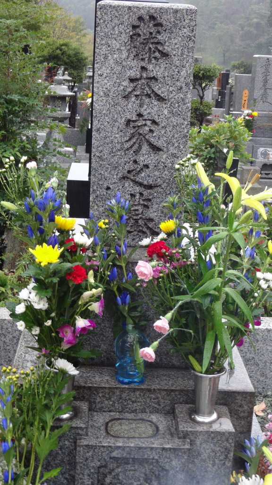

2回目もあいにくの雨・・・。雨男か私は。

***

そんな感じで毎回<a class="keyword" href="http://d.hatena.ne.jp/keyword/%A5%DF%A5%E5%A1%BC%A5%B8%A5%A2%A5%E0">ミュージアム</a>に行くたび、<a class="keyword" href="http://d.hatena.ne.jp/keyword/%A5%DF%A5%E5%A1%BC%A5%B8%A5%A2%A5%E0">ミュージアム</a>内のショップでいろいろとまとめ買いをしています。 
限定品には目がないのです。

で、今回こんなツイートを見かけまして。

<blockquote class="twitter-tweet" data-lang="HASH(0xdb106b8)">
ここでしか買えない！初の<a class="keyword" href="http://d.hatena.ne.jp/keyword/%A5%DF%A5%E5%A1%BC%A5%B8%A5%A2%A5%E0">ミュージアム</a>限定編集まんがを発売<a href="https://t.co/uUaLjQYRLP">https://t.co/uUaLjQYRLP</a> 『<a class="keyword" href="http://d.hatena.ne.jp/keyword/%A5%AD%A5%C6%A5%EC%A5%C4%C2%E7%C9%B4%B2%CA">キテレツ大百科</a>×<a class="keyword" href="http://d.hatena.ne.jp/keyword/%A5%C9%A5%E9%A4%A8%A4%E2%A4%F3">ドラえもん</a>　江戸時代の発明と未来の<a class="keyword" href="http://d.hatena.ne.jp/keyword/%A4%D2%A4%DF%A4%C4%C6%BB%B6%F1">ひみつ道具</a>』 &quot;2019年2月13日（水）より<a class="keyword" href="http://d.hatena.ne.jp/keyword/%A5%DF%A5%E5%A1%BC%A5%B8%A5%A2%A5%E0">ミュージアム</a>ショップにて限定発売&quot; &quot;特別まんが（<a class="keyword" href="http://d.hatena.ne.jp/keyword/%A4%E0%A4%AE%A4%EF%A4%E9%A4%B7%A4%F3%A4%BF%A4%ED%A4%A6">むぎわらしんたろう</a>描きおろし） 企画展Ⅰ～Ⅲ期 展示作品リスト&quot; <a href="https://t.co/apUUNebyLN">pic.twitter.com/apUUNebyLN</a>
&mdash; 白銀 (@mugengin) <a href="https://twitter.com/mugengin/status/1094065113932263424?ref_src=twsrc%5Etfw">February 9, 2019</a></blockquote>

初の<a class="keyword" href="http://d.hatena.ne.jp/keyword/%A5%DF%A5%E5%A1%BC%A5%B8%A5%A2%A5%E0">ミュージアム</a>限定編集漫画、しかも<a class="keyword" href="http://d.hatena.ne.jp/keyword/%A4%E0%A4%AE%A4%EF%A4%E9%A4%B7%A4%F3%A4%BF%A4%ED%A4%A6">むぎわらしんたろう</a>先生(F先生の最後の弟子、<a class="keyword" href="http://d.hatena.ne.jp/keyword/%A5%C9%A5%E9%A5%D9%A1%BC%A5%B9">ドラベース</a>などでおなじみ)の書下ろし漫画もついてくると。

<blockquote class="twitter-tweet" data-lang="HASH(0xe3975e0)">
え、ほしい
&mdash; Ovis＠🐑のひと (@Pandora_Ovis) <a href="https://twitter.com/Pandora_Ovis/status/1094080882074218496?ref_src=twsrc%5Etfw">February 9, 2019</a></blockquote>

<blockquote class="twitter-tweet" data-lang="HASH(0xdde77b8)">
しかししばらく東京に行く用事がない
&mdash; Ovis＠🐑のひと (@Pandora_Ovis) <a href="https://twitter.com/Pandora_Ovis/status/1094080955860414464?ref_src=twsrc%5Etfw">February 9, 2019</a></blockquote>

とつぶやいていたところ、

酢酸先生から無言リプライが。 
<blockquote class="twitter-tweet" data-lang="HASH(0xe11cad8)">
うちの嫁に電車代と入場料渡したら行ってくれそう
&mdash; さくさん (@ch3cooh) <a href="https://twitter.com/ch3cooh/status/1094094842005577728?ref_src=twsrc%5Etfw">February 9, 2019</a></blockquote>

酢酸先生のお嫁さんのあきえさんからも

<blockquote class="twitter-tweet" data-lang="HASH(0xe9ee980)">
誕生日プレゼントありがとうございます！！！！！お品代だけ貰えれば、<a class="keyword" href="http://d.hatena.ne.jp/keyword/%A5%C9%A5%E9%A4%A8%A4%E2%A4%F3">ドラえもん</a>買いに行きますよ！！！！
&mdash; ときとーあきえ//またたびの枝 (@ak10910) <a href="https://twitter.com/ak10910/status/1094226985125990400?ref_src=twsrc%5Etfw">February 9, 2019</a></blockquote>

とお話をいただいたので、さっそく依頼することにしました。

今回購入をお願いしたのは、まずさきほどの限定編集漫画。 
そして<a class="keyword" href="http://d.hatena.ne.jp/keyword/%A5%DF%A5%E5%A1%BC%A5%B8%A5%A2%A5%E0">ミュージアム</a>でしか買えないポストカードやフィギュアなど。 
特に期間限定品を中心にいろいろお願いしました。

で、無事ミッションコンプリートということで送っていただいたグッズがこちら。

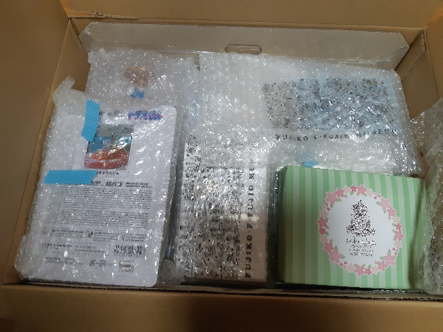

ちょうどバレンタインデーの時期ということでお菓子までいただいてしまいました。

さて、購入したのはこんなグッズたち。

<h4><a class="keyword" href="http://d.hatena.ne.jp/keyword/%C6%A3%BB%D2%A1%A6F%A1%A6%C9%D4%C6%F3%CD%BA%A5%DF%A5%E5%A1%BC%A5%B8%A5%A2%A5%E0">藤子・F・不二雄ミュージアム</a>限定編集 <a class="keyword" href="http://d.hatena.ne.jp/keyword/%A5%AD%A5%C6%A5%EC%A5%C4%C2%E7%C9%B4%B2%CA">キテレツ大百科</a>x<a class="keyword" href="http://d.hatena.ne.jp/keyword/%A5%C9%A5%E9%A4%A8%A4%E2%A4%F3">ドラえもん</a> 江戸時代の発明と未来の<a class="keyword" href="http://d.hatena.ne.jp/keyword/%A4%D2%A4%DF%A4%C4%C6%BB%B6%F1">ひみつ道具</a></h4>

これが欲しくてお使いしてもらいました。 
装丁が高級感あふれる。

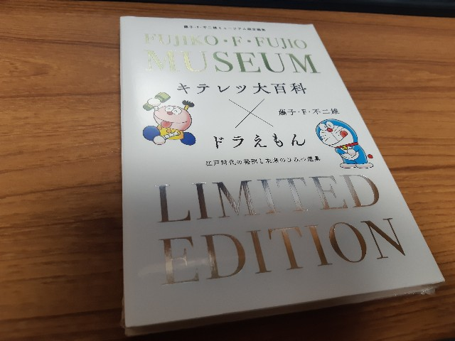

<a class="keyword" href="http://d.hatena.ne.jp/keyword/%A4%E0%A4%AE%A4%EF%A4%E9%A4%B7%A4%F3%A4%BF%A4%ED%A4%A6">むぎわらしんたろう</a>先生の漫画は2ページほど。 
F先生にまつわるエピソード漫画でした。

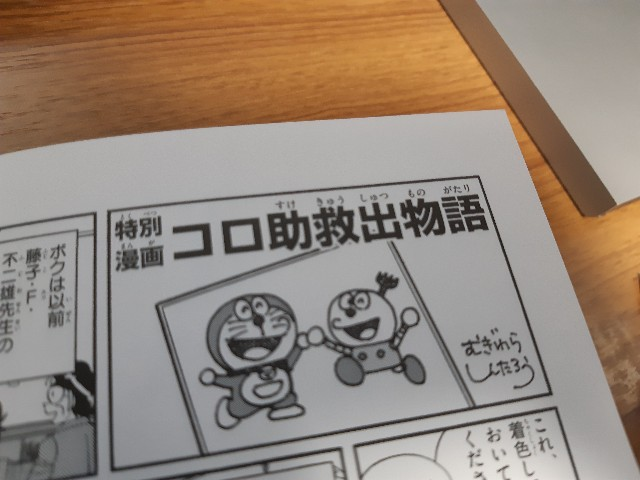

<h4><a class="keyword" href="http://d.hatena.ne.jp/keyword/%A5%DF%A5%E5%A1%BC%A5%B8%A5%A2%A5%E0">ミュージアム</a>限定LINEスタンプ</h4>

LINEスタンプはほとんどF先生作品ばかり購入してるのですが(だるやなぎスタンプ、インコネコスタンプの色物系も一部・・・)、これは<a class="keyword" href="http://d.hatena.ne.jp/keyword/%A5%DF%A5%E5%A1%BC%A5%B8%A5%A2%A5%E0">ミュージアム</a>に行かないと手に入らないスタンプなので、ゲットできて嬉しい。

こんな袋に入ってます。 
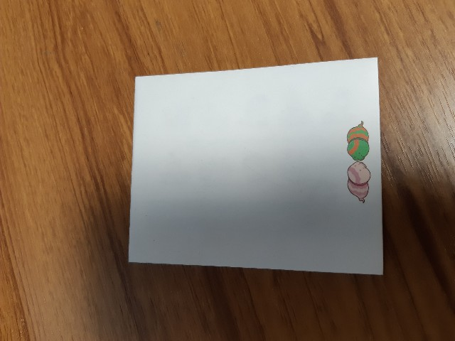

シリアルナンバーが書かれたカードはこんなデザイン。これは捨てられない・・・。

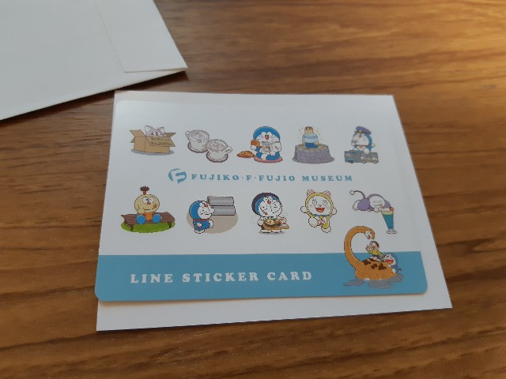

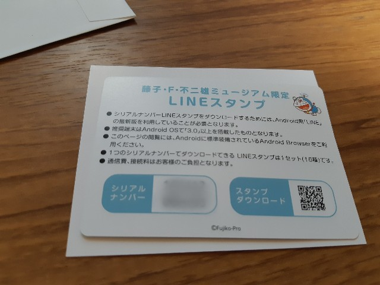

カード裏の<a class="keyword" href="http://d.hatena.ne.jp/keyword/QR%A5%B3%A1%BC%A5%C9">QRコード</a>を読み込むとスタンプショップが開くので、シリアルナンバーを入力すると手に入ります。

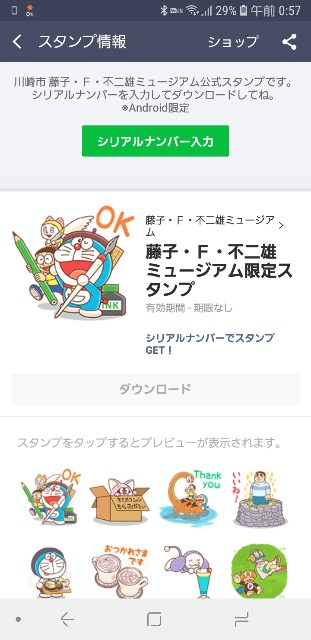

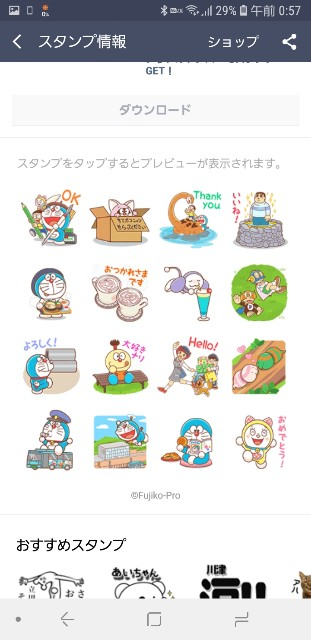

ま、スタンプをゲットしたところで送る相手は家族しかいないのですが(吐血)

<h4>フィギュア</h4>

我が家は<a class="keyword" href="http://d.hatena.ne.jp/keyword/%A5%C9%A5%E9%A4%A8%A4%E2%A4%F3">ドラえもん</a>のフィギュア(+石像、ぬいぐるみ)だらけです・・・。 
で今回も2つ購入をお願いしてしまいました。

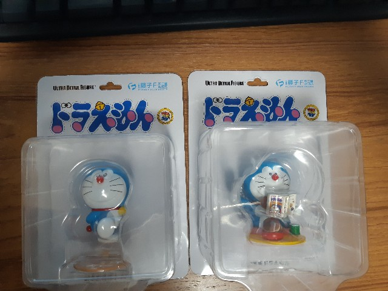

<h4>企画展「<a class="keyword" href="http://d.hatena.ne.jp/keyword/%A5%AD%A5%C6%A5%EC%A5%C4%C2%E7%C9%B4%B2%CA">キテレツ大百科</a>」×「<a class="keyword" href="http://d.hatena.ne.jp/keyword/%A5%C9%A5%E9%A4%A8%A4%E2%A4%F3">ドラえもん</a>」公式ガイドブック</h4>

行けなくてもガイドブックを見たら行った気になるかなって・・・。 
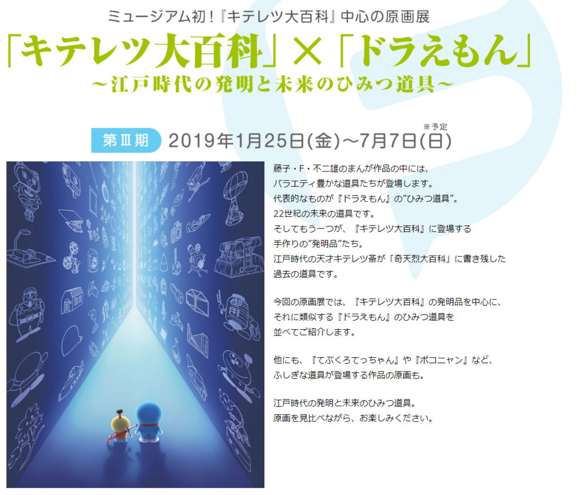
<iframe src="https://hatenablog-parts.com/embed?url=http%3A%2F%2Ffujiko-museum.com%2Fexhibition%2F" title="ミュージアム企画展 ｜ 川崎市 藤子・F・不二雄ミュージアム" class="embed-card embed-webcard" scrolling="no" frameborder="0" style="display: block; width: 100%; height: 155px; max-width: 500px; margin: 10px 0px;"></iframe>

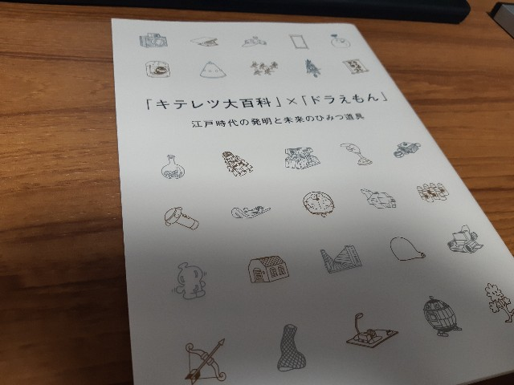

<h4>クリアファイル</h4>

「やろうぶっ殺してやる」でおなじみ(?)、迷作と名高い「<a class="keyword" href="http://d.hatena.ne.jp/keyword/%A5%C9%A5%E9%A4%A8%A4%E2%A4%F3">ドラえもん</a>だらけ」のクリアファイルと、企画展のイメージクリアファイル、そして<a class="keyword" href="http://d.hatena.ne.jp/keyword/%A5%AD%A5%C6%A5%EC%A5%C4%C2%E7%C9%B4%B2%CA">キテレツ大百科</a>第一作のクリアファイル。 
毎回こういうクリアファイルを買ってはもったいなくて使えずにしまい込んでしまう・・・。

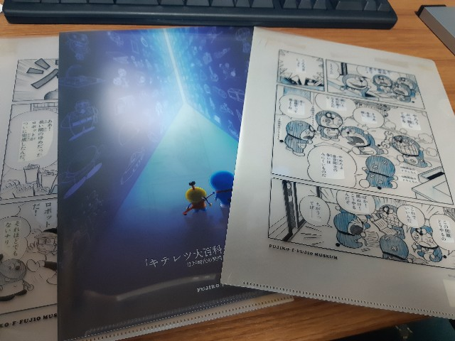

<h4>ネックレス</h4>

前回行ったときにはなかったので買ってきてもらいました。 
「「言葉を身にまとう」をコンセプトに、アクセサリーを展開するブランド“5108/コトバ”のネックレス」なんだそうです。 
暗記パン型とどこでもドア型。

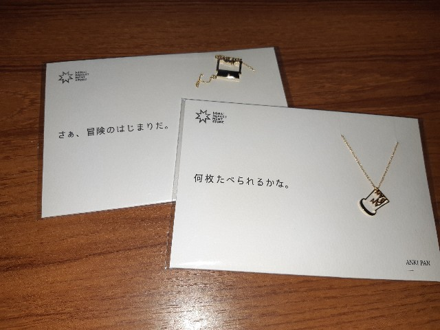

<h4>ピンズ</h4>

有名な帰ってきた<a class="keyword" href="http://d.hatena.ne.jp/keyword/%A5%C9%A5%E9%A4%A8%A4%E2%A4%F3">ドラえもん</a>の最終コマの絵柄以外はどこかシュールなシーンばかりな感じ。なぜそれをチョイスした。

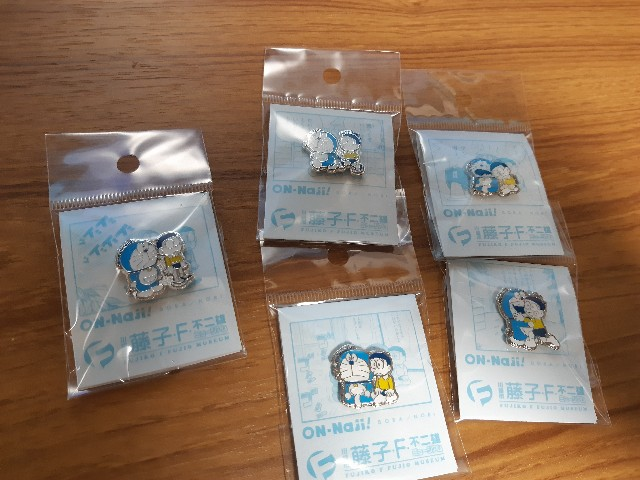

<h4>ポストカード</h4>

連載用原画のポストカードや<a class="keyword" href="http://d.hatena.ne.jp/keyword/%A5%B3%A5%ED%A5%B3%A5%ED%A5%B3%A5%DF%A5%C3%A5%AF">コロコロコミック</a>の扉絵を飾った<a class="keyword" href="http://d.hatena.ne.jp/keyword/%C2%E7%C4%B9%CA%D4%A5%C9%A5%E9%A4%A8%A4%E2%A4%F3">大長編ドラえもん</a>のカラー原画ポストカード、きれいな<a class="keyword" href="http://d.hatena.ne.jp/keyword/%A5%B8%A5%E3%A5%A4%A5%A2%A5%F3">ジャイアン</a>から<a class="keyword" href="http://d.hatena.ne.jp/keyword/%A5%B8%A5%E3%A5%A4%A5%A2%A5%CB%A5%BA%A5%E0">ジャイアニズム</a>あふれるポストカードなど、<a class="keyword" href="http://d.hatena.ne.jp/keyword/%A5%DF%A5%E5%A1%BC%A5%B8%A5%A2%A5%E0">ミュージアム</a>で売っていたポストカードを一通り。 
以前購入したものも混ざってるんですけども、何せ何を買ったかもうわからなくなってしまったので全部買ってきてもらいました(ｵｲ)。

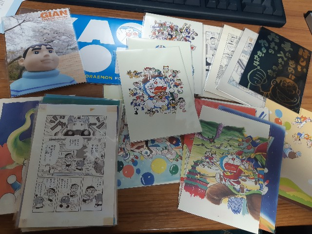

<h4>恐怖のレシート</h4>

そりゃこんだけ買えば結構な額になりますよね・・・。

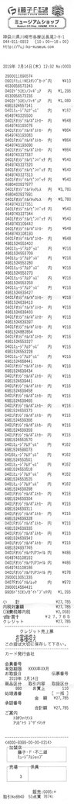

27785円・・・。 
今回複製原画買ってないのにこの金額になってしまった・・・。 
2万円あれば足りるかなと思ってたのですが（見積もりが甘い）、思っていた以上にポストカードが多かったり、ウェブサイト上に載っていない限定クリアファイルがあったのが原因。

とはいえほしかった限定品の数々が手に入ったので<a class="keyword" href="http://d.hatena.ne.jp/keyword/%CB%FC%A1%B9">万々</a>歳です。

あきえさんも割と<a class="keyword" href="http://d.hatena.ne.jp/keyword/%A5%DF%A5%E5%A1%BC%A5%B8%A5%A2%A5%E0">ミュージアム</a>を楽しんでいただけたようで何よりです。

<iframe src="https://hatenablog-parts.com/embed?url=https%3A%2F%2Fblog.akienote.com%2Fentry%2F20190218%2F1550494880" title="川崎市 藤子・F・不二雄ミュージアムへ行ってきた！ - アキエノート" class="embed-card embed-blogcard" scrolling="no" frameborder="0" style="display: block; width: 100%; height: 190px; max-width: 500px; margin: 10px 0px;"></iframe>

あきえさん本当にありがとうございまいた。 
次回はぜひ酢酸先生と一緒に<a class="keyword" href="http://d.hatena.ne.jp/keyword/%A5%DF%A5%E5%A1%BC%A5%B8%A5%A2%A5%E0">ミュージアム</a>へ！

