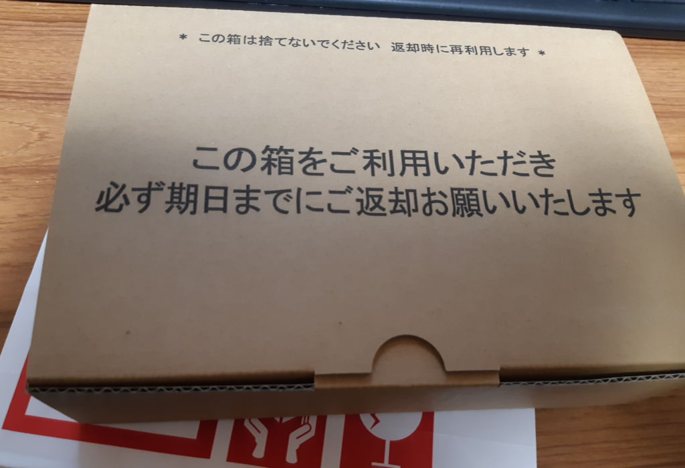
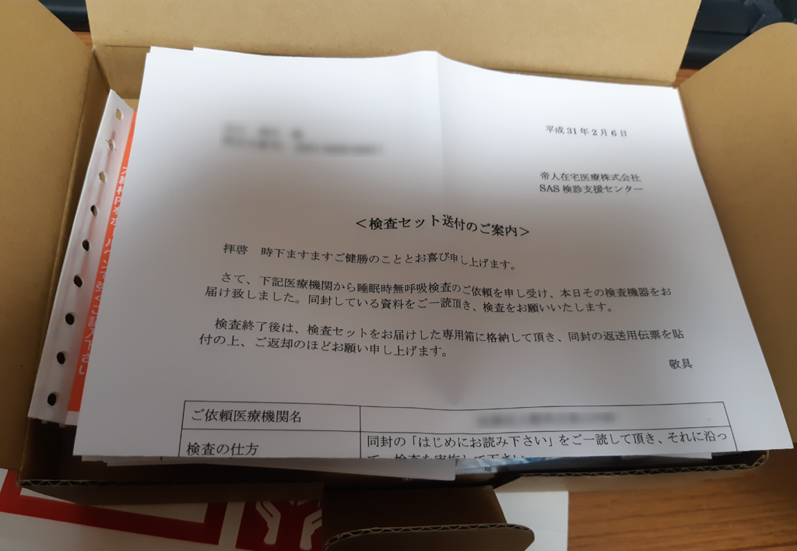
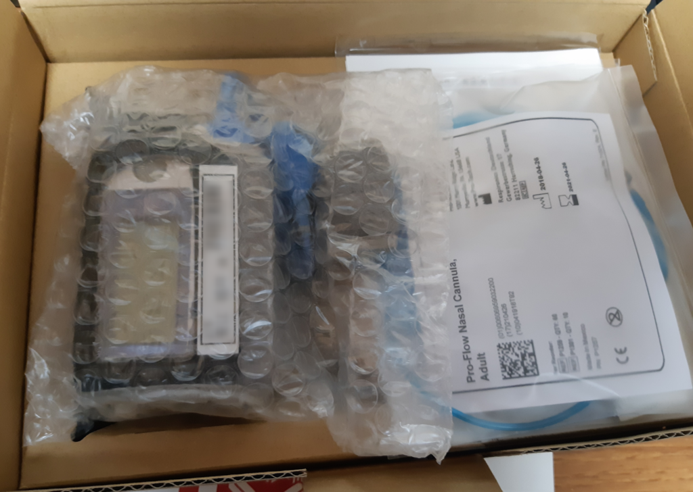
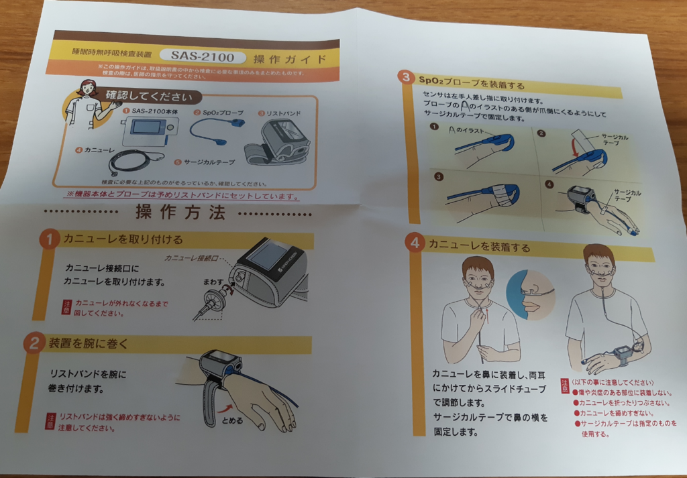
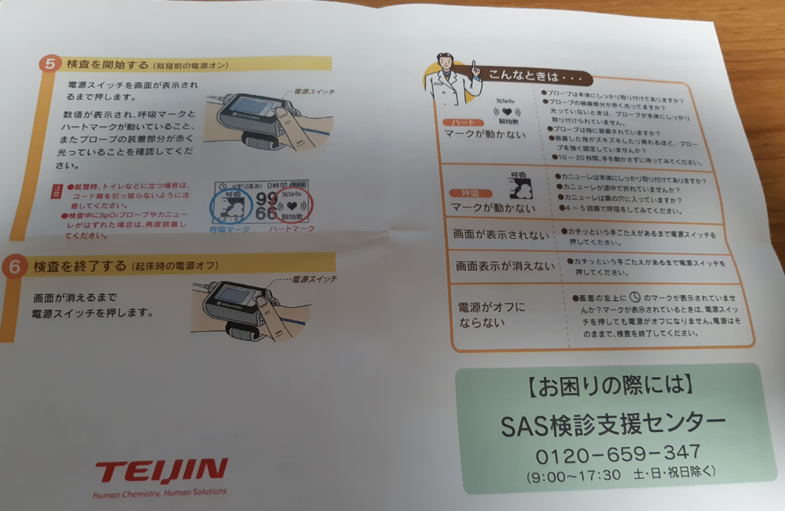
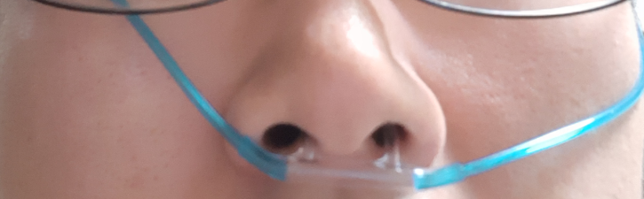
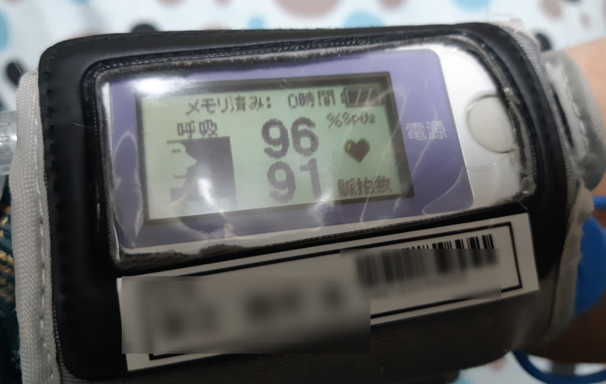

肥満外来に行ったときについでに<a class="keyword" href="http://d.hatena.ne.jp/keyword/%BF%E7%CC%B2%BB%FE%CC%B5%B8%C6%B5%DB%BE%C9%B8%F5%B7%B2">睡眠時無呼吸症候群</a>の検査をお願いし、自宅に検査キットが届いたので実際に使ってみました。

***

ヤマトで届いた検査キットはこの箱の中に入ってます。

送付案内。

中身。

操作ガイド。 

毛細血管内の酸素飽和度(正確にはSpO2、経皮的動脈血酸素飽和度)を測定するSpO2プローブを左手人差し指に取り付け、鼻に装着する<a class="keyword" href="http://d.hatena.ne.jp/keyword/%A5%AB%A5%CB%A5%E5%A1%BC%A5%EC">カニューレ</a>というチューブを本体につないだうえで鼻に差し込みます。 
(汚い顔で申し訳なく) 

装着すると、本体にこんな感じで酸素飽和度と脈拍数が計測、保存されます。

あとは普通に寝るだけ。

二晩計測してあとは宅急便で返送すればおしまい。

検査結果は病院に送られ、次回の診察時に教えてもらえるようです。 
次の診察は一か月後なので、結果はその時に。

