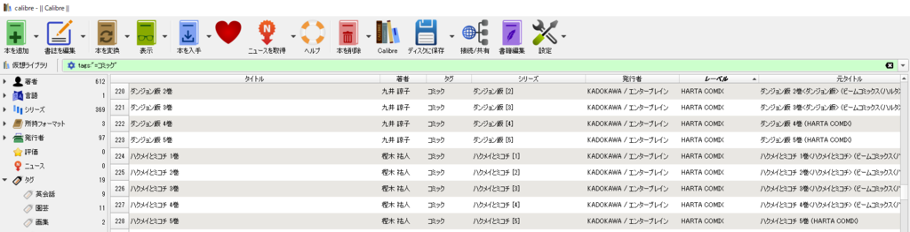

最近<a class="keyword" href="http://d.hatena.ne.jp/keyword/Calibre">Calibre</a>という<a class="keyword" href="http://d.hatena.ne.jp/keyword/%C5%C5%BB%D2%BD%F1%C0%D2">電子書籍</a>の管理ソフトを使ってます。

<iframe src="https://hatenablog-parts.com/embed?url=https%3A%2F%2Fforest.watch.impress.co.jp%2Flibrary%2Fsoftware%2Fcalibre%2F" title="窓の杜" class="embed-card embed-webcard" scrolling="no" frameborder="0" style="display: block; width: 100%; height: 155px; max-width: 500px; margin: 10px 0px;"></iframe>

このソフトで<a class="keyword" href="http://d.hatena.ne.jp/keyword/Kindle">Kindle</a>の<a class="keyword" href="http://d.hatena.ne.jp/keyword/%C5%C5%BB%D2%BD%F1%C0%D2">電子書籍</a>を管理してるんですが、私はタイトル欄には書籍名と巻数のみだけ、それ以外の情報は消しておきたいというポリシーがありまして、元のタイトルはカスタム列を作成してそちらに入れるようにしています。

こんな感じで。

が、たくさんデータがあるといちいちタイトル欄からコピーしてカスタム列にコピーして・・・ってのが面倒。

なので、<a class="keyword" href="http://d.hatena.ne.jp/keyword/Calibre">Calibre</a>のコマンドを利用して、一気にカスタム列にコピーするソフトを突貫で作りました。

***

<iframe src="https://hatenablog-parts.com/embed?url=https%3A%2F%2Fgithub.com%2FOvis%2FCalibreBulkCopyMetaData" title="Ovis/CalibreBulkCopyMetaData" class="embed-card embed-webcard" scrolling="no" frameborder="0" style="display: block; width: 100%; height: 155px; max-width: 500px; margin: 10px 0px;"></iframe>

App.config側に<a class="keyword" href="http://d.hatena.ne.jp/keyword/Calibre">Calibre</a>のパスやライブラリパス、コピー先の<a class="keyword" href="http://d.hatena.ne.jp/keyword/%A5%AB%A5%E9%A5%E0%CC%BE">カラム名</a>、コピー元の<a class="keyword" href="http://d.hatena.ne.jp/keyword/%A5%AB%A5%E9%A5%E0%CC%BE">カラム名</a>を指定してやると、コピー先カラムに値が書き込まれていない場合にコピー元カラムの値を取得して、コピー先カラムに書き込むだけ。

また、コピー元カラムにコピー先カラム内で利用されている値が含まれている場合に、その値を書き込む処理もフラグを変更したらできるようにしてます(CopyWhenIncludedFlg)。 
上の画像でいうレーベルというカラム、単行本レーベルを登録しているんですけど、これも一個一個入れるのが面倒なので、タイトル欄に入っているならそれをコピーして入れておきたいから実装した次第。 
実装が糞なので、「<a class="keyword" href="http://d.hatena.ne.jp/keyword/%A5%D3%A5%C3%A5%B0%A5%B3%A5%DF%A5%C3%A5%AF%A5%B9">ビッグコミックス</a>」と「<a class="keyword" href="http://d.hatena.ne.jp/keyword/%A5%D3%A5%C3%A5%B0%A5%B3%A5%DF%A5%C3%A5%AF%A5%B9">ビッグコミックス</a><a class="keyword" href="http://d.hatena.ne.jp/keyword/%A5%B9%A5%DA%A5%B7%A5%E3">スペシャ</a>ル」みたいなものだと<a class="keyword" href="http://d.hatena.ne.jp/keyword/%A5%D3%A5%C3%A5%B0%A5%B3%A5%DF%A5%C3%A5%AF%A5%B9">ビッグコミックス</a>のほうが採用されちゃうこともあるんですが、まぁいいや。

