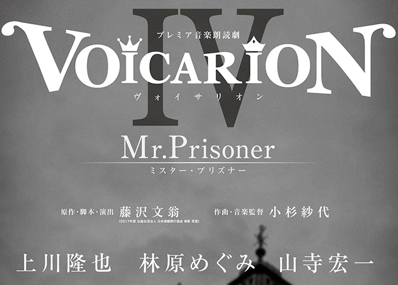

収監されてきました。 
ネタバレがありますので注意。

***

初めて「朗読劇」を鑑賞したのが同じく<a class="keyword" href="http://d.hatena.ne.jp/keyword/%C6%A3%C2%F4%CA%B8%B2%A7">藤沢文翁</a>氏脚本演出の「HYPNAGOGIA～ヒプナゴギア～」でした。

<iframe src="https://hatenablog-parts.com/embed?url=https%3A%2F%2Fblog.hitsujin.jp%2Fentry%2F2018%2F07%2F08%2F225052" title="音楽朗読劇 「HYPNAGOGIA」を見てきました - Pandora Pocket" class="embed-card embed-blogcard" scrolling="no" frameborder="0" style="display: block; width: 100%; height: 190px; max-width: 500px; margin: 10px 0px;"></iframe>

もともと生めぐさん目当てで鑑賞したのですが、声と音楽、そして照明演出が一体となった舞台に圧倒されたのを強く覚えています。

今回のMr.PrisonerはHYPNAGOGIAと同じく再演であり、出演者が

<ul>
<li><a class="keyword" href="http://d.hatena.ne.jp/keyword/%BB%B3%BB%FB%B9%A8%B0%EC">山寺宏一</a></li>
<li><a class="keyword" href="http://d.hatena.ne.jp/keyword/%CE%D3%B8%B6%A4%E1%A4%B0%A4%DF">林原めぐみ</a></li>
<li><a class="keyword" href="http://d.hatena.ne.jp/keyword/%BE%E5%C0%EE%CE%B4%CC%E9">上川隆也</a></li>
</ul>

という豪華キャスト。

特に、前回のHYPNAGOGIAでは一人一役でしたが、今回は山ちゃんがなんと一人九役！上川さんも二役！

というわけで行ってきました大阪<a class="keyword" href="http://d.hatena.ne.jp/keyword/%A5%B5%A5%F3%A5%B1%A5%A4%A5%DB%A1%BC%A5%EB%A5%D6%A5%EA%A1%BC%A5%BC">サンケイホールブリーゼ</a>。

<blockquote class="twitter-tweet" data-lang="HASH(0xf272510)">
今日はこれを見に (@ <a class="keyword" href="http://d.hatena.ne.jp/keyword/%A5%B5%A5%F3%A5%B1%A5%A4%A5%DB%A1%BC%A5%EB%A5%D6%A5%EA%A1%BC%A5%BC">サンケイホールブリーゼ</a> - <a href="https://twitter.com/breeze_hall?ref_src=twsrc%5Etfw">@breeze_hall</a> in <a class="keyword" href="http://d.hatena.ne.jp/keyword/%C2%E7%BA%E5%BB%D4">大阪市</a>, <a class="keyword" href="http://d.hatena.ne.jp/keyword/%C2%E7%BA%E5%C9%DC">大阪府</a>) <a href="https://t.co/FJpbYhDsdU">https://t.co/FJpbYhDsdU</a> <a href="https://t.co/GaidZlP3hX">pic.twitter.com/GaidZlP3hX</a>
&mdash; Ovis＠🐑のひと (@Pandora_Ovis) <a href="https://twitter.com/Pandora_Ovis/status/1106824474534518784?ref_src=twsrc%5Etfw">March 16, 2019</a></blockquote>

今回は前回のHYPNAGOGIAより若干大きめの会場で、私は二階から鑑賞しました。うっかりオペラグラスを忘れてしまったのが痛恨のミス・・・。

<h4>作品の内容(サイトに載っているレベルのネタバレのみ)</h4>

<blockquote>
１９世紀　英国
ロンドン塔（Tower of London）地下３階には
光を通さない分厚い鉄扉の独居房があった
そこには一人の囚人が幽閉されていて
囚人の周囲には、不思議な指示が出されていたという・・・
“牢屋番は耳の不自由なものにせよ”
囚人番号２５２号・・・
彼は「絶対に声を聞いてはならない囚人」と呼ばれていた・・・
</blockquote>

ということで、19世紀の<a class="keyword" href="http://d.hatena.ne.jp/keyword/%A5%F4%A5%A3%A5%AF%A5%C8%A5%EA%A5%A2%BD%F7%B2%A6">ヴィクトリア女王</a>がイギリスを治めていた時代のお話。 
終盤<a class="keyword" href="http://d.hatena.ne.jp/keyword/%A5%F4%A5%A3%A5%AF%A5%C8%A5%EA%A5%A2%BD%F7%B2%A6">ヴィクトリア女王</a>の夫である<a class="keyword" href="http://d.hatena.ne.jp/keyword/%A5%A2%A5%EB%A5%D0%A1%BC%A5%C8%B8%F8">アルバート公</a><a class="keyword" href="http://d.hatena.ne.jp/keyword/%CA%F8%B8%E6">崩御</a>の話が出てきますので、<a class="keyword" href="http://d.hatena.ne.jp/keyword/1861%C7%AF">1861年</a>より数年ほど前の話になるようです。 
まだ労働者階級と貴族階級の差は大きく、労働者は働けど生活は苦しい、そんな時代。

めぐさん演じるレスは牢屋番の孫。上記ストーリーの通り、牢屋番は耳が不自由な者を使うようにとありますが、物語が始まった段階ですでにこの牢屋番は亡くなっています。 
牢屋番しか肉親のいなかったレスは、牢屋番である祖父が亡くなったことが知られてしまうとロンドン塔から追い出されてしまうため、それを隠して囚人に食事を運ぶのですが、ついうっかり声を上げ、囚人(山ちゃん)に耳が聞こえることがバレてしまいます。

それがきっかけで囚人であると会話するようになり、先生と生徒という関係になるわけですが、ある時この囚人の正体を知るという男(上川さん)が現れ・・・。

<h4>感想ほか(ネタバレあり)</h4>

最初、上川さん演じるチャールズ・<a class="keyword" href="http://d.hatena.ne.jp/keyword/%A5%C7%A5%A3%A5%B1%A5%F3%A5%BA">ディケンズ</a>(実在する人物)と、めぐさん演じるレスとの会話から始まるんですが、私ちゃんとサイトに載ってるストーリーを読まずに行ったので、レスの声がめちゃくちゃ大人っぽくて「え？」となったのですが、ある程度聞いてこの話が大人になったレスによる昔語りであることを理解。

第一幕の終わりまで上川さんはほとんど出番がなく、ほとんどがめぐさんと山ちゃんの会話となります。 
最初は山ちゃんフードをかぶって怪しさ満点といった感じだったのですが、レスが13歳の少女だと知ったとたんフードを取っていきなり紳士に。ちょっと笑いました。

今回山ちゃんが一人で九役も演じているんですが、囚人である<a class="keyword" href="http://d.hatena.ne.jp/keyword/%A5%A8%A5%C9">エド</a>ワード・ホークウッド伯爵、劇中劇の船乗りシンドバッドの手下とオウム、風船男と枯れた男(ちょっとうろ覚え)、クリス・アシュビー、書店の老人(実はその正体は囚人の恩師)とあと・・・なんだったかわからなくなって(最後のキャスト紹介で上川さんが一番緊張すると言っていたのがこの山ちゃんの演じたキャ<a class="keyword" href="http://d.hatena.ne.jp/keyword/%A5%E9%A5%AF">ラク</a>ター紹介)しまいましたが、さすがは七色の声を持つ男性声優の山ちゃん。見事に演じ分けられていました。これを生で見ただけでもう鳥肌ものです。

まためぐさんも、今回キャ<a class="keyword" href="http://d.hatena.ne.jp/keyword/%A5%E9%A5%AF">ラク</a>ターとしては一役なんですが、大人になったレスと子供のレスを見事に演じ分けています。まぁ子供レスのかわいらしく聡明なこと。囚人が書店の老人の容姿について話したことをその老人自身にそのまま言ったときの罵詈雑言ぷりは子供だからこそできる無邪気なもので、思わず観客皆で笑ってしまうほどでした。

どちらかというと第一幕は明るい感じだったのですが、第一幕の最後でクライヴ・<a class="keyword" href="http://d.hatena.ne.jp/keyword/%A5%D8%A5%A4%A5%B9%A5%C6%A5%A3%A5%F3%A5%B0%A5%B9">ヘイスティングス</a>卿が出てきたところで話が変わってきます。囚人について意味深げなせりふを吐いていくクライヴ。
このクライヴ、最初に登場したチャールズと違い、どこか狂気を感じさせる名演技に、上川さんすごい上手い・・・！と感心。

ここで20分間の休憩が挟まれるのですが、この休憩に入るときのアナウンスが「20分間の脱獄でございます」だったのには思わずニヤッとしました。といいますか今回の劇場アナウンス、所々で「当監獄は～」とか「受刑者の皆様～」とか良い感じにひねってあって、舞台の世界観を壊さないように努めていてとてもよかったです。

後半はついに囚人<a class="keyword" href="http://d.hatena.ne.jp/keyword/%A5%A8%A5%C9">エド</a>ワード・ホークウッド伯爵がどのような人なのか、なぜ投獄されたのかが明かされます。 
<a class="keyword" href="http://d.hatena.ne.jp/keyword/%A5%F4%A5%A3%A5%AF%A5%C8%A5%EA%A5%A2%BD%F7%B2%A6">ヴィクトリア女王</a>マジで酷い。

クライヴとしてはレスが親友であるクリスの二の舞にならないようになんとかしようというところが、何とも見当違いな正義感なわけですが、もしもあの時クリスが訪ねてきたときにちゃんと話を聞いてあげたらこんなことにはならなかったのではという自責がああさせたのだと思うと、何とも責め辛い・・・。

クライヴが話した真相(間違ってるけど)のせいで先生と生徒の関係が最終的に壊れてしまったときの<a class="keyword" href="http://d.hatena.ne.jp/keyword/%A5%A8%A5%C9">エド</a>ワードの慟哭っぷりも、山ちゃんの圧巻の声の演技で心を揺さぶるものがありました。

最初はレスの先生になることを嫌がっていたのに、レスの未来への絶望を知り、再度先生となりレスを導くことを決めた<a class="keyword" href="http://d.hatena.ne.jp/keyword/%A5%A8%A5%C9">エド</a>ワード。復讐のためと老人に預けていた私財を投じてレスに教育を施していたことも終盤で判明し、なおのことその慟哭に涙を誘います。

最後改心した(という表現はあってないけどうまく説明できない)クライヴの助力で再度<a class="keyword" href="http://d.hatena.ne.jp/keyword/%A5%A8%A5%C9">エド</a>ワードと扉越しに会えたレス。このあたりもう泣くしかない。 
牢獄に閉じ込められたままの<a class="keyword" href="http://d.hatena.ne.jp/keyword/%A5%A8%A5%C9">エド</a>ワードの心がレスによって解放されたときの山ちゃんの演技が見事すぎてもう。

この朗読劇、単なる朗読だけでなく、生演奏と照明や<a class="keyword" href="http://d.hatena.ne.jp/keyword/%C3%BA%BB%C0%A5%AC%A5%B9">炭酸ガス</a>による演出があり、より一層舞台に引き込まれます。 
これは生でないと感じられない。(今後発売される円盤も、映像のないものなのが残念無念。買うけど・・・。)

終演後、ちょっと席を立つのが惜しいという思いに浸りつつ外に出ました。 
HYPNAGOGIAもそうでしたが、決して大団円という終わりではありません。が、それこそ舞台となったイギリスロンドンの霧のようにしっとりと心を湿らせる、不思議な感覚でした。

次回のVOICALIONは山ちゃんとめぐさん、そして<a class="keyword" href="http://d.hatena.ne.jp/keyword/%B5%DC%CC%EE%BF%BF%BC%E9">宮野真守</a>とこれまたチケットが取れるか心配になるメンツとなるのですが、ぜひともチケットを購入して見に行きたいものです。

お財布事情から東京に行くのは辛いので、今回のように大阪公演、または名古屋公演があると嬉しいな・・・。

<blockquote class="twitter-tweet" data-lang="HASH(0xd483d10)">
またのご投獄をお待ちしております<a href="https://twitter.com/hashtag/voicarion?src=hash&amp;ref_src=twsrc%5Etfw">#voicarion</a> <a href="https://twitter.com/hashtag/MrPrisoner?src=hash&amp;ref_src=twsrc%5Etfw">#MrPrisoner</a>
&mdash; Ovis＠🐑のひと (@Pandora_Ovis) <a href="https://twitter.com/Pandora_Ovis/status/1106867320633217024?ref_src=twsrc%5Etfw">March 16, 2019</a></blockquote>

