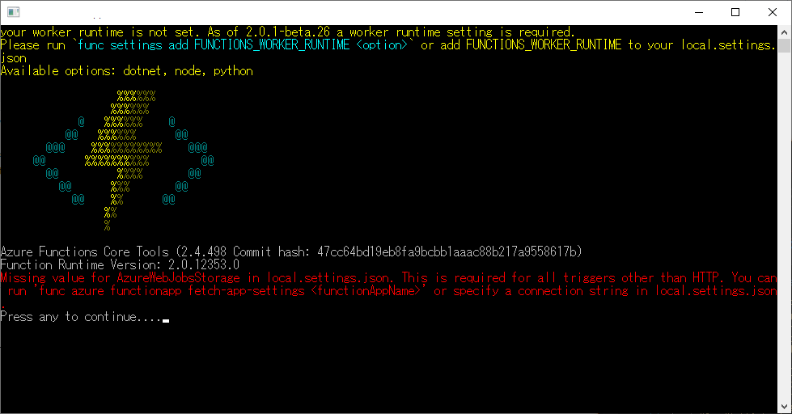

AzureFunctionsのlocal.settings.<a class="keyword" href="http://d.hatena.ne.jp/keyword/json">json</a>ファイルといえば

<blockquote>
{ 
"IsEncrypted": false, 
"Values": { 
"FUNCTIONS_WORKER_RUNTIME": "<language worker>", 
"AzureWebJobsStorage": "&lt;connection-string>", 
"AzureWebJobsDashboard": "&lt;connection-string>", 
"MyBindingConnection": "&lt;binding-connection-string>" 
}, 
"Host": { 
"LocalHttpPort": 7071, 
"CORS": "*" 
}, 
"ConnectionStrings": { 
"SQLConnectionString": "&lt;sqlclient-connection-string>" 
} 
}
</blockquote>

<a href="https://docs.microsoft.com/ja-jp/azure/azure-functions/functions-run-local">Azure Functions Core Tools &#x306E;&#x64CD;&#x4F5C; | Microsoft Docs</a>

のような感じで設定情報が保存されてます。

***

今回Valuesに新たに追加する際、

<blockquote>
  "Values": { 
"FUNCTIONS_WORKER_RUNTIME": "<language worker>", 
"AzureWebJobsStorage": "&lt;connection-string>", 
"AzureWebJobsDashboard": "&lt;connection-string>", 
"MyBindingConnection": "&lt;binding-connection-string>", 
"NewParam": { 
"NewKey1": "NewParameter1", 
"NewKey2": "NewParameter2", 
} 
},
</blockquote>

こんな感じで、階層を持たせた形で追加したのですが、これでAzure Functionsを起動すると、 

<blockquote>
Missing <a class="keyword" href="http://d.hatena.ne.jp/keyword/value">value</a> for AzureWebJobsStorage in local.settings.<a class="keyword" href="http://d.hatena.ne.jp/keyword/json">json</a>. This is required for all triggers other than HTTP. You can run 'func azure functionapp fetch-app-settings <functionAppName>' or specify a connection string in local.settings.<a class="keyword" href="http://d.hatena.ne.jp/keyword/json">json</a>.
</blockquote>

こんな感じでエラーを吐いて動かない。

Azure Functionsの<a class="keyword" href="http://d.hatena.ne.jp/keyword/GitHub">GitHub</a>に本件についてIssueがありまして、

<iframe src="https://hatenablog-parts.com/embed?url=https%3A%2F%2Fgithub.com%2FAzure%2Fazure-functions-core-tools%2Fissues%2F223" title="Missing Value for AzureWebJobsStorage in local.settings.json - still errors out · Issue #223 · Azure/azure-functions-core-tools" class="embed-card embed-webcard" scrolling="no" frameborder="0" style="display: block; width: 100%; height: 155px; max-width: 500px; margin: 10px 0px;"></iframe>

こちらによると、

<blockquote>
Values collection is expected to be a Dictionary&lt;string, string> and it's failing to parse it and returning an empty dictionary. I think parsing it as a JObject and displaying an error for any non-string values would be more correct here.

I know it's a bit confusing with the<a class="keyword" href="http://d.hatena.ne.jp/keyword/%20.NET"> .NET</a> Core appsettings.<a class="keyword" href="http://d.hatena.ne.jp/keyword/json">json</a>, but this file local.settings.<a class="keyword" href="http://d.hatena.ne.jp/keyword/json">json</a> is meant to just be a local equivalent to the Azure App Settings which are just key-<a class="keyword" href="http://d.hatena.ne.jp/keyword/value">value</a> pairs.
</blockquote>

ということで、 Dictionary&lt;string, string>として保持する関係で、階層的に値を持たせることができないらしい。 
なんてこったい。

なので上記のような<a class="keyword" href="http://d.hatena.ne.jp/keyword/JSON">JSON</a>だと、

<blockquote>
  "Values": { 
"FUNCTIONS_WORKER_RUNTIME": "<language worker>", 
"AzureWebJobsStorage": "&lt;connection-string>", 
"AzureWebJobsDashboard": "&lt;connection-string>", 
"MyBindingConnection": "&lt;binding-connection-string>", 
"NewParam:NewKey1": "NewParameter1" 
"NewParam:NewKey2": "NewParameter2" 
},
</blockquote>

として持たせる方法をとるくらいしかなさそうです。

まぁ確かにAzureポータル上では結局こういう風に値をセットすることになりますし、階層で持たせるようなことはあまりしないのかも・・・？

ただ、エラーメッセージが分かりにくい。

<blockquote>
Missing <a class="keyword" href="http://d.hatena.ne.jp/keyword/value">value</a> for AzureWebJobsStorage in local.settings.<a class="keyword" href="http://d.hatena.ne.jp/keyword/json">json</a>.
</blockquote>

これだとAzureWebJobsStorage のKeyが登録されてないという風にしか読めないです。上記の仕様でパースができなかった結果<a class="keyword" href="http://d.hatena.ne.jp/keyword/Value">Value</a>が取得できなかったためのエラーなんでしょうけども。

以上、<a class="keyword" href="http://d.hatena.ne.jp/keyword/JSON">JSON</a>の規格上は正しくても、Azure Functionsでは動かないという罠でした。

