この時期になるとサクラ大戦の曲をいつの間にか口ずさんでいるひつじです(年がら年中の間違い)  

<?# EmbedLink "https://www.youtube.com/watch?v=gqxN7Y_HAb8" /?>

桜が大変きれいに咲き誇る時期になりまして、ちょうど統一地方選の投票もあったので、ついでにちょっと足を延ばして桜並木の写真を撮ってきました。  

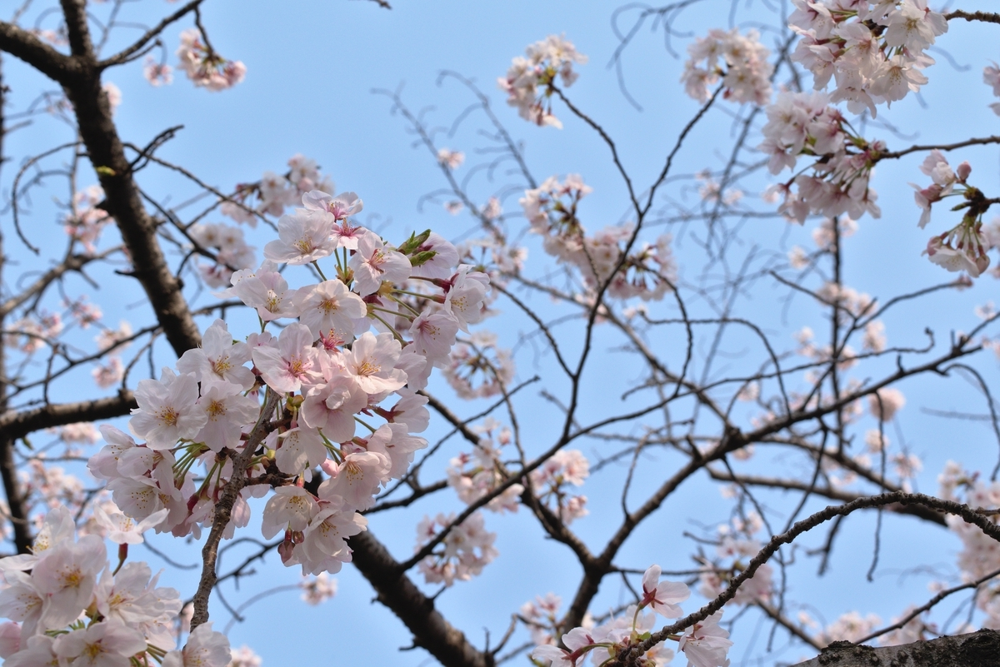 

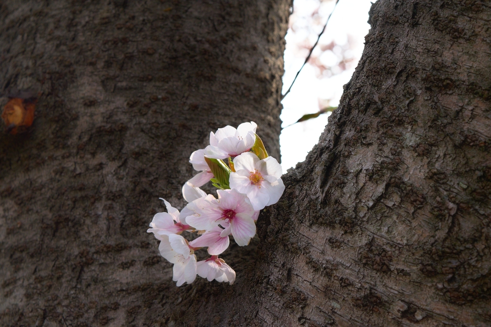 

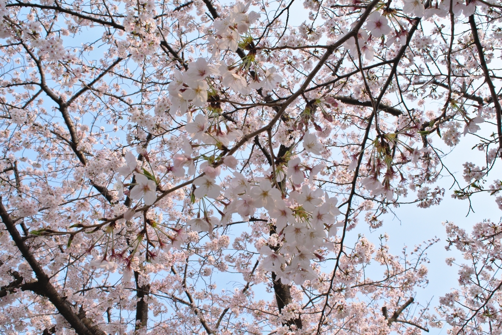 

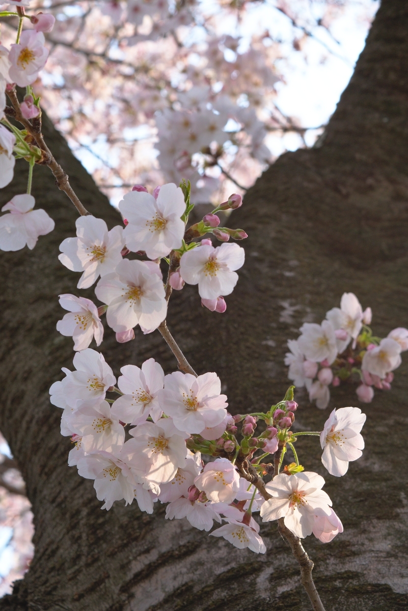 

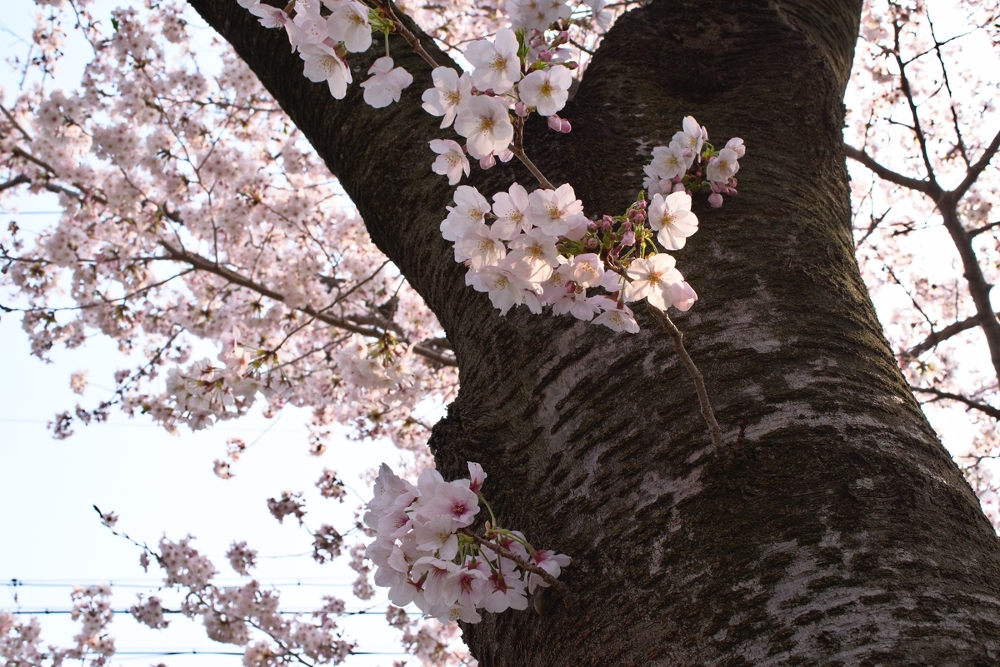 

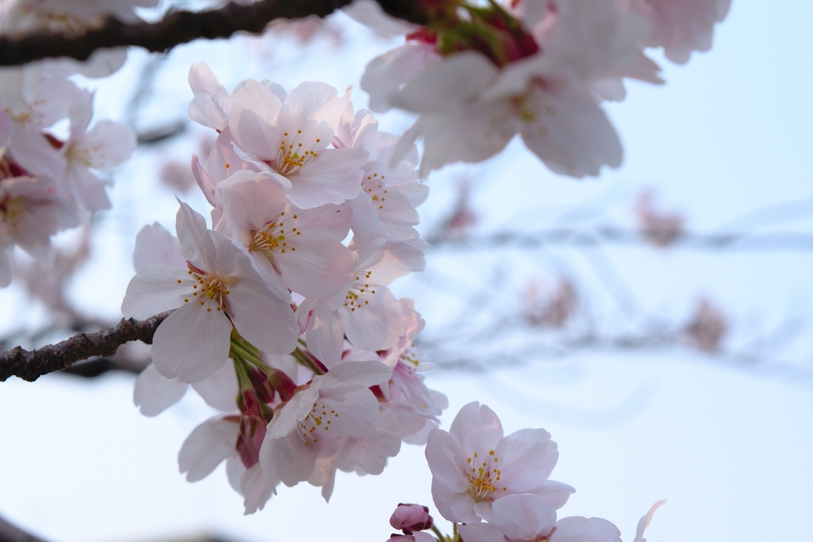 

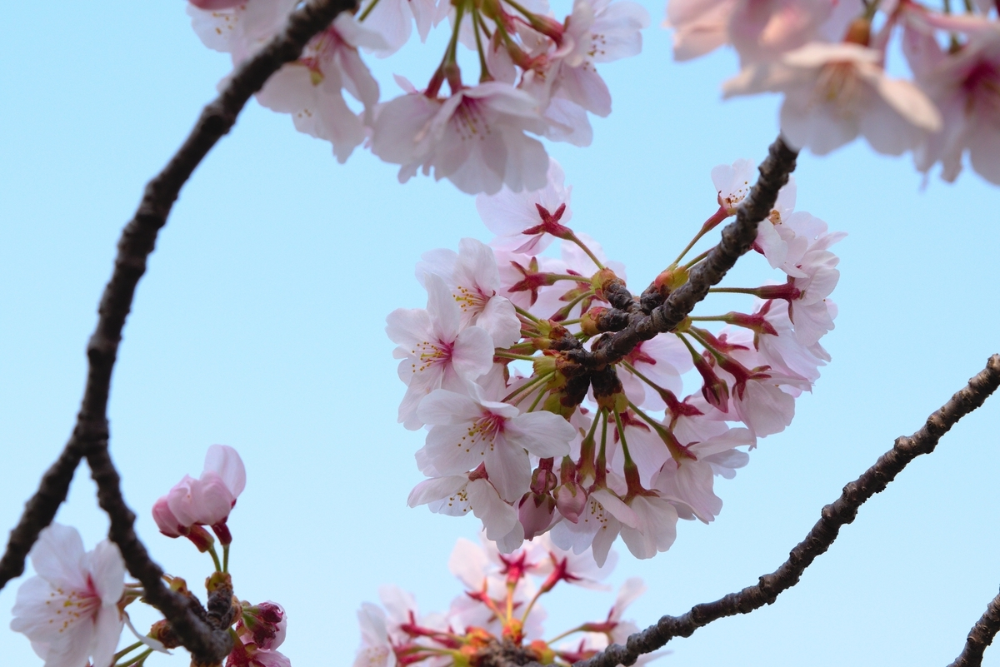 

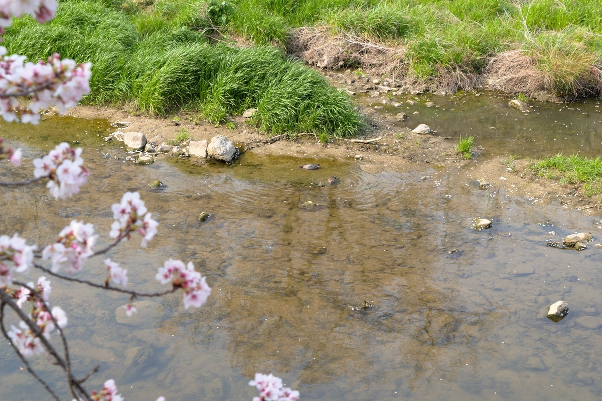 

 

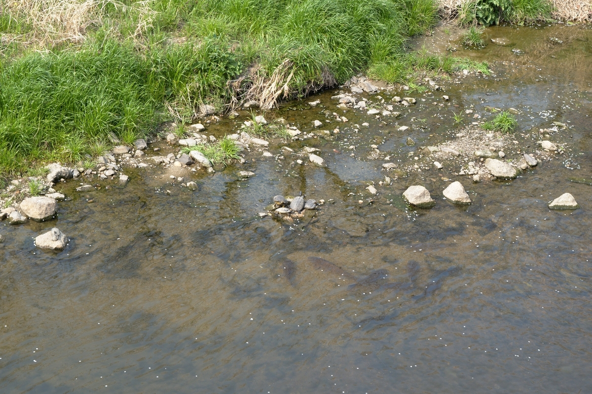 

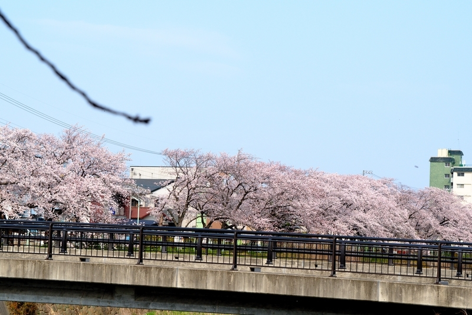 

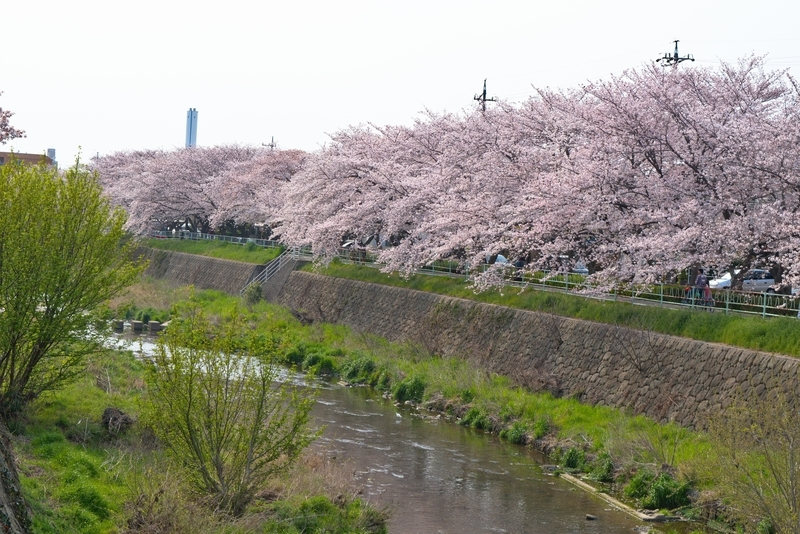 

カメラはNikon D5500。Adobe Lightroomを契約してないので、フリーソフトのdarktableで現像処理してみました。  

<?# EmbedLink "https://www.darktable.org/" /?>

