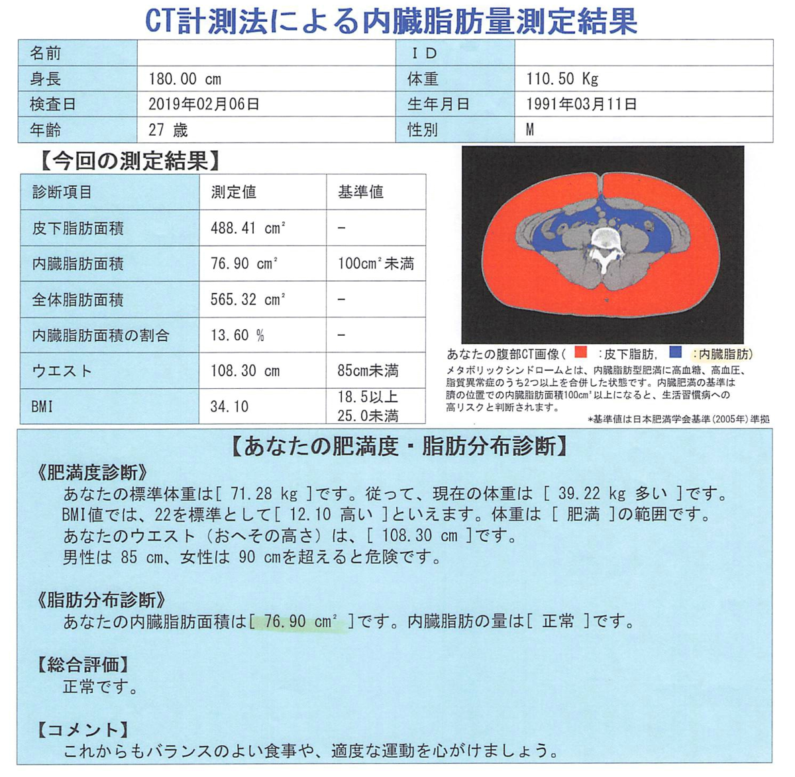
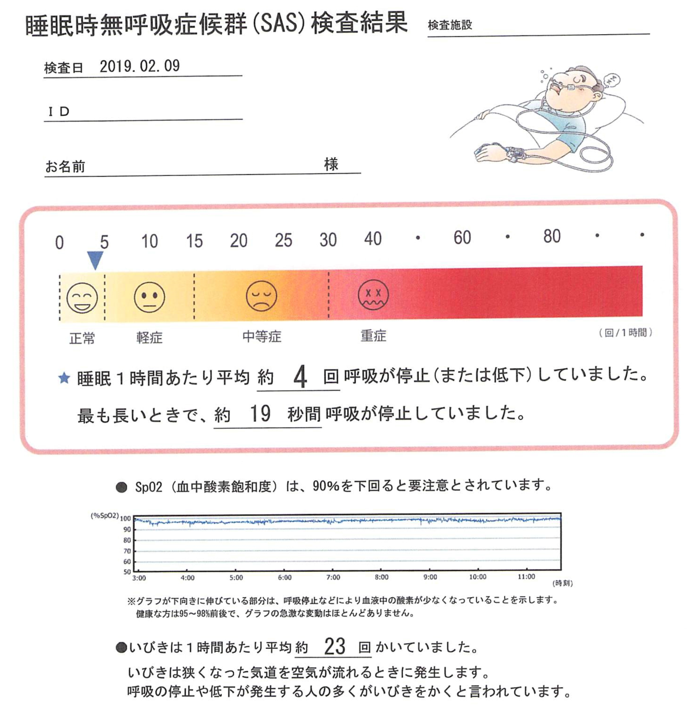
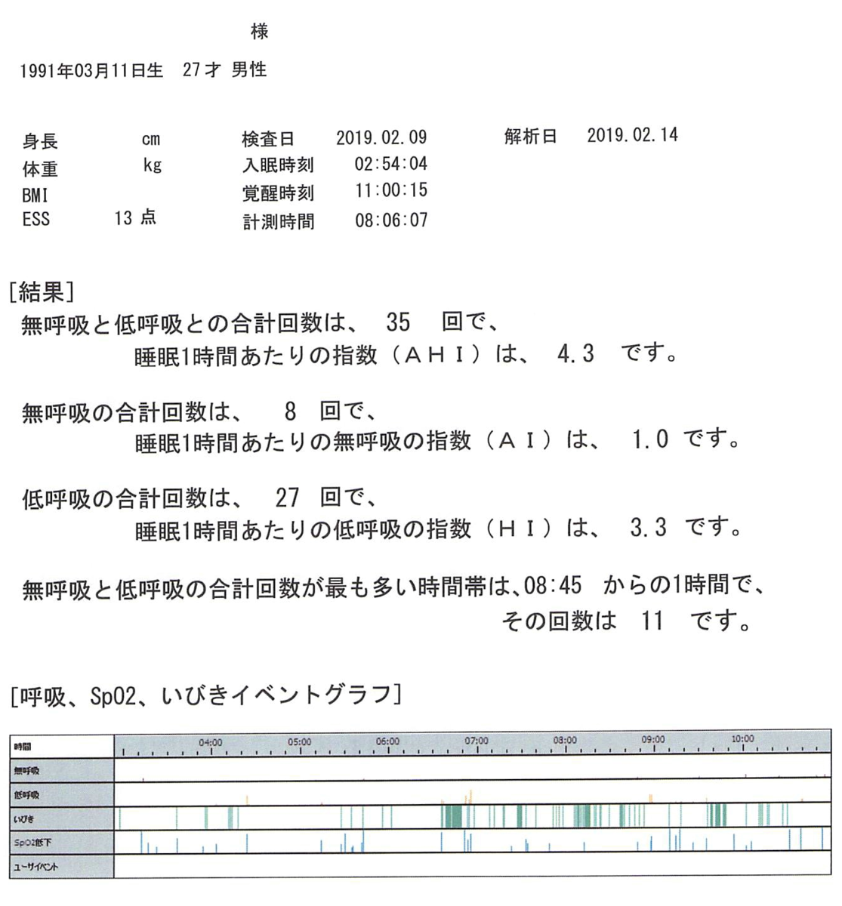
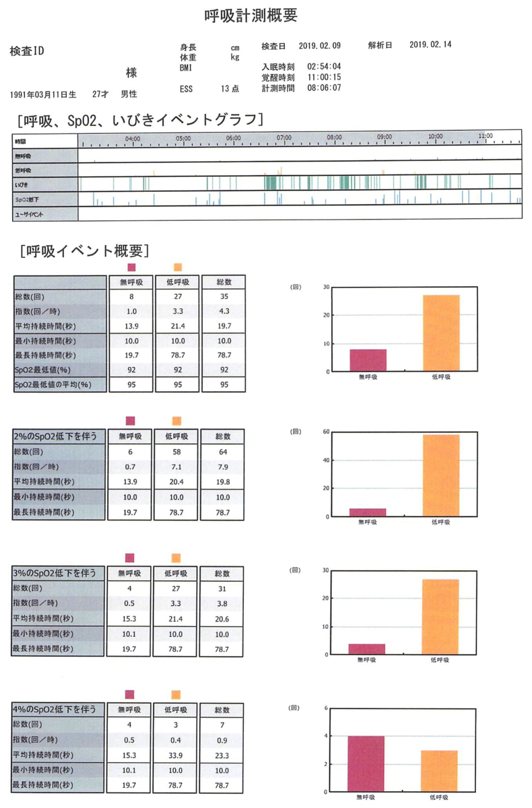
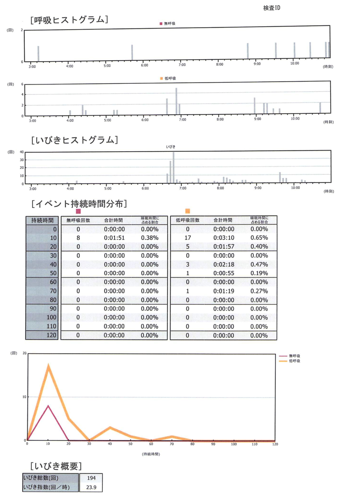
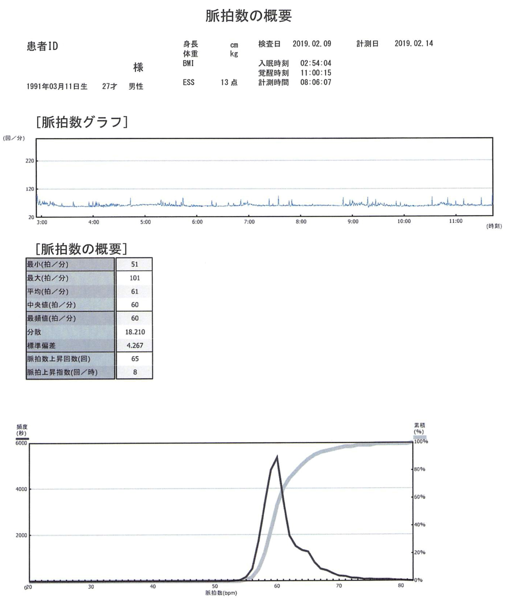

すっかり書き忘れてた。

前回、二月に肥満外来に行きまして、一か月経過したので改めて診察を受けました。

<iframe src="https://hatenablog-parts.com/embed?url=https%3A%2F%2Fblog.hitsujin.jp%2Fentry%2F2019%2F02%2F06%2F233800" title="肥満外来に行ってきた(第一回) - Pandora Pocket" class="embed-card embed-blogcard" scrolling="no" frameborder="0" style="display: block; width: 100%; height: 190px; max-width: 500px; margin: 10px 0px;"></iframe>

***

まず体重が落ちたか否かなのですが、<b>ほとんど落ちてません！！</b>

2月6日の初回計測で110.5kgで、110.2kgと、0.3kgのマイナスということで、誤差の範疇。

ダメじゃん、って話ではあるのですが、首回りとかの贅肉が落ちてるらしく、家族からは痩せてきてるといわれてるので、体型としては若干変動がある模様。

経過を見る形で新しい薬が処方されました。

前回処方された薬とほとんど変わりませんが、コレバイン錠500mgの代わりにコレバインミニ83%という薬に代わりました。 
同じコレバインなので特に違いはなさそう。

そして前回測定したCTの結果がこちら。

幸いにも、内臓脂肪値は正常で、皮下脂肪が多いという状態でした。 
内臓脂肪が多いと大きな病気になりやすいですが、皮下脂肪は比較的安全ということなので、一安心。

もちろん痩せなければならないことには変わりないのですが。

次に、<a class="keyword" href="http://d.hatena.ne.jp/keyword/%BF%E7%CC%B2%BB%FE%CC%B5%B8%C6%B5%DB%BE%C9%B8%F5%B7%B2">睡眠時無呼吸症候群</a>について。

<iframe src="https://hatenablog-parts.com/embed?url=https%3A%2F%2Fblog.hitsujin.jp%2Fentry%2F2019%2F02%2F19%2F120000" title="睡眠時無呼吸症候群の検査キットで検査してみた - Pandora Pocket" class="embed-card embed-blogcard" scrolling="no" frameborder="0" style="display: block; width: 100%; height: 190px; max-width: 500px; margin: 10px 0px;"></iframe>

結論としては問題なし。 
いびきは多いものの、<a class="keyword" href="http://d.hatena.ne.jp/keyword/%BF%E7%CC%B2%BB%FE%CC%B5%B8%C6%B5%DB%BE%C9%B8%F5%B7%B2">睡眠時無呼吸症候群</a>ではないようです。 
まぁ首周りの肉のせいでいびきが多いってことなので、どちらにしても痩せないと・・・。

なお、前回測定した結果はこんな感じでもらえました。

