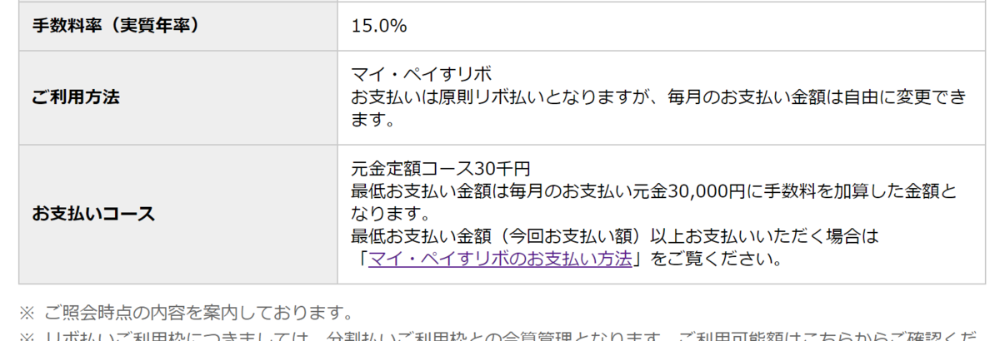

私のあほおおおおおおおおおおおおおおおおおおおおおおおおおお！と絶叫してるひつじです。

<iframe src="https://hatenablog-parts.com/embed?url=https%3A%2F%2Fjapanese.engadget.com%2F2019%2F04%2F11%2F4900-500-4-12%2F" title="速報：アマゾンがプライム会員費を値上げ、年4900円/月500円に。4月12日から - Engadget Japanese" class="embed-card embed-webcard" scrolling="no" frameborder="0" style="display: block; width: 100%; height: 155px; max-width: 500px; margin: 10px 0px;"></iframe>

<a class="keyword" href="http://d.hatena.ne.jp/keyword/Amazon%20Prime">Amazon Prime</a>の年会費が1000円値上がりすることが発表されました。

まぁ年会費で1000円なのでそんなに大きな値上がりではないでしょう。 
私はPrime特典のPrimePhoto容量無制限を大いに利用しているので、解約するつもりはありません。

といいますか、<a class="keyword" href="http://d.hatena.ne.jp/keyword/Amazon">Amazon</a> MasterCardゴールドを使ってるので、自動的にPrime会員になります。 
さて、この発表があった時、ふとMasterCardゴールドの年会費が改定されたりしてないかと気になり、Vpass（MasterCardゴールドを提供している<a class="keyword" href="http://d.hatena.ne.jp/keyword/%BB%B0%B0%E6%BD%BB%CD%A7%B6%E4%B9%D4">三井住友銀行</a>のカードサイト）を開きました。

特に値上がりのことも書いてないので、ほっとしつつ最近全く見てなかったのでちらちらサイトを見てたところ。

あれ・・・？先月は<a class="keyword" href="http://d.hatena.ne.jp/keyword/Amazon">Amazon</a>でそんなに買ってないぞ・・・？

ちょっとここで嫌な予感がしまして。

大前提として、AmazonMasterCardゴールドは年会費が1万円かかるカードです。 
ただし、リボ払い(マイ・ペイすリボ)を選択することで5000円減額、ウェブ明細に切り替えることでさらに1000円減額されます。 
AmazonPrime年会費が3900円なので、実質400円程度で持てるカードとなります。今回の改正で、実質ただとなるわけです。

で、リボ払いは手数料がかかるわけなのですが、利用限度額を実際に使う額より多く設定しておくことで一括返済となり、手数料がかからない。

さて、私もリボ払いの設定した時、利用限度額を大きく設定した<b>はず</b>です。

あああああああああああああああああああああああああああああああああああああああああああああああああああああああああ！

利用限度額が3万円になってる・・・。 
0つけ忘れた・・・？

このせいで3万円までしか支払いがされておらず、手数料がモリモリ取られていたようですorz

ご返済可能額として表示されていた今後の返済金額は約60万円。 
大半は自分が<a class="keyword" href="http://d.hatena.ne.jp/keyword/Amazon">Amazon</a>で購入した分とはいえ、毎月ちゃんと支払ってたと思ってたので、この金額を目にするとうへぇ・・・という言葉しか出ない・・・。

すぐに支払金額の変更手続きを取り、50万円まで増やした後、返済分を一括で振り込んできました。

<h4>なぜ気づかなかったの</h4>

私は普段MoneyForwardで家計簿をつけています。 
もちろんAmazonMasterCardも紐づけてました。

じゃあなぜ気づかなかったのか。 
設定を行ったときのことを覚えてないので恐らくではあるんですが。。

前提として、AmazonMasterCardは<a class="keyword" href="http://d.hatena.ne.jp/keyword/Amazon">Amazon</a>での買い物にしか利用していません。それ以外のところで使うならもっと還元率の高いカード(Kyash+ジャックスカードとか)があるので。  
なので、 AmazonMasterCardに乗る明細は<a class="keyword" href="http://d.hatena.ne.jp/keyword/Amazon">Amazon</a>の買い物情報とイコール(年会費は除く)となります。

そして、MoneyForwardに<a class="keyword" href="http://d.hatena.ne.jp/keyword/Amazon">Amazon</a>自体も紐づけているため、<a class="keyword" href="http://d.hatena.ne.jp/keyword/Amazon">Amazon</a>から取得される明細（商品名）とAmazonMasterCardの

<ul>
<li><a class="keyword" href="http://d.hatena.ne.jp/keyword/Amazon">Amazon</a> Downloads(<a class="keyword" href="http://d.hatena.ne.jp/keyword/Kindle">Kindle</a>本)</li>
<li>(振替)<a class="keyword" href="http://d.hatena.ne.jp/keyword/AMAZON.CO.JP">AMAZON.CO.JP</a></li>
</ul>

という明細がそれぞれMoneyForward上に表示されてしまうのが嫌で、どうせ<a class="keyword" href="http://d.hatena.ne.jp/keyword/Amazon">Amazon</a>から紐づけられた情報がカードの明細なのだからと、MoneyForwardの表示項目(グループとして作ってある)からAmazonMasterCardを対象外にしてしまってました。

このため、毎月どれだけ<a class="keyword" href="http://d.hatena.ne.jp/keyword/Amazon">Amazon</a>で使ってるかは把握してるものの、実際のカード引き落とし金額はちゃんと把握してない状態になってました。 
で、MoneyForwardで把握してるのだからと、毎月来るMasterCardの引き落とし確定金額のメールは特にちゃんと見てなかったという。

Vpassだと1年以上前の明細が取得できないのでMoneyForwardに保存されてたこれまでの明細を確認した限り、確かに手数料も含めると60万近く未払い金がありました。 
だいたい毎月数千円手数料で持っていかれていたことを考えると、Primeの年会費を毎月支払っていたようなもの・・・。

<h4>結論</h4>

<ol>
<li>
限度額設定はちゃんと目視確認！！
</li>
<li>
毎月の支払金額はちゃんと確認しましょう！！！（基本中の基本ですわね・・・）
</li>
</ol>

リボ払いは取り扱いを間違えると危ないことは認識していて、ちゃんと設定していた<i><b>つもり</b></i>だったところが本当に我ながら詰めが甘い。 
今回のPrime年会費値上げでAmazonMasterCardゴールドを契約することを考えられている方。 
巷にあふれてる年会費を浮かせる方法を試す際は、絶対限度額がちゃんと一括返済できる額で設定されていることをちゃんと確認してくださいね・・・。

以上あほなひつじでした。

<blockquote class="twitter-tweet" data-lang="HASH(0xf381568)">
リボ払いをいまいちわかってないけども気を付けないと火が付くことは知っている
&mdash; Ovis＠🐑のひと (@Pandora_Ovis) <a href="https://twitter.com/Pandora_Ovis/status/707957658758688769?ref_src=twsrc%5Etfw">March 10, 2016</a></blockquote>

<blockquote class="twitter-tweet" data-lang="HASH(0xec004f8)">
カードはリボ払いは絶対にしないと心に誓ってる
&mdash; Ovis＠🐑のひと (@Pandora_Ovis) <a href="https://twitter.com/Pandora_Ovis/status/402833691690278912?ref_src=twsrc%5Etfw">November 19, 2013</a></blockquote>

追記 
ゴールドカードの2.5%キャッシュバック、大きいといえば大きいものの、今となってはKyash+高還元カードを使えばそれ以上の還元があることを考えると、解約してしまってもいいかもしれない。

***