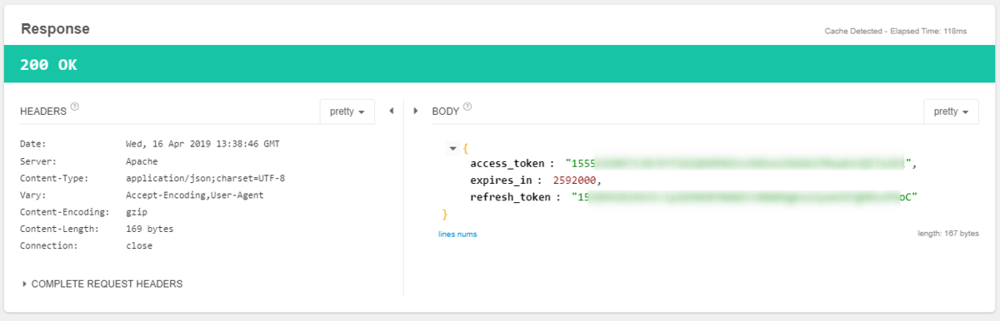

デブな現状を改善するべく、毎日体重を測っています。

以前作った、<a class="keyword" href="http://d.hatena.ne.jp/keyword/%A5%BF%A5%CB%A5%BF">タニタ</a>の体重計のデータを取得してDiscordに投稿するAzure Functionsについて、私の実装が悪かったのか単に設定がおかしかったのかわかりませんが、Azureの課金額が結構な額になってしまい、現在GCEに.NET Coreなコンソールアプリを配置して、定期実行させるようにしています。

<iframe src="https://hatenablog-parts.com/embed?url=https%3A%2F%2Fblog.hitsujin.jp%2Fentry%2F2018%2F10%2F14%2F154344" title="TANITAのHealthPlanetからデータを取得してDiscordに投稿するAzure Functionsを作った - Pandora Pocket" class="embed-card embed-blogcard" scrolling="no" frameborder="0" style="display: block; width: 100%; height: 190px; max-width: 500px; margin: 10px 0px;"></iframe>

現時点でのソースはこちら。

<iframe src="https://hatenablog-parts.com/embed?url=https%3A%2F%2Fgithub.com%2FOvis%2FPostDietProgress" title="Ovis/PostDietProgress" class="embed-card embed-webcard" scrolling="no" frameborder="0" style="display: block; width: 100%; height: 155px; max-width: 500px; margin: 10px 0px;"></iframe>

***

初めて実装した当初よくわかってなかった（←おい）非同期処理などをasync,awaitを利用したモダンな書き方にしたりするなどして、当初よりはきれいなソースにしています。 
が、一点いまだにひどい実装がありまして、どうするか悩んでました。

それはログインIDとパスワードを保持していること。 
HealthPlanetの<a class="keyword" href="http://d.hatena.ne.jp/keyword/API">API</a>はOAuth 2.0で認証が行われています。 
当然最初はログインIDとパスワードを利用して<a class="keyword" href="http://d.hatena.ne.jp/keyword/%A5%C8%A1%BC%A5%AF">トーク</a>ンを取得する必要がありますが、それ以降は<a class="keyword" href="http://d.hatena.ne.jp/keyword/%A5%C8%A1%BC%A5%AF">トーク</a>ンで認証されるので、本来だったら一度だけ使ったらそれ以降は不要のため、保持してはいけないはず。

が、今のところ保持した実装になってます。 
というのも、<a class="keyword" href="http://d.hatena.ne.jp/keyword/API">API</a>の仕様を見た限り、リク<a class="keyword" href="http://d.hatena.ne.jp/keyword/%A5%A8%A5%B9">エス</a>ト<a class="keyword" href="http://d.hatena.ne.jp/keyword/%A5%C8%A1%BC%A5%AF">トーク</a>ンを取得した際にRefreshTokenももらえるものの、仕様書上にRefreshTokenを利用したリク<a class="keyword" href="http://d.hatena.ne.jp/keyword/%A5%A8%A5%B9">エス</a>ト<a class="keyword" href="http://d.hatena.ne.jp/keyword/%A5%C8%A1%BC%A5%AF">トーク</a>ン再発行について言及がないため。 
現時点での仕様書の記載はこんな感じ。

<blockquote>
/oauth/token 
リク<a class="keyword" href="http://d.hatena.ne.jp/keyword/%A5%A8%A5%B9">エス</a>ト<a class="keyword" href="http://d.hatena.ne.jp/keyword/%A5%C8%A1%BC%A5%AF">トーク</a>ンを取得する。/oauth/auth を完了してから10分以内に完了させる必要がある 
URL : 
<a href="https://www.healthplanet.jp/oauth/token">https://www.healthplanet.jp/oauth/token</a> 
引数 : 
client_id (必須) 
アプリケーションの client_id 
client_secret (必須) 
アプリケーションの client_secret 
redirect_<a class="keyword" href="http://d.hatena.ne.jp/keyword/uri">uri</a> (必須) 
処理完了時、もしくはエラー発生時のリターンURL。アプリケーション登録にて指定した<a class="keyword" href="http://d.hatena.ne.jp/keyword/%A5%C9%A5%E1%A5%A4%A5%F3">ドメイン</a>のURLもしくは 
<a href="https://www.healthplanet.jp/success.html">https://www.healthplanet.jp/success.html</a> が指定可能 
code (必須) 
/oauth/auth にて取得したコード 
grant_type (必須) 
<a class="keyword" href="http://d.hatena.ne.jp/keyword/API">API</a>の付与タイプを指定する。現仕様では authorization_code のみ指定可能
</blockquote>

一般的なOAuthの実装だと、grant_typeにrefreshtokenを指定して、あらかじめ取得したRefreshTokenを渡してやればリク<a class="keyword" href="http://d.hatena.ne.jp/keyword/%A5%A8%A5%B9">エス</a>ト<a class="keyword" href="http://d.hatena.ne.jp/keyword/%A5%C8%A1%BC%A5%AF">トーク</a>ンが取得できるはず。 
なのに、

<blockquote>
authorization_code のみ指定可能
</blockquote>

と書かれているので、RefreshTokenでリク<a class="keyword" href="http://d.hatena.ne.jp/keyword/%A5%A8%A5%B9">エス</a>ト<a class="keyword" href="http://d.hatena.ne.jp/keyword/%A5%C8%A1%BC%A5%AF">トーク</a>ンを取得できなさそう・・・。

というわけで仕方がなくIDとパスワードを保持していました。

で、本題。 
最近ちょっと機能追加をしたくてソースをいじっている際、ふと仕様書が単に古いだけで、実は実装されてるってことはないよな・・・？と思い、grant_typeにrefreshtokenを指定し、codeにリフレッシュ<a class="keyword" href="http://d.hatena.ne.jp/keyword/%A5%C8%A1%BC%A5%AF">トーク</a>ンを指定してやったところ、

あ、いけた。

というわけで、実は行ける模様・・・？ 
懸念としては、取得されたリク<a class="keyword" href="http://d.hatena.ne.jp/keyword/%A5%A8%A5%B9">エス</a>ト<a class="keyword" href="http://d.hatena.ne.jp/keyword/%A5%C8%A1%BC%A5%AF">トーク</a>ンが元のリク<a class="keyword" href="http://d.hatena.ne.jp/keyword/%A5%A8%A5%B9">エス</a>ト<a class="keyword" href="http://d.hatena.ne.jp/keyword/%A5%C8%A1%BC%A5%AF">トーク</a>ンと同じだったこと。 
まだ元のリク<a class="keyword" href="http://d.hatena.ne.jp/keyword/%A5%A8%A5%B9">エス</a>ト<a class="keyword" href="http://d.hatena.ne.jp/keyword/%A5%C8%A1%BC%A5%AF">トーク</a>ンが切れてないからなのか、やっぱり使えないのかは不明。有効期間が30日なので、30日後に判明します。

・・・。一度<a class="keyword" href="http://d.hatena.ne.jp/keyword/%A5%BF%A5%CB%A5%BF">タニタ</a>に念のため聞いておいたほうがいいだろうか・・・。
でも、こちらの記事によるとあまり<a class="keyword" href="http://d.hatena.ne.jp/keyword/API">API</a>に関してはサポートで教えてくれないらしいしうーむ・・・。

<iframe src="https://hatenablog-parts.com/embed?url=https%3A%2F%2Fmuziyoshiz.hatenablog.com%2Fentry%2F2016%2F01%2F11%2F234921" title="Health Planet からデータをエクスポートするための embulk-input-healthplanet プラグイン - 無印吉澤" class="embed-card embed-blogcard" scrolling="no" frameborder="0" style="display: block; width: 100%; height: 190px; max-width: 500px; margin: 10px 0px;"></iframe>

<h4>追記(2019/07/13)</h4>

リク<a class="keyword" href="http://d.hatena.ne.jp/keyword/%A5%A8%A5%B9">エス</a>ト<a class="keyword" href="http://d.hatena.ne.jp/keyword/%A5%C8%A1%BC%A5%AF">トーク</a>ンの有効期限が切れた後にリフレッシュ<a class="keyword" href="http://d.hatena.ne.jp/keyword/%A5%C8%A1%BC%A5%AF">トーク</a>ンを用いて正常に新しいリク<a class="keyword" href="http://d.hatena.ne.jp/keyword/%A5%A8%A5%B9">エス</a>ト<a class="keyword" href="http://d.hatena.ne.jp/keyword/%A5%C8%A1%BC%A5%AF">トーク</a>ンが発行されたことを確認しました。

