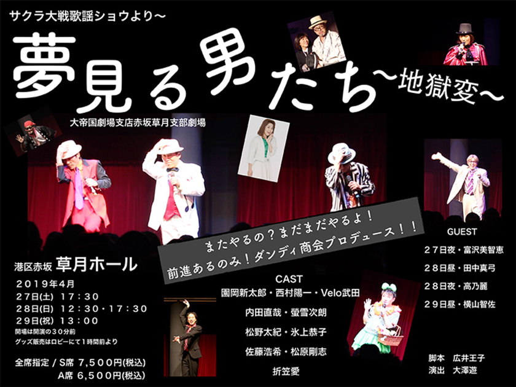

つまりは<a class="keyword" href="http://d.hatena.ne.jp/keyword/%A5%B5%A5%AF%A5%E9%C2%E7%C0%EF">サクラ大戦</a>です。

<iframe src="https://hatenablog-parts.com/embed?url=http%3A%2F%2Fsakura-taisen.com%2Finfo%2F2019%2F20190218_01.html" title="「サクラ大戦歌謡ショウより～『夢見る男たち～地獄変～』大帝国劇場支店赤坂草月支部劇場」開催決定！ | INFORMATION | サクラ大戦.com" class="embed-card embed-webcard" scrolling="no" frameborder="0" style="display: block; width: 100%; height: 155px; max-width: 500px; margin: 10px 0px;"></iframe>

東京赤坂、<a class="keyword" href="http://d.hatena.ne.jp/keyword/%C1%F0%B7%EE%A5%DB%A1%BC%A5%EB">草月ホール</a>にて、<a class="keyword" href="http://d.hatena.ne.jp/keyword/%A5%B5%A5%AF%A5%E9%C2%E7%C0%EF">サクラ大戦</a>歌謡ショウより～『夢見る男たち～<a class="keyword" href="http://d.hatena.ne.jp/keyword/%C3%CF%B9%F6%CA%D1">地獄変</a>～』 と題して、<a class="keyword" href="http://d.hatena.ne.jp/keyword/%A5%B5%A5%AF%A5%E9%C2%E7%C0%EF">サクラ大戦</a>のショウが行われたので見てきました。

***

<h4>そもそも</h4>

そもそも<a class="keyword" href="http://d.hatena.ne.jp/keyword/%A5%B5%A5%AF%A5%E9%C2%E7%C0%EF">サクラ大戦</a>って<a class="keyword" href="http://d.hatena.ne.jp/keyword/%A5%BB%A5%AC">セガ</a>のゲームなわけですが、総合プロデューサーである<a class="keyword" href="http://d.hatena.ne.jp/keyword/%B9%AD%B0%E6%B2%A6%BB%D2">広井王子</a>氏の叔母が<a class="keyword" href="http://d.hatena.ne.jp/keyword/%BE%BE%C3%DD%B2%CE%B7%E0%C3%C4">松竹歌劇団</a>の第1期生だったらしく、その叔母の舞台を楽屋裏から眺めていた体験をもとに作った作品なんだそうで（<a class="keyword" href="http://d.hatena.ne.jp/keyword/Wikipedia">Wikipedia</a>によれば）。

で。キャストを決める際、舞台に耐えられる声優を求め、オーディションではなく、広井氏自らライブや劇場、イベントに足を運んでキャスティングしたそうで、実際に声優自らが出演する<a class="keyword" href="http://d.hatena.ne.jp/keyword/2.5%BC%A1%B8%B5">2.5次元</a>舞台が97年に行われてたわけです。最近<a class="keyword" href="http://d.hatena.ne.jp/keyword/2.5%BC%A1%B8%B5">2.5次元</a>ミュージカルが多く行われてますが、まさに先駆け。

歌謡ショウは2006年に終了してしまいましたが(それでも9年間も行われていたわけですげえわ・・・)、さらにその10年後の2017年から、原作には登場しないショウオリジナルキャ<a class="keyword" href="http://d.hatena.ne.jp/keyword/%A5%E9%A5%AF">ラク</a>ターである<a class="keyword" href="http://d.hatena.ne.jp/keyword/%A5%C0%A5%F3%A5%C7%A5%A3%A1%BC">ダンディー</a>団のVelo武田氏(もともとの芸名は武田滋裕だったのですが、キャ<a class="keyword" href="http://d.hatena.ne.jp/keyword/%A5%E9%A5%AF">ラク</a>ターであるベロムーチョ武田の名にあやかり？Velo武田に改名)がリアルにダンディ商会という会社(劇団？）を立ち上げて、男性キャスト陣を中心にショウを行っています。

今回見に行ったのはその4回目のショウになります。

<h4><a class="keyword" href="http://d.hatena.ne.jp/keyword/%A5%B5%A5%AF%A5%E9%C2%E7%C0%EF">サクラ大戦</a>との出会い</h4>

私は実のところまったく<a class="keyword" href="http://d.hatena.ne.jp/keyword/%A5%B5%A5%AF%A5%E9%C2%E7%C0%EF">サクラ大戦</a>をやったことがありません。 
<a class="keyword" href="http://d.hatena.ne.jp/keyword/%A5%B5%A5%AF%A5%E9%C2%E7%C0%EF">サクラ大戦</a>というコンテンツを知ったのはおそらく中学生のころ、<a class="keyword" href="http://d.hatena.ne.jp/keyword/%A5%CB%A5%B3%A5%CB%A5%B3%C6%B0%B2%E8">ニコニコ動画</a>の<a class="keyword" href="http://d.hatena.ne.jp/keyword/%BF%C0%B6%CA">神曲</a>集あたりで<a class="keyword" href="http://d.hatena.ne.jp/keyword/%A5%B2%A5%AD%A5%C6%A5%A4">ゲキテイ</a>！を聞いたときじゃないでしょうか。 
蛇足ですが、個人的にファンである『<a class="keyword" href="http://d.hatena.ne.jp/keyword/%CE%D3%B8%B6%A4%E1%A4%B0%A4%DF">林原めぐみ</a>』を知ったのもこの<a class="keyword" href="http://d.hatena.ne.jp/keyword/%A5%CB%A5%B3%A5%CB%A5%B3%C6%B0%B2%E8">ニコニコ動画</a>の<a class="keyword" href="http://d.hatena.ne.jp/keyword/%BF%C0%B6%CA">神曲</a>集で<a class="keyword" href="http://d.hatena.ne.jp/keyword/Give%20a%20reason">Give a reason</a>を聞いたことがきっかけだったはずなので、私のオタク的人格生成に<a class="keyword" href="http://d.hatena.ne.jp/keyword/%A5%CB%A5%B3%A5%CB%A5%B3%C6%B0%B2%E8">ニコニコ動画</a>は相当影響を及ぼしたんだなぁと今更思いにふけってます。

で、<a class="keyword" href="http://d.hatena.ne.jp/keyword/%A5%B2%A5%AD%A5%C6%A5%A4">ゲキテイ</a>という曲自体は確かに中学生のころから聞いて割と好きだったわけですが、特に熱を入れて聞いてるわけではありませんでした。 
で、ここまでいきなりはまるようになったきっかけが、また例によって<a class="keyword" href="http://d.hatena.ne.jp/keyword/%A5%CB%A5%B3%A5%CB%A5%B3%C6%B0%B2%E8">ニコニコ動画</a>でして、適当に動画を探しているときに、たまたま歌謡ショウの動画を見たんです。(大変アウトなんですが・・・)

一番最初に見たのはどの作品だったか覚えてないのですが、いつの間にか見入ってしまって、そこからたくさん上がってた（だめだろ）過去の公演をあさるように見まして、曲のすばらしさに感激して、今や絶版のために買えない全曲集2冊を4.5万近く出して<a class="keyword" href="http://d.hatena.ne.jp/keyword/%A5%E4%A5%D5%A5%AA%A5%AF">ヤフオク</a>でセリ落とし、ひたすら聞きまくるかたちで<a class="keyword" href="http://d.hatena.ne.jp/keyword/%A5%B5%A5%AF%A5%E9%C2%E7%C0%EF">サクラ大戦</a>の歌謡ショウの世界にのめりこみました。

上記では曲に対して絶賛してますが、歌謡ショウ自体もとてもよくできていて、各キャストが見事に世界を作り出してるんです。 
ゲームをやってないので、アニメ版<a class="keyword" href="http://d.hatena.ne.jp/keyword/%A5%B5%A5%AF%A5%E9%C2%E7%C0%EF">サクラ大戦</a>と読み漁ったウェブ上の資料くらいしか世界観をちゃんと知らなかったりする（ファンとしてそれはどうなのかってのはある）のですが、本当の舞台俳優に劣らない(正確に言えば、<a class="keyword" href="http://d.hatena.ne.jp/keyword/%C5%C4%C3%E6%BF%BF%B5%DD">田中真弓</a>さん、高野麗さん、<a class="keyword" href="http://d.hatena.ne.jp/keyword/%C9%D9%C2%F4%C8%FE%C3%D2%B7%C3">富沢美智恵</a>さんみたいに実際に役者として舞台をやってる方もいらっしゃるわけですが)演技を、本当のキャ<a class="keyword" href="http://d.hatena.ne.jp/keyword/%A5%E9%A5%AF">ラク</a>ターの声で演じてくれるわけですよ。燃えないわけがない。 
また、キャストと観客の一体感がものすごい。 
よく訓練された観客なんて言いますが、本当にそれで、歌が流れるとそれに合わせた手拍子を叩いたり、キャストが決めると掛け声をかけたり、映像としてみてる私もなんかその場にいるような気持になるという。

たとえ歌謡ショウが終わる2006年より前に知っていたとしても、まだ中学生高校生の頃なので東京まで見に行くことはできなかっただろうとは思うものの、生で見られた人々がうらやましくてたまらない・・・。

で、私がショウの存在を知り、のめりこんだころにはすでに<a class="keyword" href="http://d.hatena.ne.jp/keyword/%A5%B5%A5%AF%A5%E9%C2%E7%C0%EF">サクラ大戦</a>というコンテンツはもう終わってしまった・・・と思っていたんですが、公式サイトを見てみると、前述のとおり<a class="keyword" href="http://d.hatena.ne.jp/keyword/%A5%C0%A5%F3%A5%C7%A5%A3%A1%BC">ダンディー</a>団主催のミニショウが行われてるじゃないですか。 
これは見るしかない！と昨年の9月の「『続々・花咲く男たち』 大帝国劇場支店<a class="keyword" href="http://d.hatena.ne.jp/keyword/%B2%D6%A4%E4%A4%B7%A4%AD">花やしき</a><a class="keyword" href="http://d.hatena.ne.jp/keyword/%BB%D9%C9%F4">支部</a>劇場」のチケットを購入したんですが、休日出勤が入っていくことがかなわず・・・。前職はそんなんばっかりだ・・・。(<a class="keyword" href="http://d.hatena.ne.jp/keyword/%A5%C9%A5%E9%A5%AF%A5%A8">ドラクエ</a>のライブも仕事が入って泣く泣くチケットを弟に譲ったり・・・)

で、今年こそは！！！とチケットを購入し、東京にやってきました。

<h4>会場に着いたら</h4>

今回4/29にこのショウを観劇し、5/2に<a class="keyword" href="http://d.hatena.ne.jp/keyword/angela">angela</a>のライブを見るため、ちょっと荷物が多く、いったん赤坂でecbo cloakを使って荷物を預けて、徒歩で会場の<a class="keyword" href="http://d.hatena.ne.jp/keyword/%C1%F0%B7%EE%A5%DB%A1%BC%A5%EB">草月ホール</a>に向かおうとしたんですが、土地勘がないのと、赤坂の周りってTBSがある関係か関係者以外立ち入り禁止の道路とかもあって遠回りすることになり、仕方がないのでほぼ初乗り運賃だしまぁいいやとタクシーで<a class="keyword" href="http://d.hatena.ne.jp/keyword/%C1%F0%B7%EE%A5%DB%A1%BC%A5%EB">草月ホール</a>へ。

タクシーを降りていざホールの中へ行こうとしたタイミングでなにやら見覚えのある格好の方が歩いてらっしゃる・・・？と思わず後姿を追うと、お隣の公園の喫煙所に向かう中でほかの人がその人に声をかけ、写真を撮ってもらってる。

<a class="keyword" href="http://d.hatena.ne.jp/keyword/%B9%AD%B0%E6%B2%A6%BB%D2">広井王子</a>氏でした。

歌謡ショウでは<a class="keyword" href="http://d.hatena.ne.jp/keyword/%B9%AD%B0%E6%B2%A6%BB%D2">広井王子</a>氏が劇場の掃除人として前説を行うのが定番になっています。 
2017年に惜しくもお亡くなりになった<a class="keyword" href="http://d.hatena.ne.jp/keyword/%C3%E6%C5%E8%C1%EF%C9%A7">中嶋聡彦</a>さん演じる中嶋の親方(ショウオリジナルのキャ<a class="keyword" href="http://d.hatena.ne.jp/keyword/%A5%E9%A5%AF">ラク</a>ター)との前説でのやり取りは本当に面白いのです。映像でしか見たことがないのだけど。

<a class="keyword" href="http://d.hatena.ne.jp/keyword/%A5%B5%A5%AF%A5%E9%C2%E7%C0%EF">サクラ大戦</a>の生みの親が、あの映像でしか見たことがない掃除人の恰好で目の前にいる！？！？と思わず私も(ちょっと口が回らなくて、ザ・オタクみたいなしゃべり方になってましたが・・・)写真撮影をお願いし、一枚パシャリ。 
今更になって、なぜ一緒に撮らせてもらわなかったのかと悔やんでます・・・。いやまだチャンスはあるはず・・・。

<h4>ショウ</h4>

これまでのダンディ団主催歌謡ショウは浅草の<a class="keyword" href="http://d.hatena.ne.jp/keyword/%B2%D6%A4%E4%A4%B7%A4%AD">花やしき</a>(ファンの方はご存じでしょうけども、作品中では<a class="keyword" href="http://d.hatena.ne.jp/keyword/%C4%EB%B9%F1%B2%DA%B7%E2%C3%C4">帝国華撃団</a>の<a class="keyword" href="http://d.hatena.ne.jp/keyword/%C9%F0%C1%F5">武装</a>飛行船「翔鯨丸」を地下に格納する<a class="keyword" href="http://d.hatena.ne.jp/keyword/%B2%D6%A4%E4%A4%B7%A4%AD">花やしき</a><a class="keyword" href="http://d.hatena.ne.jp/keyword/%BB%D9%C9%F4">支部</a>があるという設定があり、ある意味<a class="keyword" href="http://d.hatena.ne.jp/keyword/%A5%B5%A5%AF%A5%E9%C2%E7%C0%EF">サクラ大戦</a>の聖地です)で行われてましたが、今回は赤坂の<a class="keyword" href="http://d.hatena.ne.jp/keyword/%C1%F0%B7%EE%A5%DB%A1%BC%A5%EB">草月ホール</a>。 
今回3階の席だったので、よく見えるかどうかわからず、来る途中でオペラグラスを持ってくることを忘れたことに気づき、やっちまったああああと思ったのですが、実際に客席に行ってみると、割とこじんまりとした(客席と舞台の距離感が短い)ホールで、オペラグラスなんてなくてもばっちり舞台が見られました。

公園開始時間になると、待ってました掃除人広井！小さい子にアメ？を渡しつつ登場です。小さい子供さんは今後のファンなんですって。 
まずは禁止事項や掛け声についての説明。広井節が光ります。 
<a class="keyword" href="http://d.hatena.ne.jp/keyword/OSK%C6%FC%CB%DC%B2%CE%B7%E0%C3%C4">OSK日本歌劇団</a>と<a class="keyword" href="http://d.hatena.ne.jp/keyword/%A5%B5%A5%AF%A5%E9%C2%E7%C0%EF">サクラ大戦</a>がコラボするショウの話も。これぜひ見に行きたい。ちゃんと情報を見てなかったんですが、<a class="keyword" href="http://d.hatena.ne.jp/keyword/%A5%B5%A5%AF%A5%E9%C2%E7%C0%EF">サクラ大戦</a>側のキャストもいるようで。何それ期待が高まる。 
前説の最後に、なんと舞台裏にいる親方と広井氏がやり取りする一幕も。亡くなってもなお、こうやって中嶋の親方は生き続けています。 
過去のショウのでも同様の演出があったみたいなんですが、ファンとしてはとてもうれしい。

さて、前振りも終わって始まります。 
まずは<a class="keyword" href="http://d.hatena.ne.jp/keyword/%C4%EB%B9%F1%B2%CE%B7%E0%C3%C4">帝国歌劇団</a>の劇台本作家である金田先生にベロムーチョ武田と椿が、ダンディ団の劇の台本をお願いしに行くところから始まりました。どうもいつもこの流れなようで。 
歌謡ショウでは<a class="keyword" href="http://d.hatena.ne.jp/keyword/%C5%C4%C3%E6%BF%BF%B5%DD">田中真弓</a>さん演じるカンナの妄想が恒例でしたが、こちらでは金田先生の妄想が。ふんどし小僧なるベロ武田さんふんするキャ<a class="keyword" href="http://d.hatena.ne.jp/keyword/%A5%E9%A5%AF">ラク</a>ターが行水（？）をする謎シーン。 
その後も妄想的なものは止まらず、千秋楽だったからかなのかよくわからないですが、まぁ皆さんはっちゃけすぎですｗ  
<a class="keyword" href="http://d.hatena.ne.jp/keyword/%BE%BE%CC%EE%C2%C0%B5%AA">松野太紀</a>さん扮する丘菊之丞なんか舞台を飛び出してお客さんに突撃する始末で、客先大いに大盛り上がり。

舞台変わって巴里<a class="keyword" href="http://d.hatena.ne.jp/keyword/%B2%D6%C1%C8">花組</a>ショウで登場したダス・モルテスが手帳をなくしたと客先を探し回るんですが、その手帳は舞台の上。客席からは後ろ後ろと声が上がるんですが、そのたび違うほうに向かっては後ろを向いてないないと探し回り、しまいには「ドリフのコントじゃないんだから」と笑わせます。 
無事手帳を見つけて、今回死にいざなう人が誰かを確認し、ショックを受けるダス。

そのあと出てきたベロムーチョ武田が、女性を助けた際に暴漢に襲われて入院、メンバーが病室で呼びかけるのですが無反応なベロムーチョ武田。が、さすがコント要素の多いショウだけあって、菊之丞がキスもしくは人工呼吸をしようとして復活。ここでダスが現れるのでてっきりベロを連れていくのかと思いきや、まさかのボス、椿、菊之丞の三名。そっちかい。

ベロと金田先生は<a class="keyword" href="http://d.hatena.ne.jp/keyword/%B7%A7%CC%EE%BF%C0%BC%D2">熊野神社</a>に赴き、巫女と交渉して三人を現世に連れ戻そうとします。ここで出てくる巫女３人はどうやら劇団としてのダンディ商会の研修生らしい。真ん中に立っていた女性の声が藤枝かえで役の<a class="keyword" href="http://d.hatena.ne.jp/keyword/%C0%DE%B3%DE%B0%A6">折笠愛</a>さんの声に聞こえたんですけど、違うよね・・・？ 
（今回劇に出演されてますけど、この巫女の顔が白塗りだったので着替えとかの時間はないよな・・・と）

ここで巫女から渡されたのが現世に連れ戻すお札と毒薬。まさかのいったん自ら死んで、連れ戻すというデンジャーな方法。しかも一人につき２枚しかそのお札は持って行けず、自分自身にも使う必要があるので実質一名しか連れて帰れない。金田先生は当然（？）椿を連れ戻すつもりで、ベロはボス。もう一人の菊之丞は・・・まぁいいよねっていやいやいや。そこで現れたマイケル・サニーサイド（妄想のときにすでに登場してるんですが)。二人にそそのかされというか騙され、さくっと毒薬を飲んでぶっ倒れます。人がいいなほんとｗ

三途の川を渡る直前の3人とダスを追いかけ、ベロはダスに情で訴えかけます。俺たち友達だろうと。ダスはこれまで友達がいなかったので、この言葉を聞いて手帳を投げ捨て、だれを連れて行くのがわからなくなった（確かそんなセリフ）とうそぶいて、3人を返します。

・・・あまりにつたない文章すぎて、これじゃ何が面白いのかわからないですねorz

きっと<a class="keyword" href="http://d.hatena.ne.jp/keyword/%A5%A2%A5%CB%A5%E1%A5%A4%A5%C8">アニメイト</a>タイムズあたりが、前回同様詳細なレポを公開すると思うので、そちらで楽しんでください。

下記は前回のレポ。

<iframe src="https://hatenablog-parts.com/embed?url=https%3A%2F%2Fwww.animatetimes.com%2Fnews%2Fdetails.php%3Fid%3D1537620477" title="サクラ大戦歌謡ショウ『続々・花咲く男たち』レポ | アニメイトタイムズ" class="embed-card embed-webcard" scrolling="no" frameborder="0" style="display: block; width: 100%; height: 155px; max-width: 500px; margin: 10px 0px;"></iframe>

後半は歌の時間。前半でもちょくちょく歌も入ってましたが。 
千秋楽は<a class="keyword" href="http://d.hatena.ne.jp/keyword/%BF%BF%B5%DC%BB%FB%A4%B5%A4%AF%A4%E9">真宮寺さくら</a>（<a class="keyword" href="http://d.hatena.ne.jp/keyword/%B2%A3%BB%B3%C3%D2%BA%B4">横山智佐</a>さん）がゲストということで、「さくら」と広井氏の希望で「メトロで行こう」を熱唱。なんでもメトロで行こうに出てくる「アンジェラス」が閉店したのだとか。私そもそも実在するお店だと知らなかったので二度びっくり・・・。 
曲を聴いていて改めて思いましたが、ボス歌うますぎ。さすが元<a class="keyword" href="http://d.hatena.ne.jp/keyword/%B7%E0%C3%C4%BB%CD%B5%A8">劇団四季</a>。でもそれ以外の人もほんとうまいんですよ。生で聞けて本当に良かった・・・。 
最後はもちろん<a class="keyword" href="http://d.hatena.ne.jp/keyword/%A5%B2%A5%AD%A5%C6%A5%A4">ゲキテイ</a>！。三階だったので残念ながら立って踊れませんでしたが、サビの部分だけは客席皆で踊りました。 
そしてそしてやっぱり最後のしめは「全国のさくらファンの皆さんに敬礼！」。最初のころは「全国の大神少尉（途中から中尉）に敬礼！」だったんですけどね。

今回途中で写真撮影OKのコーナーがあったので何枚かバシャバシャ写真を撮りました。 
家に帰ったら(今ホテルで書いてます)パソコンに取り込んで、いくつかアップします。ピンボケしてなければいいのだけど。

<h4>夢のつづき</h4>

終演し、夢うつつ状態でホールから通路に出て、観客が帰るのをぼーっとみてたら、関係者用の扉があいて、出てきたのは椿役の<a class="keyword" href="http://d.hatena.ne.jp/keyword/%C9%B9%BE%E5%B6%B3%BB%D2">氷上恭子</a>さん。あわわわわわ・・・。 
どうやら出演者の関係者の方が入り口付近に集まっていたらしく、氷上さんの知り合いの方に挨拶をするために出てきたみたいです。 
さすがにそんなときに声を掛けられるわけもなく。写真なんかとったらファンとして失礼にもほどがあるので自粛・・・。 
そしたら<a class="keyword" href="http://d.hatena.ne.jp/keyword/%B2%A3%BB%B3%C3%D2%BA%B4">横山智佐</a>さんまであの衣装のまま外に出てこられて私心の中で大パニック。例によって知り合いの方とお話しするために出てこられたようなので、声もかけることなく、目の前にいるさくらさんの姿を目に焼き付けてその場を去りました。

わー夢のつづきがこんなすぐにみられるとは（おい）。今度からはキャストの皆さんの邪魔にならないように早く退散するようにしよう・・・。

今回ちと残念だったのが、ボスとさくらさんの「カモナ浅草！」が聞けなかったこと。前回は<a class="keyword" href="http://d.hatena.ne.jp/keyword/%B2%D6%A4%E4%A4%B7%A4%AD">花やしき</a>だったからか歌っていたので、今回は場所が違うから歌わなかったのかな。聞きたかった・・・。 
今後もやるようなので、是非とも「カモナ浅草！」を聞きたいです。あと全曲集 COMPLETE SONG BOX に載らなかった「さくら咲いた」も大好きな曲なので、いつか聞けたら嬉しいな・・・。

<a href="http://www.amazon.co.jp/exec/obidos/ASIN/B00006K0MI/ovis91-22/">サクラ大戦 全曲集 COMPLETE SONG BOX</a>
<ul><li>アーティスト: <a class="keyword" href="http://d.hatena.ne.jp/keyword/%A5%B2%A1%BC%A5%E0%A1%A6%A5%DF%A5%E5%A1%BC%A5%B8%A5%C3%A5%AF">ゲーム・ミュージック</a>,<a class="keyword" href="http://d.hatena.ne.jp/keyword/%B9%E2%C7%B5%CE%EF">高乃麗</a>(マリア・<a class="keyword" href="http://d.hatena.ne.jp/keyword/%A5%BF%A5%C1%A5%D0%A5%CA">タチバナ</a>),<a class="keyword" href="http://d.hatena.ne.jp/keyword/%B2%A3%BB%B3%C3%D2%BA%B4">横山智佐</a>(<a class="keyword" href="http://d.hatena.ne.jp/keyword/%BF%BF%B5%DC%BB%FB%A4%B5%A4%AF%A4%E9">真宮寺さくら</a>),<a class="keyword" href="http://d.hatena.ne.jp/keyword/%C6%AB%BB%B3%BE%CF%B1%FB">陶山章央</a>(<a class="keyword" href="http://d.hatena.ne.jp/keyword/%C2%E7%BF%C0%B0%EC%CF%BA">大神一郎</a>),<a class="keyword" href="http://d.hatena.ne.jp/keyword/%DE%BC%BA%EA%A4%E6%A4%EA%BB%D2">渕崎ゆり子</a>(李紅蘭),<a class="keyword" href="http://d.hatena.ne.jp/keyword/%C0%BE%B8%B6%B5%D7%C8%FE%BB%D2">西原久美子</a>(アイリス),<a class="keyword" href="http://d.hatena.ne.jp/keyword/%C9%D9%C2%F4%C8%FE%C3%D2%B7%C3">富沢美智恵</a>(神崎すみれ),<a class="keyword" href="http://d.hatena.ne.jp/keyword/%C5%C4%C3%E6%BF%BF%B5%DD">田中真弓</a>(桐島カンナ),<a class="keyword" href="http://d.hatena.ne.jp/keyword/%C0%DE%B3%DE%B0%A6">折笠愛</a>(藤枝あやめ),<a class="keyword" href="http://d.hatena.ne.jp/keyword/%C9%B9%BE%E5%B6%B3%BB%D2">氷上恭子</a>,<a class="keyword" href="http://d.hatena.ne.jp/keyword/%C0%DE%B3%DE%B0%A6">折笠愛</a>(藤枝かえで)</li><li>出版社/メーカー: <a class="keyword" href="http://d.hatena.ne.jp/keyword/%A5%A8%A5%A4%A5%D9%A5%C3%A5%AF%A5%B9%A1%A6%A5%C8%A5%E9%A5%C3%A5%AF%A5%B9">エイベックス・トラックス</a></li><li>発売日: 2002/12/11</li><li>メディア: CD</li><li> クリック: 16回</li><li><a href="http://d.hatena.ne.jp/asin/B00006K0MI/ovis91-22" target="_blank">この商品を含むブログ (14件) を見る</a></li></ul>

<a href="http://www.amazon.co.jp/exec/obidos/ASIN/B000HEZ310/ovis91-22/">サクラ大戦・全曲集 2002~2006</a>
<ul><li>アーティスト: <a class="keyword" href="http://d.hatena.ne.jp/keyword/TV%A5%B5%A5%F3%A5%C8%A5%E9">TVサントラ</a>,<a class="keyword" href="http://d.hatena.ne.jp/keyword/%B2%A3%BB%B3%C3%D2%BA%B4">横山智佐</a>,<a class="keyword" href="http://d.hatena.ne.jp/keyword/%C6%FC%B9%E2%A4%CE%A4%EA%BB%D2">日高のり子</a>,<a class="keyword" href="http://d.hatena.ne.jp/keyword/%BE%AE%CE%D3%BA%BB%C9%C4">小林沙苗</a>,<a class="keyword" href="http://d.hatena.ne.jp/keyword/%B9%AD%B0%E6%B2%A6%BB%D2">広井王子</a>,<a class="keyword" href="http://d.hatena.ne.jp/keyword/%C2%BF%C5%C4%BE%B4%CA%B8">多田彰文</a>,<a class="keyword" href="http://d.hatena.ne.jp/keyword/%BA%AC%B4%DF%B5%AE%B9%AC">根岸貴幸</a></li><li>出版社/メーカー: WAVE MASTER</li><li>発売日: 2006/12/13</li><li>メディア: CD</li><li> クリック: 4回</li><li><a href="http://d.hatena.ne.jp/asin/B000HEZ310/ovis91-22" target="_blank">この商品を含むブログ (4件) を見る</a></li></ul>

