Windows XPのHotfixが公開されるたびにSP+メーカーで統合イメージを作成したうえで、nLiteをつかって不必要なファイルやサービスを消して少しでも軽量化した状態のXPをインストールすることが趣味(?)だったひつじです。  

さすがに今はそんなことをすることはないんですが、Windows 10の大型アップデートがあるたび、クリーンインストールをするようにしています。ただのアップデートだとごみがたまって気持ちが悪いのと、たまに環境の棚卸をしないと、いざ環境がぶっ壊れてしまったときに復旧が大変なので・・・。  

最近のPCはUSBメモリーでブートしてOSをインストールすることができますが、イメージファイルとして公開されてる場合はRufusなどのソフトを使う必要があって面倒。  

そんなわけで、CD/DVDに焼いたり、USBメモリーに書き込む以外の選択肢を取ることにしました。  

#### IODD2541  
今回買ったのはIODD2541。  
HDDケースなのですが、差し込んだHDD/SSDの中のイメージファイルを仮想光学トライブとしてマウントする機能を持っています。  
これがあればいちいちCD/DVDに焼く必要がないのが大きなポイント。  

この系統の製品だとZALMANという会社の製品（ZM-VE300とか）が有名らしいんですが、こちらはすでに販売終了しています。また、このZALMANの製品はIODD社の製品のOEM品なので、内部的には全く同じもの。  

USB3.0での接続となっています。また、暗号化機能も保持しているのがポイント。  
単なるHDDケースという意味であれば高いですが、機能面で優れています。  

<?# AmazonAffiliate B00S3G12E6 /?>

#### 開封の儀  

外箱表。  
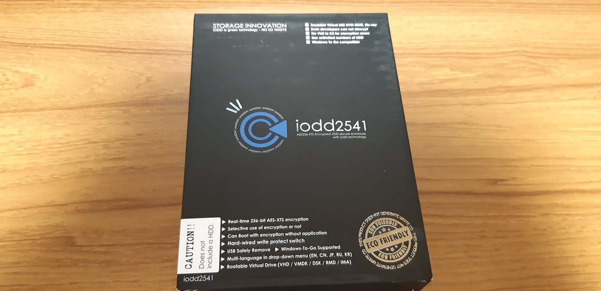 

外箱裏。  
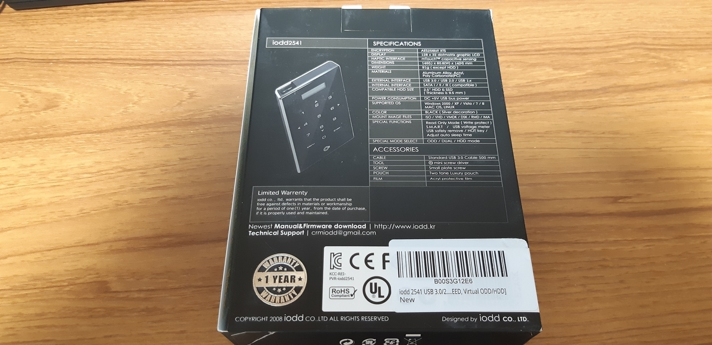 

中身。  
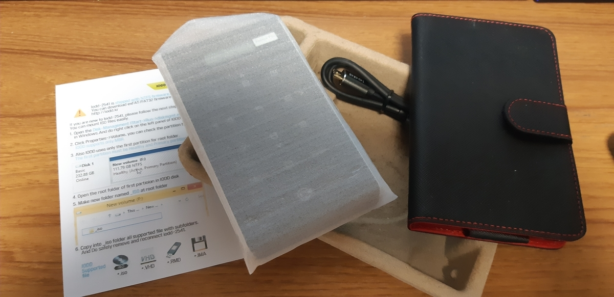   

本体。ぶっちゃけめちゃくちゃチープな感じ。  
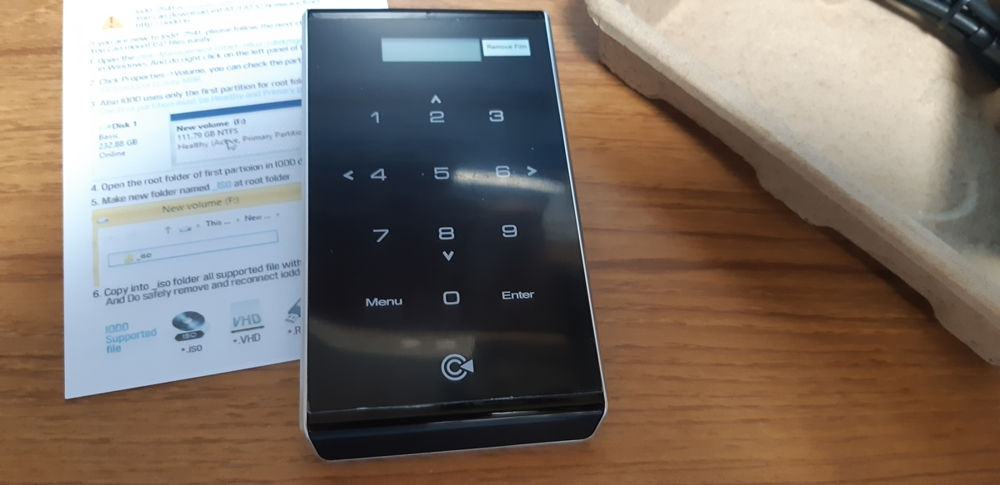 

表面保護用のフィルムが二枚同梱されていました。  
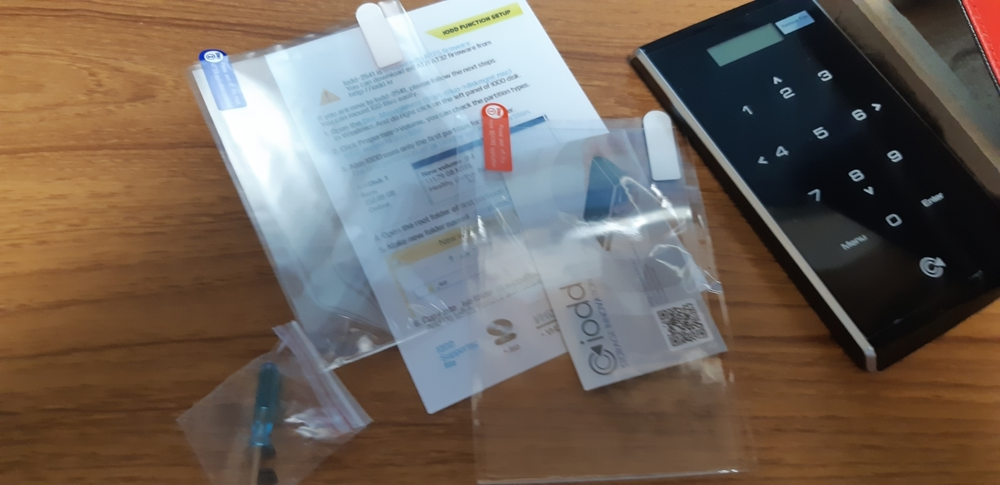   

HDDケースということでストレージがないので、今回はSSDを用意。  
120GBのSanDiskのSSDが3000円くらいで買える良い世の中になりました。  
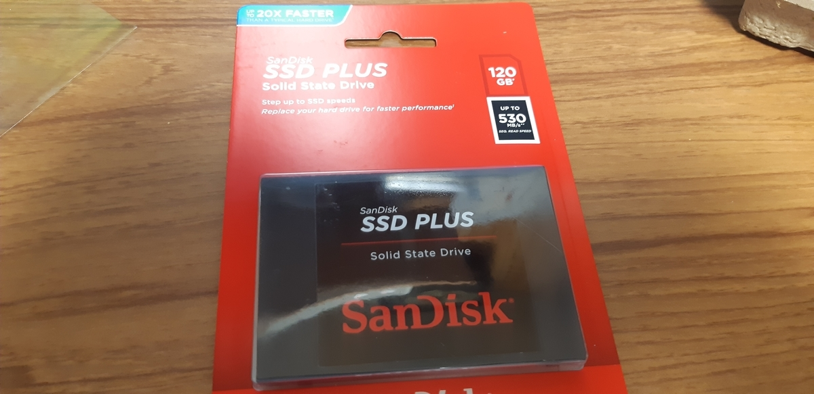 

本体をひっくり返すと、ねじがついていない状態。  
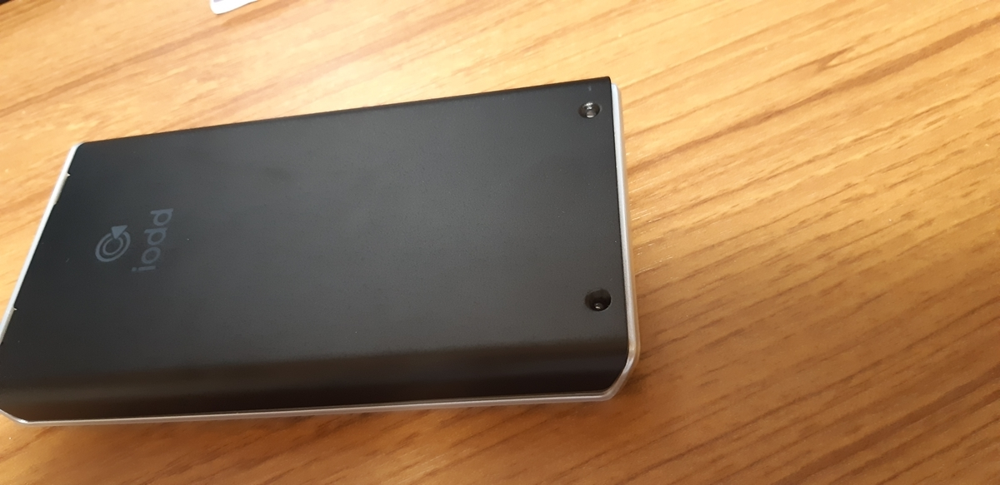 

ねじ側を上に持ち上げるように引っ張るとふたが外れます。  
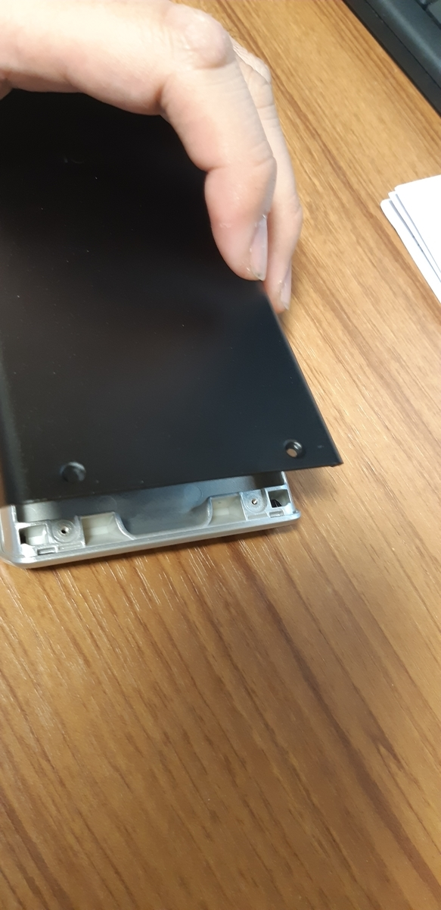 

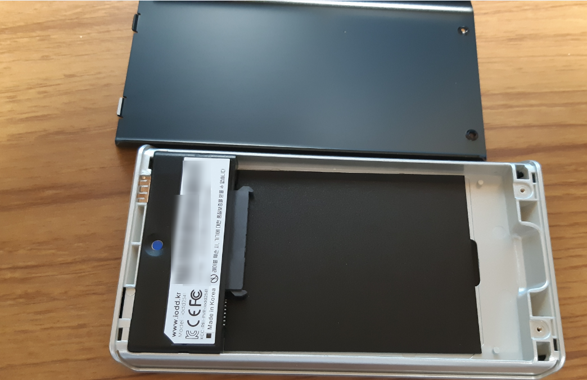 

2.5インチSSDがぴったりはまります。  
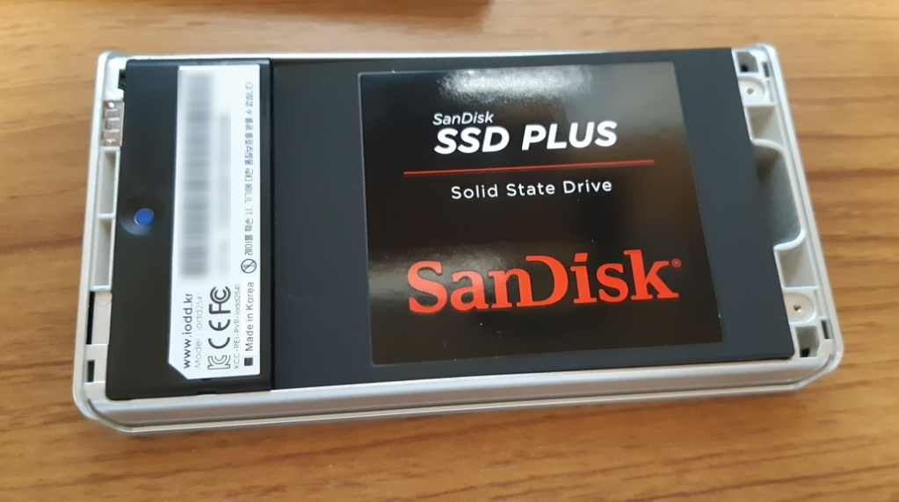 

付属してたねじでふたを止め、同じく付属してたケースに本体を入れておきました。  
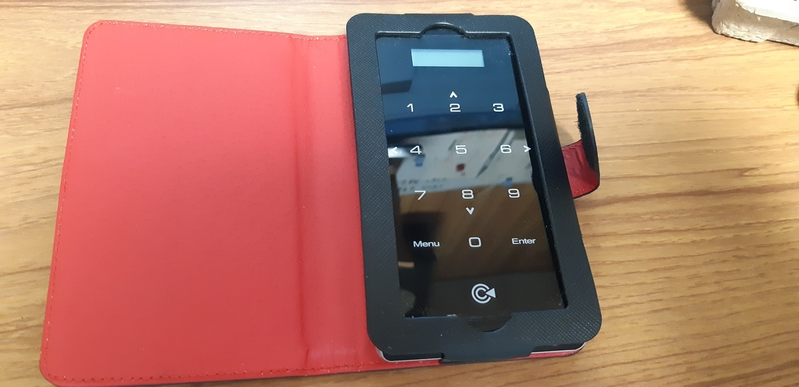 

#### 設定  
IODD2541としての日本語の利用方法はなかなかネット上にないみたいなんですが、ZALMANの情報がそのまま使えます。  
私は下記のサイトで使い方を確認しました。  

<?# EmbedLink "https://www.ask-corp.jp/guide/zalman-zm-ve400.html" /?>

また、言語を日本語に変更することもできます。  
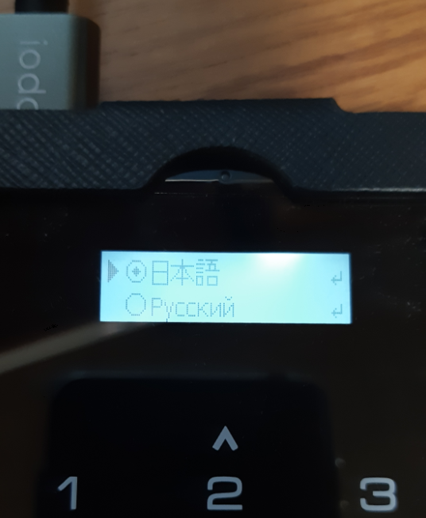 

海外製品でよくある変な日本語というわけでもないのもよいですね。  

#### PCに接続  
初期設定だとデュアルモードになるため、PCに接続すると、HDDおよび光学ドライブが認識されます。  
内蔵したHDD・SSDが初期化されていないのであれば、ディスクの管理画面からディスクの初期化を行っておく必要があります。  
ここで注意しないといけないのは、パーティションスタイルをGPTでなく、MBRにすること。このケースはGPTに対応してません。  

初期化して、NTFS形式でフォーマットしたら、ルート階層に「_iso」のフォルダを作成して、そのなかにイメージファイルを入れ、本体側でマウントしたいイメージを選ぶと、そのイメージがマウントされます。  
HDDケースの機能なので、OSがWindowsだろうがMacだろうがLinuxだろうが利用可能なのがうれしい。もちろんUSBブートも対応PCであれば利用可能。  

今回はWindows 10 1903のイメージをマウントさせてみました。  
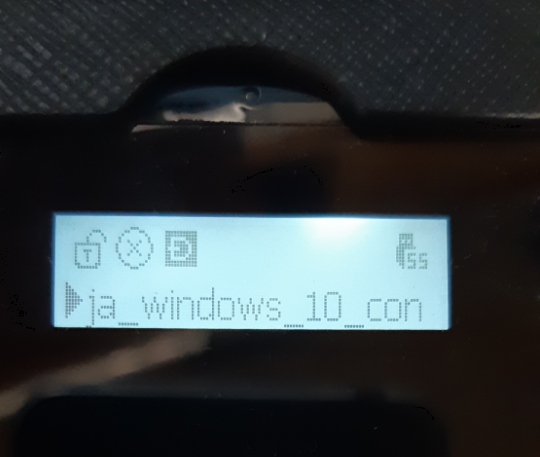 

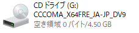 

今回のイメージはDVD-Rの容量以上のサイズだったので二層のものを使うか、Blu-rayに焼くか、USBメモリーを使うかという選択肢になるところだったんですが、これがあればイメージファイルをぶち込むだけでマウントできるのでさくっと利用可能です。  