秘密鍵、どうやって管理してますか？  

適当に.sshディレクトリに入れたまま？USBメモリーなどに格納？はたまたクラウドストレージに保管？  

私はこれまで.sshディレクトリに突っ込むだけだったのですが、万が一ファイルが漏洩したり、ストレージが吹っ飛んだ時に困るので、もう少し安全な管理方法がないか考えたうえで、Dropbox上でCryptomatorを利用して暗号化することにしました。  

#### Cryptomatorとは  
Cryptomatorとは専用の仮想ドライブを作成し、その中に格納されたファイルを暗号化して保存するオープンソースのソフトウェアです。  
(ただし、スマホアプリはiOS:1080円、Android:1060円の買切有料)  

作成した仮想ドライブは通常のストレージと同じくドライブ文字が指定され、ファイルやフォルダを保存します。内部的にはメモリー上でファイルを復号して、WebDAV（またはDokany）経由でアクセスしているそうです。  

この仮想ドライブに保存されたファイル、フォルダは暗号化されたうえで、あらかじめ指定したフォルダ(以下金庫と呼称)に保存されます。  

フォルダを丸ごと一つのファイルとして暗号化するわけでなく、それぞれ暗号化するので、オンラインストレージとの相性が良いのが特徴。  
また、ファイル名も暗号化されるので、ファイル名から中身を特定されないのもよさみ。  

オンラインストレージにフォルダを作成、指定することで、ファイルを安全に管理することができます。  
#### ダウンロード、インストール  

公式サイトからインストーラをダウンロード  
[https://cryptomator.org/downloads/#winDownload:embed]
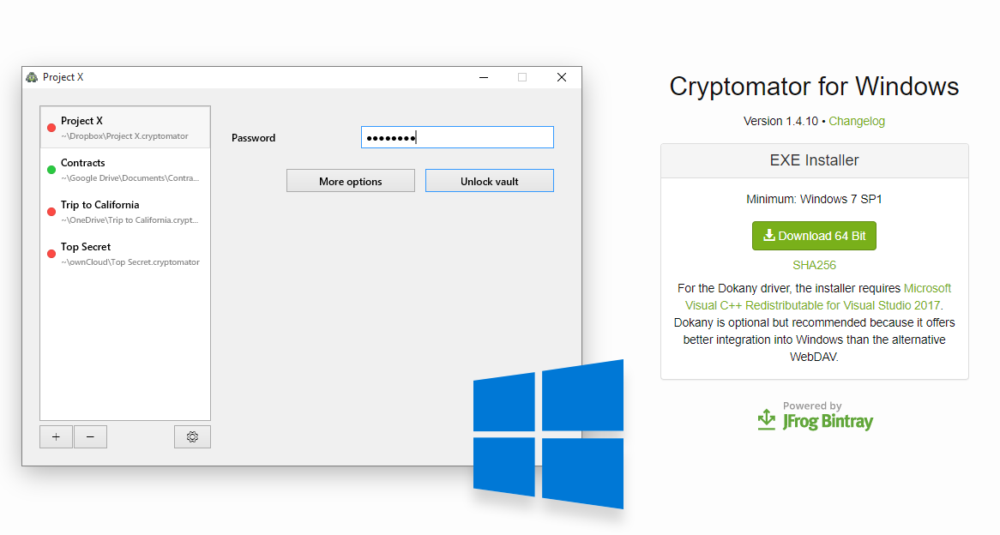 

インストーラを起動し、ライセンスを受諾。    
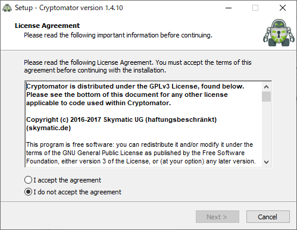 

インストール先を指定。  
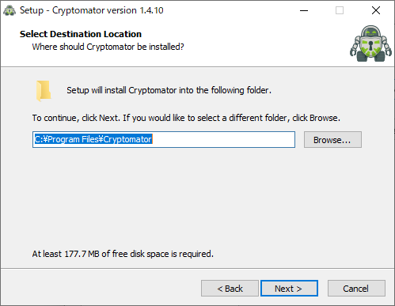 

Dokan File System Driverは下記のWikiPediaの記事を参照。入れない場合はWebDAV接続になります。入れておくべき。  

[https://ja.wikipedia.org/wiki/Dokan:embed]  
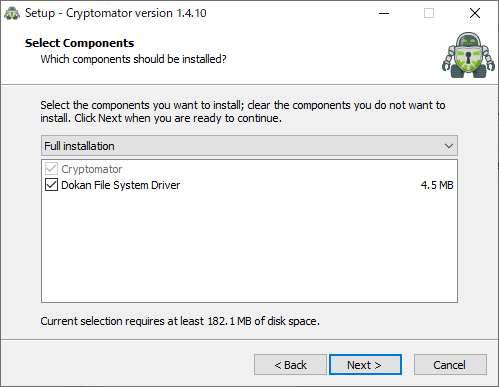 

インストール中、上記でチェックを入れていたらDokanのインストーラーが起動するので、こちらも同様にインストール。  
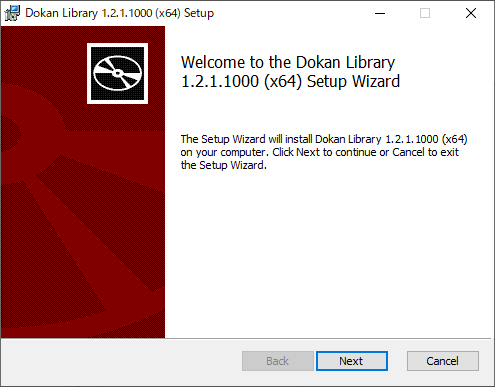 

インストール完了。  
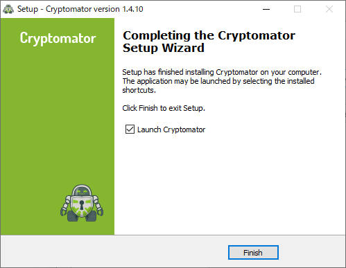   

#### 起動  
初回起動時はWindowsファイアーウォールが警告を出すのでアクセス許可を出しておいてください。  
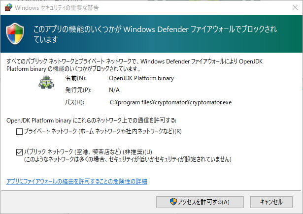 

アップデート確認はお好きなように。  
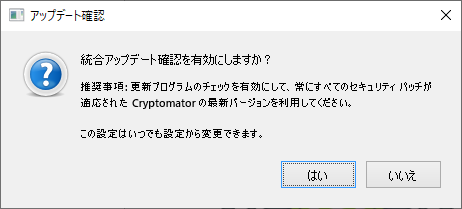 

メイン画面。  
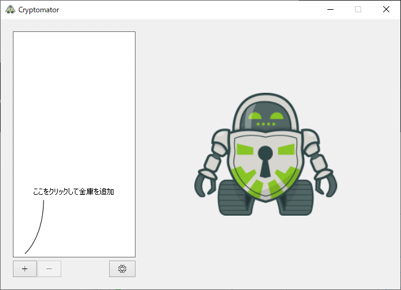 

#### 仮想ドライブの作成  
メイン画面左下のプラスボタンをクリックするとメニューが表示されるので、「新しい金庫を作成」をクリック。  
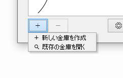 

名前を付けて保存のウィンドウが表示されるので、配置したいフォルダを開いたうえで、ファイル名欄に作成するフォルダ名を入力して保存ボタンをクリック。  
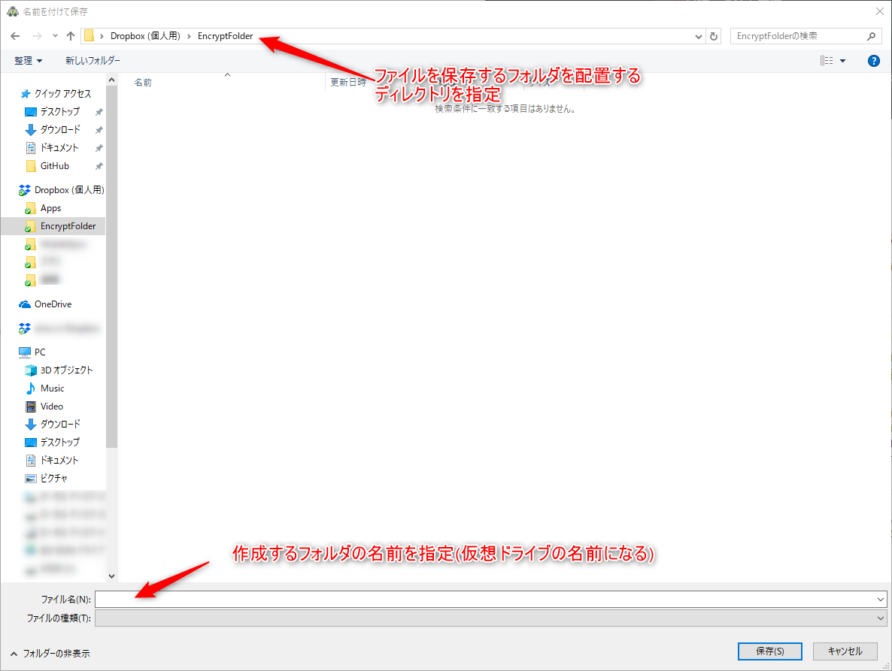 

パスワードを設定して、金庫を作成ボタンをクリック。  
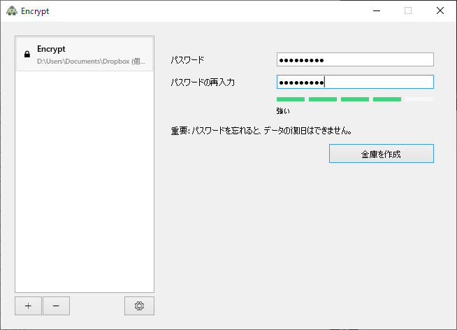 

これで完了。  
オプションからドライブ名やドライブ文字を変更可能。  
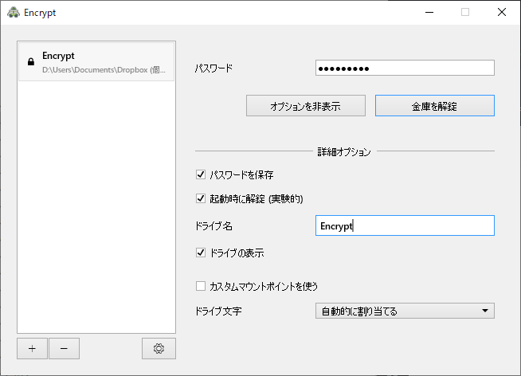 

パスワード欄にパスワードを入力して、金庫を解錠ボタンをクリックすると、フォルダが復号されたうえで仮想ドライブとしてマウントされます。  
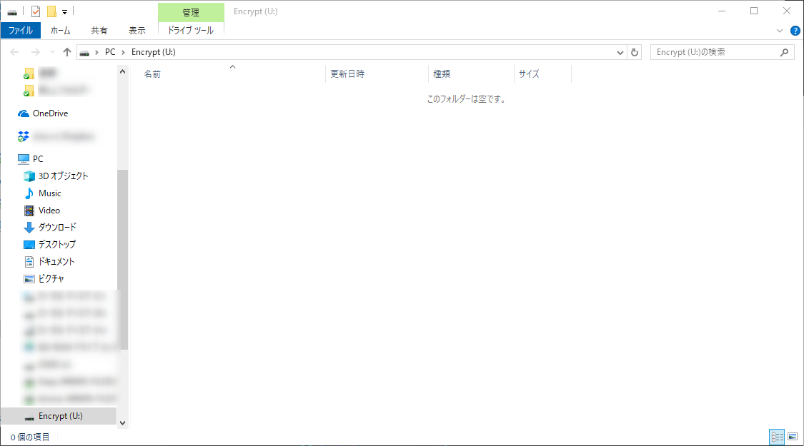 

金庫を施錠ボタンを押すとアンマウントされます。  
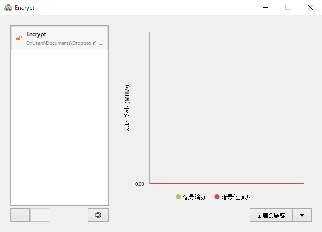 

こうやって仮想ドライブに保存された秘密鍵が  
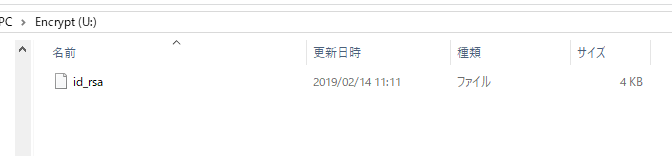 

暗号化されたファイルはこのような感じで格納されてます。  
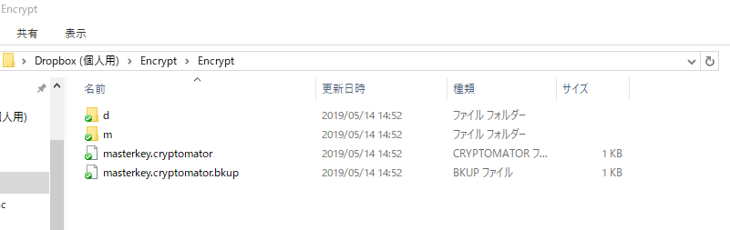   
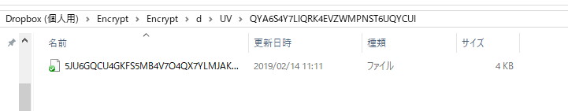 

元のファイルに対して  
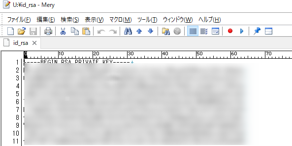 

こんな感じで中身がちゃんと暗号化されてます。  
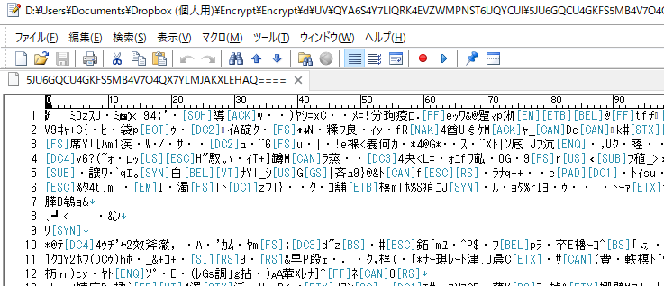 

#### 別のマシンから開く  
メイン画面左下のプラスボタンのメニューにある「既存の金庫を開く」を選択し、
 

開きたい金庫にある 「masterkey.cryptomator」ファイルを選択して開くボタンをクリック。
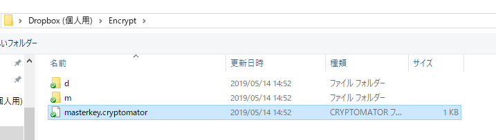 

#### 金庫の削除  
単にCryptomatorから削除しようとしても、リストから消えるだけで、ファイル自体は消えません。  
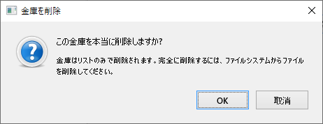 

エクスプローラで作成したフォルダごと削除すればOKです。  

#### おわり  
必要な時にだけ復号することで、オンラインストレージのバックアップ、共有を利用しつつ、安全にファイルを共有することができました。  
AES-256bit暗号化方式で暗号化されているので、万が一暗号化されたファイルが流出しても今の技術レベルであれば安易に復元することは不可能なはず。  

ドライブ文字の指定ができるので、.ssh/configにIdentityFileでフルパス指定しておけば、Cryptomatorを起動してパスワード入力して解錠するだけですぐ使えます。  
[https://qiita.com/0084ken/items/2e4e9ae44ec5e01328f1:embed]
手間というほど手間もないので、マスターパスワードさえ忘れなければ(1Passwordなどのソフトで管理しましょう)手軽に使うことができるかと。便利なもんだ。  
