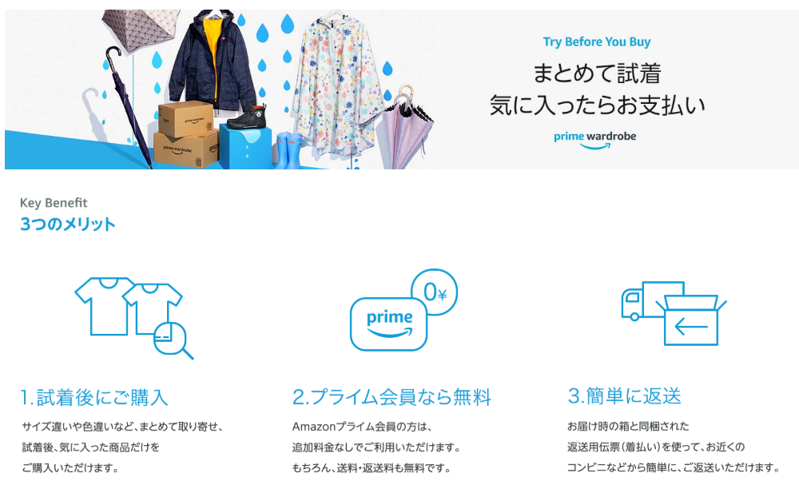
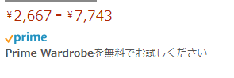
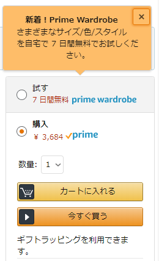
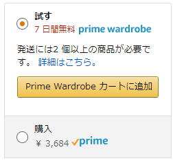
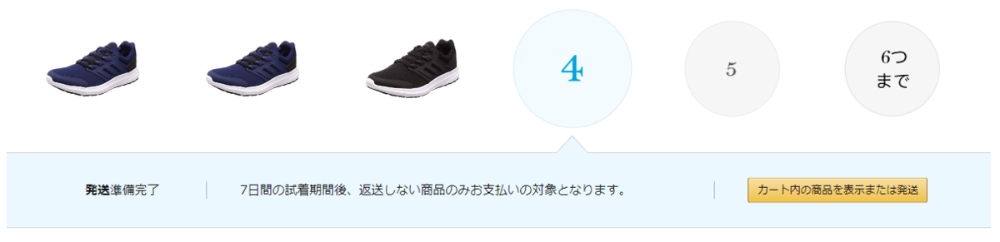
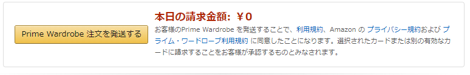
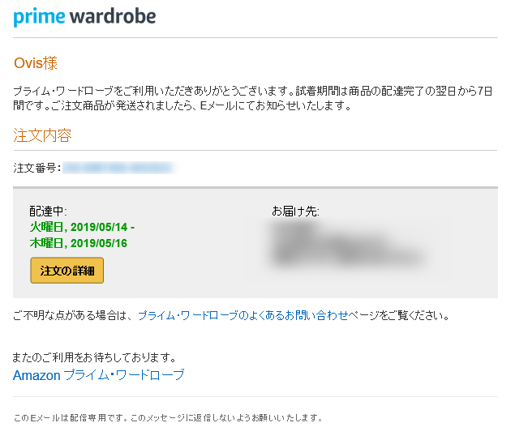

足がでかくてなかなか靴が見つからないひつじです。  

普段はいている靴は30cm、足幅も3E相当のもの。  
このサイズになると普通の靴屋ではなかなか好みのものがお手頃価格で見つからず、いつもは岐阜県の土岐市にある土岐プレミアムアウトレットに行って、アウトレット価格のものをひたすら探していたんですが、それでも良いお値段。そして物がない。  

で、だるやなぎ氏のブログを見て思い出したAmazon Prime Wardrobeの存在。  
[https://blog.daruyanagi.jp/entry/2019/03/30/012232:embed]

 

Amazonで売っている（Wardrobeに対応しているものだけですが）衣類や靴を選んで、配送してもらい、必要なものだけ手元に残して残りを返却すると、手元に残した分だけが支払われる仕組みです。  

今回普段履きの靴が傷んできたので、試しに使ってみました。  

### 注文までの流れ  
####  商品検索  
まず商品を検索します。  
対応している場合は次の画像のように表示されています。  
 

####  カートに追加 
商品ページの注文ボタンが表示されているところに「試す」の項目が表示されているので、そちらをクリックしてから、カートに追加をクリック。    
 
 

####  発送 
Wardrobeは2つ以上の商品が選択されていないと利用できないので、適当に好きな商品を2点以上選び、「カート内の商品を表示または発送」を選択。  
 

あとは基本的にいつものAmazonの注文と同じです。  
ただし、発注段階ではまだ決済されていないので、下記のように表示されています。  
 

注文するとこんなメールが届くので待ちましょう。  
 

### 届いた  

そのまま返送できる箱で届きます。  
[f:id:Ovis:20190518215807j:plain]

[f:id:Ovis:20190518220033j:plain]

着払い票も中に入ってます。  
[f:id:Ovis:20190518220252j:plain]

届いた靴。同じ靴でサイズの違うものをいくつか送ってもらうと選びやすくてよい感じ。  
[f:id:Ovis:20190518220320j:plain]

### 購入と返送  

購入したいもの、返品したいものが決まったら、Amazonからくるメールか注文履歴から返送を行います。  
今回はAmazonのAndroidアプリで行いました。  

各アイテムごとに購入、返送を選び、  
[f:id:Ovis:20190518220330j:plain]

返送のほうは返送理由も選び、購入確定ボタンを押せばOK。  
[f:id:Ovis:20190518220335j:plain]

あとは返送したいものと、箱に入っていたレシートみたいなものを箱に詰めて、ヤマト便で着払いで送ればOK。  
箱にはあらかじめ両面テープが張ってあるのは良いですね。  
[f:id:Ovis:20190518220018j:plain]
[f:id:Ovis:20190518220024j:plain]

今回これで一足購入することにしました。  
ちょうどAmazon Primeセール中だったこともあり、4000円で購入できました。普段はその倍の金額で買ってるので、これはめちゃくちゃ節約できる・・・！（私の場合）  
私のように足が大きい方、靴を探すのに苦労していると思いますが、この方法なら写真で好みのものをリストアップして、自宅で試し履きができるので一度は試してみるべき！と感じました。  

PrimeとつくだけあってPrime会員しか使えないようなので、Prime会員の方はぜひ。  

