家で仕事している関係で、朝から晩まで机に向かってます。  
さらに言えば休日も大体パソコンを触ってるので、毎日机に向かってるわけです。

ともなれば机も良いものにしたいなと。  
今使っている机は前借りていたアパートで使っていたものですが、狭い部屋でも導入できるようにそれほど大きくないものをチョイスした関係で、奥行きが60cm程度。  
通常であれば十分なところなんですが、43インチ4Kモニターが陣取っている関係で、普通に机に向かっているとモニターとの距離が近い。目が痛い。  

また、ずっと座っているわけなので、体にもよろしくない。ただでさえ太っているのにじっと座ってるんだから腰も痛くなる。  
というわけで、ずっと考えていたのですが、ころちゃんさんやてるろーさんのつぶやきを見て、スタンディングデスク良いな・・・と。  

<?# Twitter 1089120572426997760 /?>

<?# Twitter 1089406864561852417 /?>

### スタンディングデスクの選定
というわけで導入を決意したのですが、スタンディングデスクの足ってお高い。  
スタンディングデスクをDIYしている方のブログを見ると大体Flexispotの製品を利用しています。  
特にE3が人気のようです。大体4万7千円ほど。昇降速度は38mm/sで耐荷重は100kg。昇降範囲は60～123cm。    
<?# AmazonAffiliate B074897V3X /?>

これより安いものだとE1Eが2万9千円ほど。
<?# AmazonAffiliate B07FDVGLK8 /?>
お安いですが昇降速度が25mm/sと遅く、また高さのメモリー機能がない。耐荷重は70kgで昇降範囲は71～121cm。  

E1Bは3万3千円でメモリー機能はつくものの昇降速度、耐荷重、昇降範囲はE1Eと変わらず。
<?# AmazonAffiliate B07LF51796 /?>

とはいえまぁ無難にE1Bあたりかなぁと考えていたところ、こちらの商品を発見。  

<?# AmazonAffiliate B07CKRNMVW /?>

こちらの会社の製品の模様。  

<?# OEmbed "http://www.aimezoergo.com/" /?>

定価は41000円でポイントがついて大体40200円ほど。  
ググってほとんど情報がないものの、昇降範囲は64～129cm、昇降速度は40mm/s、耐荷重も120kgとFlexispot製品よりも優秀。  
もちろんメモリー機能も搭載。Flexispotは上位製品にアラーム機能がついてるそうですが、別にそんなのはいらないので問題なし。

 
  
また、Amazonの「この商品の特別キャンペーン」で、下記のいずれかの商品が無料で手に入るというのも良き。  

<?# AmazonAffiliate B07F8PRF6F /?>
<?# AmazonAffiliate B07F8QDN9P /?>
<?# AmazonAffiliate B07DCLYZ79 /?>

特にスタンディングデスクを導入した人のレポートを見ると、長時間立っていると足の裏が痛くなってくるため、マットが必要という意見が多く見受けられたので、マットが無料でついてくるのはありがたい。  

PSE認証も通っていて、サポート期間もFlexispotと同じ、米国のAmazonのレビューなどもおおむね好評な感じだったので、これに決定しました。  

### 天板の選定  
当初は集成材を下記のショップでオーダーメイドしようと思ってました。  

<?# OEmbed "https://shop.woodworks-marutoku.com/" /?>

が、良いなと思う要件をポチポチしていくと、
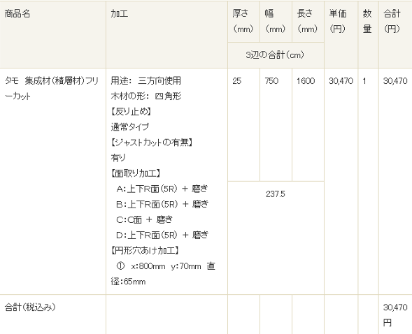 
こんな金額に。お高い。  

この金額がネックで躊躇してたのですが、Twitterでスタンディングデスクの話題を楓月さん、う゛ぇいさんと話していた時、

<?# Twitter 1131135687959302144 /?>

とアドバイスをいただいたので、ちょっと遠い場所にある大きなホームセンターまで行き、資材コーナーをチェック。  

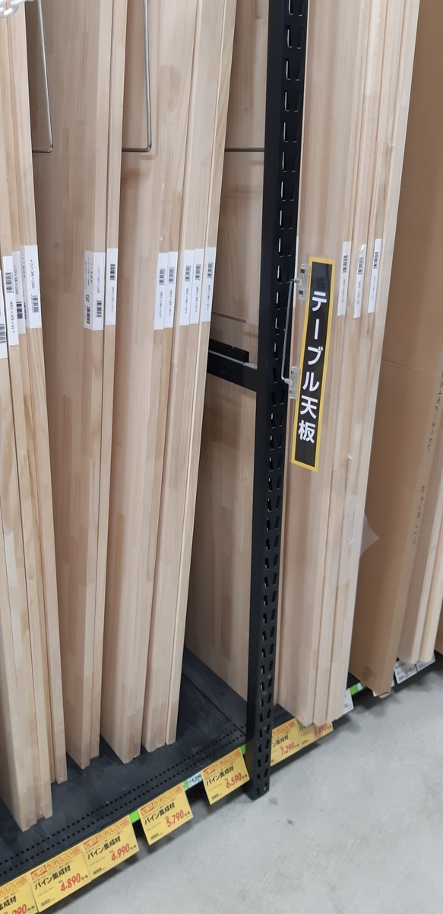 

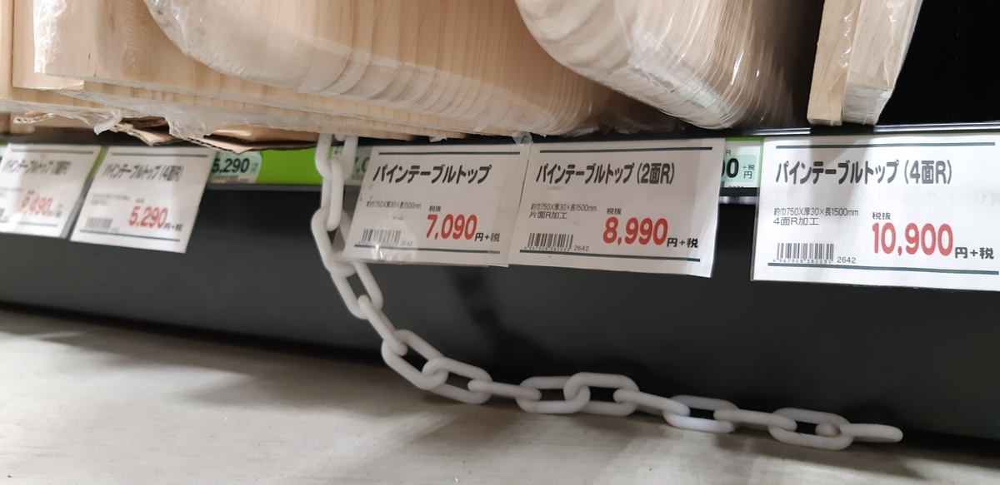 

これで良いじゃないか・・・。  
もともと、普通の板材だと角が丸くなってなくて、これを丸くするのは素人にゃ厳しいだろうと思っていたので、ここまでお膳立てされたものがあるならこれで問題なし。  
というわけで、この天板を購入しました。  
横幅150cm、奥行75cm、厚さ3cmの天板を当初想定予算より安くゲット！

### 天板のカスタマイズ  
#### 穴あけ  
でかくてそこそこ重たいので、天板はホームセンターの無料配送サービスで自宅に届けてもらいました。  
ビニールが破れてちょっと汚れていたので少々イラっとしつつ、どうせ加工するからいいかとあきらめ。  
<?# Twitter 1140124098892353536 /?>

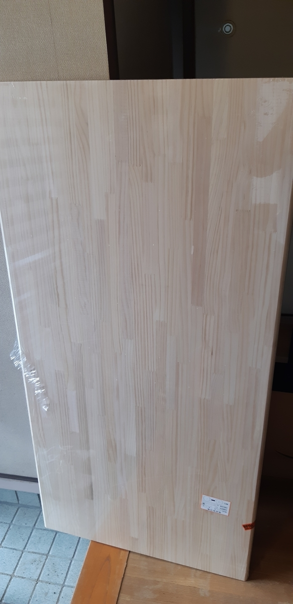 

さて、この天板ですが、このままではちょっと使えません。  
一応軽く研磨されてますけど、まだ毛羽立ちがあるほか、パイン材なのでとても柔らかい。  
また、前のテーブルで不満だった、配線を通せない問題を解決するべく、配線孔を開けたい。  
というわけで、加工を行います。  

まずはホールソーで穴あけ。  

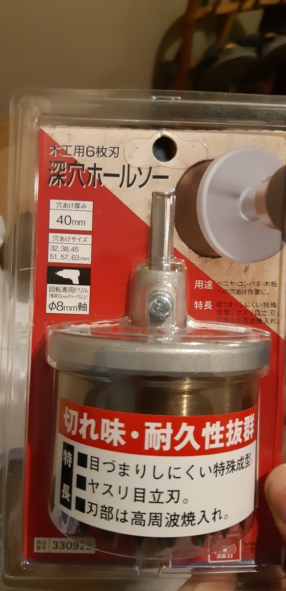 

厚さが3cmもあるのでホールソーも物を選びます。  
3cm以上の穴があけられるものを購入したものの、今度は手持ちの電動ドライバーがそれを装着できないことに気づいたので(あほ）、近所のホームセンターで電動ドライバーをレンタル。  
250円で2泊3日。  

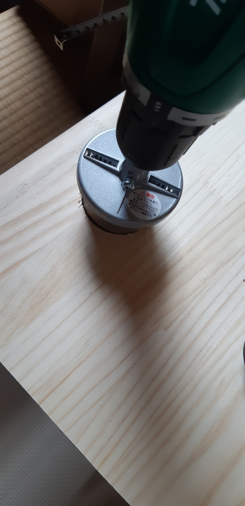 

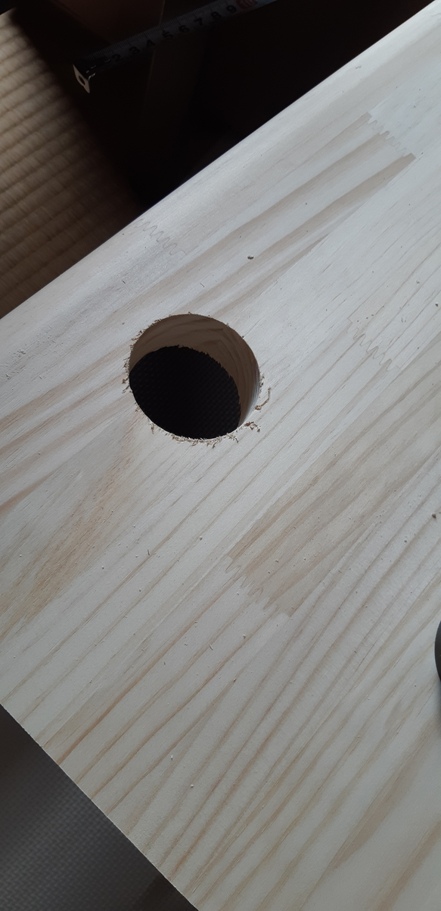 

不器用すぎて最初の罫書きに失敗し、穴の周りが傷だらけ・・・。  
一つの穴をあけるのに大体30分も費やしました・・・。  
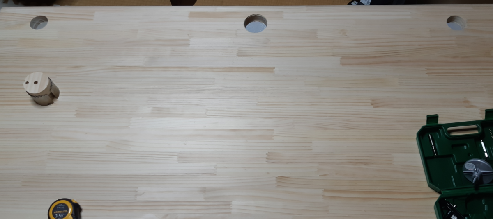 

この穴には別途購入した配線孔キャップを取り付けました。傷もこのカバーでほとんど隠れたのでちょうどよかった。    

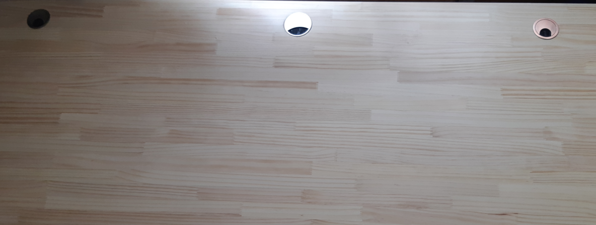 

<?# AmazonAffiliate B07PX3DTG1 /?>
<?# AmazonAffiliate B00K5D8MYS /?>

#### 研磨  
毛羽立ちを取り、この後のニス塗りで綺麗に仕上がるよう、研磨を行います。  
が、まず先に、天板の凹みとり。  
まだニスを塗っていない状態なので、凹んでいるところに水を少しこぼして放置すると、給水されて木材の潰れた繊維が膨らみ、凹みが目立たなくなります。

こんな感じでへこんでるところに水を含ませて、
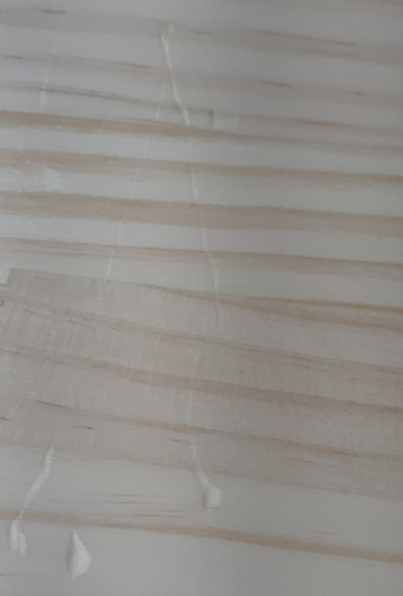 

しばらくしてから拭き取ったらこんな感じに。  
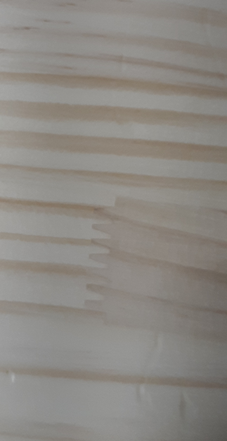 

これが終わったらまず150のサンドペーパーでざっくりと研磨して、目立つ傷を取り、そこから240のサンドペーパーで研磨。  
最初はレンタルしてきたサンダーを使おうとしたものの、なかなかの暴れ馬で使いにくかったので諦めて、こちらにサンドペーパーを取り付けて作業しました。

<?# AmazonAffiliate B0792TYXYL /?>
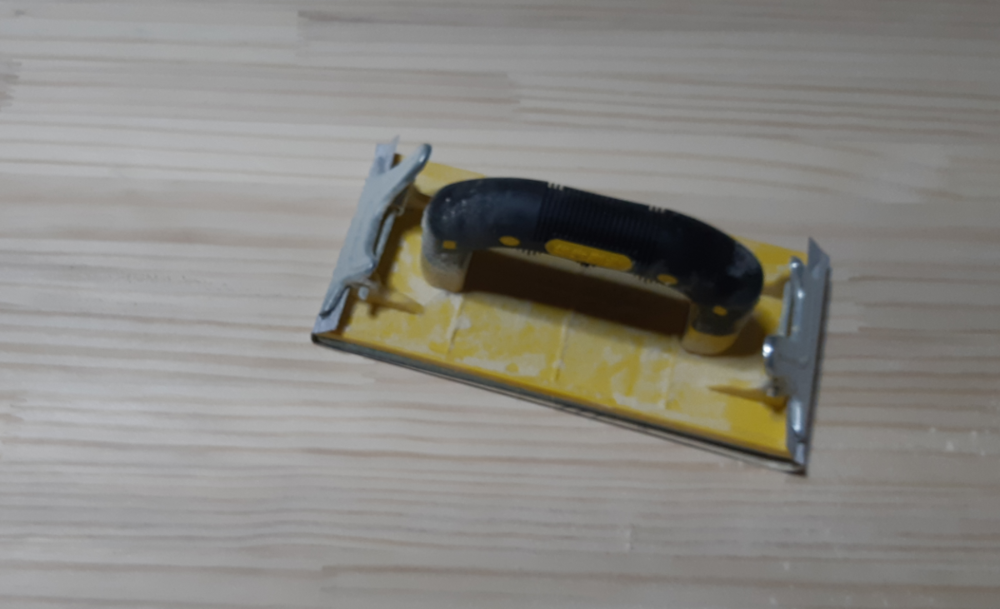 

研磨して出た木材の粉を吸い込まないようマスクは必須。できれば保護メガネも。
暑いからと扇風機をつけたら思い切り粉が舞ってえらいめにあったのは内緒。

研磨し終わり、粉も綺麗に拭きとったので塗装します。
ワトコオイルでオイルフィニッシュも有りかなと思ったものの、無難に水性ウレタンニスコーティングに。

<?# AmazonAffiliate B0091FU8PW /?>

最初は木材がどんどん吸収することもあってか塗るときに刷毛の滑りが悪いので、水でほんの少しだけ薄めてから塗り始めました。  
そこそこの範囲を塗る必要があるので、刷毛ゴテを使って塗り塗り。

<?# AmazonAffiliate B004GTA7F4 /?>

スポンジローラーだと気泡ができて仕上がりが良くないんだとか。
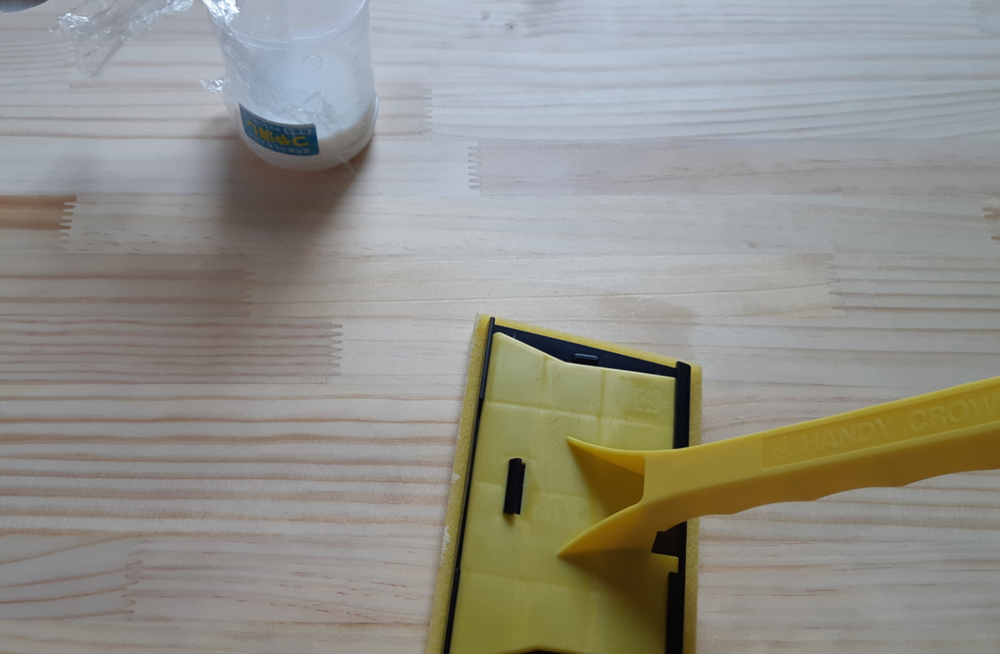 

塗り終えたら1時間程度乾かして、今度は320のサンドペーパーで研磨。  
あまり擦りすぎるとせっかく塗ったニスが剥げるので程々に。  
そしたらまたニスを塗っていく作業。ここからは原液のまま塗っていきました。  
これを数回繰り返して完了。  
触るとわかる木材の毛羽立ちはなくなり、しっかりニスでコーティングされたことで濡れたものを置いても染みなくなりました。

またこの時に天板の反り止めもつけておきました。厚さが3㎝あるし、いらない気がしましたが念のため。

#### 本体の組み立て  
さて届きましたスタンディングデスク本体。  
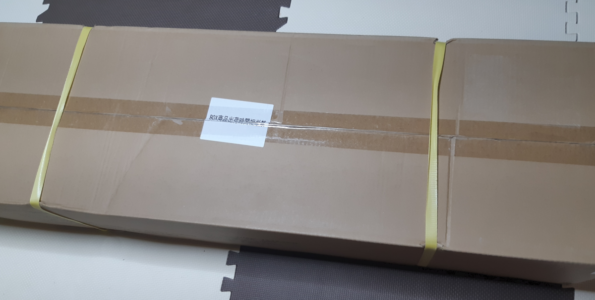 
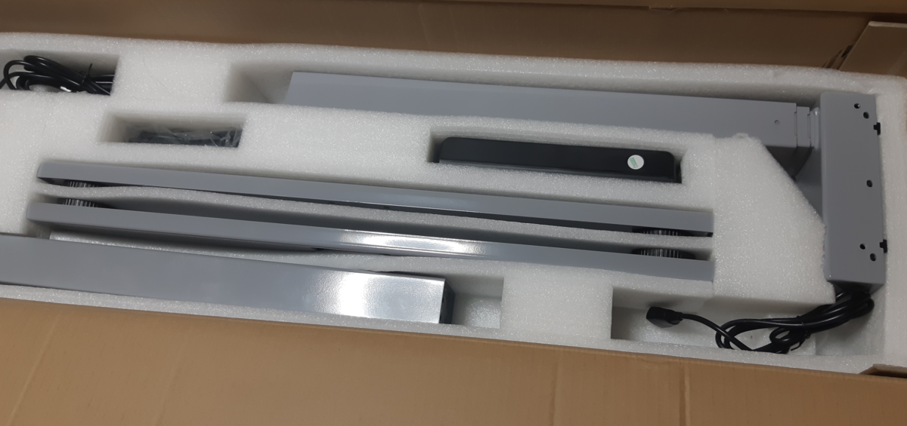 

期待してなかったのですが日本語の取扱説明書が付属してました。日本語は思っていたよりまとも。  
ただしねじの個数とかが実際と異なっていた（かつ説明書きと全体構成図でのねじの使い回りが違っていた）のが微妙。  

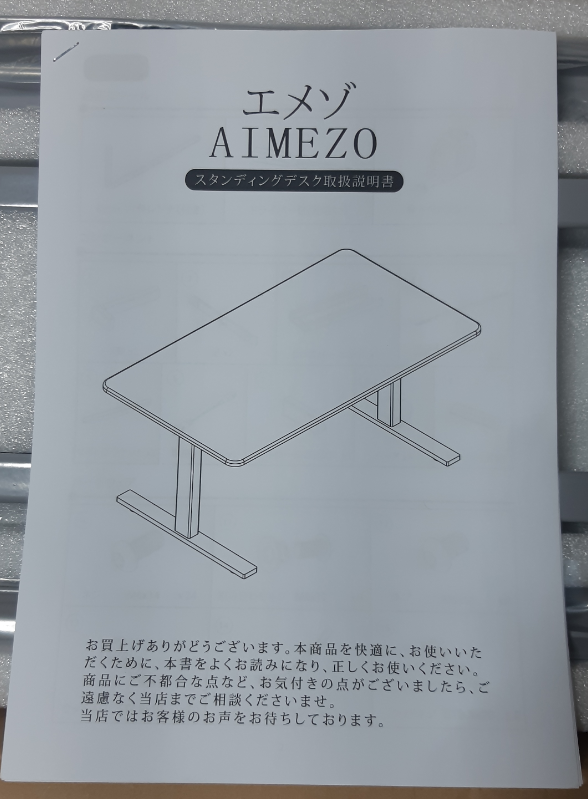 

基本的には付属していた六角レンチで組み立てできます。  
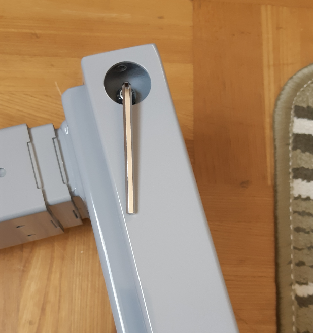 

本来ついている足部を取り外して、ねじ径がM8のキャスターを取り付けました。  
スタンディングデスクは重たくて掃除するときや模様替え、配線整理の時に動かすのが大変なので。  
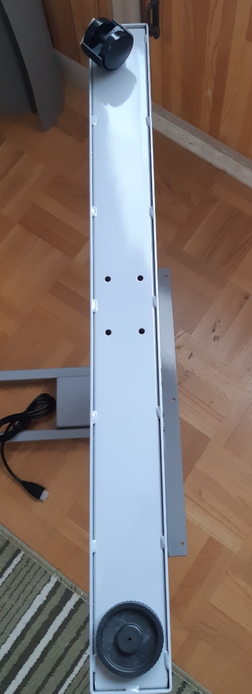 

あとは天板を取り付けて(これはねじで締めるのでドライバーが必要。電動ドライバーがあると尚よい）、コントローラーをお好みの場所に取り付け。  
とりあえず仮ということで配線の整理はしてません。  

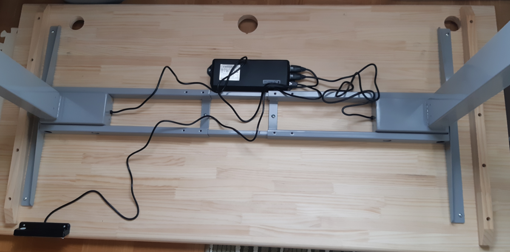 

大体組み立てに1時間ほどかかりました。  

組み立てが完了したらとりあえずちゃんと動くかどうかチェック。  
初回起動時はコントローラーの↑ボタンと↓ボタンを同時に10秒以上長押しすることで初期化シーケンスが開始され、動くようになります。  
最初は説明書の通り同時に押してるのに無反応で、不良品をつかんでしまったかと焦りましたが、それぞれのボタンを本当にぴったり同時に押し続けたら動き始めました。結構シビアみたい。  

最初は表記がセンチメートルでなくインチだったため、1,2,Mのボタンを同時押しして、デジタル表示が「C-E」の点滅表記になったら「1」ボタンを押してメートルモードに切り替えました。  

↑ボタンと↓ボタンをそれぞれ押して正常に稼働することを確認したのでこれでスタンディングデスク完成！  

### ビフォーアフター  
#### ビフォー  
天板サイズが120cmx60cmだったので、4Kモニタがどーんとのっかりぐちゃぐちゃしてたのですが、
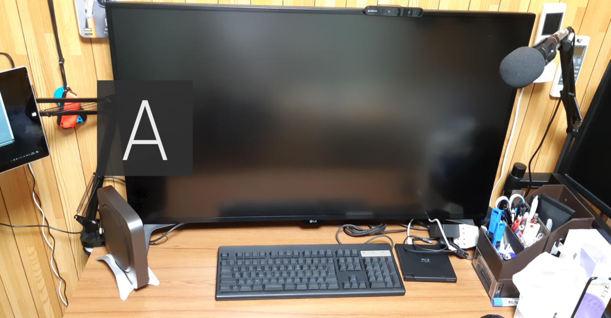 
#### アフター
こんな感じで横が広くなったことで、モニターの横にMac miniが鎮座できるように。右側もドアホンの子機を置けるようになりました。  
また15cm奥行きが広がったことでモニターとの距離が程よくなり、目の負担が軽くなりました。     
ケーブルはまだ整頓してないのでぐしゃぐしゃしてますが、今後片付ける予定。  
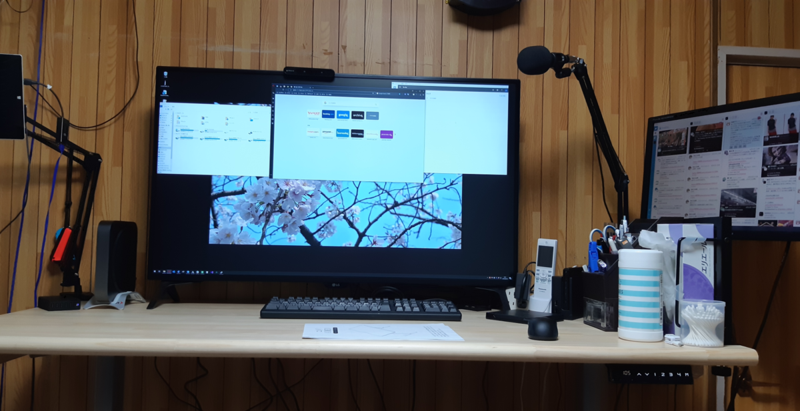 

普段椅子に座っているときの高さだとこんな感じ。デジタル表示が73cmになってますが、キャスター分高くなってるので実際には76cmほど。    
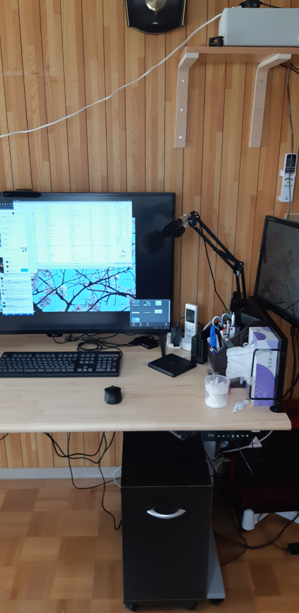 

立ち上がって作業するときはこんな感じ。  
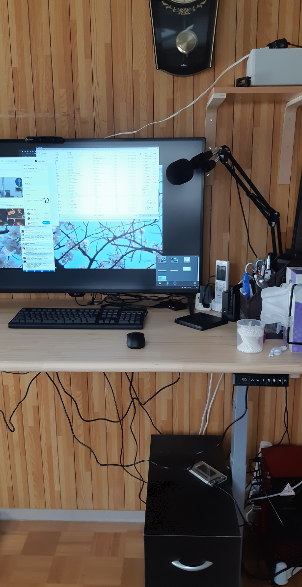   

別途購入していたツイストステッパーを漕ぎながら作業するときは（さすがに集中できないので仕事中には使わないけど)めいっぱい高くしてこんな感じに。  
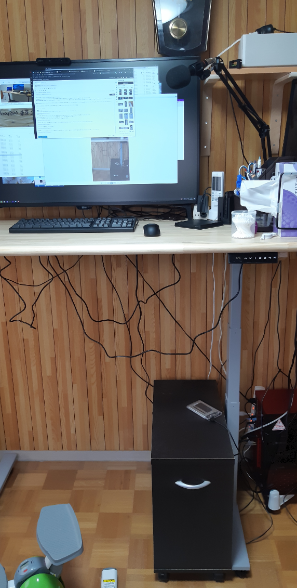 

このめいっぱい高くしてる状態でもほとんど揺れない印象。もちろん無理やりやれば揺れ揺れしますが。  

昇降速度と稼働中の音は動画を参照。  
<iframe width="560" height="315" frameborder="0" allowfullscreen="" src="//www.youtube.com/embed/bUmcHoa9k8Q"></iframe>
動画だとちょっとうるさく聞こえると思いますが、夜中でもそこまで気にならない程度の音だと思います。  
IKEAで売っていたスタンディングデスクよりはうるさいかな？  

取扱説明書。  
<iframe src="https://drive.google.com/file/d/1jSxwUVGcYNPD-xe84HV0RuL0l1398D49/preview" width="640" height="480"></iframe>  

まだ導入してすぐなのでまだ感想というほどの感想はなかったりするので、使い込んでからそのあたりもレビューしようかと。  
購入した工具、材料などを含めても6万円程度に収まり、スタンディングデスクとしては非常にお安くできた感じです。あとは長く使えることを祈ってます。