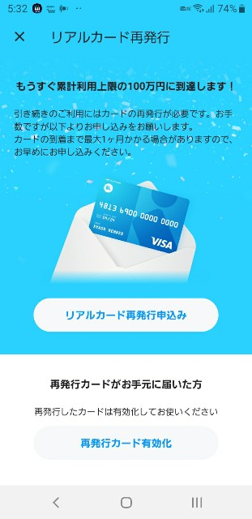
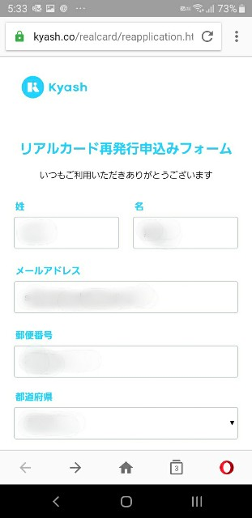
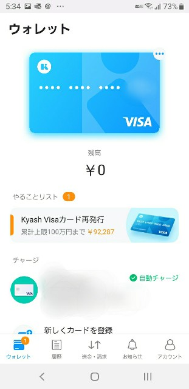

送金、決済アプリのKyash、便利ですね。  
以前こんな記事を書きましたが、  

<?# OEmbed "https://blog.hitsujin.jp/entry/2019/01/08/232322" /?>

<?# OEmbed "https://blog.hitsujin.jp/entry/2019/01/10/121403" /?>

即時に明細として発行されることでどの用途で使ったかを家計簿アプリに登録しやすく、また2%ものポイントキャッシュバックがあるという、使わないともったいないサービスです。 

このKyash、アプリで発行されるバーチャルカードだとオンライン決済でしか利用できませんが、別途リアルカードを発行してもらうことで、日常の買い物でもVISAのクレジットカードとして利用することができます。  

おかげで普段から買い物する際はほかのカードのほうがメリットがあるという場合を除いてKyashばかり使っています。  

で、このKyashなんですが、一日当たり5万円まで、一か月間で12万円までの限度額 が決められております。

さらに、リアルカードに関しては、利用額が100万円を超えると利用できなくなる制限があります。  

昨年12月に利用し始めてからほぼほぼ毎月限度額いっぱいまで利用していたため、ついに本日こんなメッセージが。  

 

合計利用額が90万円を超えるとこのメッセージが表示されるようです。  

上記の通り100万円まで利用したリアルカードは使えなくなるため、カードの更新（再発行）をする必要があります。  

アプリの再発行申込のボタンを押すと、ブラウザで再発行ページが表示されるので、住所を入力して依頼をかけるだけ。  

 

 

当月の15日までに再発行依頼をした場合は当月末、それ以降の場合は次の月の中旬ごろに届くようです。  

なお、100万円の限度額ぎりぎりになっているカードで商品の予約注文をしている場合は要注意。  

予約した段階で決済されてしまっていればよいのですが、予約段階でまだ決済されていない場合、最終的に決済されるタイミングで限度額オーバーすると下記記事のようになるかもしれません。  

<?# OEmbed "https://blog.ch3cooh.jp/entry/2019/06/01/130000" /?>

ご利用は計画的に。  