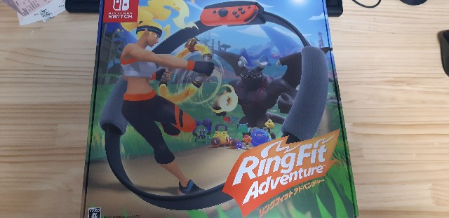
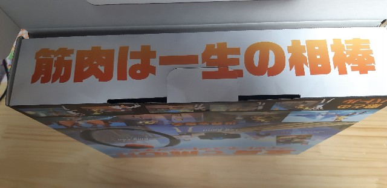
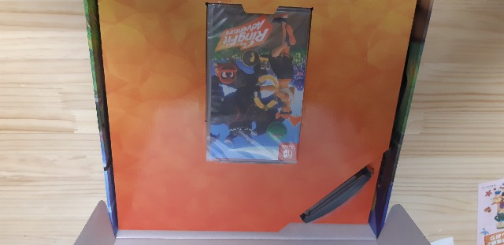
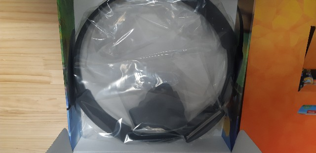
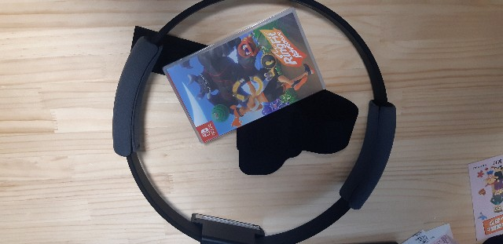

痩せないと痩せないとって口癖のように言っている割には何もできていないひつじです。

数か月前に肥満外来に行き、運動もして105kgまで落としたくせに、8月9月不摂生をした結果、見事にリバウンドして現在112kgです。リバウンド時最大104.6kgを観測しました。 
だめじゃん・・・。

来年友人の結婚式に御呼ばれしてるので、友人として恥ずかしくない状況にしておきたい・・・。 
というわけでまたダイエットを取り組み始めてます。

で、以前フィットボクシングという<a class="keyword" href="http://d.hatena.ne.jp/keyword/Nintendo%20Switch">Nintendo Switch</a>のフィットネスゲームを購入してやっていたわけですが、最初のころは毎日やっていたのにだんだん一日伸ばし二日伸ばし・・・となって気づけばあまりやっていないという。

<iframe src="https://hatenablog-parts.com/embed?url=https%3A%2F%2Fblog.hitsujin.jp%2Fentry%2F2019%2F02%2F24%2F184341" title="フィットボクシングをぽちったよ - Pandora Pocket" class="embed-card embed-blogcard" scrolling="no" frameborder="0" style="display: block; width: 100%; height: 190px; max-width: 500px; margin: 10px 0px;"></iframe>

<a href="http://www.amazon.co.jp/exec/obidos/ASIN/B07HYKWLJH/ovis91-22/">Fit Boxing (フィットボクシング) -Switch</a>
<ul><li>出版社/メーカー: <a class="keyword" href="http://d.hatena.ne.jp/keyword/%A5%A4%A5%DE%A5%B8%A5%CB%A5%A2">イマジニア</a></li><li>発売日: 2018/12/20</li><li>メディア: Video Game</li><li><a href="http://d.hatena.ne.jp/asin/B07HYKWLJH/ovis91-22" target="_blank">この商品を含むブログを見る</a></li></ul>

これ、<a class="keyword" href="http://d.hatena.ne.jp/keyword/%B2%BB%A5%B2%A1%BC">音ゲー</a>要素があるわけですが、あまり<a class="keyword" href="http://d.hatena.ne.jp/keyword/%B2%BB%A5%B2%A1%BC">音ゲー</a>に興味がないこともあって、ゲームとしてはそれほど楽しめず(<a class="keyword" href="http://d.hatena.ne.jp/keyword/%C2%E7%C4%CD%CC%C0%C9%D7">大塚明夫</a>さんの声とか燃えましたが）、あくまでフィットネスとしてやっていたのでどうも飽きがきてしまう。

となると飽きないでやれるのがやはり続けるための一つの重要な要素なんだなと。 
とか思っていたところ、新たに<a class="keyword" href="http://d.hatena.ne.jp/keyword/Nintendo%20Switch">Nintendo Switch</a>用ソフトとして、<a class="keyword" href="http://d.hatena.ne.jp/keyword/%C7%A4%C5%B7%C6%B2">任天堂</a>自身がフィットネスゲームを出してきました。

***

<iframe src="https://hatenablog-parts.com/embed?url=https%3A%2F%2Fwww.nintendo.co.jp%2Fring%2F" title="リングフィット アドベンチャー | Nintendo Switch | 任天堂" class="embed-card embed-webcard" scrolling="no" frameborder="0" style="display: block; width: 100%; height: 155px; max-width: 500px; margin: 10px 0px;"></iframe>

<a href="http://www.amazon.co.jp/exec/obidos/ASIN/B07XV7PXBM/ovis91-22/">リングフィット アドベンチャー -Switch 【Amazon.co.jp限定】オリジナル手ぬぐい 同梱</a>
<ul><li>出版社/メーカー: <a class="keyword" href="http://d.hatena.ne.jp/keyword/%C7%A4%C5%B7%C6%B2">任天堂</a></li><li>発売日: 2019/10/18</li><li>メディア: Video Game</li><li><a href="http://d.hatena.ne.jp/asin/B07XV7PXBM/ovis91-22" target="_blank">この商品を含むブログを見る</a></li></ul>

新たな<a class="keyword" href="http://d.hatena.ne.jp/keyword/Nintendo%20Switch">Nintendo Switch</a>用のコントローラー、リングコンを利用した（というか専用コントローラー）フィットネスゲームです。 
こちらはフィットボクシングと違って<a class="keyword" href="http://d.hatena.ne.jp/keyword/%A5%A2%A5%AF%A5%B7%A5%E7%A5%F3RPG">アクションRPG</a>要素があり、<a class="keyword" href="http://d.hatena.ne.jp/keyword/RPG">RPG</a>好きな私にピッタリ感。

というわけで購入しました。

<a class="keyword" href="http://d.hatena.ne.jp/keyword/%B3%AB%C9%F5">開封</a>の儀。

こちらが外箱。

開けるとこんな文字が書いてあって思わずにやり。

ゲームソフトと、

リングコン、レッグバンド。

必要なのはこの3点。

<blockquote class="twitter-tweet" data-lang="HASH(0x55ab1e95cc90)">
リングフィットアド<a class="keyword" href="http://d.hatena.ne.jp/keyword/%A5%D9%A5%F3%A5%C1%A5%E3%A1%BC">ベンチャー</a>やり始めた
&mdash; Ovis＠🐑のひと (@Pandora_Ovis) <a href="https://twitter.com/Pandora_Ovis/status/1186624652682117120?ref_src=twsrc%5Etfw">October 22, 2019</a></blockquote>

カートリッジをSwitchに差し込んで起動すると、レッグバンドの装着方法と、リングコンの装着方法が動画で紹介されます。 
私はすでに装着していたので流し見（それが悪かった）

動画が終わるとレッグバンドを装着した状態で立ったまま動かないでと表示されます。

<blockquote class="twitter-tweet" data-lang="HASH(0x55f69cb9bf90)">
この画面から進まない <a href="https://t.co/NuOoG3eMhi">pic.twitter.com/NuOoG3eMhi</a>
&mdash; Ovis＠🐑のひと (@Pandora_Ovis) <a href="https://twitter.com/Pandora_Ovis/status/1186625183479525376?ref_src=twsrc%5Etfw">October 22, 2019</a></blockquote>

・・・立ってるんですが一向に次の画面に進まない。

3分経過しても進まない。

<blockquote class="twitter-tweet" data-lang="HASH(0x558dcc69d598)">
<a class="keyword" href="http://d.hatena.ne.jp/keyword/%A4%BF%A4%B1%A4%B7%A4%CE%C4%A9%C0%EF%BE%F5">たけしの挑戦状</a>かなんかかこれ
&mdash; Ovis＠🐑のひと (@Pandora_Ovis) <a href="https://twitter.com/Pandora_Ovis/status/1186625660342558720?ref_src=twsrc%5Etfw">October 22, 2019</a></blockquote>

んなあほなと思ってもう一度動画をちゃんと見返して理由判明。

<blockquote class="twitter-tweet" data-lang="HASH(0x55b6bc18f728)">
あ、左のジョイコン上下逆だったwwwww
&mdash; Ovis＠🐑のひと (@Pandora_Ovis) <a href="https://twitter.com/Pandora_Ovis/status/1186626053206183938?ref_src=twsrc%5Etfw">October 22, 2019</a></blockquote>

ジョイコンのスティックが上側に来るようにレッグバンドを装着しないといけないところ、下向きに装着していたため、反応しなかっただけでした。

ちゃんと装着しなおしたらあっさり次の画面へ。こちらはリングコンの説明でしたが難しいこともなくサクッと終了。

ここまで終わるとリングコンとレッグバンドの操作手順と、どれくらいの負荷で遊ぶかなどを指定していきます。キャ<a class="keyword" href="http://d.hatena.ne.jp/keyword/%A5%E9%A5%AF">ラク</a>ターの見た目もここで。

一通り終わったらダイナミックストレッチなるストレッチを行うことになります。

たぶん普通の人はさくっと終わりますが、私みたいなおデブさんは足を上げてリングコンをかかとにつけるストレッチであたふたします。（きっと

ここまで終わったらようやくオープニングムービー。

<blockquote class="twitter-tweet" data-lang="HASH(0x55fe9f9a5298)">
謎のオープニング <a href="https://t.co/hInFvCOo0h">pic.twitter.com/hInFvCOo0h</a>
&mdash; Ovis＠🐑のひと (@Pandora_Ovis) <a href="https://twitter.com/Pandora_Ovis/status/1186628245581520896?ref_src=twsrc%5Etfw">October 22, 2019</a></blockquote>

<a class="keyword" href="http://d.hatena.ne.jp/keyword/RPG">RPG</a>要素はありますがごてごてしたストーリーってわけでもなくさっと見終わります。

ムービーが終わったら<a class="keyword" href="http://d.hatena.ne.jp/keyword/%A5%C1%A5%E5%A1%BC%A5%C8%A5%EA%A5%A2%A5%EB">チュートリアル</a>的なステージに。

ここから実際にリングコンを使っていくわけですが、基本的に移動は自分自身が走ってレッグバンドのジョイコンの加速度センサーを反応させてやる必要があるので、そこそこ走ります。 
足元にヨガマットなどを強いておくべき。 
運動不足なので<a class="keyword" href="http://d.hatena.ne.jp/keyword/%A5%C1%A5%E5%A1%BC%A5%C8%A5%EA%A5%A2%A5%EB">チュートリアル</a>だけで足ががががががが。

リングコンを横から押すと空気砲が出たり、引っ張ると<a class="keyword" href="http://d.hatena.ne.jp/keyword/%A5%AB%A1%BC%A5%D3%A5%A3">カービィ</a>の吸い込みみたくステージに転がってるコインを回収できたりと、なかなか楽しいアクション感。

ステージをクリアするとこんな感じで運動の成果が表示されます。 
あくまで目安ですが。

<blockquote class="twitter-tweet" data-lang="HASH(0x55c6d35a2ec8)">
<a class="keyword" href="http://d.hatena.ne.jp/keyword/%A5%C1%A5%E5%A1%BC%A5%C8%A5%EA%A5%A2%A5%EB">チュートリアル</a>の2、3分でも意外とカロリー消費するんだな <a href="https://t.co/jwkcaRbKKb">pic.twitter.com/jwkcaRbKKb</a>
&mdash; Ovis＠🐑のひと (@Pandora_Ovis) <a href="https://twitter.com/Pandora_Ovis/status/1186637950768963585?ref_src=twsrc%5Etfw">October 22, 2019</a></blockquote>

フィットボクシングはストイックにフィットネスを行う感じですが、こちらは楽しく行うことを主眼に置いてる感じで、気軽に楽しめそう。 
ほかにも<a class="keyword" href="http://d.hatena.ne.jp/keyword/%A5%DF%A5%CB%A5%B2%A1%BC%A5%E0">ミニゲーム</a>的なフィットネスもあるようなので、しばらくはこれで遊びながら運動を継続したいと思います。

<a href="http://www.amazon.co.jp/exec/obidos/ASIN/B07XV7PXBM/ovis91-22/">リングフィット アドベンチャー -Switch 【Amazon.co.jp限定】オリジナル手ぬぐい 同梱</a>
<ul><li>出版社/メーカー: <a class="keyword" href="http://d.hatena.ne.jp/keyword/%C7%A4%C5%B7%C6%B2">任天堂</a></li><li>発売日: 2019/10/18</li><li>メディア: Video Game</li><li><a href="http://d.hatena.ne.jp/asin/B07XV7PXBM/ovis91-22" target="_blank">この商品を含むブログを見る</a></li></ul>

