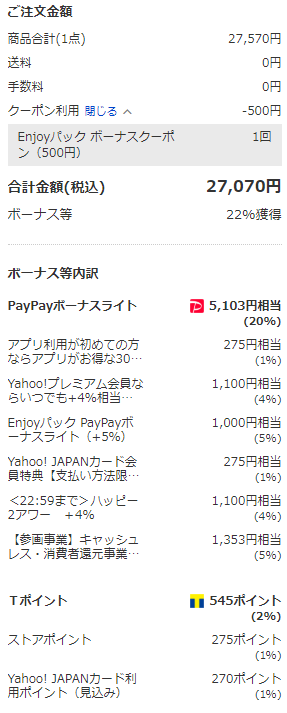
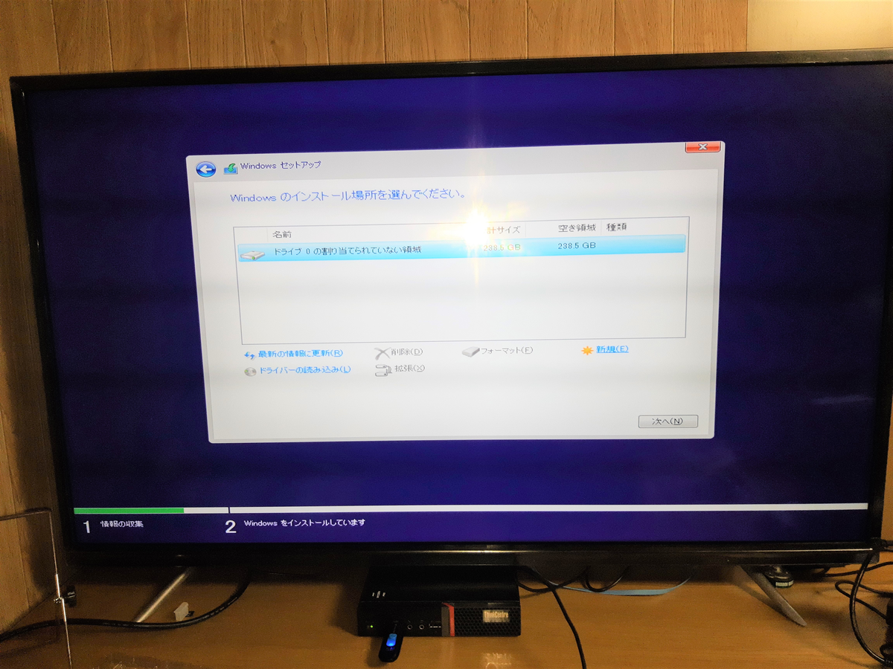

2年前に<a class="keyword" href="http://d.hatena.ne.jp/keyword/LG%C5%C5%BB%D2">LG電子</a>製の43インチ4Kモニタを購入しましたが、今ではこのサイズの4Kモニタなしに作業なんてしたくないと思うほどべたぼれです。

<a href="https://www.amazon.co.jp/exec/obidos/ASIN/B075ZWRH6Z/ovis91-22/">【Amazon.co.jp限定】LG モニター ディスプレイ 43UD79T-B 42.5インチ/4K/IPS非光沢/HDMI×4・DP・USB Type-C・RS-232C/スピーカー/ブルーライト低減</a>
<ul><li>発売日: 2017/10/13</li><li>メディア: Personal Computers</li></ul>

ただ、当然ながらこんなで買い物は持ち運びができるわけにもいかず。 
今は自宅で仕事をしているわけですが、1週間ほど実家に帰った際に仕事をする際はやむを得ず昔使っていた24インチの<a class="keyword" href="http://d.hatena.ne.jp/keyword/%A5%D5%A5%EBHD">フルHD</a>モニタを利用していました。

が、4K43インチに慣れてしまうと情報量の少なさにぶちきれそうです。同じ画面に<a class="keyword" href="http://d.hatena.ne.jp/keyword/Visual%20Studio">Visual Studio</a>とブラウザとPDFビューアを同時に表示したいが、そうしてしまうとそれぞれ一部しか表示できない・・・。

というわけで、4Kのモニタを購入することにしました。

***

が、そんな無駄な金があるわけではないのでできる限り安いものがないかと思い探していたところ、こんな商品を発見。

<a href="https://www.amazon.co.jp/exec/obidos/ASIN/B07RGVXDYB/ovis91-22/">superbe SU-TV4304K [43インチ]</a>
<ul><li>メディア: エレクトロニクス</li></ul>

アグレクションという会社の43インチ4Kのテレビ、SU-TV4304Kです。 
正直聞いたことがない会社なので、大丈夫か？と思ったものの、日本の会社らしく、ネットから参照できる取扱説明書も中華系製品でよくあるような怪しい日本語もないので少しは安心できそう。 
<a class="keyword" href="http://d.hatena.ne.jp/keyword/%B2%C1%B3%CA.com">価格.com</a>や個人ブログのレビューを見ても上々で、<a class="keyword" href="http://d.hatena.ne.jp/keyword/%A4%AB%A4%C4%A4%AA">かつお</a>値段が19年12月8日現在、<a class="keyword" href="http://d.hatena.ne.jp/keyword/%B2%C1%B3%CA.com">価格.com</a>の最安値で26980円。お安い。

<iframe src="https://hatenablog-parts.com/embed?url=https%3A%2F%2Freview.kakaku.com%2Freview%2FK0001154672%2F%23tab" title="アグレクション superbe SU-TV4304K [43インチ] レビュー評価・評判" class="embed-card embed-webcard" scrolling="no" frameborder="0" style="display: block; width: 100%; height: 155px; max-width: 500px; margin: 10px 0px;"></iframe>

<iframe src="https://hatenablog-parts.com/embed?url=https%3A%2F%2Fblog.endstart.net%2Farticle%2Fsutv4904k.html" title="アグレクション『SU-TV4904K』レビュー：2.7万で買える爆安4Kテレビ" class="embed-card embed-webcard" scrolling="no" frameborder="0" style="display: block; width: 100%; height: 155px; max-width: 500px; margin: 10px 0px;"></iframe>

テレビですけども別に<a class="keyword" href="http://d.hatena.ne.jp/keyword/HDMI">HDMI</a>で外部入力可能なので、PC用モニタとして十分利用できます。

このもともとお安いSU-TV4304K、<a class="keyword" href="http://d.hatena.ne.jp/keyword/Yahoo%21%A5%B7%A5%E7%A5%C3%A5%D4%A5%F3%A5%B0">Yahoo!ショッピング</a>だと更にお安く購入することができました。

今回<a class="keyword" href="http://d.hatena.ne.jp/keyword/Yahoo%21%A5%B7%A5%E7%A5%C3%A5%D4%A5%F3%A5%B0">Yahoo!ショッピング</a>のディーライズというストアで購入しましたが、そちらの販売価格は27570円(送料無料)。

私はワイモバイルに切り替えたので、<a class="keyword" href="http://d.hatena.ne.jp/keyword/Yahoo%21">Yahoo!</a>プレミアムに無料登録できるため、<a class="keyword" href="http://d.hatena.ne.jp/keyword/Yahoo%21%A5%B7%A5%E7%A5%C3%A5%D4%A5%F3%A5%B0">Yahoo!ショッピング</a>だと特典が適用され、数％のポイント還元(時と場合によって変動する)が行われます。 
さらにEnjoyパック（月550円かかるものの、初月は無料）の割引と500円クーポン、<a class="keyword" href="http://d.hatena.ne.jp/keyword/Yahoo%21">Yahoo!</a>カード決済の還元、キャッシュレス消費者還元事業の5％還元などなどを駆使した結果、こんな感じに。

(いわゆる現金値引きではないものの)実質21422円で購入したようなもの。 
お安い。

実際に届いて設置したところこんな感じに。

モニタとして使う前に一度テレビが映るかを確認するためアンテナを接続してみてみましたが、正直なんだか人の顔がのっぺりとしたり、つぶれている感じ。発色は気にならないものの、正直不安を覚えました。 
が、PCに接続して<a class="keyword" href="http://d.hatena.ne.jp/keyword/4K%B2%F2%C1%FC%C5%D9">4K解像度</a>で表示させたところ、そんな表示にならず問題なくきれいに表示されました。 
おそらく<a class="keyword" href="http://d.hatena.ne.jp/keyword/%A5%D5%A5%EBHD">フルHD</a>の地デジを4Kにアップコンバートする機能が微妙なのかな、と。出力される対象データが4Kであれば問題なし。また、設定を変更することでそれなりに見えるものになりました。

応答速度が9msと最近のものにしては遅いんですが、私の目では特段気になるものはなし。正直コードを見るのに使うわけで、応答速度が必要なゲームをやるわけではないので問題ないですね。

当然テレビなので<a class="keyword" href="http://d.hatena.ne.jp/keyword/HDMI">HDMI</a>接続すれば内蔵スピーカーから音声が流れます。音はまぁ安いなりの音かな、と。 
PCスピーカーに慣れているので特に気になりませんでした。

唯一気になるというかちょっと困ったのが、PCがスリープ状態になってモニタ電源がオフになると、PCを復帰させても自動的に電源が入らないこと。これはPCモニタではないので当然といえば当然なのかな。設定を見落としているだけかもしれないです。

PCモニタとして利用する分には(値段を考えて)ほとんど欠点らしき欠点はなく、約2万円で購入できてしまったのは相当なお買い得だったかな、と思います。

