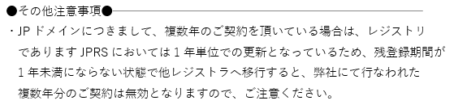
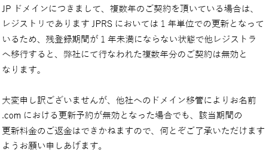

泣きを見ます。

私は知らなかったのですが、大前提としてJP<a class="keyword" href="http://d.hatena.ne.jp/keyword/%A5%C9%A5%E1%A5%A4%A5%F3">ドメイン</a>は複数年契約ができません。毎年契約を更新する形になっています。 
そこでお名前.com(を含む複数の<a class="keyword" href="http://d.hatena.ne.jp/keyword/%A5%EC%A5%B8%A5%B9%A5%C8%A5%E9">レジストラ</a>)のように複数年更新できるようになっているところは、複数年分先にお金を受け取っておいて、一年分は更新し、残金は次の更新時期に利用するという形になっています。

というわけで、お名前.comの管理コンソール上期限が数年後になっていたとしても、<a class="keyword" href="http://d.hatena.ne.jp/keyword/Whois">Whois</a>では実際には最大で一年後までの期限となっています。

***

<h4>移管する場合</h4>

FAQに載ってなかったこともあって気づいていなかったのですが、複数年契約をしているJP<a class="keyword" href="http://d.hatena.ne.jp/keyword/%A5%C9%A5%E1%A5%A4%A5%F3">ドメイン</a>を移管する場合、複数年分契約は無効となります。 
移管申請のメールに下記の通り記載がありました。

<blockquote>
・JP<a class="keyword" href="http://d.hatena.ne.jp/keyword/%A5%C9%A5%E1%A5%A4%A5%F3">ドメイン</a>につきまして、複数年のご契約を頂いている場合は、<a class="keyword" href="http://d.hatena.ne.jp/keyword/%A5%EC%A5%B8%A5%B9%A5%C8%A5%EA">レジストリ</a> 
であります<a class="keyword" href="http://d.hatena.ne.jp/keyword/JPRS">JPRS</a>においては1年単位での更新となっているため、残登録期間が 
1年未満にならない状態で他<a class="keyword" href="http://d.hatena.ne.jp/keyword/%A5%EC%A5%B8%A5%B9%A5%C8%A5%E9">レジストラ</a>へ移行すると、弊社にて行なわれた 
複数年分のご契約は無効となりますので、ご注意ください。
</blockquote>

というわけで、2024年まで契約していたので、4年分の契約が無効となってしまいました。 
4年分となると11360円・・・。

返金してもらえないかな、と淡い期待をしつつサポートに問い合わせてみたのですが、

<blockquote>
JP<a class="keyword" href="http://d.hatena.ne.jp/keyword/%A5%C9%A5%E1%A5%A4%A5%F3">ドメイン</a>につきまして、複数年のご契約を頂いている場合は、 
<a class="keyword" href="http://d.hatena.ne.jp/keyword/%A5%EC%A5%B8%A5%B9%A5%C8%A5%EA">レジストリ</a>であります<a class="keyword" href="http://d.hatena.ne.jp/keyword/JPRS">JPRS</a>においては1年単位での更新となって 
いるため、残登録期間が1年未満にならない状態で他<a class="keyword" href="http://d.hatena.ne.jp/keyword/%A5%EC%A5%B8%A5%B9%A5%C8%A5%E9">レジストラ</a> 
へ移行すると、弊社にて行なわれた複数年分のご契約は無効と 
なります。

大変申し訳ございませんが、他社への<a class="keyword" href="http://d.hatena.ne.jp/keyword/%A5%C9%A5%E1%A5%A4%A5%F3">ドメイン</a>移管によりお名前 
.comにおける更新予約が無効となった場合でも、該当期間の 
更新料金のご返金はできかねますので、何とぞご了承いただけます 
ようお願い申しあげます。
</blockquote>

ということで返金はならず。まぁそりゃそうか・・・。

私は<a class="keyword" href="http://d.hatena.ne.jp/keyword/%B3%F4%BC%E7%CD%A5%C2%D4">株主優待</a>でキャッシュバックを受けていたので、実質的にほぼ±0くらいで収まってるんですが、これは気をつけないと泣きを見ますわね。。

