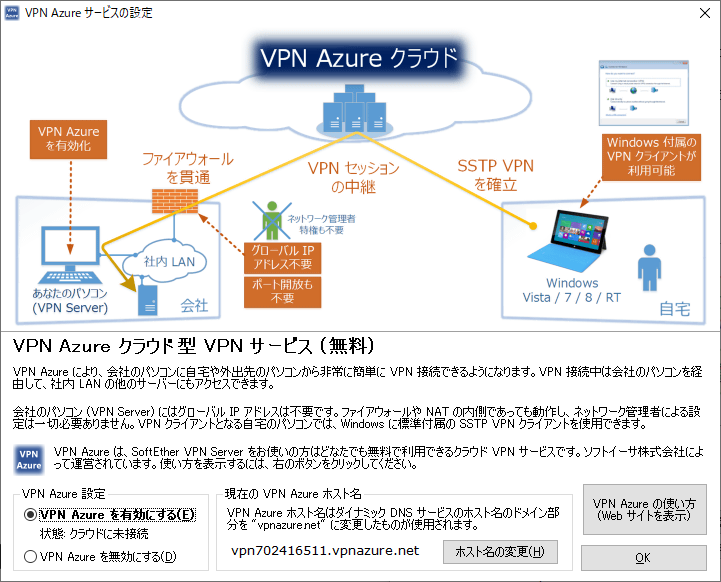

SDカードがお釈迦になって環境を作りなおしたので覚書。  


#### Raspbianのインストール  
##### Raspbianのダウンロード  
ここからイメージをダウンロード。  
[https://www.raspberrypi.org/downloads/raspbian/:embed]

複数のイメージがあり、

* Raspbian Buster with desktop and recommended software(GUIかつ推奨されるアプリケーションがすでにインストール済)  
* Raspbian Buster with desktop(GUI版)  
* Raspbian Buster Lite(コンソールのみ)  

となっている。今回はLiteを用いた。  

##### ストレージのフォーマットと書き込み  
今回はお釈迦になったSDカードの代わりとして、ESXiを構築していた時に使っていたUSBメモリーを利用。  
RaspberryPi3 B+から標準でUSBブートできるようになったらしい。  

[SD Card Formatter](https://www.sdcard.org/jp/downloads/formatter/)で初期化後、Etcherを使ってさくっと焼いた。  
[https://www.balena.io/etcher/:embed]
[https://azriton.github.io/2017/11/12/ラズパイのOSイメージを焼くときはEtcherが便利＆UIカッコいい/:embed]

SSHで接続するので、エクスプローラでbootのドライブを開き、直下に `ssh` という名前の空ファイルを作成。  

これでOK。  

#### SSH接続  

Windows 10から(どのバージョンからだったかは忘れた・・・)mDNSに対応したので、RaspberryPiのIPアドレスがわからなくても ‘raspberrypi.local‘ で接続可能。便利。  

mDNSが利用できない環境の場合。  
MACアドレスがB8:27から始まるものがRaspberryPiなので、arpコマンドやLAN内探査ソフトでも使えばディスプレイにつながなくてもわかる。  
```bat
 for /l %i in (0,1,255) do ping -w 1 -n 1 192.168.0.%i  
 arp -a  
```
参考：  
[https://qiita.com/xshell/items/af4e2ef8d804cd29e38e:embed]

デフォルトのユーザ名は"pi"、パスワードは"raspberry"となっている。  

 

#### 初期設定  
apt upgrade をするとインターフェイス名がeth0からenx+MACアドレスの形になるらしいので、インターフェイス名が変わらないように設定する。  
コマンド：  `sudo -e /etc/udev/rules.d/70-persistent-net.rules`  

> SUBSYSTEM=="net", ACTION=="add", DRIVERS=="?*", ATTR{address}=="b8:27:eb:5e:3b:00", ATTR{dev_id}=="0x0", ATTR{type}=="1", NAME="eth0"    

RaspberryPiのMACアドレスは下記コマンドで確認可能。  
コマンド：`ifconfig | grep 'ether' `  

本来リブートが必要だけど、この後の処理でリブートするので後回し。  

終わったらRaspbianのコンフィグツールを使って初期設定。  

コマンド： `sudo raspi-config`  
 

コマンドを入力するとブルーバックのこんな画面になるので、下記の設定を実施。  

##### ホスト名変更
2.Network options→ N1 Hostname で変更。複数のRaspberryPiがある場合、変更しておいたほうが競合しなくて済む。  

##### 自動ログイン解除 
3 Boot Options → B1 Desktop/CLI  より。B1 Consoleに変更。

##### ロケール変更  
4 Localisation Options → I1 Change Localeより。 Asia→Tokyo。  

##### タイムゾーン変更  
4 Localisation Options → I2 Change Timezone  より。Asia→Tokyo。  


##### 領域拡張  
7 Advanced Options → A1 Expand Filesystem より。これをやらないとストレージを丸ごと利用してくれないらしい。が、SDカードのみでUSBメモリーの場合は不要らしい。    

設定が終わったらFinishを選択して終了。リブートが必要なので言われるがままリブートを実施。    

#### リポジトリ更新、自動更新設定
リブートが終わったらaptやファームウェアの更新をしておく。  
```sh
sudo rpi-update  
sudo apt update  
sudo apt upgrade -y  
sudo apt dist-upgrade -y  
```

基本的に普段はいちいちログインしないので、自動的に更新するようにしておきたい。  
`unattended-upgrades` パッケージを導入することで解決できる。  
コマンド： `sudo apt install unattended-upgrades`
インストール後下記のコマンドを実行すると、自動更新が行われるようになる。  
コマンド： `sudo dpkg-reconfigure -plow unattended-upgrades`  

自動的に更新が続くといつかはストレージがゴミで埋まるので、不要パッケージは削除する。  
コマンド：  `sudo nano /etc/apt/apt.conf.d/50unattended-upgrades`  
`Unattended-Upgrade::Remove-Unused-Dependencies "true";`  に変更。(デフォルトはfalseかつコメントアウトされている) 
今回基本的に全部自動的に更新してもらいたいので設定していないものの、更新してほしくないパッケージがある場合はそれぞれ設定が必要。  

リブートが必要な更新もあるので、自動リブート設定も仕込む。  
`Unattended-Upgrade::Automatic-Reboot-WithUsers "true";` と `Unattended-Upgrade::Automatic-Reboot-Time "02:00";` の設定のコメントアウトを外して、再起動したい時間に変更。  

#### ウォッチドッグの追加  
何かの拍子にシステムが正常に動作しなくなった場合、自動的にハードウェア側で再起動を行うことができる。  
コマンド： `sudo nano /boot/config.txt`   
`dtparam=watchdog=on` を追加。  

カーネルモジュール側の設定。  
下記コマンドでファイル作成。
コマンド： `sudo nano /etc/modprobe.d/bcm2835-wdt.conf`   
`options bcm2835_wdt heartbeat=14 nowayout=0` を追加。14秒に一回のハートビートを行うことを期待する。

systemdの設定変更。  
コマンド： `sudo nano /etc/systemd/system.conf`  
`#RuntimeWatchdogSec=0` となっている箇所があるので、新規に作るかコメントを外すかして `RuntimeWatchdogSec=14` に変更。 


再起動後下記コマンドを実行。  
コマンド： `dmesg | grep bcm2835-wdt`  

`[    0.586795] bcm2835-wdt bcm2835-wdt: Broadcom BCM2835 watchdog timer` こんな感じで表示されていればウォッチドッグは正常稼働しているはず。  

フォーク爆弾として有名な下記のコマンドを実行し、数分後再起動されることも確認。  

コマンド： `:(){ :|:& };:`

##### ユーザー作成  
デフォルトのpiユーザー以外のものを作って、そちらに移行したほうがセキュリティ上いくらかは安全(鍵認証するなら問題ない気もするけど)なので、先達の意見に従い別のユーザーを作成する。  

まずはユーザーを作成。(hogeユーザーを作成する)  
コマンド： `sudo useradd -m hoge -s /bin/bash`  

パスワード設定。  
コマンド： `sudo passwd hoge`  

piユーザーと同じグループに所属させておきたいので、  
コマンド： `groups pi` 
を実行し、取得されたグループを今回作ったユーザーに指定する。  
コマンド： `sudo usermod -G pi,adm,dialout,cdrom,sudo,audio,video,plugdev,games,users,input,netdev,spi,i2c,gpio hoge`

パスワード入力なしでsudoを実行できるように変更する。  

コマンド： `root # nano /etc/sudoers.d/010_pi-nopasswd` 
初期設定だと `pi ALL=(ALL) NOPASSWD: ALL` となっているので、piの部分を今回作ったユーザーに差し替える。  

ほかのサイトを見るとpiユーザーのホームディレクトリ内のファイルを作成したユーザーのホームディレクトリにコピーする手順がありますが、今回はまだ作ったばかりでホームディレクトリに移動する必要のあるファイルはないので行わない。(.bashrcとかいじってるならそれは移動させる)  

作ったユーザーでSSHログインできるかを確認。  
sudoが実行でき、かつパスワードを聞かれなければOK。  

#### piユーザー削除  
先ほどまで作業に資料していたpiユーザーはこれにてお役御免。  
コマンド： `sudo userdel -r pi`  
グループpiはさっき追加したユーザーが追加されているので削除されず。まぁグループは残しておいても良いかな、と。  

#### SSH設定
ポートマッピングしてない限り外部から侵入されることはまずないと思われるものの、やっておくに越したことはない。  
ポート22は有名すぎてアタックされるので、別の番号に変更する。(ポートスキャンすればバレるので気休めではある) 

コマンド： `sudo nano /etc/ssh/sshd_config`   

`#Port 22` となっている行の下あたりに `Port 変更後の値` を入力。
`PermitRootLogin no` も追加。これでrootユーザーの直接ログインを禁止。  
`PermitEmptyPasswords no` も追加しておくと、パスワードが空でのログインを禁止できる。  

ここまで変更したら保存し、SSHを再起動。  
コマンド： `sudo service ssh restart`  

現時点で利用している接続を切断せず、別途今変更した値でログインできるかどうか確認。  
できたなら前の接続は切断してOK。  

#### SSH鍵認証  
パスワード認証はセキュリティ上決して頑丈ではない(長く複雑であればよっぽど問題ないとは思うものの)ので、鍵認証を行う。  
ローカルで公開鍵を作成し、ホームディレクトリに `.ssh` ディレクトリを作成しパーミッションを変更。  
コマンド： `mkdir /home/hoge/.ssh`  
コマンド： `chmod 0700 /home/hoge/.ssh`  

SCPなりSFTPなりで.sshフォルダに公開鍵を保存し、名前を `authorized_keys` に変更、パーミッションを600にする。  
コマンド： `chmod 0600 /home/hoge/.ssh/authorized_keys`   

鍵認証でSSH接続できることを確認。  
できたなら、より一層のセキュリティ強化のため、パスワードログインを無効化する。  
コマンド： `sudo nano /etc/ssh/sshd_config`   
`PasswordAuthentication no`を追加。
`ChallengeResponseAuthentication no` はデフォルトで指定されているはずではあるものの、もし指定されていなければ記入しておくこと。  

#### NTP設定  

時間同期を行っておかないとどんどん時間が狂ってしまうので、できるだけ近い場所にあるNTPサーバーを指定。  

コマンド： `sudo nano /etc/systemd/timesyncd.conf `

```
#  This file is part of systemd.
#
#  systemd is free software; you can redistribute it and/or modify it
#  under the terms of the GNU Lesser General Public License as published by
#  the Free Software Foundation; either version 2.1 of the License, or
#  (at your option) any later version.
#
# Entries in this file show the compile time defaults.
# You can change settings by editing this file.
# Defaults can be restored by simply deleting this file.
#
# See timesyncd.conf(5) for details.

[Time]
#NTP=
#FallbackNTP=0.debian.pool.ntp.org 1.debian.pool.ntp.org 2.debian.pool.ntp.org 3.debian.pool.ntp.org
#RootDistanceMaxSec=5
#PollIntervalMinSec=32
#PollIntervalMaxSec=2048
NTP=ntp.nict.jp
FallbackNTP=ntp.jst.mfeed.ad.jp
```

NICTのNTPサーバーをプライマリとして、万が一接続できなかった時用にインターネットマルチフィードのNTPサーバーを指定。

ここまでやっておいたらWin32DiskImagerやDDforWindows(SDカードの場合)、USB Image Toolあたりでイメージを取得しておくと、この後失敗した時にすぐ復活させやすい。  
なお、Win32DiskImagerもUSB Image Toolも、領域丸ごと取得してくれる模様。Bootパーティションしか表示されてなくてもそれを取得すればOKみたい。  

#### ブリッジ系の設定  
SoftEtherの都合、ブリッジが必要なので、下記の通り設定を行う。  

まず `bridge-utils` をインストール。  
コマンド： `sudo apt install -y bridge-utils`  

IPアドレス等の設定は `/etc/network/interfaces.d` 配下にファイルを作成し、リスタートすることで反映される。  
設定内容は下記のサイトを参考にした。  
[https://qiita.com/sigma7641/items/6b253703efe5f8f06de2:embed]

コマンド： `sudo nano /etc/network/interfaces.d/NetworkConfig`
[https://gist.github.com/Ovis/4831aefdf613026c613fc98ed9f8da71:embed]


#### SoftEtherのインストール  
[公式サイト](http://www.softether-download.com/ja.aspx?product=softether)からファイルのURLを取得。  
 
 
RaspberryPiでwget(今回は `/home/pi` にDLした)  
コマンド： `wget https://github.com/SoftEtherVPN/SoftEtherVPN_Stable/releases/download/v4.32-9731-beta/softether-vpnserver-v4.32-9731-beta-2020.01.01-linux-arm_eabi-32bit.tar.gz`

圧縮ファイルを展開。  
コマンド： `tar zxf softether-vpnserver-v4.32-9731-beta-2020.01.01-linux-arm_eabi-32bit.tar.gz`  

展開したら作成されたディレクトリに移動してmakeする。  

コマンド： `cd vpnserver; make`  

   
1を選択。  

   
1を選択。  

   
1を選択。  

makeが完了したら下記コマンドを実行して、 `/usr/local` 配下にディレクトリを移動、実効権限を付加する。  
> cd ../  
> sudo mv vpnserver /usr/local/  
> cd /usr/local/vpnserver/  
> sudo chmod 600 *  
> sudo chmod 700 vpncmd  
> sudo chmod 700 vpnserver  

自動実行できるようSystemdに登録する。  

コマンド： `sudo nano /etc/systemd/system/softether-vpnserver.service`  

[https://gist.github.com/Ovis/17f6660cb31687ad73d8a4ee507eb7f4:embed]

起動用スクリプトも別途作成。  
コマンド： `nano /usr/local/vpnserver/vpnserver_start`
実行権限も付与する。  
コマンド： `sudo chmod 755 /usr/local/vpnserver/vpnserver_start`
[https://gist.github.com/Ovis/c6b01dcec67fe06c40f022d1bb4f8b76:embed]

ファイルを作成し終わったら下記のコマンドでSystemdをリスタート。  
コマンド： ` sudo systemctl daemon-reload` 

有効化して起動する。  
`sudo systemctl enable softether-vpnserver.service`  
`sudo systemctl start softether-vpnserver.service`  

正しく起動しているかどうか確認。  
コマンド： `sudo systemctl status softether-vpnserver.service`  

> pi@rasp:~ $ sudo systemctl status softether-vpnserver.service
> ● softether-vpnserver.service - SoftEther VPN Server
>    Loaded: loaded (/etc/systemd/system/softether-vpnserver.service; enabled; vendor preset: enabled)
>    Active: active (running) since Sun 2019-09-01 13:29:20 JST; 45s ago
>   Process: 2761 ExecStart=/usr/local/vpnserver/vpnserver start (code=exited, status=0/SUCCESS)
>  Main PID: 2764 (vpnserver)
>     Tasks: 31 (limit: 16777216)

`Active: active (running) ` となっていればOKのはず。  

#### SoftEtherの設定  
Windowsの `SE-VPN サーバー管理(ツール)` を起動して、新しい接続設定を作成  
 

初回接続時はパスワードを指定しろとウィンドウが出るので入力。  

簡易セットアップウィザードが表示されるので、 `リモートアクセスVPNサーバー` にチェックを入れて `次へ` ボタンをクリック。  
 

確認ダイアログが表示されるので、`はい` をクリック。  
 

仮想Hub名は何でもよいのでそのままにしておく。  
 

##### ダイナミックDNS機能の設定  
ホスト名をお好みのものに変更。  
 

##### IPsec / L2TP / EtherIP / L2TPv3 設定  
今回はL2TPサーバー機能(L2TP over IPsec)を利用するので、  `L2TPサーバー機能を有効にする(L2TP over IPsec)` にチェックを入れ、IPsec共通設定の事前共有鍵を設定。  
 

##### VPNAzureサービスの設定  
お好みで。  
 

##### VPN接続ユーザー作成 

`ユーザーを作成する` ボタンをクリック。  
 

ユーザー名と認証方法を設定。今回はとりあえずパスワード認証で。  
 

##### ローカルブリッジの設定  
ローカルブリッジの設定はとりあえずeth0を選ぶ。  
 

`ローカルブリッジ設定` ボタンをクリック。  
 

既存のローカルブリッジを一度削除。(よく考えたら上の作業では何もする必要がなかったかも)  
 

新しいローカルブリッジの定義を作成する。  
`新しいtapデバイスとのブリッジ接続` を選択し、 `新しいtapデバイス` に適当な名前を入れて、  `ローカルブリッジを追加` をクリック。  
 

これでつながるはず。  

うまくいかない場合はSoftEtherのログを見る。  

> sudo su  
> cd /usr/local/vpnserver/server_log/  
> tail -f vpn_yyyymmdd.log  

##### ついでにTeamViewerをインストール  
GUI版でなくてもTeamViewerを入れておくと、自宅外からコンソールを開けるほか、LAN内のパソコンに対してWakeOnLANがTeamViewer経由でスマホからできるようになるので便利。  


公式サイトからパッケージファイルをDLしてRaspberryPiに配置。  
コマンド： `sudo apt install ./teamviewer-host_14.5.1691_armhf.deb` 

インストールするとTeamViewerのリポジトリがaptに登録されるので、今後はaptからアップデート可能。  

セットアップは下記のコマンドを実行。  
コマンド： `teamviewer setup`  

日本語メッセージなので迷うこともないかと。  


#### 参考  

[https://qiita.com/sigma7641/items/6b253703efe5f8f06de2:embed]

[https://qiita.com/ww24/items/43de25219159119d5d59:embed]

[http://www.majishini.net/wp/?p=833:embed]

[https://qiita.com/t-ken/items/c43865973dc3dd5d047c:embed]


[https://qiita.com/kumasun/items/6fd9ddafc8ea6278f088:embed]


[https://qiita.com/KEINOS/items/673313682c45016b06cb:embed]


[https://ozuma.hatenablog.jp/entry/20140623/1403532516:embed]


[https://qiita.com/Fendo181/items/659f306232f55fc5a8de:embed]

[https://candy-line.tumblr.com/post/167284883068/raspberry-pi%E3%81%AB%E3%83%8F%E3%83%BC%E3%83%89%E3%82%A6%E3%82%A7%E3%82%A2watchdog%E3%82%92%E8%A8%AD%E5%AE%9A%E3%81%97%E3%81%A6%E3%81%BF%E3%81%BE%E3%81%97%E3%82%87%E3%81%86:title]


