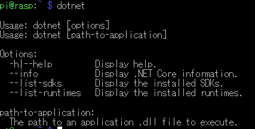

以前GCE上で.NET Coreアプリを定期実行する記事を書いたのですが、

<iframe src="https://hatenablog-parts.com/embed?url=https%3A%2F%2Fblog.hitsujin.jp%2Fentry%2F2019%2F01%2F29%2F165247" title="Google Compute Engine(無料枠)のLinux上で.NET Coreアプリを定期実行させる - Pandora Pocket" class="embed-card embed-blogcard" scrolling="no" frameborder="0" style="display: block; width: 100%; height: 190px; max-width: 500px; margin: 10px 0px;"></iframe>

無料枠で動かしたはずなのに課金の通知が飛んできたので、いったん撤退して手持ちのRaspberryPi上で動かすことにしました。

***

<h4>.NET Core 3.1ライブラリのダウンロード</h4>

<a class="keyword" href="http://d.hatena.ne.jp/keyword/Ubuntu">Ubuntu</a>はパッケージマネージャからインストール可能。Raspbianについては残念ながら提供されておらず。 
そのため今回はダウンロードして展開、パスを通す形で実行できるように変更する。

<iframe src="https://hatenablog-parts.com/embed?url=https%3A%2F%2Fdotnet.microsoft.com%2Fdownload%2Fdotnet-core%2F3.1" title="Download .NET Core 3.1 (Linux, macOS, and Windows)" class="embed-card embed-webcard" scrolling="no" frameborder="0" style="display: block; width: 100%; height: 155px; max-width: 500px; margin: 10px 0px;"></iframe>

対象のライブラリは<a class="keyword" href="http://d.hatena.ne.jp/keyword/Linux">Linux</a>のARM32向け。RaspbianがARM32向けであるため。 
本記事執筆時点では下記のファイルが最新。

<a href="https://download.visualstudio.microsoft.com/download/pr/67766a96-eb8c-4cd2-bca4-ea63d2cc115c/7bf13840aa2ed88793b7315d5e0d74e6/dotnet-sdk-3.1.100-linux-arm.tar.gz">https://download.visualstudio.microsoft.com/download/pr/67766a96-eb8c-4cd2-bca4-ea63d2cc115c/7bf13840aa2ed88793b7315d5e0d74e6/dotnet-sdk-3.1.100-linux-arm.tar.gz</a>

<a class="keyword" href="http://d.hatena.ne.jp/keyword/wget">wget</a>でPi上にダウンロード。

<blockquote>
<a class="keyword" href="http://d.hatena.ne.jp/keyword/wget">wget</a> <a href="https://download.visualstudio.microsoft.com/download/pr/67766a96-eb8c-4cd2-bca4-ea63d2cc115c/7bf13840aa2ed88793b7315d5e0d74e6/dotnet-sdk-3.1.100-linux-arm.tar.gz">https://download.visualstudio.microsoft.com/download/pr/67766a96-eb8c-4cd2-bca4-ea63d2cc115c/7bf13840aa2ed88793b7315d5e0d74e6/dotnet-sdk-3.1.100-linux-arm.tar.gz</a>
</blockquote>

<h4>展開</h4>

ホーム<a class="keyword" href="http://d.hatena.ne.jp/keyword/%A5%C7%A5%A3%A5%EC%A5%AF%A5%C8">ディレクト</a>リ配下に<a class="keyword" href="http://d.hatena.ne.jp/keyword/%A5%C7%A5%A3%A5%EC%A5%AF%A5%C8">ディレクト</a>リを作成して、その中に展開。

<blockquote>
mkdir -p $HOME/<a class="keyword" href="http://d.hatena.ne.jp/keyword/dotnet">dotnet</a> &amp;&amp; tar zxf <a class="keyword" href="http://d.hatena.ne.jp/keyword/dotnet">dotnet</a>-<a class="keyword" href="http://d.hatena.ne.jp/keyword/sdk">sdk</a>-3.1.100-<a class="keyword" href="http://d.hatena.ne.jp/keyword/linux">linux</a>-arm.tar.gz   -C $HOME/<a class="keyword" href="http://d.hatena.ne.jp/keyword/dotnet">dotnet</a>
</blockquote>

<a class="keyword" href="http://d.hatena.ne.jp/keyword/Raspberry%20Pi">Raspberry Pi</a>だと展開に時間がかかるのでしばし待つ。

展開が完了したら、 <code>.bashrc</code> ファイルに下記のコマンドを追加。

コマンド： <code>nano ~/.bashrc</code>

<blockquote>
export <a class="keyword" href="http://d.hatena.ne.jp/keyword/DOTNET">DOTNET</a>_ROOT=$HOME/<a class="keyword" href="http://d.hatena.ne.jp/keyword/dotnet">dotnet</a> 
export PATH=$PATH:$HOME/<a class="keyword" href="http://d.hatena.ne.jp/keyword/dotnet">dotnet</a>
</blockquote>

<h4>コマンド実行確認</h4>

一旦ログアウトしてから(.bashrcの変更を適用させるため)、下記のコマンドを実行。

コマンド： ‘<a class="keyword" href="http://d.hatena.ne.jp/keyword/dotnet">dotnet</a>‘

こんな感じで表示されればOK。

<h4>Cron実行時</h4>

GCEで動かしていた時同様、Cronで定期実行したいのですが、上記のインストール方法だと、Cron実行時動きません。 
<a class="keyword" href="http://d.hatena.ne.jp/keyword/bash">bash</a>に対してパスを通しているので、Cron実行時のshに通ってないため。

Cronの場合、
Cronファイルの <code>PATH</code> の項目に <code>/home/pi/dotnet</code> という形でパスを追加してやればOK。

.NET CoreのDLLに対しては<a class="keyword" href="http://d.hatena.ne.jp/keyword/%C0%E4%C2%D0%A5%D1%A5%B9">絶対パス</a>指定です。 
また、<a class="keyword" href="http://d.hatena.ne.jp/keyword/%A5%B7%A5%A7%A5%EB%A5%B9%A5%AF%A5%EA%A5%D7%A5%C8">シェルスクリプト</a>ではないので、 <code>$HOME</code> のような変数が使えないことにも注意。

