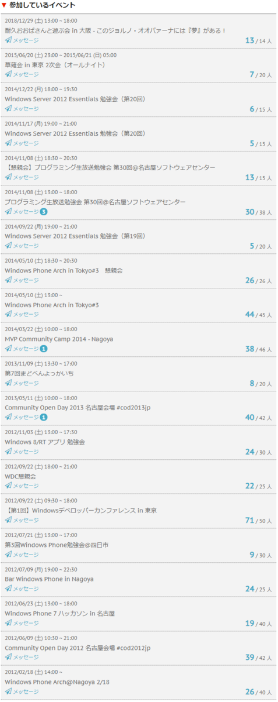

イベント開催支援ツールのATNDが終了するらしい。

<blockquote class="twitter-tweet" data-lang="ja">
【重要：サービス終了のお知らせ】 いつもATNDをご利用いただきありがとうございます。 この度ATNDは、2020年4月14日（火）をもちまして、全てのサービスを終了させて頂くこととなりました。 詳しくはATNDTOPページサイトバナーから、注意事項をご確認いただくようよろしくお願いいたします。
&mdash; ATND[アテンド] (@atnd) <a href="https://twitter.com/atnd/status/1216971766209417216?ref_src=twsrc%5Etfw">2020年1月14日</a></blockquote>

<iframe src="https://hatenablog-parts.com/embed?url=https%3A%2F%2Fatnd.org%2F" title="イベント開催支援ツール アテンド : ATND" class="embed-card embed-webcard" scrolling="no" frameborder="0" style="display: block; width: 100%; height: 155px; max-width: 500px; margin: 10px 0px;"></iframe>

ATNDはイベントに参加する人を管理するサービスの先駆け的存在(確か)で、私も何度も利用してました。

サービス終了後はこれまで参加した勉強会の一覧も見えなくなりそうなので、思い出を書きながらちょっと整理。

<h4><a class="keyword" href="http://d.hatena.ne.jp/keyword/Silverlight">Silverlight</a>を囲む会 in 名古屋 #5</h4>

初めて参加した勉強会はATNDで申し込みました。 
これです。

<iframe src="https://hatenablog-parts.com/embed?url=https%3A%2F%2Fatnd.org%2Fevents%2F19746" title="Silverlightを囲む会in名古屋 #5 : ATND" class="embed-card embed-webcard" scrolling="no" frameborder="0" style="display: block; width: 100%; height: 155px; max-width: 500px; margin: 10px 0px;"></iframe>

<a class="keyword" href="http://d.hatena.ne.jp/keyword/Silverlight">Silverlight</a>ってところが時代を感じる。完全に<a class="keyword" href="http://d.hatena.ne.jp/keyword/Windows">Windows</a> Phone関係かつ名古屋で開催される勉強会ということで参加した記憶。

思えばこの勉強会に参加したことで、みつばたん(<a href="http://blog.hatena.ne.jp/c-mitsuba/">id:c-mitsuba</a>)やつもりん(<a href="http://blog.hatena.ne.jp/tmyt/">id:tmyt</a>)、てつじんさん、おおばさん(<a href="http://blog.hatena.ne.jp/tworks/">id:tworks</a>)と知り合いになったような記憶が。

<h4><a class="keyword" href="http://d.hatena.ne.jp/keyword/Windows">Windows</a> Phone勉強会＠<a class="keyword" href="http://d.hatena.ne.jp/keyword/%BB%CD%C6%FC%BB%D4">四日市</a></h4>

<iframe src="https://hatenablog-parts.com/embed?url=https%3A%2F%2Fatnd.org%2Fevents%2F21546" title="Windows Phone勉強会＠四日市 : ATND" class="embed-card embed-webcard" scrolling="no" frameborder="0" style="display: block; width: 100%; height: 155px; max-width: 500px; margin: 10px 0px;"></iframe>

初めて参加した勉強会の次に参加したのが<a class="keyword" href="http://d.hatena.ne.jp/keyword/%BB%B0%BD%C5%B8%A9">三重県</a><a class="keyword" href="http://d.hatena.ne.jp/keyword/%BB%CD%C6%FC%BB%D4">四日市</a>で開かれた「<a class="keyword" href="http://d.hatena.ne.jp/keyword/Windows">Windows</a> Phone勉強会＠<a class="keyword" href="http://d.hatena.ne.jp/keyword/%BB%CD%C6%FC%BB%D4">四日市</a>」。 
その後勉強会の名前が「まどべんよっかいち」となり、何度か参加しました。 
この勉強会の主催ののぶくまさんとはその後、<a class="keyword" href="http://d.hatena.ne.jp/keyword/Microsoft">Microsoft</a>が開催したコンテストに一緒に参加して、賞をもらった思い出。ところであの時もらってのぶくまさんが所有することになった<a class="keyword" href="http://d.hatena.ne.jp/keyword/Xbox">Xbox</a>、今どうなってるのでしょう（

<h4><a class="keyword" href="http://d.hatena.ne.jp/keyword/Windows">Windows</a> Phone Arch@Nagoya 2/18</h4>

<iframe src="https://hatenablog-parts.com/embed?url=https%3A%2F%2Fatnd.org%2Fevents%2F22938" title="Windows Phone Arch@Nagoya 2/18 : ATND" class="embed-card embed-webcard" scrolling="no" frameborder="0" style="display: block; width: 100%; height: 155px; max-width: 500px; margin: 10px 0px;"></iframe>

初めてにして唯一の主催。 
そして主催といいつつたくさんの皆様に助けていただき、しかも自分ではセッションを持たないというなんちゃって主催感・・・。その節は皆さま本当にありがとうございました。

この時に初めてオデさんやいっちゅうさん他、今も<a class="keyword" href="http://d.hatena.ne.jp/keyword/Twitter">Twitter</a>で仲良くさせていただいている方とお近づきになった記憶。 
この時MSから<a class="keyword" href="http://d.hatena.ne.jp/keyword/%A5%CE%A5%D9%A5%EB%A5%C6%A5%A3">ノベルティ</a>を頂戴し、配布したのですが、余ったものがいまだに家に残っています。 
<a class="keyword" href="http://d.hatena.ne.jp/keyword/%A4%AF%A1%BC%A4%DE%A4%F3">くーまん</a>可愛いよ<a class="keyword" href="http://d.hatena.ne.jp/keyword/%A4%AF%A1%BC%A4%DE%A4%F3">くーまん</a>。

<h4>【第1回】<a class="keyword" href="http://d.hatena.ne.jp/keyword/Windows">Windows</a><a class="keyword" href="http://d.hatena.ne.jp/keyword/%A5%C7%A5%D9%A5%ED%A5%C3%A5%D1">デベロッパ</a>ーカンファレンス in 東京</h4>

<iframe src="https://hatenablog-parts.com/embed?url=https%3A%2F%2Fatnd.org%2Fevents%2F32054" title="【第1回】Windowsデベロッパーカンファレンス in 東京 : ATND" class="embed-card embed-webcard" scrolling="no" frameborder="0" style="display: block; width: 100%; height: 155px; max-width: 500px; margin: 10px 0px;"></iframe>

第一回といいつつ一回しか開催されなかったような気がする、そのころ学生だったがりっち(<a href="http://blog.hatena.ne.jp/garicchi/">id:garicchi</a>)主催の勉強会。 
<a class="keyword" href="http://d.hatena.ne.jp/keyword/Microsoft">Microsoft</a>が主宰してるようなタイトルだけど個人の勉強会。 
初めての東京での勉強会だったんですが、地方勉強会とは雲泥の差の集客ぶりに驚いた記憶があります。 
名古屋だと補欠者がでるほどの勉強会ってあまり見かけず。

<h4>振り返って</h4>

ATNDで参加した勉強会は主催分含めて24件でした。 
最近ではconnpassばかり利用していますが、初めて使ったサービスだっただけに終了はさみしくも感じます。

以下ATND経由で参加した勉強会一覧

***