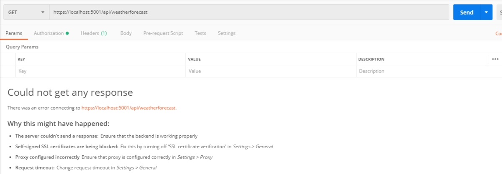
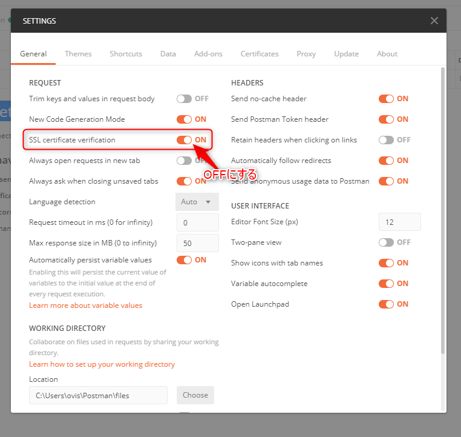
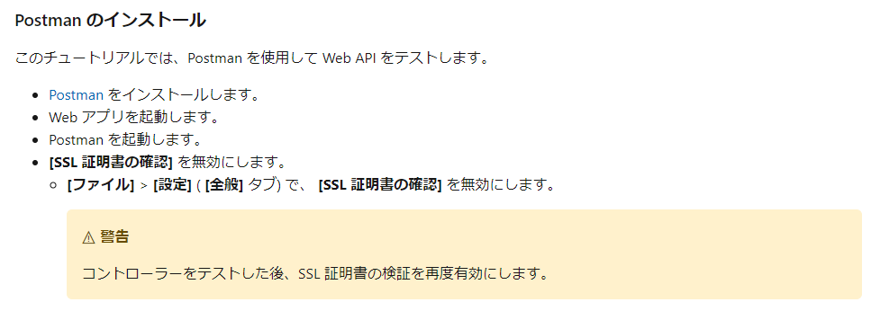
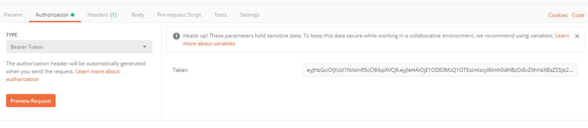

以前使っていた<a class="keyword" href="http://d.hatena.ne.jp/keyword/API">API</a>をたたくツールが公開終了してしまい、最近は<a class="keyword" href="http://d.hatena.ne.jp/keyword/PowerShell">PowerShell</a>で下記のように叩いていたんですが、

<blockquote>
$body = @{<a class="keyword" href="http://d.hatena.ne.jp/keyword/hoge">hoge</a>="fuga"; foo="bart"} | ConvertTo-<a class="keyword" href="http://d.hatena.ne.jp/keyword/Json">Json</a> -Compress 
<a class="keyword" href="http://d.hatena.ne.jp/keyword/Invoke">Invoke</a>-RestMethod -<a class="keyword" href="http://d.hatena.ne.jp/keyword/Uri">Uri</a> "<a href="https://localhost:5001/api/RESTfulApi">https://localhost:5001/api/RESTfulApi</a>" -Method POST -Body $body -ContentType application/<a class="keyword" href="http://d.hatena.ne.jp/keyword/json">json</a>
</blockquote>

やっぱり専用のクライアントを使ったほうが楽だなと思い直してPostmanを使い始めました。

<iframe src="https://hatenablog-parts.com/embed?url=https%3A%2F%2Fwww.postman.com%2F" title="Postman | The Collaboration Platform for API Development " class="embed-card embed-webcard" scrolling="no" frameborder="0" style="display: block; width: 100%; height: 155px; max-width: 500px; margin: 10px 0px;"></iframe>

乗り換えた際に躓いた点の備忘録。

<ul class="table-of-contents">
<li>
***
<a href="#ローカルデバッグ中のASPNET-Core-APIを叩けない">ローカルデバッグ中のASP.NET Core APIを叩けない</a></li>
<li><a href="#Bearer-トークンを指定したい">Bearer トークンを指定したい</a></li>
</ul>

<h4 id="ローカルデバッグ中のASPNET-Core-APIを叩けない">ローカル<a class="keyword" href="http://d.hatena.ne.jp/keyword/%A5%C7%A5%D0%A5%C3%A5%B0">デバッグ</a>中の<a class="keyword" href="http://d.hatena.ne.jp/keyword/ASP.NET">ASP.NET</a> Core <a class="keyword" href="http://d.hatena.ne.jp/keyword/API">API</a>を叩けない</h4>

<a class="keyword" href="http://d.hatena.ne.jp/keyword/ASP.NET">ASP.NET</a> Coreの<a class="keyword" href="http://d.hatena.ne.jp/keyword/API">API</a>テンプレートをそのまま動かしていてブラウザでは表示されるのに、

<blockquote>
Could not get any response
</blockquote>

とはじかれる事案。

なんやこれ、と思って調べたところ、下記のサイトを発見。

<iframe src="https://hatenablog-parts.com/embed?url=https%3A%2F%2Fknkomko.hatenablog.com%2Fentry%2F2019%2F10%2F02%2F001032" title="Postman の Could not get any response を解決する方法 (.Net Core API) - Grow up" class="embed-card embed-blogcard" scrolling="no" frameborder="0" style="display: block; width: 100%; height: 190px; max-width: 500px; margin: 10px 0px;"></iframe>

ローカル実行中の<a class="keyword" href="http://d.hatena.ne.jp/keyword/ASP.NET">ASP.NET</a> Coreの<a class="keyword" href="http://d.hatena.ne.jp/keyword/API">API</a>は自己署名の<a class="keyword" href="http://d.hatena.ne.jp/keyword/SSL%BE%DA%CC%C0%BD%F1">SSL証明書</a>を利用しているため、Postmanが<a class="keyword" href="http://d.hatena.ne.jp/keyword/SSL%BE%DA%CC%C0%BD%F1">SSL証明書</a>の検証を行った際に失敗してしまうのが原因の模様。

Postmanの<a class="keyword" href="http://d.hatena.ne.jp/keyword/%A5%C4%A1%BC%A5%EB%A5%D0%A1%BC">ツールバー</a>より「File」→「Settings」 から設定を開き、「<a class="keyword" href="http://d.hatena.ne.jp/keyword/SSL">SSL</a> certificate verification」 のチェックをオフにすることで問題は解消。

<a href="https://docs.microsoft.com/ja-jp/aspnet/core/tutorials/first-web-api?view=aspnetcore-3.0&amp;tabs=visual-studio">Microsoft Docs</a>にもちゃんと書いてありました。よく読めって話ですね。はい。

<h4 id="Bearer-トークンを指定したい">Bearer <a class="keyword" href="http://d.hatena.ne.jp/keyword/%A5%C8%A1%BC%A5%AF">トーク</a>ンを指定したい</h4>

JWTを利用した認証を行う際、発行されたBearer <a class="keyword" href="http://d.hatena.ne.jp/keyword/%A5%C8%A1%BC%A5%AF">トーク</a>ンをセットする必要があります。

最初Headerタブに設定すると思ってたんですが、普通にAuthorizationタブがありますね・・・。 
Typeに「BearerToken」があるので、そちらを選択し、Tokenにセットしたい<a class="keyword" href="http://d.hatena.ne.jp/keyword/%A5%C8%A1%BC%A5%AF">トーク</a>ンを入力するだけです。

