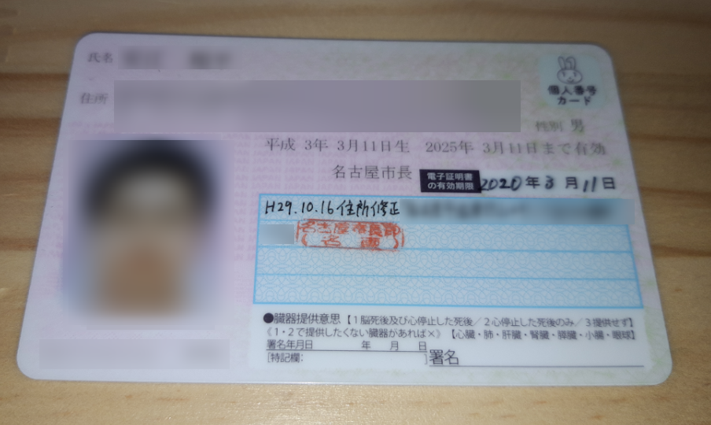

これの続き。 
<iframe src="https://hatenablog-parts.com/embed?url=https%3A%2F%2Fblog.hitsujin.jp%2Fentry%2F2020%2F02%2F06%2F213000" title="e-Taxで確定申告したら、マイナンバーカードの電子証明書が失効していることに気づいた話 - Pandora Pocket" class="embed-card embed-blogcard" scrolling="no" frameborder="0" style="display: block; width: 100%; height: 190px; max-width: 500px; margin: 10px 0px;"></iframe>

***

<h4><a class="keyword" href="http://d.hatena.ne.jp/keyword/%CC%BE%C5%EC%B6%E8">名東区</a>役所へ</h4>

<a class="keyword" href="http://d.hatena.ne.jp/keyword/%C5%C5%BB%D2%BE%DA%CC%C0%BD%F1">電子証明書</a>の再発行は居住している地域の役所の市民課(市区町村によって名称が異なる場合あり)で手続きを踏む必要があります。 
私は<a class="keyword" href="http://d.hatena.ne.jp/keyword/%CC%BE%B8%C5%B2%B0%BB%D4">名古屋市</a><a class="keyword" href="http://d.hatena.ne.jp/keyword/%CC%BE%C5%EC%B6%E8">名東区</a>在住なので、<a class="keyword" href="http://d.hatena.ne.jp/keyword/%CC%BE%C5%EC%B6%E8">名東区</a>役所へ。

どの窓口に行けばいいのかわからなかったので係の方に事情を伝え、転入転出系の窓口へ。 
<a class="keyword" href="http://d.hatena.ne.jp/keyword/%CC%BE%C5%EC%B6%E8">名東区</a>役所によると、転入時の<a class="keyword" href="http://d.hatena.ne.jp/keyword/%A5%DE%A5%A4%A5%CA%A5%F3">マイナン</a>バーカードの<a class="keyword" href="http://d.hatena.ne.jp/keyword/%C5%C5%BB%D2%BE%DA%CC%C0%BD%F1">電子証明書</a>の更新手続きは、口頭で更新するか否かを確認するんだそうです。私はわざわざ更新しないなんて言うこともないと思うのですが、もはや記憶がないので何とも言えない。なぜ書面での確認にしないのか・・・。市町村によってこのあたりの様式が異なるのは行政手続きを煩雑にする要因の一つだと思いますので、できるだけ統一してほしい。

<h4>再発行しようとするも</h4>

さて、<a class="keyword" href="http://d.hatena.ne.jp/keyword/%A5%DE%A5%A4%A5%CA%A5%F3">マイナン</a>バーカードの証明書更新書類をもらったので、そちらに名前、住所を記載し、手続きへ。 
<a class="keyword" href="http://d.hatena.ne.jp/keyword/%C5%C5%BB%D2%BE%DA%CC%C0%BD%F1">電子証明書</a>の有効期限が2020年3月11日となっているので、証明書の再発行ではなく、更新(有効期限の延長)手続きを行ってもらうことに。
<a class="keyword" href="http://d.hatena.ne.jp/keyword/%C5%C5%BB%D2%BE%DA%CC%C0%BD%F1">電子証明書</a>の更新手続き自体はよくある話だからか、係の方もよどみなく作業をされていた・・・のですが、途中で手が止まり、考え込み始めました。

<blockquote class="twitter-tweet" data-lang="ja">
係の方、更新処理が上手くいないらしくめっさ困惑してはる(
&mdash; Ovis＠🐑のひと (@Pandora_Ovis) <a href="https://twitter.com/Pandora_Ovis/status/1227442593530818560?ref_src=twsrc%5Etfw">2020年2月12日</a></blockquote>

ほかの係の方にもヘルプに入ってもらってあーだこーだと議論されつつ、いったん待合席で待っていてくれと告げられたので待合席で待つこと15分ほど。

結論としては、<a class="keyword" href="http://d.hatena.ne.jp/keyword/%C5%C5%BB%D2%BE%DA%CC%C0%BD%F1">電子証明書</a>の有効期限が2021年3月11日までだったため、更新手続きができなかったとのことでした。

<blockquote class="twitter-tweet" data-lang="ja">
<a class="keyword" href="http://d.hatena.ne.jp/keyword/%C5%C5%BB%D2%BE%DA%CC%C0%BD%F1">電子証明書</a>の有効期限が表面記載の有効期限より一年長かったので更新できなかったらしい。 どういうことなの。。。
&mdash; Ovis＠🐑のひと (@Pandora_Ovis) <a href="https://twitter.com/Pandora_Ovis/status/1227447811463172101?ref_src=twsrc%5Etfw">2020年2月12日</a></blockquote>

<a class="keyword" href="http://d.hatena.ne.jp/keyword/%A5%DE%A5%A4%A5%CA%A5%F3">マイナン</a>バーカードは発行してから10回目の誕生日までが有効期限となっていますが、<a class="keyword" href="http://d.hatena.ne.jp/keyword/%C5%C5%BB%D2%BE%DA%CC%C0%BD%F1">電子証明書</a>の有効期限は発行から5回目の誕生日までとなっています。 
私の<a class="keyword" href="http://d.hatena.ne.jp/keyword/%A5%DE%A5%A4%A5%CA%A5%F3">マイナン</a>バーカードは2025年3月11日まで有効と印字され、<a class="keyword" href="http://d.hatena.ne.jp/keyword/%C5%C5%BB%D2%BE%DA%CC%C0%BD%F1">電子証明書</a>の有効期限欄は役所の方の手書きで2020年3月11日までと記載されていました。

が、なぜか本来より1年長かったようです。解せぬ。 
発行した時点で誕生日を過ぎていたので伸びていたのかも・・・？と係の方に言われたんですが、それなら<a class="keyword" href="http://d.hatena.ne.jp/keyword/%A5%DE%A5%A4%A5%CA%A5%F3">マイナン</a>バーカードに印字されているカードそのものの有効期限も2026年までだと思うんですよね・・・。

まぁ何はともあれ、更新はできないということで、再発行手続きを進めてもらい、無事<a class="keyword" href="http://d.hatena.ne.jp/keyword/%A5%DE%A5%A4%A5%CA%A5%F3">マイナン</a>バーカードの<a class="keyword" href="http://d.hatena.ne.jp/keyword/%C5%C5%BB%D2%BE%DA%CC%C0%BD%F1">電子証明書</a>が復活しました。 
これで<a class="keyword" href="http://d.hatena.ne.jp/keyword/e-Tax">e-Tax</a>で確定申告ができるようになります。

