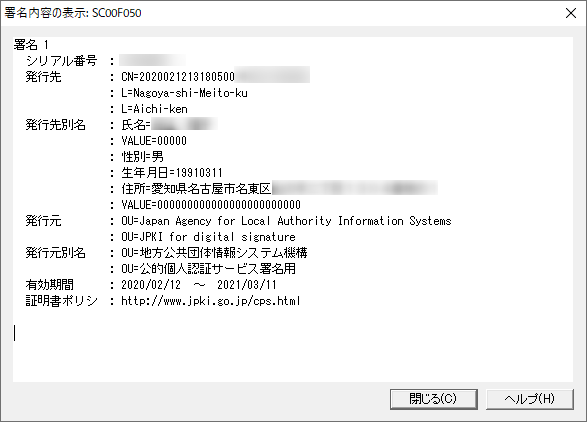

今回確定申告をするにあたってトラブルの原因になった、<a class="keyword" href="http://d.hatena.ne.jp/keyword/%A5%DE%A5%A4%A5%CA%A5%F3">マイナン</a>バーカードの署名用<a class="keyword" href="http://d.hatena.ne.jp/keyword/%C5%C5%BB%D2%BE%DA%CC%C0%BD%F1">電子証明書</a>。
この<a class="keyword" href="http://d.hatena.ne.jp/keyword/%C5%C5%BB%D2%BE%DA%CC%C0%BD%F1">電子証明書</a>にはどのような情報が保存されているのか気になりまして、調べてみました。

***

下記の画像は<a class="keyword" href="http://d.hatena.ne.jp/keyword/e-Tax">e-Tax</a>を行う際に用いるその名も「<a class="keyword" href="http://d.hatena.ne.jp/keyword/e-Tax">e-Tax</a>ソフト」を利用して表示される、<a class="keyword" href="http://d.hatena.ne.jp/keyword/%C5%C5%BB%D2%BD%F0%CC%BE">電子署名</a>内容になります。

恐らく漏れたらまずいであろう部分などにモザイクをかけておきましたが、下記の情報が保持されていることがわかります。

<ul>
<li>シリアル番号</li>
<li>発行先</li>
<li>発行先別名</li>
<li>発行元</li>
<li>発行元別名</li>
<li>有効期間</li>
<li>証明書ポリシー</li>
</ul>

発行先のCNの値について、どうやら先頭部は<a class="keyword" href="http://d.hatena.ne.jp/keyword/%C5%C5%BB%D2%BE%DA%CC%C0%BD%F1">電子証明書</a>を発行した時点での日時が保存されているようです。 
この画面をもっと早く知っていたら、前回失効していたことが分かった時に調査できたのですが・・・。

<code>発行先別名</code> の欄は<a class="keyword" href="http://d.hatena.ne.jp/keyword/%A5%DE%A5%A4%A5%CA%A5%F3">マイナン</a>バーカードの<a class="keyword" href="http://d.hatena.ne.jp/keyword/%CA%DD%CD%AD">保有</a>者の情報として、 <code>氏名</code>  <code>性別</code>  <code>生年月日</code> <code>住所</code> が保持されています。<a class="keyword" href="http://d.hatena.ne.jp/keyword/%C5%C5%BB%D2%BE%DA%CC%C0%BD%F1">電子証明書</a>が無効化されるのは氏名性別生年月日住所のいずれかが変更された場合という<a class="keyword" href="http://d.hatena.ne.jp/keyword/%A5%DE%A5%A4%A5%CA%A5%F3">マイナン</a>バー<a class="keyword" href="http://d.hatena.ne.jp/keyword/%A5%DD%A1%BC%A5%BF%A5%EB%A5%B5%A5%A4%A5%C8">ポータルサイト</a>の情報と一致しますね。

