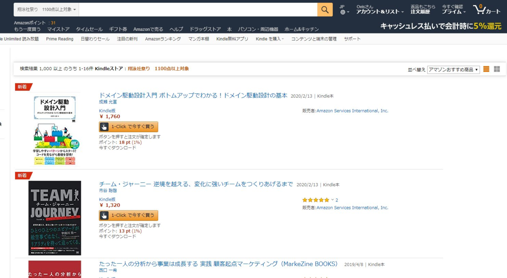
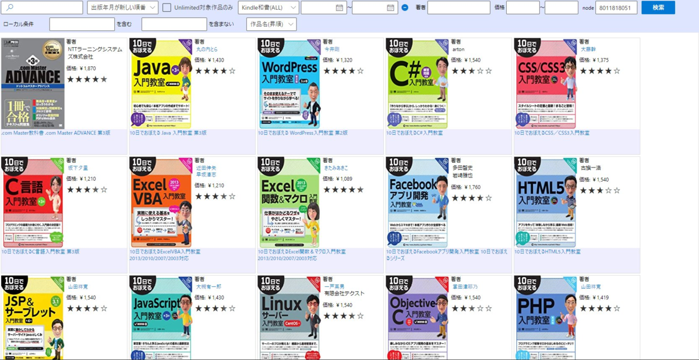
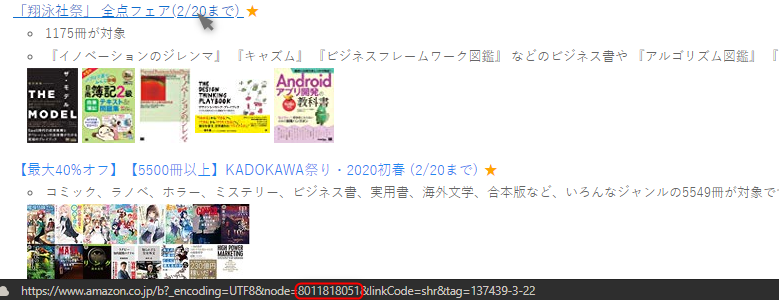

<blockquote class="twitter-tweet" data-lang="ja">
しんじさんの<a class="keyword" href="http://d.hatena.ne.jp/keyword/Kindle">Kindle</a> Search、node検索に対応いただいたので、キャンペーンに特化した検索、並び替えができるようになって最高。 例えば<a class="keyword" href="http://d.hatena.ne.jp/keyword/%E6%C6%B1%CB%BC%D2">翔泳社</a>祭りのnodeが8011818051なのだけど、node欄に入力して検索するとこんな感じでタイトル並び替えができる。<a class="keyword" href="http://d.hatena.ne.jp/keyword/Amazon">Amazon</a>公式がタイトル並び替えできればいいのだけど。 <a href="https://t.co/ZYuCu0vB2M">pic.twitter.com/ZYuCu0vB2M</a>
&mdash; Ovis＠🐑のひと (@Pandora_Ovis) <a href="https://twitter.com/Pandora_Ovis/status/1229069614211973120?ref_src=twsrc%5Etfw">2020年2月16日</a></blockquote>

投稿したものがすべてを語ってるんですが、しんじさん(<a href="http://blog.hatena.ne.jp/Shinji_Japan/">id:Shinji_Japan</a>)が公開されている<a class="keyword" href="http://d.hatena.ne.jp/keyword/Chrome">Chrome</a>拡張の「<a class="keyword" href="http://d.hatena.ne.jp/keyword/Kindle">Kindle</a> Search」にBrowseNode(以下node)検索機能を実装していただきました。

<iframe src="https://hatenablog-parts.com/embed?url=https%3A%2F%2Fchrome.google.com%2Fwebstore%2Fdetail%2Fkindle-search%2Fbckpnmiaedmiohplnmmeleogkifnmkfk" title="Kindle Search" class="embed-card embed-webcard" scrolling="no" frameborder="0" style="display: block; width: 100%; height: 155px; max-width: 500px; margin: 10px 0px;"></iframe>

<iframe src="https://hatenablog-parts.com/embed?url=http%3A%2F%2Fshinji-japan.hatenadiary.jp%2Fentry%2F2019%2F11%2F23%2F114458" title="React/TypeScriptでKindle本を検索できるChrome拡張を作ったので公開しました - shinji-japanのブログ" class="embed-card embed-blogcard" scrolling="no" frameborder="0" style="display: block; width: 100%; height: 190px; max-width: 500px; margin: 10px 0px;"></iframe>

これによって、特定のnodeに紐づく<a class="keyword" href="http://d.hatena.ne.jp/keyword/Kindle">Kindle</a>本のみを抽出することができるようになります。

nodeとは<a class="keyword" href="http://d.hatena.ne.jp/keyword/Amazon">Amazon</a>の商品カテゴリのことです。 
例えば日用品なら「<a href="https://www.amazon.co.jp/b/ref=as_li_ss_tl?node=170563011">170563011</a>」となります。

これ、何がうれしいかというと、<a class="keyword" href="http://d.hatena.ne.jp/keyword/Kindle">Kindle</a>がたまに行っているキャンペーン・セールは(例外もありますが)nodeを発行して、対象本を紐づけて表示しているので、このnodeさえわかればキャンペーン中の本だけが表示、並び替えできるんです。

例えば今(2020/02/17)行われている<a class="keyword" href="http://d.hatena.ne.jp/keyword/%E6%C6%B1%CB%BC%D2">翔泳社</a>の<a class="keyword" href="http://d.hatena.ne.jp/keyword/Kindle">Kindle</a>本セール。

<iframe src="https://hatenablog-parts.com/embed?url=https%3A%2F%2Fwww.amazon.co.jp%2Fb%2Fref%3Das_li_ss_tl%3Fnode%3D8011818051" title="Amazon.co.jp: 翔泳社祭り　1100点以上対象: Kindleストア" class="embed-card embed-webcard" scrolling="no" frameborder="0" style="display: block; width: 100%; height: 155px; max-width: 500px; margin: 10px 0px;"></iframe>

このセールはnodeとして「8011818051」が発行されています。

<a class="keyword" href="http://d.hatena.ne.jp/keyword/Amazon">Amazon</a>で普通に検索すると、<a class="keyword" href="http://d.hatena.ne.jp/keyword/Amazon">Amazon</a>お勧め順、価格の安い(高い)順、出版年月順では検索できるものの、タイトル順が存在しません。 
これが曲者で、シリーズものを探すときに本当に苦労します。

で、この<a class="keyword" href="http://d.hatena.ne.jp/keyword/Chrome">Chrome</a>拡張を使うと、

こんな感じ。  
タイトル順なので、10日でおぼえるシリーズがまとまっているのがわかるでしょうか。 
なぜ<a class="keyword" href="http://d.hatena.ne.jp/keyword/Amazon">Amazon</a>で実装されていないのか理解に苦しむのですが、ABテストとかで実装しないほうが売れる結果が出たとかなんでしょうか・・・。

さて、このnodeなんですが、普通は<a class="keyword" href="http://d.hatena.ne.jp/keyword/API">API</a>(<a class="keyword" href="http://d.hatena.ne.jp/keyword/Amazon">Amazon</a> <a class="keyword" href="http://d.hatena.ne.jp/keyword/Product%20Advertising%20API">Product Advertising API</a>)を叩かないと判明しません。

<iframe src="https://hatenablog-parts.com/embed?url=https%3A%2F%2Fqiita.com%2Fkobake%40github%2Fitems%2F88001f62983211027f63" title="Amazonカテゴリ一覧 23,420 件（BrowseNodeデータ収集結果） - Qiita" class="embed-card embed-webcard" scrolling="no" frameborder="0" style="display: block; width: 100%; height: 155px; max-width: 500px; margin: 10px 0px;"></iframe>

<iframe src="https://hatenablog-parts.com/embed?url=http%3A%2F%2Fblog.livedoor.jp%2Funderzonez%2Farchives%2F6618861.html" title="[C#] Amazon Product Advertising API を使用する : システム管理者さんの憂鬱" class="embed-card embed-webcard" scrolling="no" frameborder="0" style="display: block; width: 100%; height: 155px; max-width: 500px; margin: 10px 0px;"></iframe>

さすがに面倒なので、きんどうさんやキンセリさんのサイト、ツイートをチェックして、そのURLからnodeを探しましょう。 
(nodeだけ拝借するとタダ乗りになってしまうので、URL開いて<a class="keyword" href="http://d.hatena.ne.jp/keyword/%A5%A2%A5%D5%A5%A3%A5%EA%A5%A8%A5%A4%A5%C8">アフィリエイト</a>タグだけ反映させておくのがよいかと)

<iframe src="https://hatenablog-parts.com/embed?url=https%3A%2F%2Fkindou.info%2F" title="きんどう あなたのポチッを加速させるメディア" class="embed-card embed-webcard" scrolling="no" frameborder="0" style="display: block; width: 100%; height: 155px; max-width: 500px; margin: 10px 0px;"></iframe>
<iframe src="https://hatenablog-parts.com/embed?url=https%3A%2F%2Fyapi.ta2o.net%2Fkndlsl%2F" title="キンセリ" class="embed-card embed-webcard" scrolling="no" frameborder="0" style="display: block; width: 100%; height: 155px; max-width: 500px; margin: 10px 0px;"></iframe>

特にキンセリさんのサイトは上記<a class="keyword" href="http://d.hatena.ne.jp/keyword/API">API</a>を叩いて自動更新しているだけあって、使いやすいです。 

<blockquote class="twitter-tweet" data-lang="ja">
【<a class="keyword" href="http://d.hatena.ne.jp/keyword/Kindle">Kindle</a>セール開始】<a class="keyword" href="http://d.hatena.ne.jp/keyword/%E6%C6%B1%CB%BC%D2">翔泳社</a>祭り！1100点以上対象 (2020/2/13から)<a href="https://t.co/ShucfR5WlD">https://t.co/ShucfR5WlD</a>
&mdash; キンセリ 公式 (@kinselist) <a href="https://twitter.com/kinselist/status/1228514303927472128?ref_src=twsrc%5Etfw">2020年2月15日</a></blockquote>

***