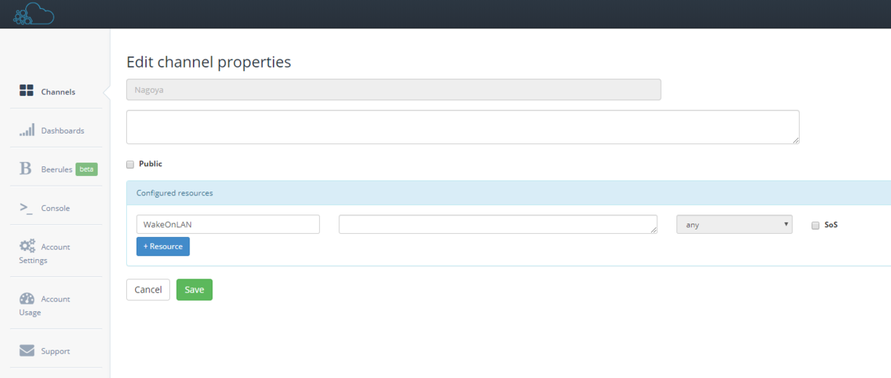
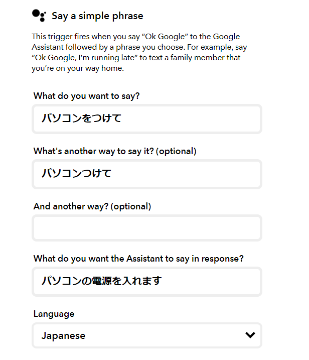
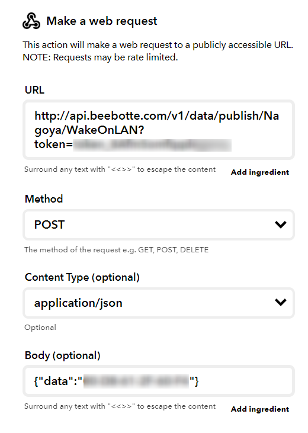
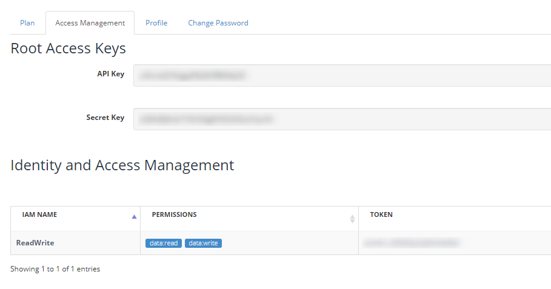

家で仕事をしているのですが、普段寝る前にはパソコンの電源を落としています。  
朝起きて身支度をして、仕事部屋に行ってからパソコンの電源を入れて・・・よりはデスクの前に来た段階で電源が入っていてほしい。  

というわけで、朝起きたときに枕もとのGoogle Assistantに「パソコン付けて」というだけで電源が入るようにしました。  

構成としてはまずGoogle AssistantとIFTTTを連携させ、IFTTTのWebhookでMQTT Broker(今回はBeebotte)に指示を送信。  
RaspberryPiにMQTTのクライアントを配置し、このクライアントがMQTTを受け取ったらWakeOnLANを実行する、という単純な作りです。  

最初はRaspberryPiでWebサーバーを構築し、直接呼ぶことを考えたのですが、セキュリティ的に難があるなと思い、ポート開放をしなくともいける方法を採用。  

ソースコードはこちら。今後いろいろと機能を設けて、ひつじ家のスマートホーム化の根幹にできたらなと。  

[https://github.com/Ovis/MqttHomeClient:embed]

こんな感じでBeebotte側でMQTTを送れるようにチャンネルを作ってあげて、  

 

IFTTT側でこんな感じのウェイクワードを指定し、  

 

WebhookでBeebotteにMACアドレスを送信。
   

BeebotteのAccount SettingsのSecret Keyまたは別途作成したトークンをメモって、
 

MQTTクライアントのappsettings.jsonのAccountIdにトークンを記載。Channelには上で作ったチャンネルのIDを指定。

今回RaspberryPiで実行するので、あらかじめRaspberryPiに.NET CoreのSDKをぶち込んでおきます。  

方法はこちらを参照。  

[https://blog.hitsujin.jp/entry/2020/01/13/153809:embed]

今回はCron実行なバッチプログラムではなく、常時起動するプログラムなので、Systemdで起動させるようにします。  

`/etc/systemd/system` 配下に `[サービス名].service` という名前でファイルを作成し、下記の内容を転記、修正。  

[https://gist.github.com/Ovis/61b61e2d28b1ddd9987eb94046414170:embed]

後はSystemdをリロードして、  
コマンド： `sudo systemctl daemon-reload`  

サービスを有効化。  
コマンド： `sudo systemctl enable [サービス名]`  

後はシステムをリブートするか、下記のコマンドを実行して起動してみて下さい。なお、下記のコマンドだと実行してからCtrl+Cで戻ってこないとうんともすんとも言わなくなります(上のサービス設定が悪い)。  
コマンド： `sudo systemctl start [サービス名]`  

この方法ならGoogle Assistantでなくてもスマホのホーム画面にIFTTTのボタンウィジェットを配置しておけば、外出していてもパソコンの電源を入れることができて便利。  
最悪トークンが漏れても再生成すればよく、そもそも漏れたところで私のパソコンが勝手に起動するだけだしセキュリティ的にもまぁ問題ないでしょう。

#### 参考サイト  

[https://sys-guard.com/post-16501/:embed]

