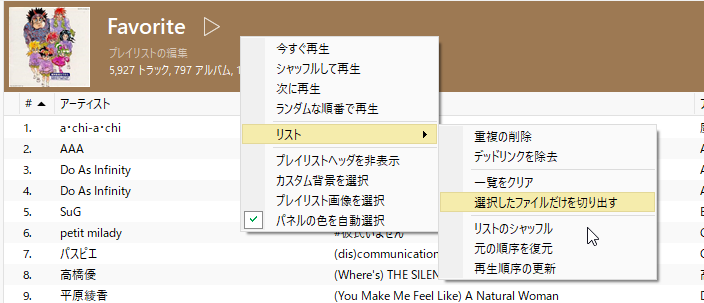

伯父から車を譲ってもらったんですが、15年物の古い車で、CDかMD、FMラジオしか音楽再生手段がない。 
近所に買い物に行くくらいならともかく、実家に帰るときなどある程度の距離を走るときは音楽が欲しい。

スマートフォンには容量の都合音楽ファイルを入れておきたくないので、USBメモリー対応のFMトランスミッターを物色し、AnkerのRoav FM Transmitter F2を購入しました。

<a href="https://www.amazon.co.jp/exec/obidos/ASIN/B07CVH67G4/ovis91-22/">Anker Roav FM Transmitter F2（FMトランスミッター搭載 19.5W 2ポート カーチャージャー）【Bluetooth 4.2 / カーファインダー / ハンズフリー通話対応 / PowerIQ搭載】</a>
<ul><li>メディア:</li></ul>

***

商品が届いて実際に接続し、音楽が再生できるところまで確認したんですが、音楽ファイルの再生順番がよくわからない。

説明書にも載ってなければAnkerのサイトにも載っていない。

私は基本的に同じアーティストをガンガン流すよりシャッフルで聞きたいのですが、そういう機能はない。

Ankerのサポートに聞いてみたところ、 <code>音楽ファイルのファイル名順</code> とのこと。

ただ、実際に試してみたもののそういう順番にはならない・・・。

謎なのでいろいろ試した結果、どうやら同一階層のファイルのうち、<code>USBメモリーにファイルをコピーした順番（つまりは作成日時）</code>で音楽ファイルが再生される模様。

なので、最終的にMusicBeeの同期機能を利用してUSBメモリーにファイルを配置することにしました。

プレイリストを作成したうえでUSBメモリーに保存したい曲を登録、<code>リストをシャッフル</code> でプレイリストをシャッフルしてから <code>再生順序の更新</code> でシャッフルした順番にプレイリストを保存してから同期することで、疑似的にシャッフル再生することができました。

