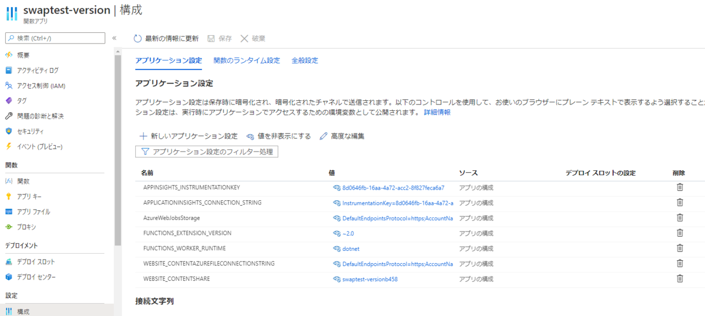
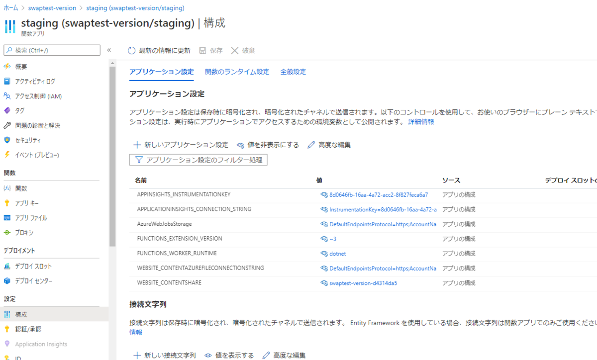
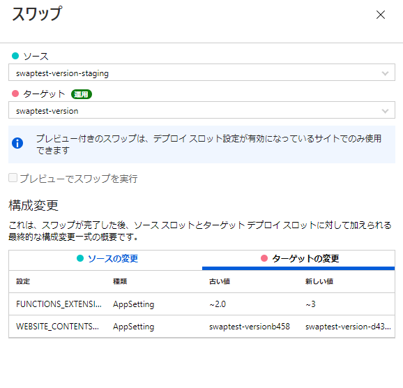
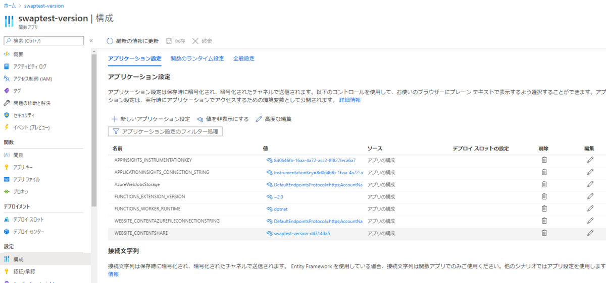

タイトルがすべて。

<iframe src="https://hatenablog-parts.com/embed?url=https%3A%2F%2Fblog.shibayan.jp%2Fentry%2F20200715%2F1594822678" title="2020 年 10 月に既存の Azure Functions v2 は v3 (.NET Core 3.1) に更新されます - しばやん雑記" class="embed-card embed-blogcard" scrolling="no" frameborder="0" style="display: block; width: 100%; height: 190px; max-width: 500px; margin: 10px 0px;"></iframe>

Azure Functions v2がEOLとなり、<code>FUNCTIONS_EXTENSION_VERSION</code> の値を <code>~2.0</code> としていたアプリがありました。 
当然EOL状態を放置することはできないため、v3に対応する修正を実施し、開発環境では正常に動くことを確認。 
本番に向けステージング環境にデプロイ後、<code>FUNCTIONS_EXTENSION_VERSION</code> の値を <code>~3</code> に変更したうえでスワップを実施しました。

が、ここで本番環境でエラーが発生することが発覚し、急遽再スワップを実施して戻すことに。

発生したエラーは下記の通り。

<pre class="code" data-lang="" data-unlink>Could not load type &#39;System.IAsyncDisposable&#39; from assembly &#39;System.Runtime, Version=4.2.1.0, Culture=neutral, PublicKeyToken=b03f5f7f11d50a3a&#39;.</pre>

IAsyncDisposable がライブラリにないぞと。 
該当の処理はawait usingステートメントでSQLトランザクションを行っており、少なくとも開発環境では正常に動いている。

<iframe src="https://hatenablog-parts.com/embed?url=https%3A%2F%2Fsmdn.jp%2Fprogramming%2Fdotnet-samplecodes%2Fdisposing%2Ffb04ff1b0bc911eb97288f27619b2bb2%2F" title="await usingステートメントを使ってオブジェクトを非同期的に破棄する (C# 8.0) - .NET サンプルコード - 総武ソフトウェア推進所" class="embed-card embed-webcard" scrolling="no" frameborder="0" style="display: block; width: 100%; height: 155px; max-width: 500px; margin: 10px 0px;"></iframe>

なんぞこれはと悩んでいたのですが、ここでアプリケーション設定の <code>FUNCTIONS_EXTENSION_VERSION</code> の値が <code>~2.0</code> のままになっていることが発覚。 
スワップ時はダブルチェックでスロット設定を確認していたのになぜ・・・？と調査したところ、こちらのIssueが。

<iframe src="https://hatenablog-parts.com/embed?url=https%3A%2F%2Fgithub.com%2FAzure%2FAzure-Functions%2Fissues%2F925" title="Setting FUNCTIONS_EXTENSION_VERSION is not swapped · Issue #925 · Azure/Azure-Functions" class="embed-card embed-webcard" scrolling="no" frameborder="0" style="display: block; width: 100%; height: 155px; max-width: 500px; margin: 10px 0px;"></iframe>

<blockquote>
Any app setting that ends with _EXTENSION_VERSION will be treated as slot setting. This behavior has been added a while ago prior to when we introduces capability for users to mark settings as slot settings.
</blockquote>

<code>_EXTENSION_VERSION</code>で終わるアプリケーション設定はスロット設定にチェックを入れている入れていないにかかわらず、スロット設定として扱われると。

このためスワップしたときに切り替わらなかったようです。

開発環境は直接設定の上デプロイしたため正常に動き、本番はスワップ元で設定後デプロイして実行したものの、この段階では設定が <code>~3</code> と正しかったためにこちらも問題なく稼働。

スワップしたものの上記理由により <code>FUNCTIONS_EXTENSION_VERSION</code> が 入れ替わらず、 <code>~2.0</code> のままだったために.NET Core 3.1から利用可能になった処理で躓いてしまったのが今回の問題だった模様。

<h4>検証</h4>

検証のためにFunctionsを作成。

スワップ先になるプロダクション環境。スロット設定は無し。 

ステージング環境。

スワップ処理。 
構成変更には <code>FUNCTIONS_EXTENSION_VERSION</code> が表示されているので変更されるように見える。 

スワップは正常終了。 

プロダクション環境のアプリケーション設定を確認すると、 <code>WEBSITE_CONTENTSHARE</code> の値は変わっているのに <code>FUNCTIONS_EXTENSION_VERSION</code> は変わっていない。 

これは罠だ・・・。

***