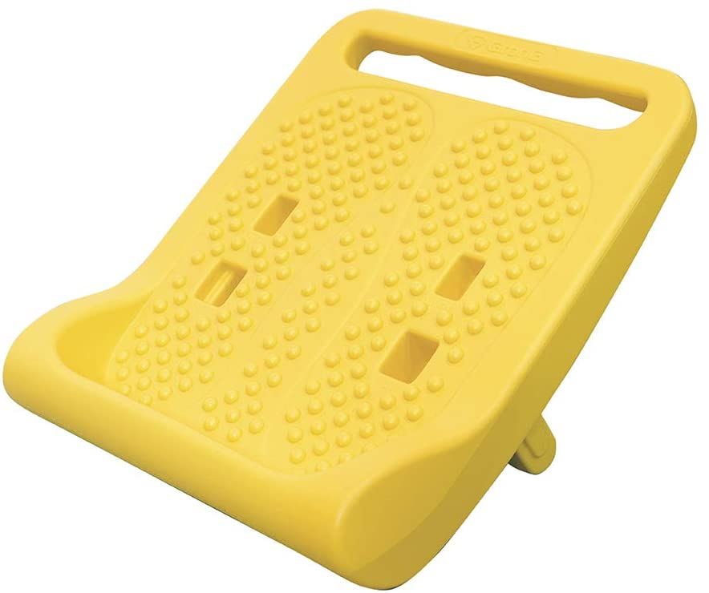

2020年ももう終わりということで、今年買ってよかったもの。

お題「<a class="keyword" href="https://blog.hatena.ne.jp/-/campaign/bestbuy2020">#買って良かった2020</a> 」

***

<h2>ハード系</h2>

<h3>HP ProBook x360 435 G7</h3>

かずきさん(<a href="http://blog.hatena.ne.jp/okazuki/">id:okazuki</a>)に3年ほど前に安く譲ってもらったSurface Bookもだいぶバッテリーの持ちが悪くなってきたこともあり、今回仕事の打ち合わせに持っていくために新調しました。 
HPのノートパソコンはキーボードのエンターキーの右側にもキーがある変態構成だったので長らく調達先から外してきたのですが、これは普通のキーボードでした。 
つい最近の構成からキーボードが変わったみたいですね。

<iframe src="https://hatenablog-parts.com/embed?url=https%3A%2F%2Fpc.watch.impress.co.jp%2Fdocs%2Fnews%2F1293731.html" title="HPの日本語キーボードがついに変更。PageUp等を右端に置くスタイルをやめて誤操作を防止  ～まずは13.5型2in1「Spectre x360 14」に適用" class="embed-card embed-webcard" scrolling="no" frameborder="0" style="display: block; width: 100%; height: 155px; max-width: 500px; margin: 10px 0px;"></iframe>

メモリー16GB、Ryzen 5、SSD512GB、Windows 10 Proの構成で10万円を普通に切ってるあたり最近はパソコンも安くなったものだなぁと。 
ちょっとした開発ならこのマシンだけで事足りそうです。

<a href="https://www.amazon.co.jp/exec/obidos/ASIN/B08LD4V8NM/ovis91-22/">HP ノートパソコン HP ProBook x360 435 G7 Ryzen5 メモリ8GB 256GB SSD Windows10 Pro 13.3インチ フルHD タッチディスプレイ（型番：1A4P0PA-AABW）</a>
<ul><li>メディア:</li></ul>

<h3>Marantz Professional MPM-2000U</h3>

コロナもあって音声会議などもあるだろうと思い購入。 
これまではSONYの安いマイクを利用していたのですが、雑音が入ったり音がやけに小さいなど不満があり・・・。

こちらはホワイトノイズもなく、音もしっかり拾えて好印象。

<a href="https://www.amazon.co.jp/exec/obidos/ASIN/B01GJ9IUNY/ovis91-22/">【Amazon限定ブランド】888M マランツプロ USBコンデンサーマイク 在宅勤務/生放送/録音 ショックマウント・ケース付 MPM2000U</a>
<ul><li>発売日: 2016/12/07</li><li>メディア: エレクトロニクス</li></ul>

<h3>AVLT PC モニターアーム</h3>

<a href="https://www.amazon.co.jp/exec/obidos/ASIN/B083QGXMXZ/ovis91-22/">AVLT PC モニターアーム 17~43インチ対応 耐荷重2-15kg 多角度調節 ガススプリング式 ディスプレイアーム グロメット式&amp;クランプ式 VESA スタンド - 支援超ワイド/曲面/液晶ディスプレイ</a>
<ul><li>メディア: エレクトロニクス</li></ul>

一昨年購入したLG電子の43インチ4Kモニタ用モニターアームが欲しいなと思っていたところ、

<blockquote data-conversation="none" class="twitter-tweet" data-lang="ja">
このモニターアームは、例の15kgくらいあるLGの43インチモニタも吊れました。エルゴトロンのLXアームだと垂れましたorz  AVLT の AVLT PC モニターアーム 17~43インチ対応 耐荷重2-15kg  <a href="https://t.co/lu015hejcR">https://t.co/lu015hejcR</a> <a href="https://t.co/FvgGPAonGh">pic.twitter.com/FvgGPAonGh</a>
&mdash; izm (@izm) <a href="https://twitter.com/izm/status/1332553243302379522?ref_src=twsrc%5Etfw">2020年11月28日</a></blockquote>  

というツイートを見かけて購入。

なお私が使ってるLGのモニターは200mmx200mmのVESA規格なので、変換用パーツが必要でした。

<a href="https://www.amazon.co.jp/exec/obidos/ASIN/B00AAHOYXM/ovis91-22/">エルゴトロン VESA Bracket Adaptor Kit 97-759</a>
<ul><li>メディア: Personal Computers</li></ul>

<h3>Nature Remo 3</h3>

<a href="https://www.amazon.co.jp/exec/obidos/ASIN/B08BLSLWH4/ovis91-22/">Nature スマートリモコン Nature Remo 3 ネイチャーリモ Remo-1W3 Alexa/Google Home/Siri対応</a>
<ul><li>メディア: Tools &amp; Hardware</li></ul>

LS miniからの乗り換え。 
買って早々にシステムトラブルで使えないタイミングがあって乗り換えに失敗したか・・・？と思ったものの、それ以降は特段問題なく。 
リモコンのプリセットも数揃えられているあたりはさすが。 
Nature Remo E liteもついでに購入し、Wi-SANでリアルタイムに電力消費状況も確認できるようにしたものの、今のところは見るだけ状態。APIが提供されているので暇を見て遊びたい。

<a href="https://www.amazon.co.jp/exec/obidos/ASIN/B086WGR1TZ/ovis91-22/">スマートエナジーハブ Nature Remo E lite</a>
<ul><li>メディア: Tools &amp; Hardware</li></ul>

<h2>調理</h2>

<h3>和平フレイズ ワイドになった ホットサンドパン あつほかダイニング MB-1772</h3>

<a href="https://www.amazon.co.jp/exec/obidos/ASIN/B08CR5KD5V/ovis91-22/">和平フレイズ “よくばりサイズ&quot; ワイドになった ホットサンドパン さらにぎゅうぎゅうに焼ける! 直火専用 あつほかダイニング MB-1772</a>
<ul><li>発売日: 2020/08/07</li><li>メディア: ホーム&amp;キッチン</li></ul>

リロ氏の投稿動画を見て衝動買い。 
もともと小さめのホットサンドメーカーとしてi-WANOのホットサンドメーカーを使ってました。

<a href="https://www.amazon.co.jp/exec/obidos/ASIN/B07PF8M23R/ovis91-22/">【 i-WANO × 燕三条 】 日本製 フチが圧着 カリカリの食感が◎ 耳まで焼ける 上下取り外し可能 フッ素樹脂加工 [ ホットサンドメーカー JP ] 直火 対応 ホットサンド アウトドア キャンプ にも 2枚のフライパンとしても使用可能 片面フラットで使いやすさ◎ 丸洗いOK</a>
<ul><li>メディア: ホーム&amp;キッチン</li></ul>

ただ、単純にホットサンドを作るだけならこれで十分なものの、肉を一気に焼くなど、ほかの料理をしようと思うとパンのサイズでしかないこのホットサンドメーカーだとちょっと小さく。

こちらはでかいだけあって胸肉を二つ同時に焼いたり、大きなお好み焼きを焼いたりと大活躍。 
欠点は二つに分解できないこと。洗う時には外れたほうが楽なんですが、こちらは分解できず。和平フレイズのTwitterによると、二つに分離できるつくりにしようと思うとさらに重くなってしまうことから断念したらしい。確かにすでに重たいので、これ以上重たくなると使いにくくはなりそう。

<blockquote data-conversation="none" class="twitter-tweet" data-lang="ja">
申し訳ありませんm(_ _)m 開口角度を固定させる＋着脱可能にすると、現品よりも重くなってしまうようなのです。現状も、決して軽いわけではなく…難しいところなのです😭 ご検討ありがとうございます🙇‍♀️🙇‍♀️
&mdash; フレにゃん＠和平フレイズ【公式】 🍳🥘 (@waheifreiz) <a href="https://twitter.com/waheifreiz/status/1299262250679635968?ref_src=twsrc%5Etfw">2020年8月28日</a></blockquote>  

<h3>VPCOK ノンフライヤー</h3>

<a href="https://www.amazon.co.jp/exec/obidos/ASIN/B07JFYQ4V1/ovis91-22/">【新発売】Newモデル!フライヤー 電気フライヤー VPCOK 揚げ物 油無し ノンフライヤー エアフライヤー 大容量 2.6L 1~4人に適用 スマートディスプレイ＆タッチパネル 日本語説明書付き</a>
<ul><li>メディア:</li></ul>

揚げ物好きなものの、家で揚げ物するのは油の管理が非常に面倒なので、Amazonセールで安かったこちらを購入。 
中国製なので日本語説明書も微妙ではあったものの、それほどややこしい作りではないのですぐ慣れました。 
大量に作るのには向いてないものの(ムラが発生するので)、一人分を作るには十分。

<h2>ストレッチ</h2>

<h3>GronG ストレッチボード</h3>

私はとにかく体が硬く、特に足首の可動域がめちゃくちゃ狭いので、ふとした時にストレッチできるといいなと思い購入。

角度を調整して上に乗るだけで足首とふくらはぎが伸びて心地よい・・・。

<a href="https://www.amazon.co.jp/exec/obidos/ASIN/B07NCWQS7W/ovis91-22/">GronG(グロング) ストレッチボード 足つぼ 3段階調節 耐荷重110kg イエロー</a>
<ul><li>メディア: その他</li></ul>

