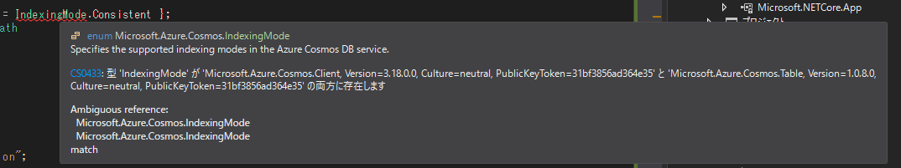

業務アプリで利用しているSDKを更新していてはまったので覚書。

#### 問題
今回 `Microsoft.Azure.Cosmos` と `Microsoft.Azure.Cosmos.Table` をそれぞれ用いる構成なのですが、単純にNuGetパッケージをインストールすると、名前空間が衝突する箇所があり、

 

> エラー	CS0433	型 'IndexingMode' が 'Microsoft.Azure.Cosmos.Client, Version=3.18.0.0, Culture=neutral, PublicKeyToken=31bf3856ad364e35' と 'Microsoft.Azure.Cosmos.Table, Version=1.0.8.0, Culture=neutral, PublicKeyToken=31bf3856ad364e35' の両方に存在します

このようにエラーとなります。

#### 解決策
.NETではこのように名前空間が衝突してしまう場合に、 externエイリアスという機能を利用して解決することができます。  

<?# OEmbed "https://docs.microsoft.com/ja-jp/dotnet/csharp/language-reference/keywords/extern-alias" /?>

<?# OEmbed "https://rksoftware.hatenablog.com/entry/2021/01/28/194508" /?>

DLLファイルだったら各DLLのプロパティでエイリアスを指定するらしいのですが、NuGetパッケージの場合はそういうことはできません。  

この場合、csprojファイルに下記のように記載することで対応できます。  

```csproj
	<Target Name="ChangeAliasesOfAzureTables" BeforeTargets="FindReferenceAssembliesForReferences;ResolveReferences">
		<ItemGroup>
			<ReferencePath Condition="'%(FileName)' == 'Microsoft.Azure.Cosmos.Table(エイリアス指定したいNuGetパッケージ名)'">
				<Aliases>AzureTable(エイリアス名)</Aliases>
			</ReferencePath>
		</ItemGroup>
	</Target>
```

あとは通常通り、
```csharp
extern alias AzureTable;
using AzureTable::Microsoft.Azure.Cosmos.Table;
```

こんな感じでusingを記載してやれば、うまく回避することができます。


#### 参考

<?# OEmbed "https://stackoverflow.com/questions/33460667/how-to-use-extern-alias-with-nuget" /?>

