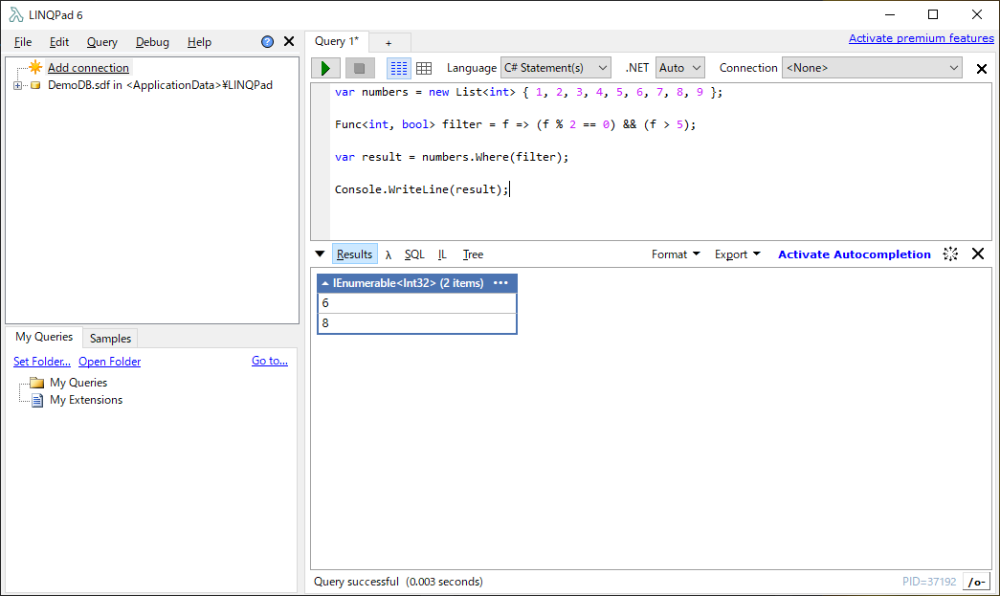

たまに使おうと思って度忘れしているのでメモ。  

LINQを使ってデータを抽出する際にWHERE句を用いますが、同じデータソースに対してWHERE句の中身だけが異なるなんてことがあるかと思います。  

それぞれメソッドを分けると冗長ですので、WHERE句だけ外部から渡したい。  

こういう時はDelegateを使えば外部からラムダ式を渡せます。

ex)  
```csharp
var numbers = new List<int> { 1, 2, 3, 4, 5, 6, 7, 8, 9 };

Func<int, bool> filter = f => (f % 2 == 0) && (f > 5);

var result = numbers.Where(filter);
```
 


### 参考

<?# OEmbed "https://stackoverflow.com/questions/10243458/delegate-in-a-where-clause" /?>

<?# OEmbed "https://qiita.com/RyotaMurohoshi/items/740151bd772889cf07de" /?>

