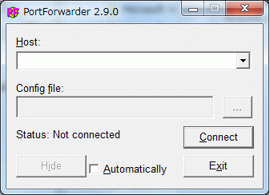
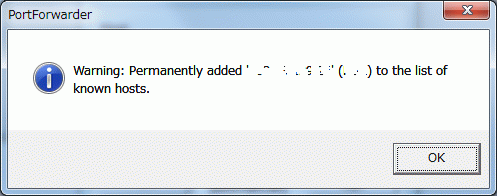
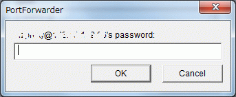

**注意**

追記をご覧あれ。

今年に入って始まったIPサイマル放送のradiko。ノイズが入らず高音質にラジオを聴けるとあって人気も高い。

ただ、これは東京と大阪のみ聴くことができるという視聴者からしてみたら訳のわからない制限がある。（法律や広告の兼ね合いによるものだけど）

2chでは一部の人がプロクシを作ったりしてエリア外から聴けるようにしていたけど、DDoS攻撃にあったりradiko側でIPアドレス制限をしたりしてサービス終了してしまうなどなかなか安定して使えない。

ならば自分で設置してみようじゃないかといろいろやってみた。

まず最初に始めたのはStoneを利用したポートフォワーディング。

[このサイト](http://padoo-padoo.blogspot.com/2010/03/radiko.html)を参考にStoneを設置して動かしてみるもあえなく撃沈。うまく動かなかった。

次にxinetdを利用してみた。

いろいろいじって聴けるようになったと思ったものの、ほかのプロクシが入っていたから聴けていただけで、実際のところは機能していなかったことが発覚。無念。

次にOpenVPNを入れてやってみようとしたものの、証明書など入れ方がいまいちわからず撃沈。

あきらめていたものの、たまたま今日ほかのようで検索していたら[このサイト](http://tomocha.net/diary/?201005a#201005043)を発見。

SSH PortForwarderというソフトを利用してradikoが聴けるらしい。

まずはSSH PortForwarderをダウンロードして適当な場所に展開。今回はProgram Filesに展開した。

これが起動したときの画面。

 

ここでConfig fileの･･･ボタンをクリックしダイアログを開いて、設定ファイルを読み込む。

設定ファイルはサイトに書かれているものをコピペして(追記 最新版はこの記事の下)、HostNameとUserを変えるだけ。

 

読み込んだらHostの▽をクリックしてradiko.jpを選択（デフォルトの場合）

選択したらConnectをクリック。

 

SSHのUnknwon Hostがどうのとでるのではいをクリック。

 

OKをクリック。

 

指定したユーザのパスワードを入力してOKをクリック

 

あとはHostファイルに

```
127.0.0.1 radiko.smartstream.ne.jp

127.0.0.1 www.radiko.jp radiko.jp
```

と書いておけば何も間違えていなければポートフォワーディングされて無事にエリア外でも[radiko](http://d.hatena.ne.jp/keyword/radiko)を聴くことができるはず。

無論サーバが東京もしくは大阪に無ければ聴けないけども。

XREサーバなら大阪の放送が聴けるのかな。でも共用サーバーだと他の人に迷惑がかかる可能性もあるからおすすめはしないかな。

これならサーバの設定をいじることなく（SSHサーバが動いていなかったり、適切なユーザがない場合は除く）radikoに接続ができて便利。

後は対策されないことを祈る。

追記＠19:45

このままだとradikoに接続しないまま一定時間がたつとSSHが切断されてしまうことに気づいた。

これを迂回するには設定ファイルに
```
TcpKeepAlive yes  
ServerAliveCountMax 5  
ServerAliveInterval 60
```
なんて呪文を書いておくと切断されない予感。

さらに追記＠07/11  

XREAで試してみたらやはり大阪の放送が聴けた。

共用サーバではほかのユーザーに迷惑がかかりかねないのでやるならば大阪にサーバを置いているVPSや専用サーバを利用するしかないかな。

追記×3  

ともちゃ日記さんところの設定だと繋がらなくなってしまった。

[２ちゃんねるのレス](http://toki.2ch.net/test/read.cgi/am/1291251411/87)で有効なIPアドレスを知ることができたので、私の今の設定と一緒に貼り付け。
```
Host radiko.jp（PortForwarderに表示されるタイトル）
HostName サーバーのIPアドレス
Port SSHのポート番号
User ユーザー名
TcpKeepAlive yes
ServerAliveCountMax 15
ServerAliveInterval 80
# radiko.smartstream.ne.jp
LocalForward 1935 219.103.34.224:1935
LocalForward 80 219.103.34.224:80
# www.radiko.jp
LocalForward 80 219.103.34.226:80
LocalForward 443 219.103.34.226:443
LocalForward 8935 219.103.34.226:8935
LocalForward 8936 219.103.34.226:8936
LocalForward 8937 219.103.34.226:8937
```