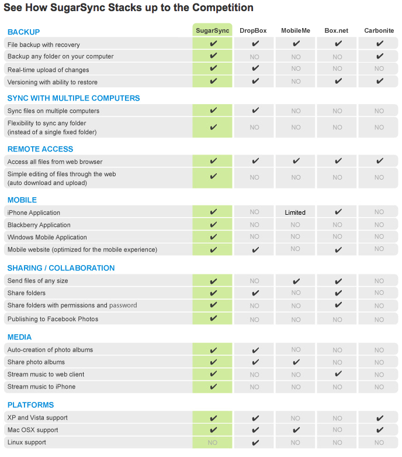

日本語化を契機に[Dropbox](https://www.dropbox.com/referrals/NTEwMDExODA1OQ)から[SugarSync](https://www.sugarsync.com/)に乗り換えたのだけど、結局[Dropbox](https://www.dropbox.com/referrals/NTEwMDExODA1OQ)に戻ってきてしまった。

どちらもネットワークを利用してファイルを同期するオンラインストレージ型の同期サービスだけども、機能面で少々違いがある。

[SugarSyncのHP](https://www.sugarsync.com/)によればこんな感じ。

[Dropbox](https://www.dropbox.com/referrals/NTEwMDExODA1OQ)から[SugarSync](https://www.sugarsync.com/)に切り替えたのは、[SugarSync](https://www.sugarsync.com/)は自由に同期するフォルダが選べたこと。

[Dropbox](https://www.dropbox.com/referrals/NTEwMDExODA1OQ)はマイドキュメントのMy　Dropboxフォルダ内のみを同期するのに対し[SugarSync](https://www.sugarsync.com/)は設定すればどのフォルダであろうと同期ができる。

私の使い方だとSleipnirとThunderbirdの設定フォルダをいちいちシンボリックリンクで同期していたのでそのあたりの手間が省ける。

また、Windows Mobile用のソフトがあったのも魅力だった。

というわけで移行してみたのだけれど、いくつか問題が。

私の環境だけなのかもしれないけれど、ファイルがなかなか同期されなかったり、ファイルがすぐに競合してしかも消してもすぐに復活してしまう、私の通う大学のネットワーク上ではローカルプロクシを噛まさないと同期してくれないなど困ることが多々あった。

利点であった任意のフォルダを同期できるという機能もさほど使うことなく、ただただ不満が募るばかり。

というわけで結局パソコンのOS再インストールを契機に[Dropbox](https://www.dropbox.com/referrals/NTEwMDExODA1OQ)に戻ることに。

こちらのほうが私には性に合うみたい。

というわけでこれから[Dropbox](https://www.dropbox.com/referrals/NTEwMDExODA1OQ)を使う人は下のリンクから登録してくださいな。私にもあなたにも容量が250MB増えますので。

https://www.dropbox.com/referrals/NTEwMDExODA1OQ