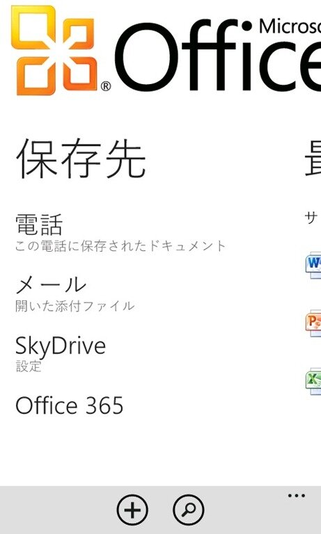
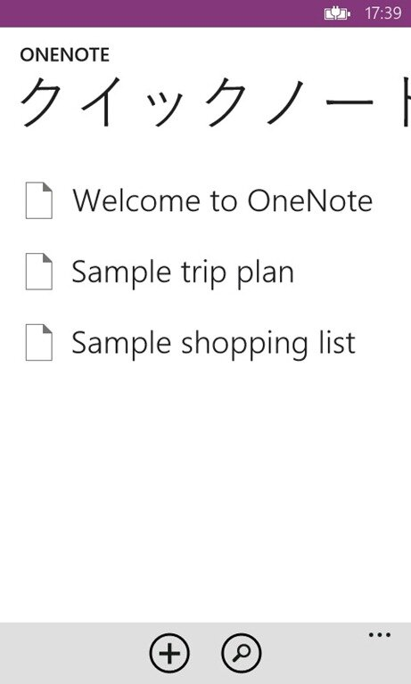
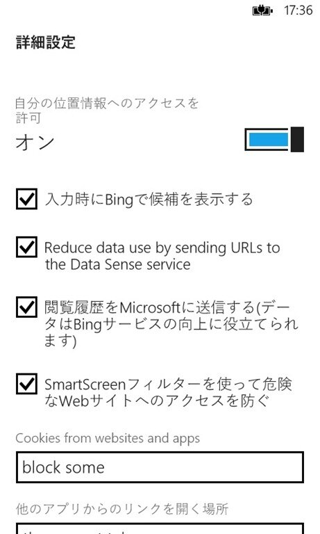
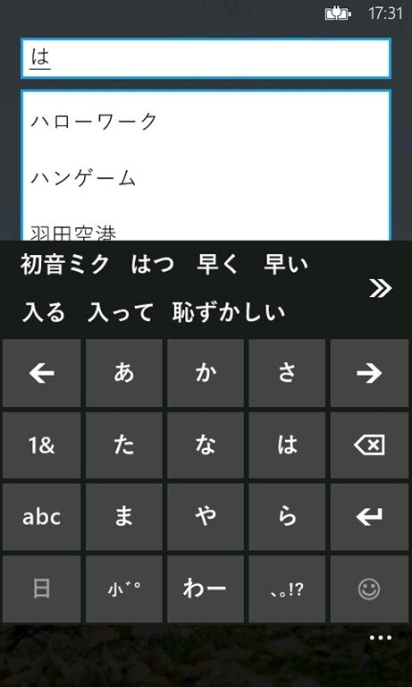
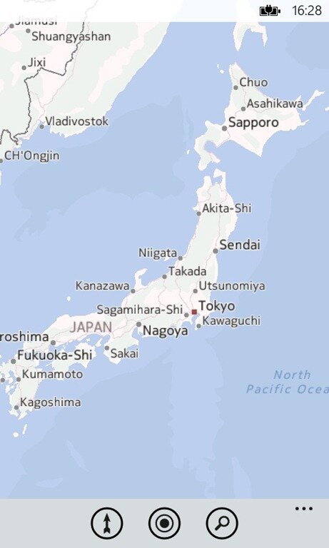
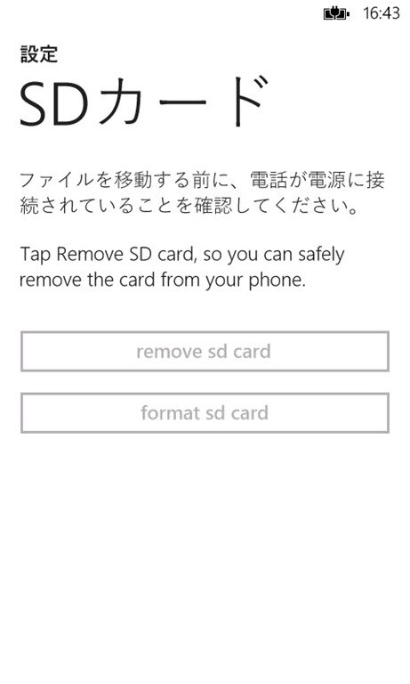
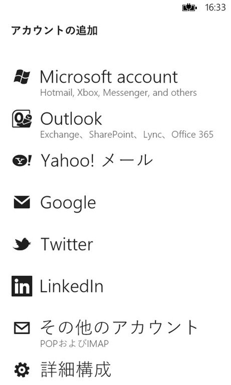

Windows Phone 8が来月にでるというわけですけどもまだまだ全貌は隠されています。

ただ先日Windows Phone 8のSDKが流出する出来事がありました。

私自身はそのSDKを入手することはなかったのですがその中に入っていたエミュレータのスクリーンショットが流出してまして。  
[日本語のスクリーンショット](http://pinterest.com/pokedev/wp8-beta/)もありましたので[SSを撮った方](https://twitter.com/poke_dev)に許可を取った上でこちらに転載。

 
 

まずはスクリーンロック画面。

背景にbing壁紙を指定できるようになったようです。   
毎日変わるので良いですね。

 

スタート画面。すでに公表されているようにタイルの種類が増えました。

長タップして大きさを変更できるようになっています。   
Tangoでタイルフォルダが搭載されるなんて噂がありましたが（タイル型ランチャーのような物）こういう形で対応するようですね。

 
 

アプリケーションのリスト画面は7.5までと全然変わらないですねぇ。

ただいくつか新しいアプリが見受けられますね。

新しいOffice。私はあまりOfficeを利用していないので違いがいまいち(ノ∀｀) 

 
 
 

 
 
 

文字入力もほとんど変更がないようです。絵文字が増えたとかどうとか。   
Unicode6.0に対応したんでしたっけ・・・？あと8[半]が二つあるのはなぜ・・・？ 

 
 
 

 
 

WP7.5の段階であったものの日本語環境では利用できなかった音声認識がどうやら日本語環境でも使えるようになるようですね。 

 
 

WP8ではIE10が搭載されます。どうやらWP7.8では[IE10が載らないようですね](http://ggsoku.com/2012/08/windowsphone8-features-7-8/)。   
IE10の設定画面。  
アドレスバー左側のボタンはこの設定で変更できます。

 
 

bing検索。  
これまでウェブ検索と画像検索の二つがありましたが画像検索がメディア検索となり動画も検索できるようになったようです。  
また設定を変更することで検索情報のフィルタもかけられるようになっています。

 
 
 
 
 

通信料モニターという新しいアプリ。   
その名の通り3G/WiFiにおけるネットワーク通信量を確認できるようです。   
また設定を変えることでデータ通信量の制限などができるようになっているようです。   
パケットを気にする人にはうれしい機能ですね。   

 
 
新機能の一つ、ウォレット。  
クレジットカードやクーポン、旅客機搭乗券といったデータを、通信事業者提供のセキュアなSIMカードのメモリ領域に格納することが[できるそうです](http://k-tai.impress.co.jp/docs/news/20120621_541563.html)。  
[キャリア決済も利用できる](http://internet.watch.impress.co.jp/docs/news/20120621_541562.html)ということで期待が高まります。

 
 

地図機能も機能面では非常に強化されるようです。   
特にオフラインマップが利用できるようになるのはありがたいですね。ただやっぱり地図が酷い。ほんとここは何とかしてくださいよ・・・。   
機能を追求するのは非常に大事なんですけど・・・。 

 
 
 
 
 

メッセージング。  
添付ファイルで連絡先も送れるようになっていますね。  
これは地味に便利なのでありがたい。

 
 

ストアの設定画面。

Marketplaceから名前を変えるみたいですね。この設定を見た限りアプリ購入に対するパスワード制限をかけることができるようです。これで子供がむやみやたらとアプリを購入すすることができなくなって親も安心ですね。

 

音楽、動画、画像ファイルの保存先を変更できるようです。また、SDカードの取り出しボタンとフォーマットボタンが確認できます。 

 
 
 

タップして送信。   
名前だけ聞いたら何のこっちゃという感じなんですがこれはNFCを利用して他の端末と写真や連絡先を共有する機能のようです。

 

アカウントの追加画面。

これまでWindows LiveであったところがMicrosoft accountになっています。  
Liveの終焉を感じさせます。

 

ロックスクリーン。

前述したように壁紙にbingを選べるようになっているほかロックスクリーンから直接アプリケーションを起動できるようになっているようです。

 
 

個人的に一番うれしい機能、バックアップ。   
これまでバックアップができなかったので大変だったんですよね。   
特にアプリの再インストールはReinstallerで一つ一つインストールし直した後一つ一つ設定をするというのが面倒で・・・。

 
 
 
 

以上流出したSDKエミュレータのスクリーンショットでした。   
他にも新機能があるようなので非常に楽しみです。