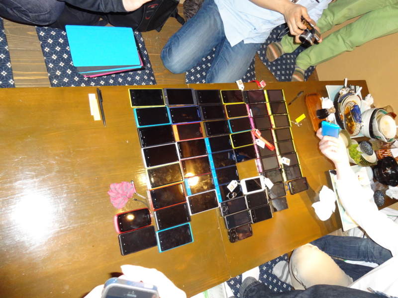

いつまでたっても日本で発売されないWindows Phone。

業を煮やしたWindows Phoneファンが署名を始めました。

> 日本でauから発売された唯一のWindowsPhone7端末IS12Tが発売されて、もうすぐ2年が経ちます。

プラットフォームとしては一部を除き日本ローカライズが既にされているのに「売れる見込み＝需要」が見えないからキャリアが採用しないというのが一因だと思います。

じゃぁどれくらい待ち望んでいる人がいるのか可視化してみようということで署名を募ってみます。

賛同して頂ける人はコメントよろしくお願いします。

この署名を始めたのはいっちゅうさん。TrainTimeTableの作者さんです。

いっちゅうさんはこの間静岡県の草薙にある一部Windows Phoneクラスタの聖地、auショップ草薙の近所の居酒屋でオフ会を開催されまして、私も参加してきました。

 

このオフ会の二日後がauの夏機種発表会であり、ほんのちょっとだけ期待していたわけですが案の定Windows Phone 8搭載端末はなく。挙句

https://twitter.com/tezawaly/status/336357596292329472

なんていう話もありましてWindows Phoneクラスタは怒り心頭。署名運動に発展したのでありました。

署名ページでは目標1000人となっていますがより強くキャリアにお願いするためにもその数倍の賛同者を集めたいですね。

IS12Tが売れなかったがゆえに各キャリアが及び腰になっているのだと思いますが、たった一機種出した程度で決めてしまうのはあまりに惜しい。せめてあと2・3機種は出してほしいものです。

日本で出ないのはキャリアだけが悪いわけではなくさまざまな要因が複雑に絡まっているからだというのは分かっているんですけどね。MSは今[4社](http://jp.techcrunch.com/2012/06/21/20120620microsoft-announces-hardware-partners-ota-updates-and-something-special-for-enthusiasts/)（Nokia、HTC、Samsung、Huawei）にしかライセンスを提供していませんのでその4社以外からWindows Phone搭載端末が出ることはないんですが、Nokiaは事実上日本撤退、サムスンはAndroidとTizen押し。HTCには期待したいところですがなんかHTCという会社自体が消えそうなごたごたがあるみたいですし・・・。

MSとしてもできればグローバルに販売できるだけの力があるところにお願いしたいでしょうから日本国内のメーカーには海外でも十分訴求力のある端末がだせるようになってくれると嬉しいです。

MSには地図の改善やユーザー辞書の実装などユーザーが望む最低限の機能を早く実装するようこちらも強く求めたいですね。

### 追記

なんかスティーブバルマーが日本でもWindows Phone 8端末を出せるよう全力で取り組んでいると発言したそうで。

https://twitter.com/tezawaly/status/337434075398815744

まぁリップサービス何でしょうけど期待してしまいますね。