これまで録画マシン＝メインマシンだったのですが電力を結構喰う構成なのに24時間起動しっぱなしという非常に電気代がもったいない状況でした。  
さすがに一人暮らしで自分で電気代を払っていかねばならない状況でこれはちょっと辛いので録画マシンを別に作ることに。

とはいえ単なる録画マシンだけではちょっともったいないと思ったのでこの機会にESXiサーバーを構築し、その中で仮想マシンとして動く録画サーバーを稼働させることにしてみました。

今回利用するVMWare ESXiはハードウェア、とくにネットワークの制約が厳しいので注意が必要。Intel製のNICなら問題ないみたいです。CPUは仮想化サポートがないものは使えません。IntelだとVT-dですね。

24時間稼働させるのでできるだけ電力消費が少ないものにしたいと思い3570Tを選択しました。TDPが45Wとなかなか優秀です。できれば35Wと行きたいですけど性能との兼ね合いで断念。明日発売のHaswellはそのあたり期待できそうです。

1時間ほどで組み立ててESXiのインストールです。

今回はUSBメモリーにESXiをインストールしてみました。インストール自体はハードウェアが対応してないとかそういう問題がない限りはあっという間にインストールが終了するはずです。

起動したら黄色い画面になるのでF2を押して設定を変更しておきましょう。特にIPアドレスあたり。

ここからはvSphere Clientを利用します。

ESXiのISOイメージをダウンロードするついでにClientもダウンロードしてインストールしておきましょう。ESXいのバージョンとあってないものをインストールしても使えないので注意。

起動すると以下のような画面になるのでESXiサーバーのIPアドレスとユーザー名、パスワードを入力します。

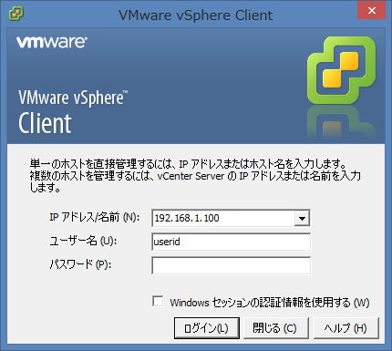 

初回時はセキュリティ警告が表示されますが気にしないで無視を選択しましょう。今後も表示させたくないなら

「この証明書をインストールし、「IPアドレス」に対するセキュリティ警告をすべて表示しない」

にチェックを入れておけばOKです。

ライセンスが切れるまであと60日というダイアログが出ますがあとで登録するのでOKを押して閉じてください。

vSphere Clientのメイン画面が表示されます。

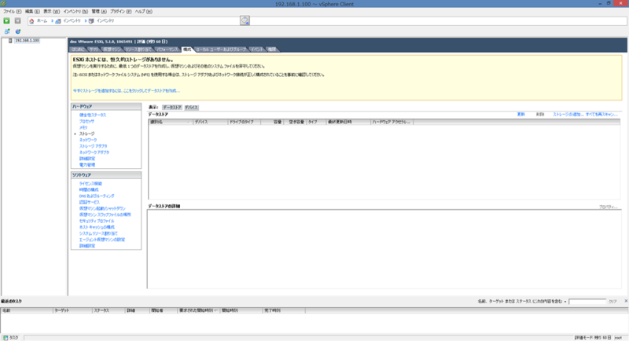 

まだ仮想マシンを設置するデータストア（データ領域）の設定が済んでいないためエラーが表示されています。

「今すぐストレージを追加するには、ここをクリックしてデータストアを作成」

をクリックするか構成タブ→ハードウェア→ストレージにあるストレージの追加を選択すると以下の画面が表示されます。

今回はESXiサーバーマシンに内蔵したHDDを利用するのでディスク/LUNのまま次へを選択します。

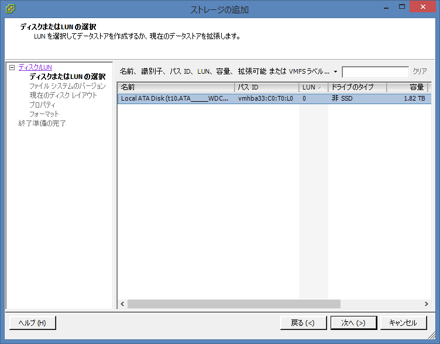 

利用するHDDを選択して（今回は一台しか搭載していないので一個しか表示されてませんが）次へ。

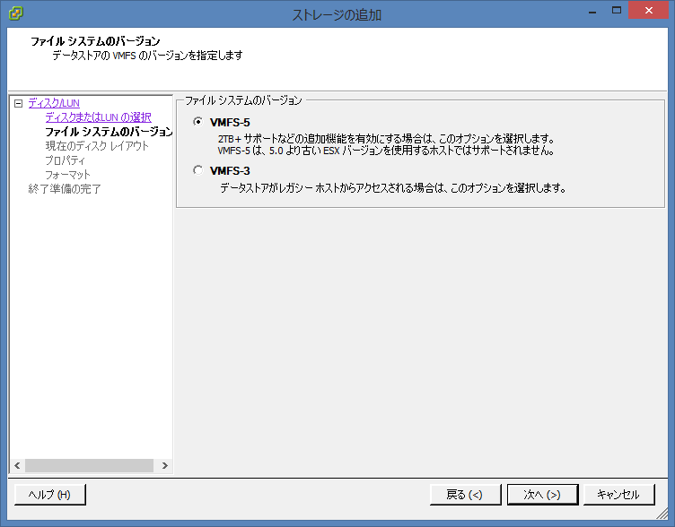 

データストアのファイルバージョンはVMFS-5のままで問題ないはずなのでこのまま次へ。

データストア名は後々のことを考えると短い名前のほうがよいかもしれません。

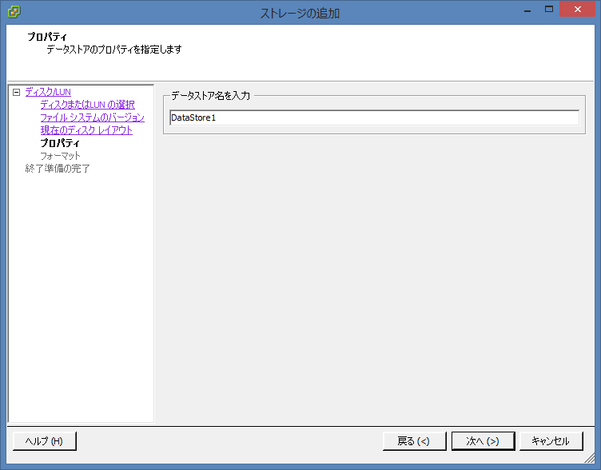 

ESXi以外には利用しないので使用可能な最大領域のまま次へ。

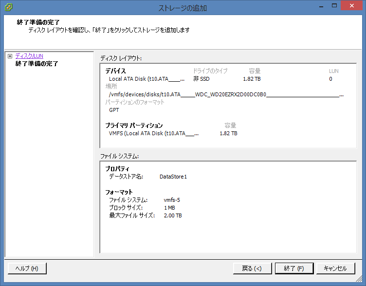 

設定に問題なければ終了を選択してください。データストアが作成されます。

データストアの作成が行われている間にESXiのライセンスを登録しておきましょう。

構成タブ→ソフトウェア→ライセンス機能を選択し、右上の編集をクリックします。

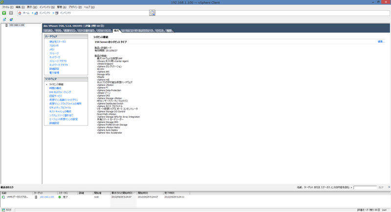 

以下のようなダイアログが表示されますので

このホストに新規のライセンスキーを割り当てる

を選択し、 キーを入力 ボタンからあらかじめ手に入れておいたライセンスキーを入力します。これでライセンスは有効になります。

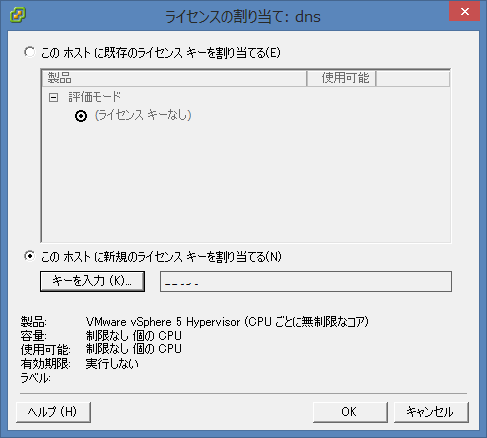 

とりあえず仮想マシンを設置するための下準備は終わったので仮想マシンを作成します。

左のIPアドレスが表示されているツリーを右クリックし新規仮想マシンを選択します。

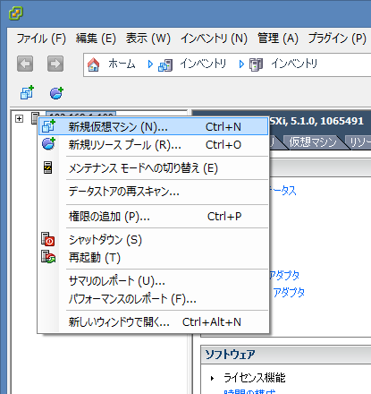 

構成は標準とカスタムから選ぶことができますが、あとから編集できるのでとりあえず標準で行きます。

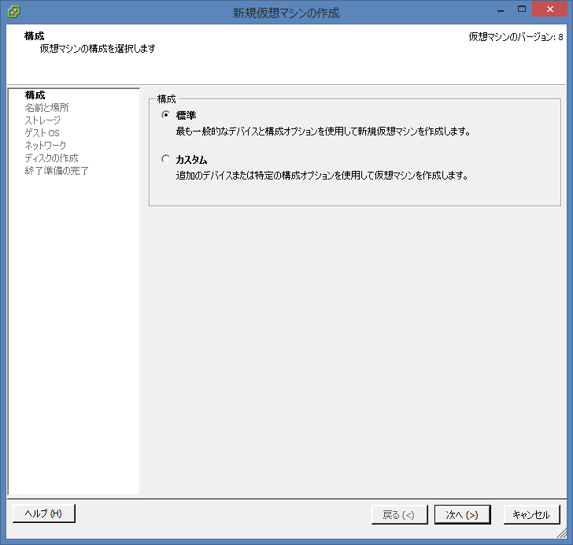 

仮想マシンの名前を入力します。VMwareの識別名になるので英数字だけにしておいたほうがよさそう。

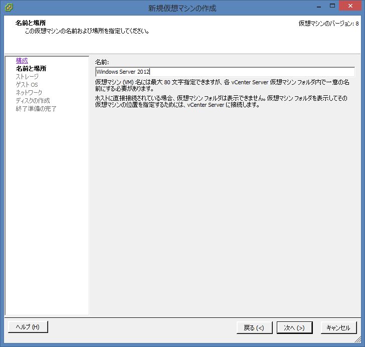 

仮想マシンの格納先は先ほど作成したデータストアしかないのでそのまま次へ。

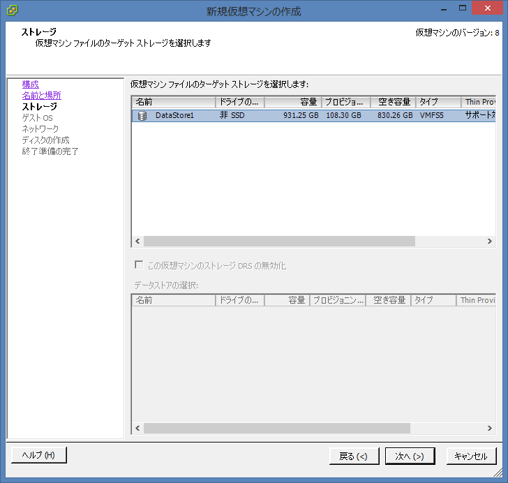 

インストールするOSの種類を入力します。ここで選択した情報はVMWare Toolsインストール時に判定材料として使われるらしいので正しいものを選択しましょう。

今回私はWindows Serverをインストールするので「Microsoft Windows Server 2012（64ビット）」を選択しています。仮想マシンの名前からある程度自動的に判定してくれますが若干違うときもあるのできちんと確認しておきましょう。

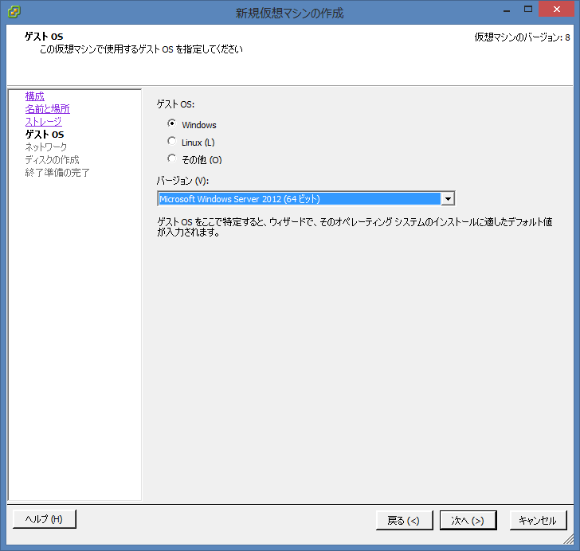 

ネットワーク接続の作成は私の場合NICが一つしかありませんし、よくわからないのでこのまま次へを選択。

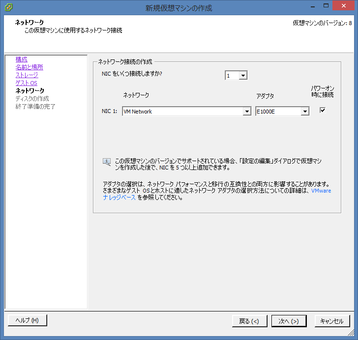 

仮想マシンの使用データ容量を入力します。三つ選択できる部分がありますが私はシックプロビジョニング（Lazy Zeroed）にしてます。ここの違いは[このサイト](http://shakaijin-life.net/2012/02/26/esxi5%E3%81%AE%E4%BB%AE%E6%83%B3%E3%83%87%E3%82%A3%E3%82%B9%E3%82%AF%E3%83%97%E3%83%AD%E3%83%93%E3%82%B8%E3%83%A7%E3%83%8B%E3%83%B3%E3%82%B0%E3%81%AE%E9%81%95%E3%81%84%E3%81%AB%E3%81%A4%E3%81%84/)が詳しい。

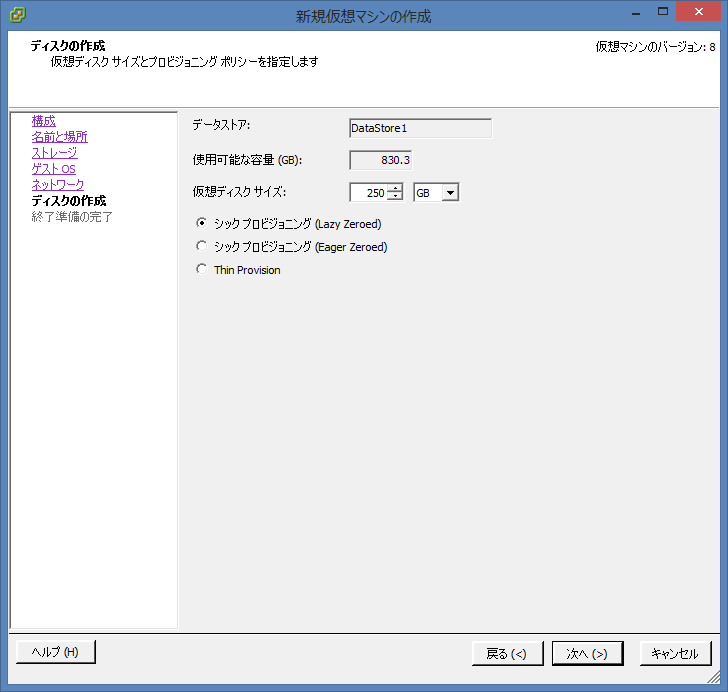 

これで仮想マシンの領域と設定が終わりました。終了を選択すると領域が作成されるので少し待ちます。

作成された仮想マシンは左のツリーに表示されます。右クリックして設定の編集を選択するとメモリーの割り当てサイズなどが変更できます。

それではWindows Serverをインストールします。

仮想マシンの電源を入れ、Windows Serverのイメージを読み込み普通にインストールするだけなのでここは割愛。

インストールが終わったらWindows Serverを起動します。

起動すると自動でサーバーマネージャが立ち上がります。役割と機能の追加を選択して

- .Net Framework 3.5
- Media Foundation
- デスクトップ エクスペリエンス

を有効にします。これでWindows Serverを普通のWindows 8のように利用することができます。

それでは録画環境を構築します。

まずこのままでは仮想マシンはPT3を認識してくれません。ESXiでPT3をパススルー設定してあげる必要があります。

まず構成→ハードウェア→詳細設定を選択し、パススルーの構成をクリックします。

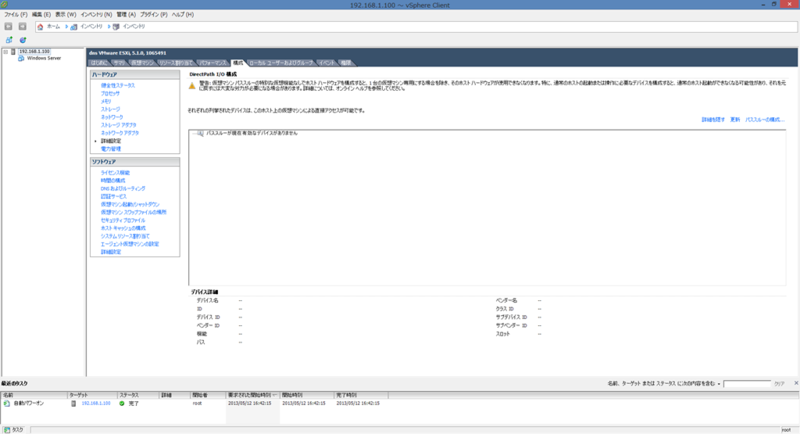 

以下のウィンドウが表示されたらUnknown マルチメディア デバイスにチェックを入れOKを選択します。

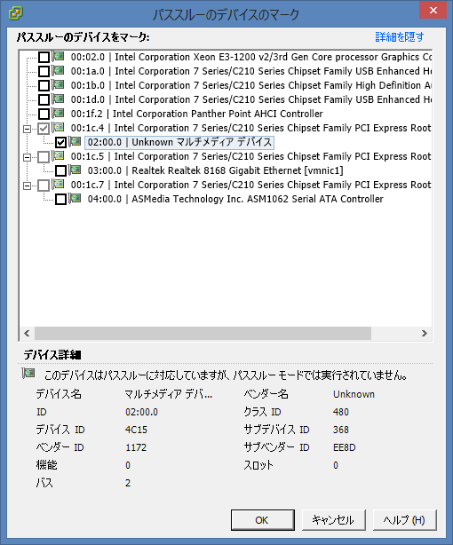 

これでESXiでPT3を触れるようになります。

次に仮想マシンからPT3を扱えるようにします。

まず仮想マシンが起動しているならシャットダウンをして、設定を開きます。

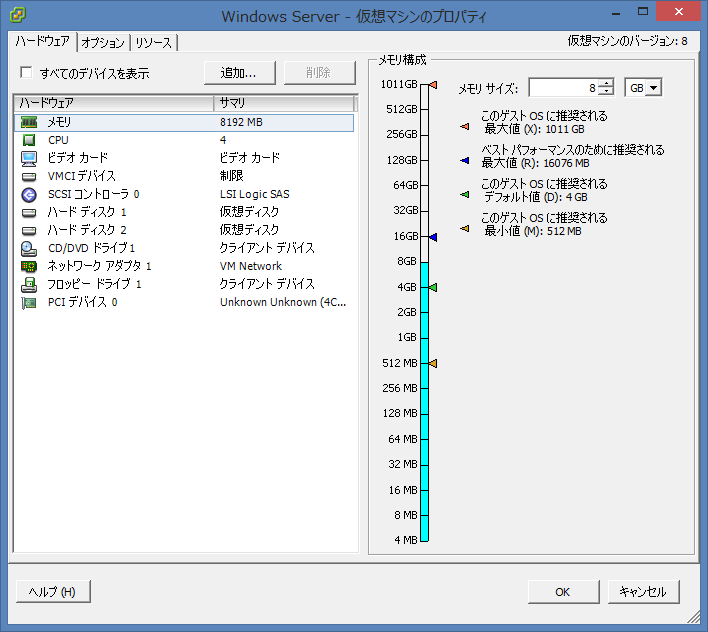 

追加ボタンを選択すると以下のような画面が表示されるのでPCIデバイスを選択して次へ。

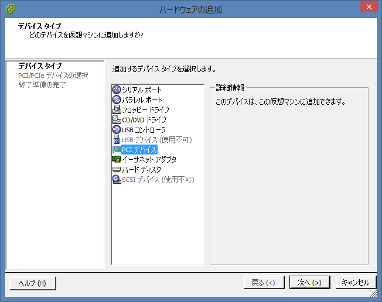 

ここはこのまま次へ。次の画面で終了を選択。

これで仮想マシン上でPT3が認識されます。あとは普通にWindows上からドライバやSDKなどをインストールするだけです。

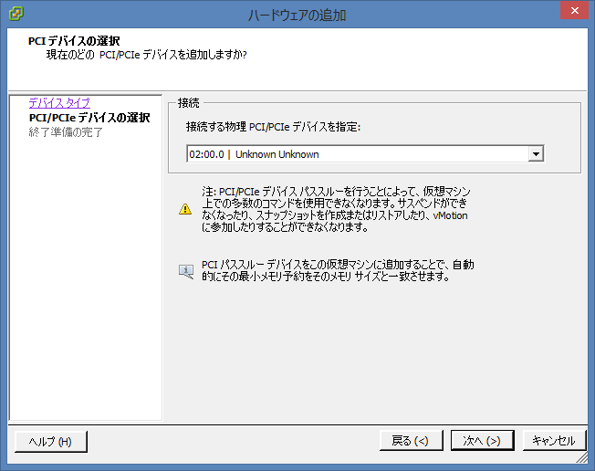 

SoftCasを使っているｱﾁｬｰな人やBonCasLinkを利用している人はともかくESXiマシンにUSBカードリーダーを接続して利用したいと思っている方はUSBデバイスのパススルーも行いましょう。

こちらは先ほどのハードウェアの追加からまずUSBコントローラを追加して、そのあとUSBデバイスを追加するだけです。これだけでUSBパススルーが行われます。あとはリモートデスクトップ時に切断されないようサービス化したりしてください。

さて、これで録画サーバーとしては完成しました。録画したファイルは保存されているフォルダをWindowsファイル共有でメイン機につなげればメイン機でも録画したものが見られます。ただ、このままだとメイン機からテレビを見ることはできませんし録画設定できないのでネットワーク越しに接続できるようにしておきましょう。

とはいってもVirtualPTとEDCBの機能をいじるだけです。

メイン機からテレビを見るようにするにはVirtualPT用のBonDriverのiniファイルを編集し、録画サーバーのIPアドレスを記入しておくだけです。それだけで視聴可能になります。

録画設定はEDCBに入っているEPGTimerNW.exeを利用するだけ。起動するとサーバーIPアドレスとポートを記入する画面が表示されるので録画サーバーのIPアドレスとあらかじめ録画サーバーで起動しているEDCBの設定に記しておいたポート番号を入力し接続を選択するだけ。これで録画サーバーにあるEDCBをメイン機から制御できます。ちなみに私の環境ではEPGTimerNWを管理者権限で実行しないとうまく動きませんでした。たぶんProgram Filesにおいているのが原因です。

### おまけ

ついでなのでradikoを録音しようと思ったのですが標準状態だと単純にradikaをインストールするだけでは駄目だったのでメモ。

Windows ServerではInternet Explorerの設定が厳しくなっているため標準状態ではFlashが利用できません。

サーバーマネージャを起動してローカルサーバーのプロパティからIEセキュリティ強化の構成を選択し無効化してください。これでFlashが利用可能になります。

もちろんDirectX 9.0cは入っていないのでインストールしてくださいね。