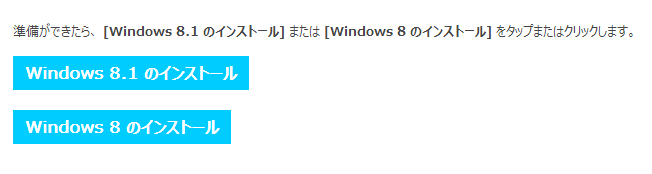
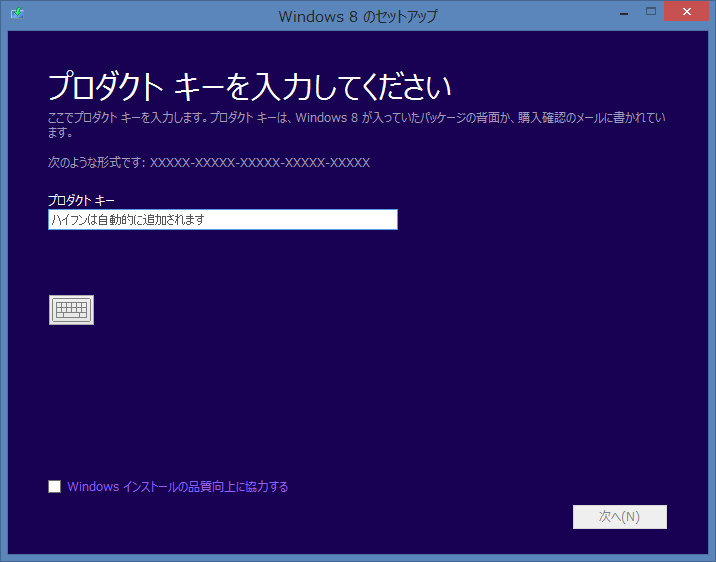
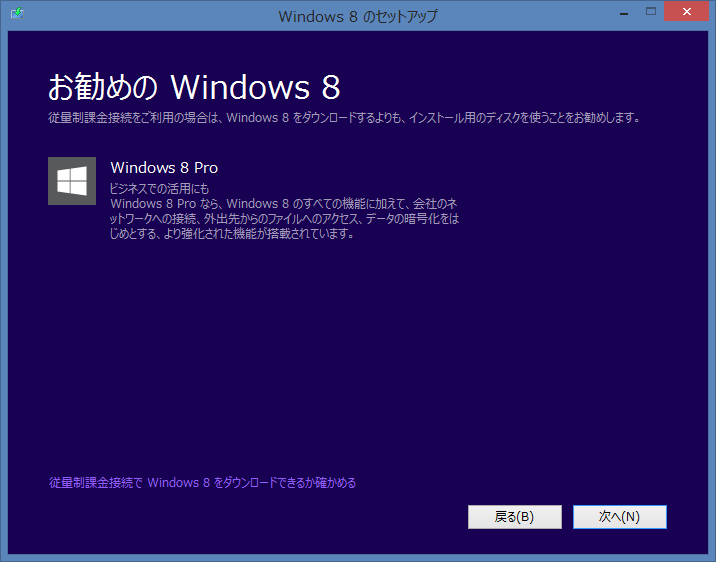
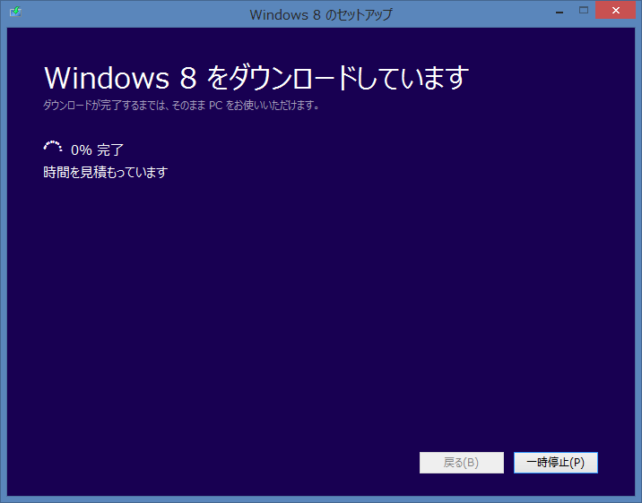
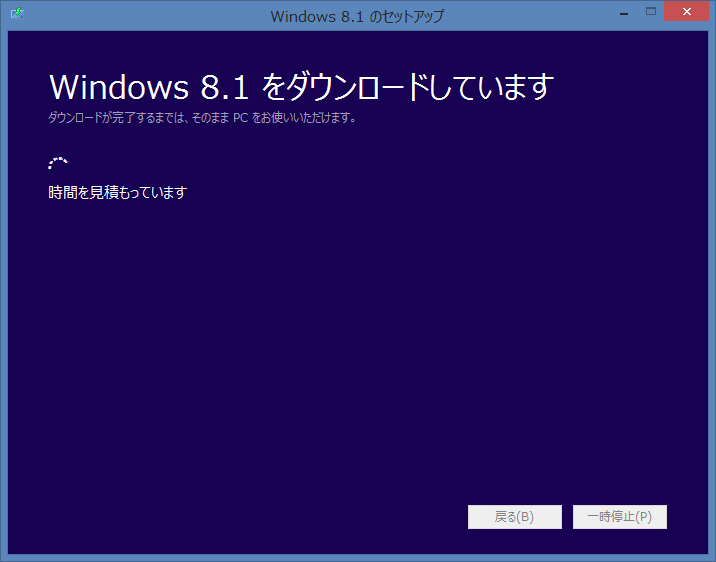
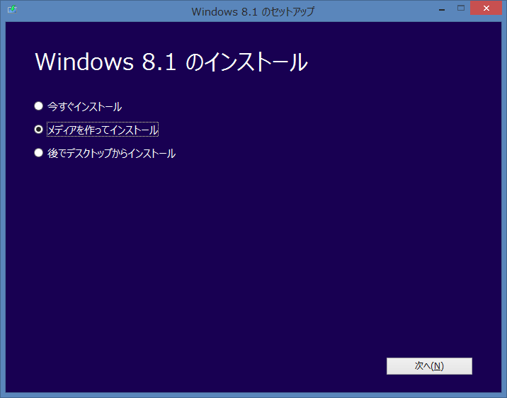
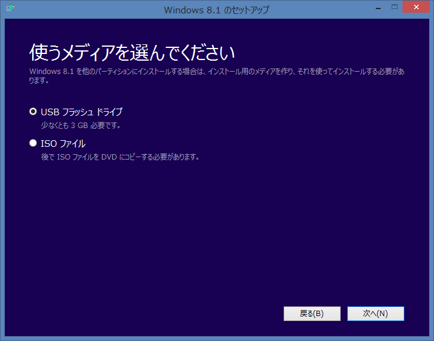
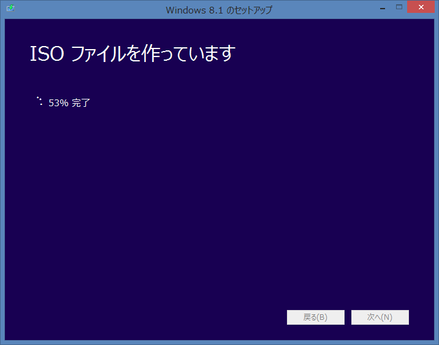
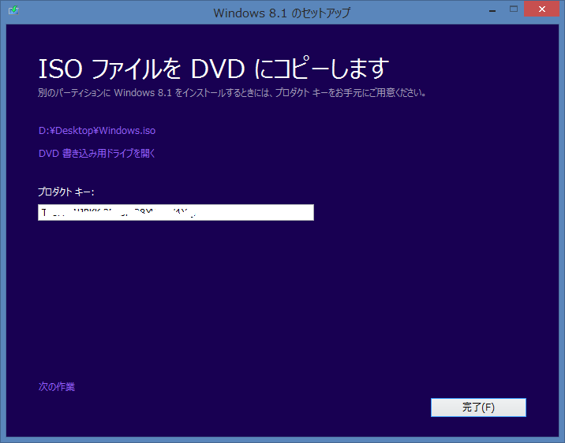
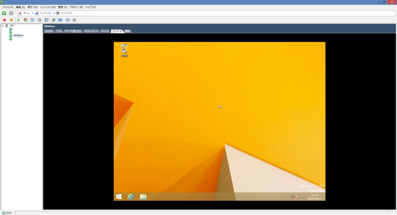

Windows 8.1公開されましたね。私の周りはMSDNやTechNetですでに使ってる人が多かったので非常に悔しい思いをしてましたがようやく使えます。

ただ現状だとWindows 8をアップグレードインストールで8.1にするかパッケージを買ってくるしかインストール方法がないようです。  
アップグレードインストールは余計なごみが残ったり誤動作の原因になることがあるのでできればクリーンインストールしたいところ。

MicrosoftがISOイメージを公開してくれればいいんですが、公開してくれる兆しがないのであきらめてました。そしたらCNETでISOイメージを手に入れる方法がのっていたので紹介。

まず[マイクロソフトのサイト](http://windows.microsoft.com/ja-jp/windows-8/upgrade-product-key-only)からWindows 8のアップグレードソフトをダウンロードします。二つともダウンロードしてください。

 

ダウンロードしたソフトウェアのうちWindows 8向けのソフト（Windows8-Setup.exe）を起動します。  
起動したらWindows 8のプロダクトキーを入力して次へを選択します。

 

次へ。

 

下の画面になったら×ボタンでソフトを終了してください。タイミングが遅れてダウンロードが始まると失敗します。  
もしもタイミングが遅れてしまった場合は  
- C:\Users\ユーザー名\AppData\Local\Microsoft\WebSetup\  
- C:\ESD\  
を削除してしまえばOKみたいです。

 

次にWindows 8.1向けのソフト（WindowsSetupBox.exe）を起動します。起動すると自動的にダウンロードが始まります。

 

ダウンロードが終了すると以下のような画面になりますのでメディアを作ってインストールにチェックを入れて次へ。  
の前にC:\ESD\Windows\Sourcesにei.cfgというファイルを作り以下の文面を記入して保存しておいてください。(２ちゃんねる情報)

> [EditionID]  
> [Channel]  
> Retail  
> [VL]  
> 0

 

今回はUSBメモリーにインストールするのではなくISOイメージを作るのでISOファイルにチェックを入れて保存。

 

 

これでWindows 8.1のインストールメディアが完成します。あとはDVDに書き込んでしまえば終了です。

 

ためしに作成したイメージでブートしてみましたがちゃんとWindows 8.1がインストールできました。

 

ei.cfgでインストーラをごまかすなど、ライセンス面で問題がないかちょっと気になりますが。。。