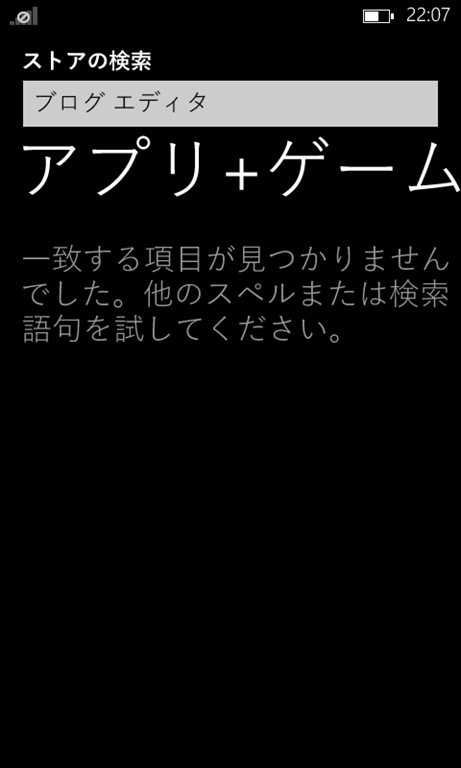
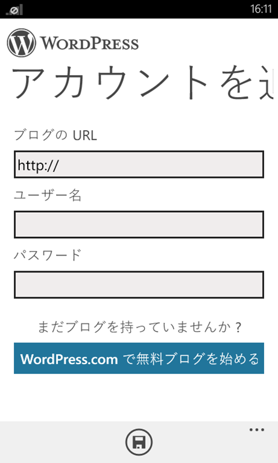
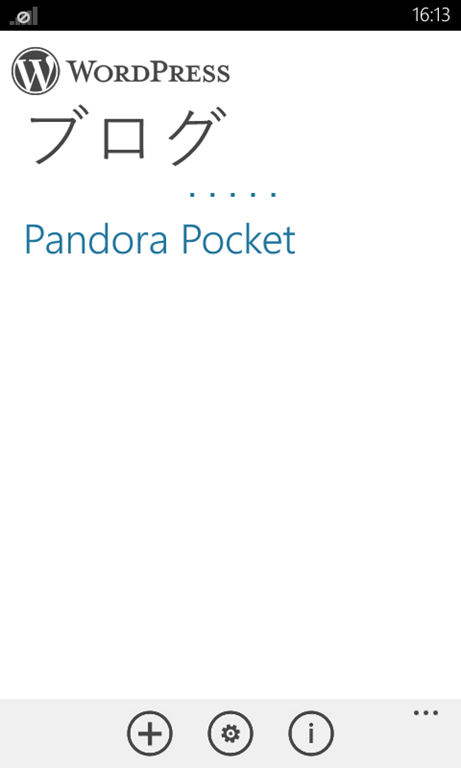
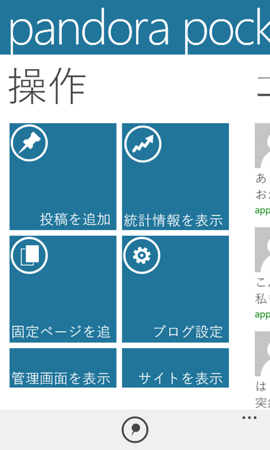
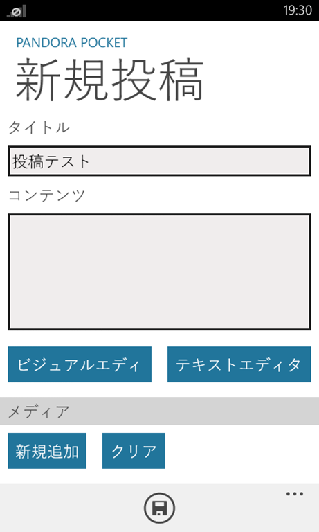
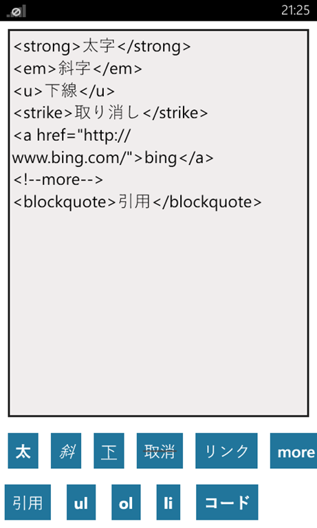
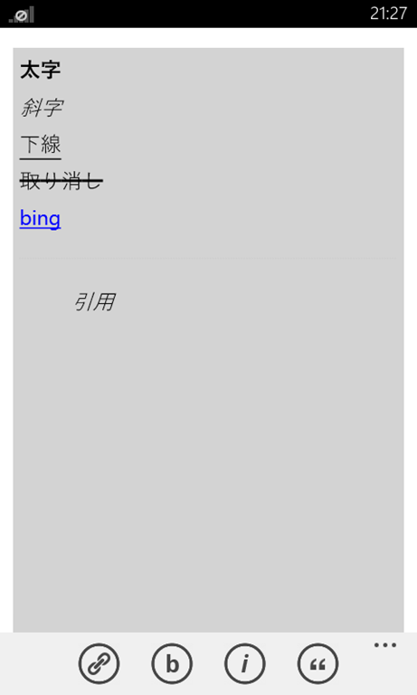
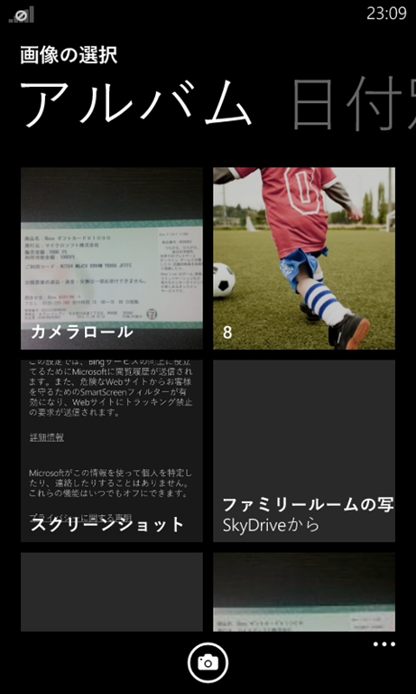
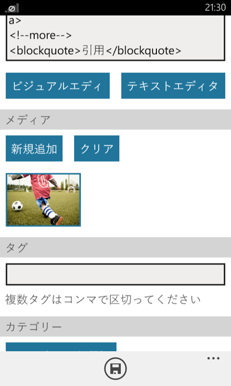

[Windows Phone Advent Calendar 2013](http://www.adventar.org/calendars/201)第四日目の記事です。

タイトルからして出落ち感が漂いますがつまりはWindows PhoneでWindows Phoneに関する記事をWordPressアプリを使ってWordPressに投稿してみたってだけです。はい。

毎日コツコツとブログを投稿している人ってどうやってるんでしょう。

私は不精で特にネタがない場合はおろかネタがあってもブログを書かなかったりするので、日々ブログに様々なネタを投稿されているTwitterのフォロワーさん割と尊敬してます。

ブログってあくまでWeb上に残すログなので別に無駄に凝る必要はないですし、思ったことをつらつら書けばいいと思うのですが、ネタができてもパソコンを立ち上げてブログを開いて記事を書いて・・・というのが割と面倒でして。

そんなわけでもうちょっとブログの更新ペースを上げようかなと思い立ちWindows Phoneにブログエディタアプリをインストールしようとストアで検索してみました。

 

はい。

この単語では検索してもでてきませんね。（涙）

・・・そんなのはどうでもよくて探した限りで一番まともなのはWordPress.comを運営しているAutomattic社のWordPressアプリでした。

 

WordPress.com専用というわけではなくWordPressさえ設置していれば問題なく使えるようです。

 

まずはアカウントを登録します。

WordPress.comのアカウントではなく自分のブログのユーザー名とパスワードを入力します。ブログのURLには自身のブログのトップページのURLを入力してください。

 
 
ログインに成功すると自分のブログのタイトルがリストに表示されます。このアプリ一つで複数のブログを管理できるようです。

もっとも複数ブログを開設してる人ってあまりいない気もしますが（汗

 

まずは新規に記事を投稿してみます。

このアプリはビジュアルエディタ（いわゆるWYSIWYGエディタ）とテキストエディタが利用できます。

 

これはテキストエディタ。

下のボタンをタップするとHTMLタグが挿入されます。リンクコードに関しては画面が遷移してURLとタイトルを入力することで挿入されます。

 

ビジュアルエディタだとこんな感じ。

文章を選択して各ボタンをタップすると選択された文字が装飾されます。

アプリケーションバーをタップすればそのほかの装飾機能が表示されます。

 
 
 

画像の挿入も可能です。

新規追加ボタンから画像を選択し、表示された画像をタップすると詳細画面に飛びますのでそちらから本文に挿入できます。挿入先は本文の前か後どちらかのようです。

実際にこのアプリで記事を書いてみました。

* [xboxギフトカードでWindows Phoneアプリを買ってみた](https://blog.hitsujin.jp/entry/2013/12/03/131202)
* [Windows Phoneストアにお願いしたいこと](https://blog.hitsujin.jp/entry/2013/12/03/151200)

なお、画像の挿入はパソコンでやってます。残念ながらこのアプリでは画像の詳細な設定ができなかったので。

また、バグだと思われますが長文だと途中で表示されなくなる問題が発生しました。

このアプリほかにも投稿されたコメントを見たりアクセス解析を確認できるようです。（アクセス解析はWordPress.comユーザーだけ？JetPackを入れてみてもだめでした）

残念ながらほかのプラットフォームにあるような高性能なものではありませんが、気軽にブログに投稿したいという需要はそれなりに満たせるかと思います。

私と同じく筆不精な方は試しにインストールしてみてはいかがでしょうか。

### 追記

フォントが中華フォントで非常に残念・・・。