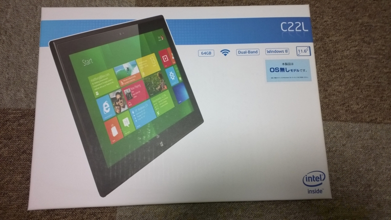
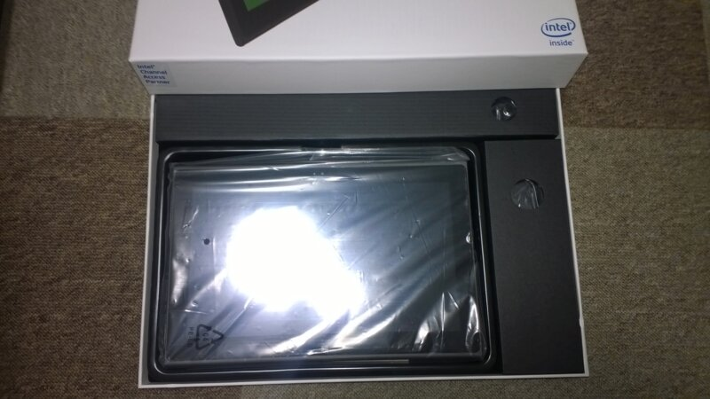
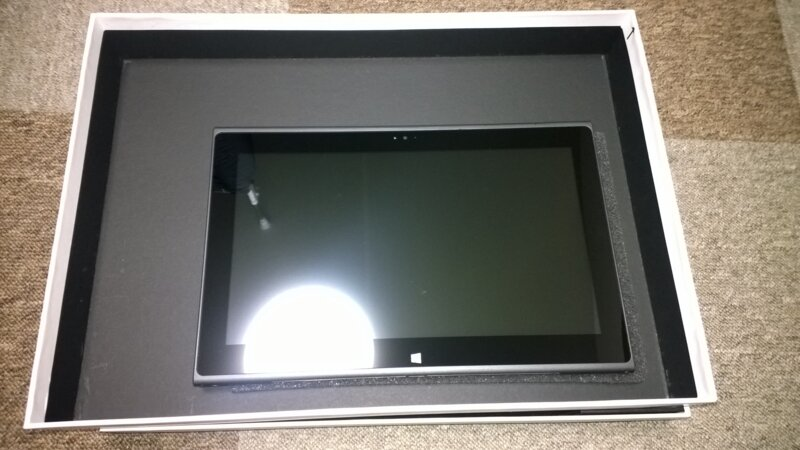
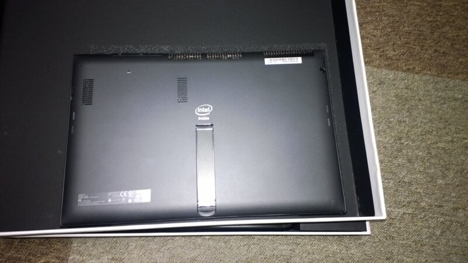
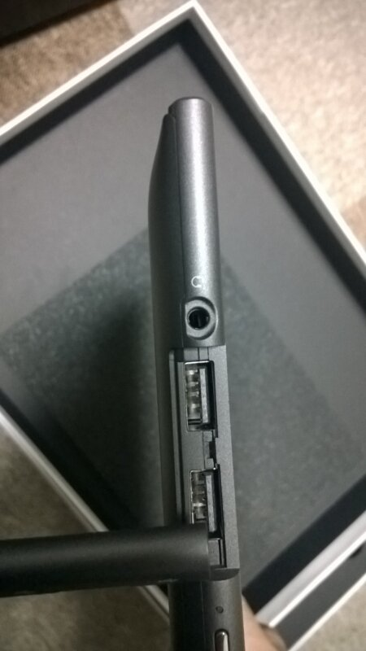
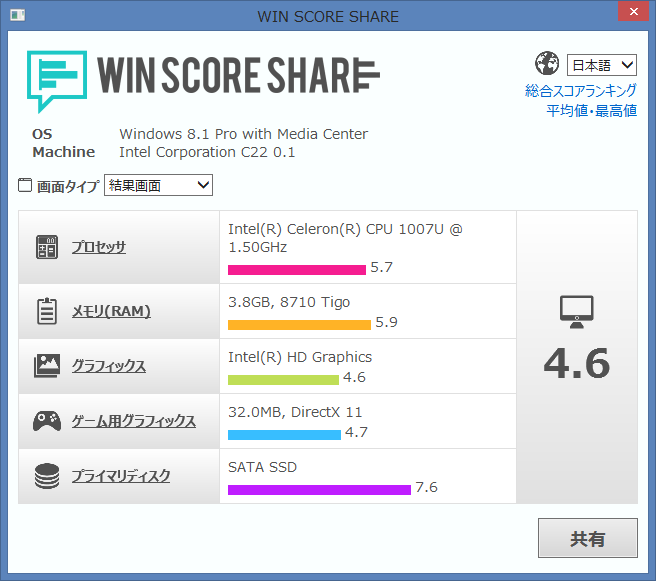

SurfaceとかWindows 8搭載のタブレットPC欲しいな～と思いつつそんな金がなかったのですがこんな記事があったので思わず購入してしまいました。

Win 8対応の11.6インチタブレットが29,800円で販売中 （取材中に見つけた○○なもの） - AKIBA PC Hotline!
http://akiba-pc.watch.impress.co.jp/docs/wakiba/find/20140228_637595.html

C22L。  
普通のタブレットPCはOSがちゃんと搭載されているものですがこのタブレットはOSレスモデル。  
昨年発売した当初の記事を読んだときは47000円もしていたので眼中になかったのですが3万円なら手が届く距離。OSそのものはストックがあったので問題ありませんでした。

秋葉原のお店が数量限定価格で販売していたので手に入らないかなと思っていましたが[@YoshihiroOkabe](https://twitter.com/YoshihiroOkabe)さんのおかげで無事ゲットできました。岡部さんありがとうございました！

外箱はこんな感じです。  
 

箱を開けるとこんな感じ。
 
袋から取り出してみたところ。

 

背面。

 

USB端子はカバー付きで二つ。

 

手持ちのWindows 8.1 Proをインストールしてみました。
このタブレットUEFIじゃなくてBIOS搭載してるみたいなんですけどそれでも起動は6秒程度でした。BIOSの皮をかぶったUEFIなんですかね。

8.1からはエクスペリエンスインデックスがなくなってしまいましたけどコマンドプロンプトからいけるので値だけはわかります。
測定結果はこんな感じでした。

 

タッチ感度は安いタブレットの割にまぁまぁいい感じなのですがたまに反応が鈍ることも。とはいえ思っていたよりは使える印象です。  
バッテリー100％の段階での残り時間は7時間との表記でしたが実際に使った感じ4時間持てばいいところかなという印象です。

私はこの端末を持ち運ぶつもりは特になく、普段録画していたテレビ番組の視聴とストアアプリの開発に使おうかと思っていたので問題ないですがそうじゃないならHaswell搭載の端末を買ったほうが幸せになれるかと思います。  
OSを持っていてかつそれなりに持ち歩かないなら比較的お安いのでお勧めです。