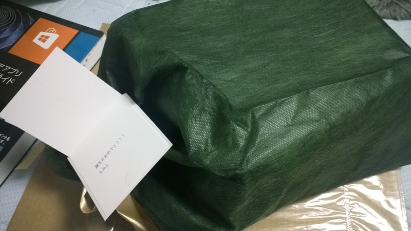
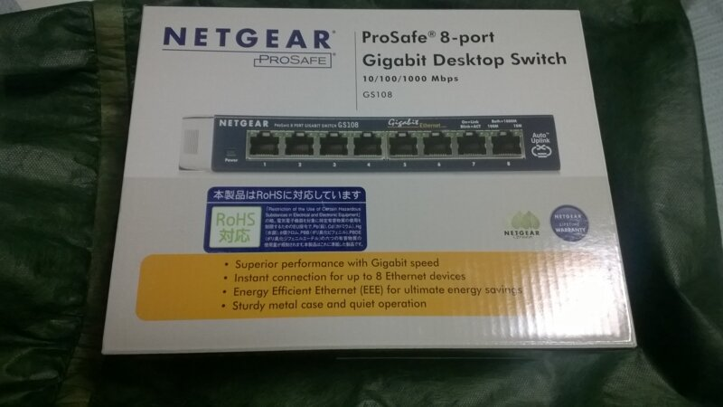
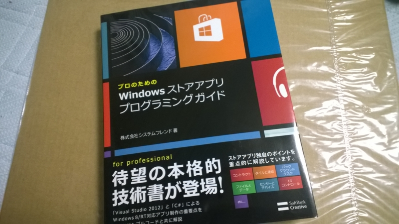
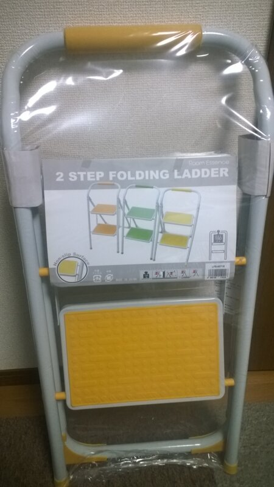
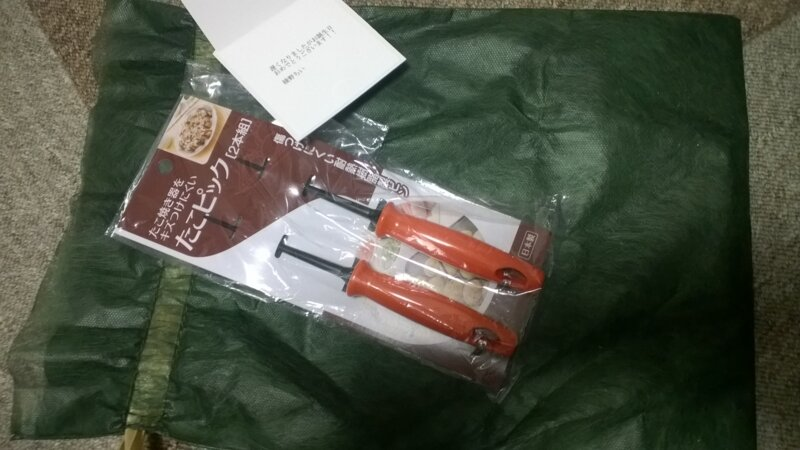

3月11日は誕生日でした。  
早いものでもう23歳です。22歳は学生最後の歳であり社会人最初の歳であったわけですがあっという間に過ぎてしまいました。  
予定ではもっと勉強会に参加したりアプリ作ったりする予定だったのに結局なあなあになってしまいちょっと消化不良な歳でもありました。  

社会人一年生から少しは成長して少し余裕が持てるようになってきたのでこれからはもう少し取り組んでいきたいと思っています。  
2年ほど前からドメインだけ取得してまだ構築できていないWindows PhoneのサイトもWP8端末が日本で出るかもしれない今年こそは立ち上げたいですね。  

以上抱負です。

続きましていただいたプレゼントについて。
今年は[Amazonの欲しいものリスト](http://www.amazon.co.jp/registry/wishlist/1MWF7SLKI5LI3/ref=cm_sw_r_tw_ws_j4Whtb1H7KF0D)を公開してプレゼントを募るやらしいことをしたわけですが、いくつか着弾いたしましたのでお礼を兼ねてこちらで紹介させていただきます。

まず[もみんさん](https://twitter.com/mominosin)からいただいたのはネットギアのスイッチングハブ。
まさかのギフト包装で届きました。
 
 

今はルーターとパソコンが直結しているのですがいい加減アレなのでESXiサーバーを拡張するついでにこれを利用して自宅内ネットワーク環境を整えたいと思います。

次にこちら。
 

シーラカンスさんが執筆されたWindows ストアアプリの開発本です。
先月レビューさせていただいたポケットリファレンスともども今年こそはストアアプリを提出できるようしっかり読んで勉強したいですね。。。。
~~ところでこちらは宛名もなくどなたからいただいたのかわからないのですが名乗り出てくださいませませお礼を言いたいです。~~ [すてねこさん](https://twitter.com/suteneko1027)でした！ありがとう！

追記
さらにプレゼントをいただきました。
 

こちらは[太田さん](https://twitter.com/ichiohta)からいただきました。これで踏み台昇降の運動して痩せたいと思います（（（

最後は綾野ちいさんから。
 

載せてない物が届くというのは或る意味欲しいものリストの醍醐味ですね（白目
たこ焼き器を持って無いのでどうやって使おうか・・・。
