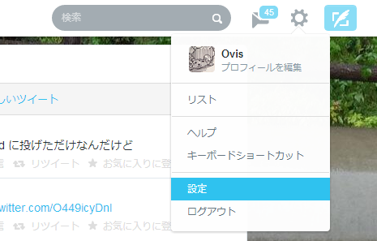
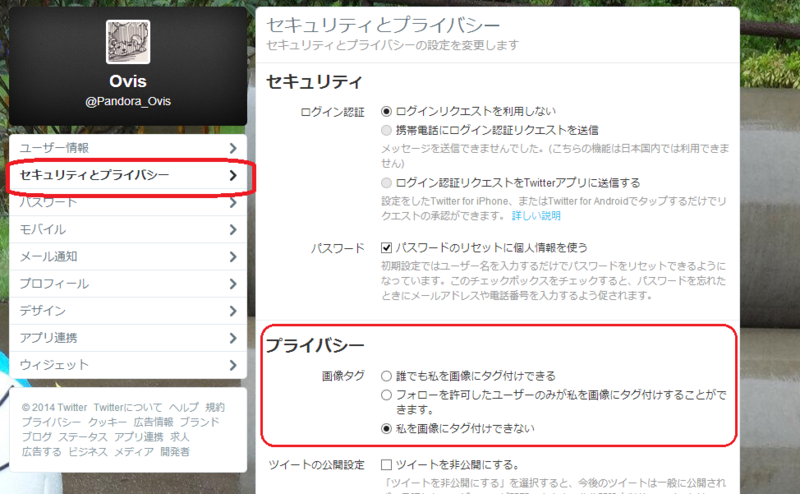

ウェブサービスってのはある程度成熟してくるとユーザーからしたらよくわからない機能を実装してくる気がするんですが気のせいでしょうかね。

Twitterが最近写真にタグ付けを行うことができる機能を追加したそうです。  
Facebookには同様の機能が既にありますがあちらは実名で顔写真公開が普通。Twitterは実名よりハンドルネームを使ってる人が多いわけで写真を紐づけたいと思う人は少ない気がするのですが。

一応設定から紐づけされないようにすることができるので紹介。

Twitterウェブサイトの上部から設定を呼び出します。
 

左メニューからセキュリティーとポリシーを選択し、プライバシー項目にある画像タグの「私を画像にタグ付けできない」にチェックを入れて変更を保存します。
 

これでタグ付けされなくなります。