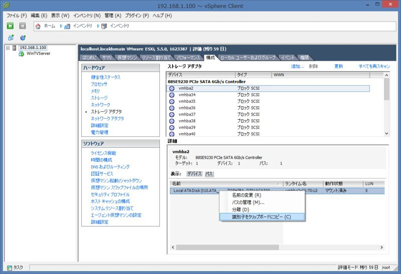
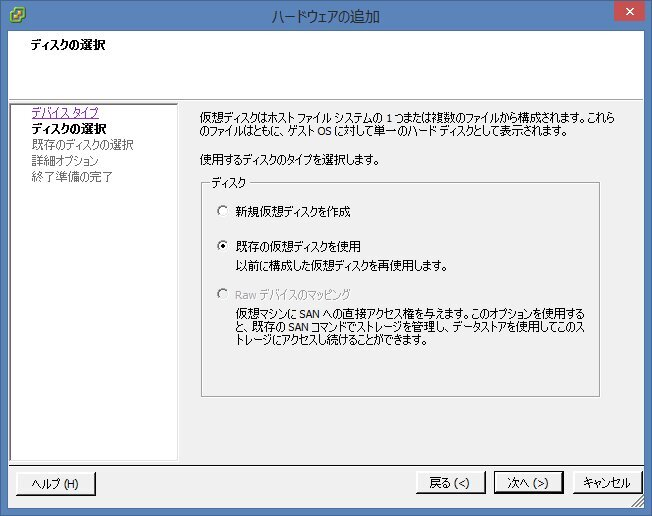
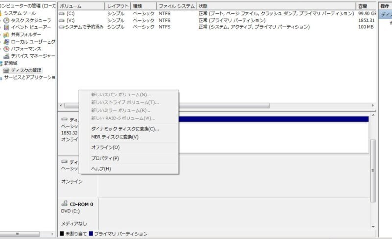
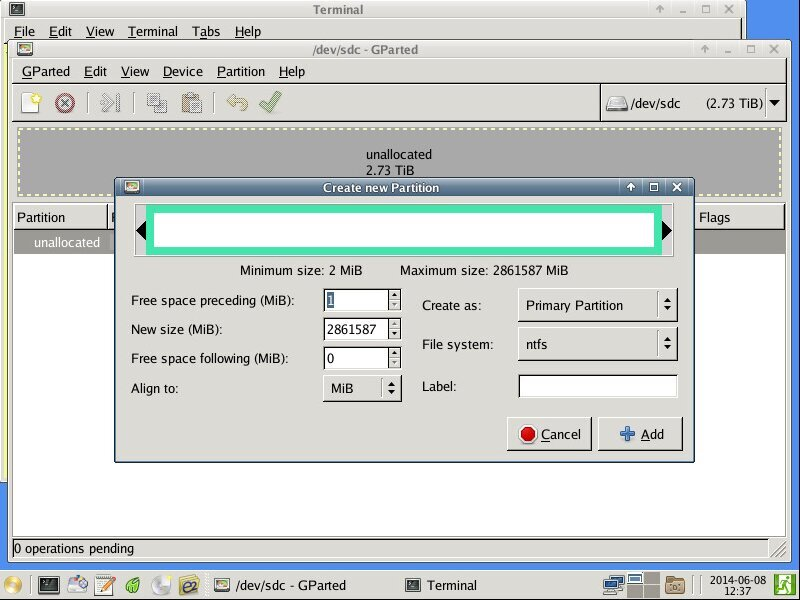
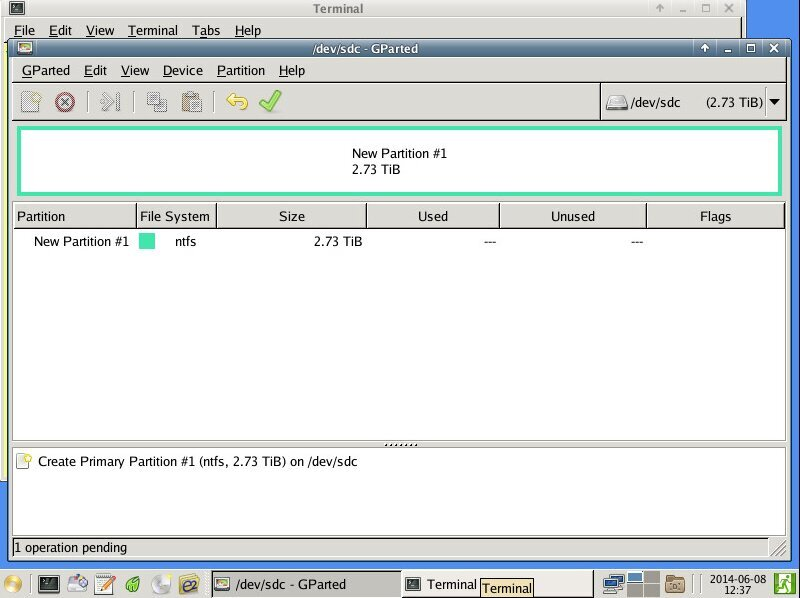

一年前にESXiサーバーを構築し、録画サーバーを仮想マシンとして運用しているのですが、録画ファイルを置いておく仮想ディスクはvmdkファイルなのでパフォーマンス面で気になるところが。  
あとHDDを抜き取ってほかのマシンに差してもそのままでは中のデータを取り出せないのもなんとなく気持ちが悪い。

そんなわけでパススルーで直接HDDを仮想マシンから使えるようにしようとSATAアダプター買ってきたりドライバいじったりしてたのですが残念ながら大失敗。
なので今回はRDM（Raw Device Mapping）を使うことにしました。

<!-- more -->

RDMはHDDをマッピングファイルで紐づけて利用するものらしく、データストアにマッピングファイルを置く必要があります。パーティションを分けることはできずHDD丸ごと使う形になるみたいです。  
まずはvSphere ClientからHDDのシリアル番号を取得します。

ほかの参考にしたサイトだとESXi上にSSHでログインしてから

`ls -l /vmfs/devices/disks/`

を実行してシリアル番号を取得してましたけど多分vSphere Clientからシリアル番号を取得するほうがわかりやすい気がします。  

 

次はマッピングファイル（という名のvmdkファイル）を作成します。  
ESXiサーバーにSSHでログインして以下のコマンドを実行。

`vmkfstools -z /vmfs/devices/disks/HDDのシリアル番号 "/vmfs/volumes/データストア名/マウントしたい仮想マシンディレクトリ名/適当な名前.vmdk" -a lsilogic`

-zオプションはPhysicalモードでVMKernelを仲介しない方式、-rオプションだとVirtualモードでスナップショット機能などを使うことができるようになるそうなのですが、Virtualモードだと2TB以上のHDDを認識できないそうなので利用しません。  
2015/4/13追記  
ESXi 6.0では-a lsilogicは不要になりました。  
というかあると警告が出ます。（作成はされる模様）

あとはこれを仮想マシンに追加します。
既存の仮想ディスクを使用を選択したのち先ほど作成したvmdkファイルを選べばOKです。  

 

これでHDDをRDMを用いてマウントすることができるのですが、2TB以上のHDDをWindowsで利用したい場合はもうちょっと面倒な作業が必要みたいです。  
事象について日本語で言及、解決策を記載してるサイトが見つからなかったのですが、今回3TBのHDDをRDMでマウントしてWindowsの管理マネージャから確認すると以下の通り。
 

3TBのHDDなのに0MBのHDDとして認識されて何もできないという。  
ESXiのバグなのかよくわからないのですが英語サイトを物色していると解決策が見つかりました。

まずレスキューCDでもCDブートできるLinuxでもなんでもいいのでGPartedを使える環境を用意。  
GPartedを起動したら該当するHDDにパーティションテーブルを作成してNTFSでフォーマット。

 
 
 
 

これでOKです。

もう一度ディスク管理を見ればちゃんとNTFSフォーマットされた3TBのHDDが認識されています。

### 参考にしたサイト  
- ESXi5におけるRaw Device Mappingのやりかたについて - k32ru's blog  
http://k32ru.hatenablog.com/entry/2013/07/14/223030  
- ESXi上のVMに、DAS(内蔵HDD)を追加する（RDM) - Think threshold  
http://makoro.hatenablog.jp/entry/2014/01/23/160700  
- ESXi + RDM = 0MB drive in Windows - [H]ard|Forum  
http://hardforum.com/showthread.php?t=1731949