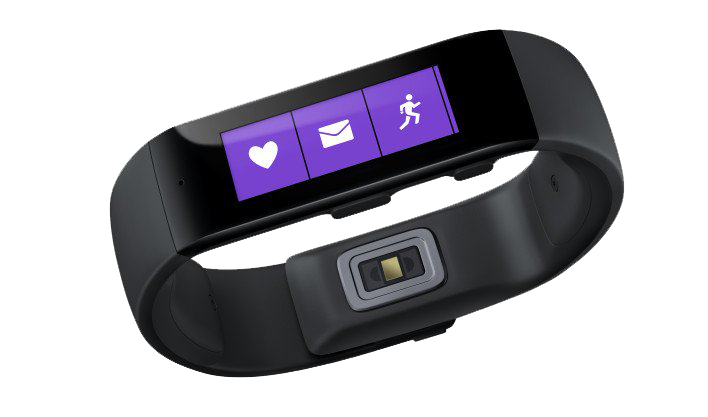
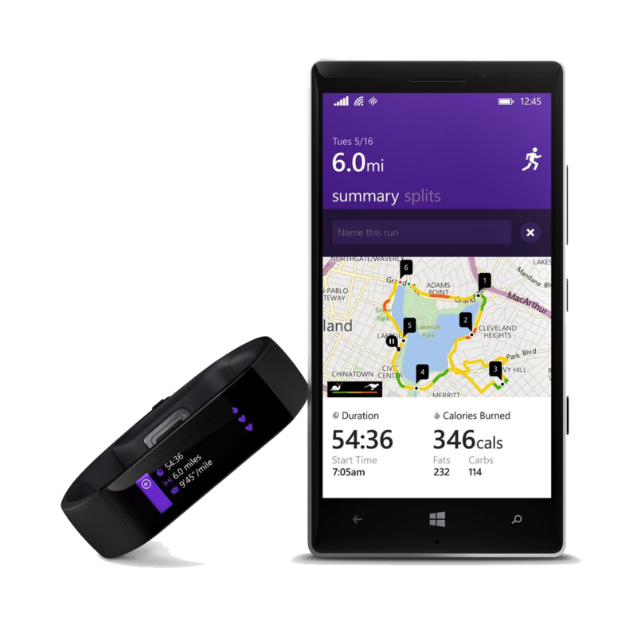
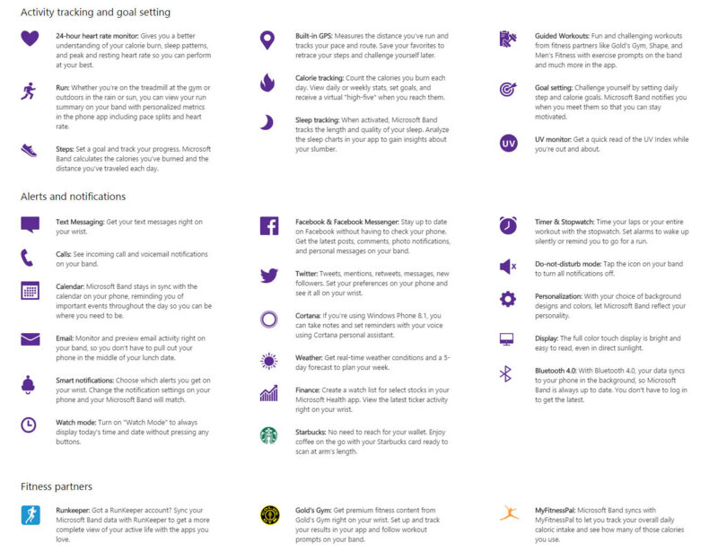

！？なんてつけるほどのものでもないですけどね。さんざん噂は流れていましたし。  

 

正直ウェアラブルデバイスはあまり興味がなかったのですが、とりあえずお値段を聞いてぽちることが確定しました。  
199ドル。現在の米ドルレートでも22000円くらい。安いWindows Phone端末と同じくらいのお値段ですね。

画面サイズは1.4インチ（解像度は310×102）フルカラーのタッチスクリーン。  
電話着信、ボイスメール、SNS、カレンダーリマインダーの通知あたりはウェアラブルデバイスなので当然（？）実装されています。

 

まず特筆すべき点としてはセンサー類が豊富なことでしょうか。  
[光学心拍、3軸ジャイロ/加速、環境光、UV、皮膚温度、電気皮膚反応のセンサーを内蔵](http://japanese.engadget.com/2014/10/30/microsoft-band-microsoft-health-windows/)し、[心拍数、歩数、カロリー消費量、睡眠品質、紫外線モニターの機能](http://www.itmedia.co.jp/enterprise/articles/1410/30/news110.html)を持つそうです。  
特にUV（紫外線）センサーを持つウェアラブルデバイスというのは聞いたことがないのですが、「今紫外線量が多いから外出るのはやめよう」とかそういう判定には使えそうですね。

Microsoftが発売したデバイスですが、Windows OSにしか対応しないというわけではなく、iOS/Androidにもばっちり対応しています。アプリもでました。（ただし日本を除く）  
ただしCortana（音声コマンド）に関してはWindows Phoneでしか使えないみたいです。（※）

Apple Watchのように時計をスマートデバイス化したというよりはJawboneなどの腕に巻くデバイスに液晶を付けたといった感じで、実際前面に押し出してるのはフィットネス機能。  
Microsoft Healthという同時発表のWebサービスと連携し、蓄積した情報をもとに分析を行ってくれるそうです。

そのほか機能は割とたくさんあるので以下の画像を参照。  
今後サードパーティ向けにSDKも公開するそうなのでそっちも期待ですね。

 

気になるバッテリーの持ちですが、100mAhのバッテリーが2つ搭載されており、48時間の稼働が可能だそうです。  
もうちょっと持ってほしいのですが、バッテリーのブレイクスルーでもないかぎり厳しいかな・・・。
充電は付属しているマグネット式USBケーブルを用いて1時間半ほどだそうです。  
ちょっと残念なのは完全防水ではないところ。汗くらいは全然平気だそうですが、ウェアラブルデバイスならやっぱり生活防水程度は対応してほしかったです。

とりあえずJawboneを買おうかと思って金を貯めていたのでそのお金でぽちります。  
日本じゃ売らないんじゃないかと思うので、来月MVP Global Summitに参加するために渡米する[がりっち](https://twitter.com/garicchi)に買ってきてもらう予定。
在庫あればいいんだけど・・・。
