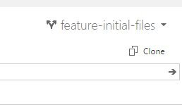
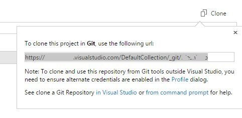

備忘録。  

Visual StudioからVisual Studio Onlineのプロジェクトをクローンしたいとき、  
   
のCloneをクリックして  
   
このURLを使えばいいよってことらしいんですがこれをどう使ったらいいのかわからなくて調べてました・・・。たぶんこれ常識ですよねorz

大切なことはすべてここに書いてありました。  
[oembed:"http://msdn.microsoft.com/en-us/library/vstudio/ms181475.aspx"]

クローンするにはVisual StudioのチームエクスプローラからTeam Foundation Serverに接続する必要があります。  
Visual Studio Onlineに接続するとき必要なURLは

> https://○○.visualstudio.com/DefaultCollection/

とのこと。これを登録するとMicrosoftアカウントの確認画面が出るので、登録してあるMSアカウントを入力すればチームエクスプローラにプロジェクトが表示されます。