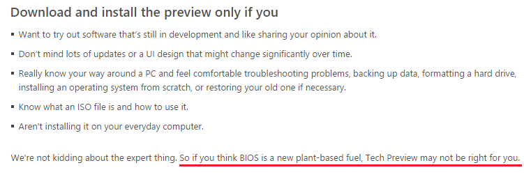

TLでこんなつぶやきをみまして。

<?# Twitter 538702154626650112 /?>

日本語文はこれですね。  

<?# OEmbed "http://windows.microsoft.com/ja-jp/windows/preview-faq#faq=tab0" /?>

確かに書いてあります。  

なんのこっちゃかわからなかったのでとりあえず原文を参照することにしました。
Microsoftのページは大体ja-jpをen-usに変えれば原文が出てきます。（つまりは英語）

<?# OEmbed "http://windows.microsoft.com/en-us/windows/preview-faq#faq=tab0" /?>
 

> We're not kidding about the expert thing. So if you think BIOS is a new plant-based fuel, Tech Preview may not be right for you.

おー、原文にもちゃんとnew plant-based fuelなんて書いてあるわ・・・。  
ということで機械翻訳がおかしいといいますか、文章を忠実に訳した結果だったようです。  
しかしアメリカンジョーク（？）はよくわからない・・・。植物由来の燃料にBIOSに似た名前のものがあるんですかね。

### 追記

<?# Twitter 538702645846765568 /?>

あー、納得。

