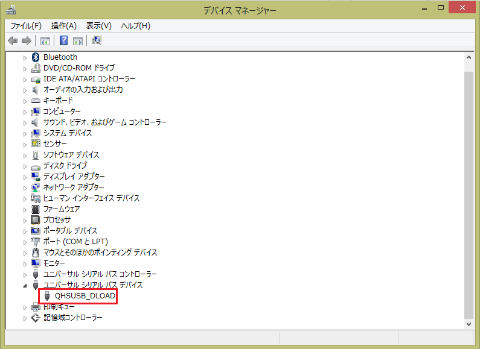

先日Windows 10 Mobile TPをあてたLumia 820。  

10TP堪能したしメイン端末だから8.1に戻そうとWindows Phone Recovery Toolでリカバリーを実施中、フラッシュモードに切り替わってROMに書き込まれている最中突然切断、Toolも失敗と表示され、その後うんともすんとも言わなくなってしまいました・・・。  

PCに接続しなおすと接続音はするものの、Lumiaとして認識されず
 

のようにQHSUSB_DLOADとして認識されてしまうだけ。  
Lumia Software Recovery Toolも利用してみたものの認識してくれず、頼みの綱のNokia Care Suite（よいこは使っちゃダメなツール//）でもVolume-+Powerによるリカバリーモードに移行できないため書き込みできず完全に詰み状態。  

海外でもどうやらそこそこの数の人が同様の問題で死屍累々状態となっているようで、つい先ほども

<?# Twitter 589314573754208256 /?>

と文鎮仲間(白目）が誕生するなど非常に残念な事態・・・。  
[Lumia 520で問題が発生してそれのフィックス版Recovery Toolが公開されているようですが](http://answers.microsoft.com/en-us/insider/forum/insider_wintp-insider_repair/lumia-520521devices-unusable-after-using-windows/c5d072d5-c26e-4a02-907d-fde2ca5e34c7)、綾野氏の端末は925、私のは820とほかの端末でも現象が発生してしまうようで。  

現状この状態になった場合復旧手段は修理に出すかJTAG接続してフラッシュするくらいしかないようで。  

ということで手元にWindows Phone端末がなくなるという非常事態になってしまったのでLumia 636をぽちりたいと思います。。  

追記
無事復活させられました！！！  

<?# OEmbed "https://blog.hitsujin.jp/entry/2015/05/19/210256" /?>

