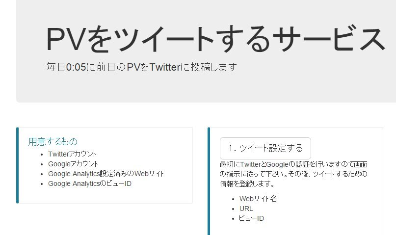
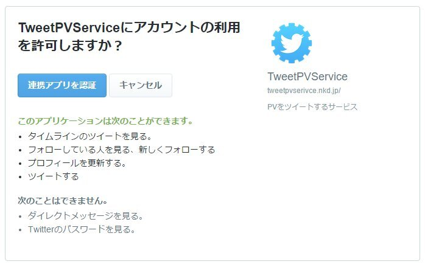
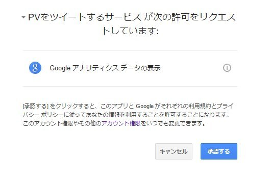
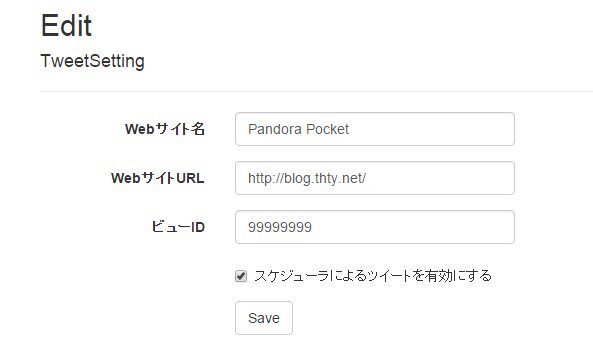
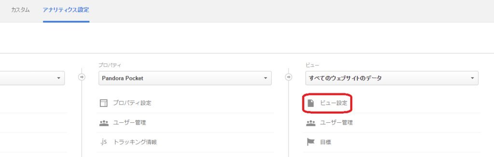
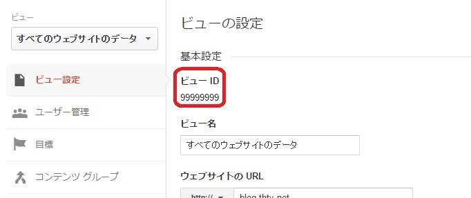

以前手作業でつぶやいていた一日のPVなんですが、面倒くさくなってやめてました(ｵｲ  

先ほどTwitter眺めていたら酢酸先生(id:ch3cooh393)とかずあきさん(id:kazuakix)がなかじさん(id:nakaji999)作の「[PVをツイートするサービス](http://tweetpvservice.nkd.jp)」を利用しようとしていたので便乗で私も設定してみました。  

[oembed:"https://x.com/ch3cooh/status/649249292650045440"]

<!-- more -->

1.「[PVをツイートするサービス](http://tweetpvservice.nkd.jp/)」の「ツイート設定する」ボタンをクリック
 

2.Twitterの認証ページに飛ぶので認証ボタンをぽちっ
 

3.Google Analyticsの認証ページに飛ぶのでこちらも認証ボタンをぽちっ
 

4.サービスの設定画面に飛ぶのでサイト名、URL、ビューIDを入力
 

このビューIDはGoogleAnalyticsの設定からビュー設定を開くと書いてある。  
 
 

これで毎日0時5分に勝手にツイートされるらしい。  
便利だ。  

ところで著作権表示が

[oembed:"https://x.com/hitsuji_no_hito/status/649247107614834688"]

になってるのはいいんだろうか（