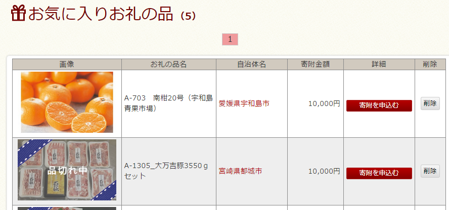
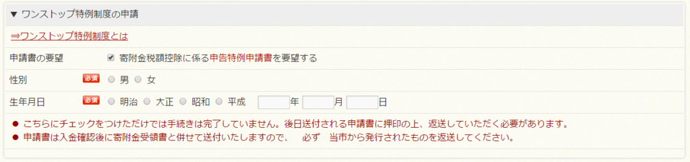

[oembed:"https://x.com/tanaka_733/status/663333740928630784"]

あーそういえばそんな制度あったなー。  

ということでふるさと納税してみました。  

ふるさと納税制度が始まったころはいろいろ手続きが面倒臭かったりしていたようですが、最近は

[oembed:"https://www.furusato-tax.jp/"]

のようにふるさと納税の対象をさくっと探してさくっとクレジットカード払いできるサイトがでてきたおかげでずいぶん楽になってますね。  
財テクとしてだいぶ浸透してきているようで書店の雑誌コーナーなんかだとよく「ふるさと納税 お得な自治体はここだ！」みたいな特集やってますし。  

##### 控除額の確認  
とりあえずまずはいくらまでが税金の控除として認定されるのかをチェックします。  
上に挙げたサイトにあるシミュレータはちょっと細かく入力する必要があって面倒くさいので

[oembed:"https://www.satofull.jp/static/calculation02.php"]

こっちを使ってみたほうが楽です。  
これによると私の場合だいたい3万円くらいまでなら自己負担額が2000円に収まるようですね。  

##### お礼の品のチェック  
控除の上限がわかったところでゲットしたいお礼の品をチェックします。  
一覧をチェックしながらほしいなと思ったものをお気に入り登録すること約30分。私はお肉のセットとこれからの時期ほしくなるミカン10kgをチョイスしました。  

##### 納税申し込み  
チョイスが終わったら各自治体に対して寄附を申し込みます。  
マイページのお気に入りページにチェックした品が表示されているので、それぞれ申し込みを行います。  

 

ふるさとチョイスだとYahoo!公共支払いサービスを利用してクレジットカード払いできるみたいです。  

##### ワンストップ特例制度  
申し込むときに忘れてはいけないのが「 ワンストップ特例制度」の申請。  
これまではふるさと納税を行った後、確定申告を行わないとお金が戻ってこなかったわけですが、今年からはこの制度を利用することで確定申告をしなくともすむようになりました。  
この制度がなかったら面倒くさくてふるさと納税しなかったですね・・・。  

 

この制度、注意点がいくつかあります。  

* 別途確定申告を行う場合  
別の都合で確定申告を行う必要がある場合は特例制度が利用できないみたいです。  
医療費控除とかで確定申告をする必要がある場合は利用できないので注意。  

* 今年の4月1日以前にふるさと納税をしている  
この制度は4月1日からスタートしたので、それ以前に納税をしている場合は利用できないみたいです。  

* ふるさと納税先が5件以下  
私みたいに自己負担額を2000円に抑えるには3万円までという人はあまり関係ないかもですが、ワンストップ特例制度を利用する場合は納税先を5件までに絞る必要があります。  
限度額が多い人は複数の自治体に納税すると思うのでこの点注意。  

##### お礼の品が届いた後に  
ワンストップ特例制度を利用した場合、お礼の品と一緒に（別で届くこともあるのかな・・・？）特例制度の申請書類が届きます。  
届く書類はこんなやつ。  

[oembed:"http://www.soumu.go.jp/main_content/000351462.pdf"]

平成28年1月10日までに提出しないと確定申告を自分でやる羽目になるので注意。  

##### まとめ  
制度から始まって数年たち、制度を利用するにおいての障壁がだいぶんと軽減された印象。  
書類を郵送する必要はあるとはいえそれほど面倒なことでもないですし、メリットのほうが随分と大きいです。  
2千円の自己負担で割といろいろな特産品をゲットできるふるさと納税。  
最近はちょっとヒートアップしすぎてソシャゲの課金アイテムとかよくわからないお礼の品を掲げて総務省から怒られた自治体もあったり、ふるさと納税の意義がぶっ飛んでる話もありますけど、こういう形で知らない町に触れることができる面白い制度だと思うので、試してみるのもありだと思います。

参考:

[oembed:"http://www.furusato-tax.jp/2015newrule.html"]

