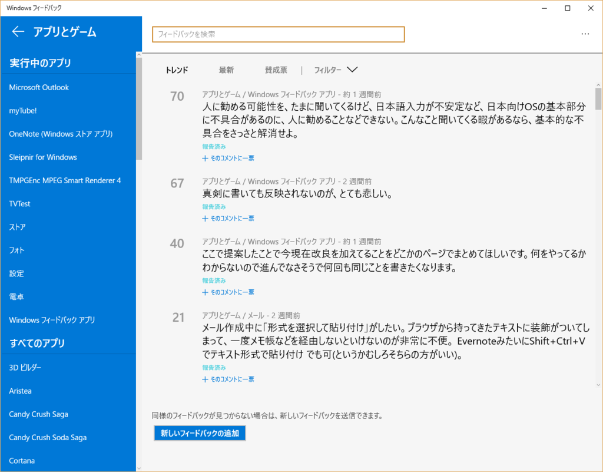
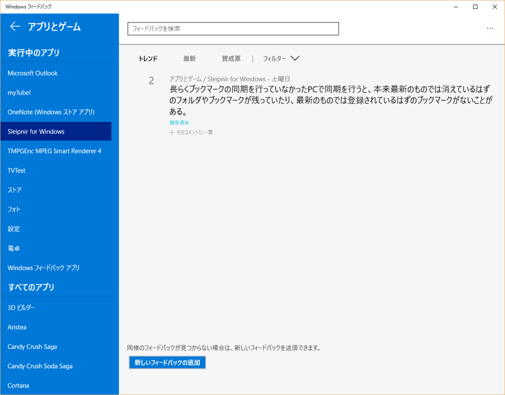

Windows 10になってからMicrosoftはユーザーに要望や不具合をダイレクトに伝えてもらおうと「Windowsフィードバック」というアプリを搭載してるわけですが、このアプリにある「アプリとゲーム」というカテゴリを開くと以下のような表示になります。  

 

Windowsフィードバックの日本語版はMSに対する罵詈雑言じみた投稿が多く辟易してあまり見てなかったので知らなかったのですが、この「アプリとゲーム」というカテゴリはMicrosoft製のストアアプリに対するフィードバックができるのかと思っていたらそれ以外のサードパーティアプリが表示されてます。  

ストアにはレビュー欄がありますが、あの欄はあくまでレビューであって不具合報告をする場所ではないと思っているのでこれはいいやと。  
要望不具合報告はこちらで！ってできるなと思っていたのですがよく考えてみたらこの左メニュー、実行中のアプリというサブカテゴリの中には「Sleipnir for Windows」や「TMPGEnc MPEG Smart Renderer 4」など、ストアアプリ以外のものまで表示されてます。  

試しに投稿してみたところ、
 

こんな感じで投稿可能でした。  
そのあと誰かが一票を入れてくれたのか票が2になっているので投票機能も動いてますね。  

これ、Windows 10限定ではありますけどユーザーが開発者にフィードバックする環境をOSが提供してくれるわけで、開発者が不具合や要望を吸い上げるためのシステムを作らなくても済むという点でとっても便利かもしれない。  

試してみた感じ圧縮ファイルを解凍して実行したプログラムは表示されず、インストーラーでインストールした（レジストリに登録されている）プログラムが表示できる感じです。  
MSの意図した使い方なのかわからないですけども、ユーザーから要望を送ってほしいと思っている開発者の方は頭の片隅に入れておくといいかも？