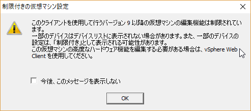
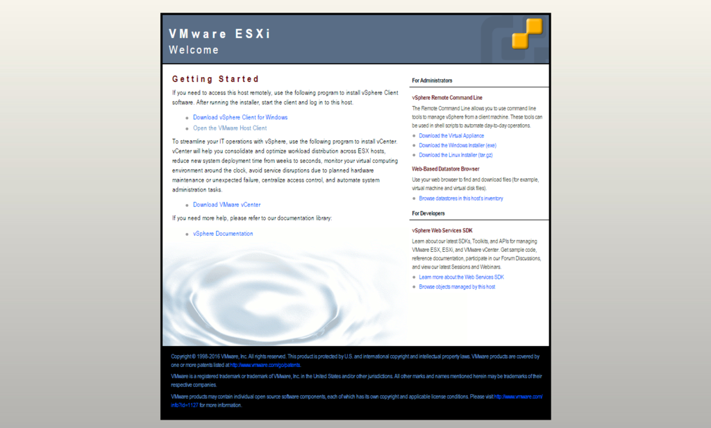
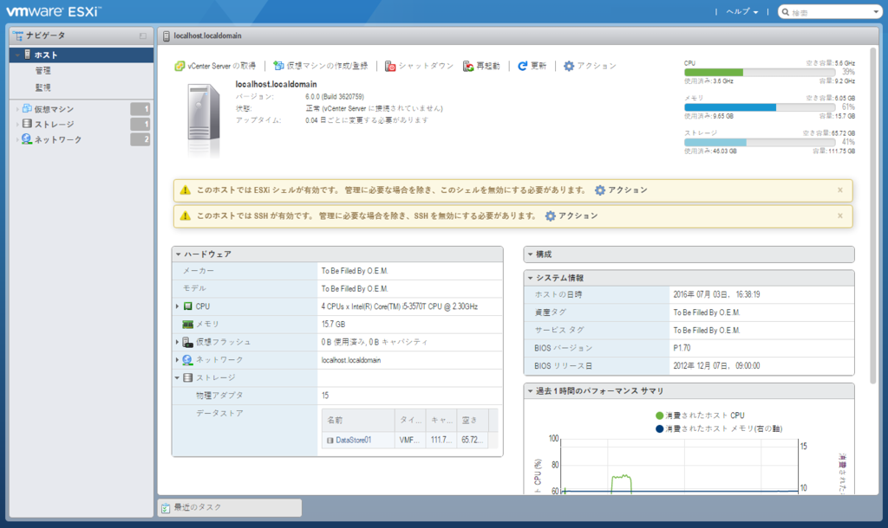
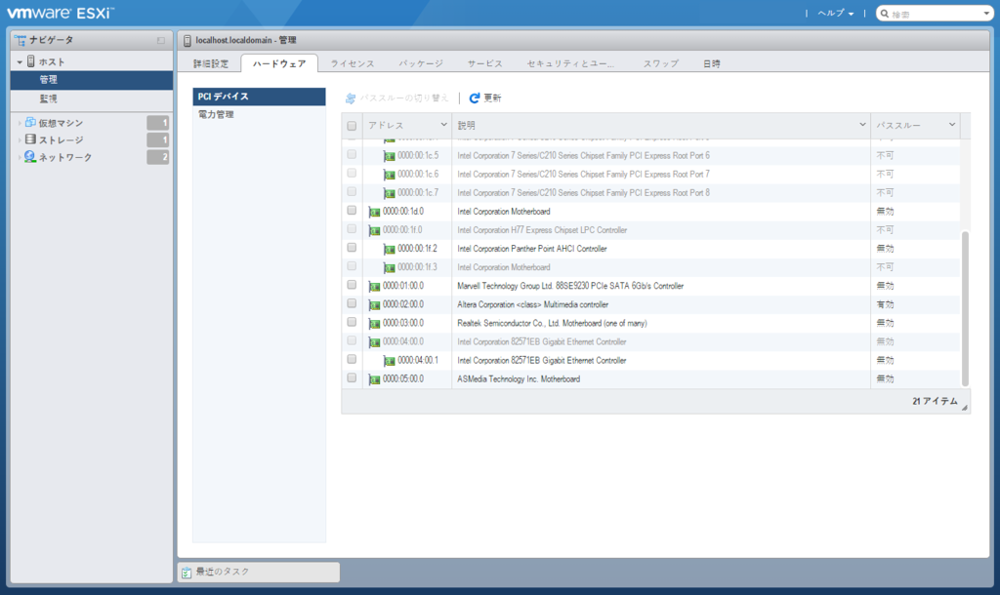
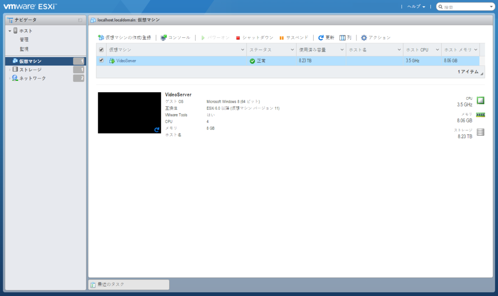
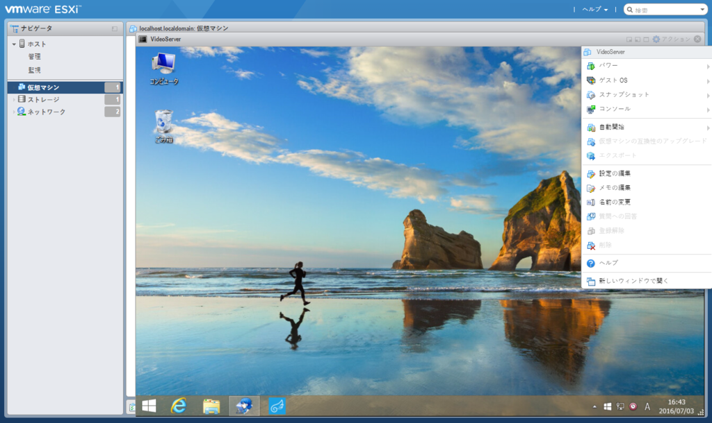
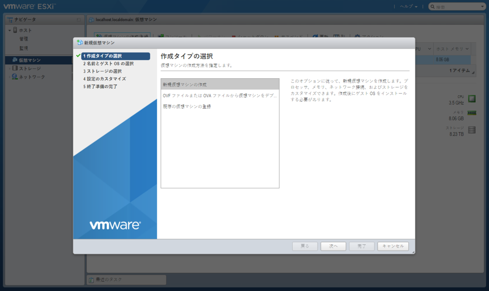

VMware ESXiはこれまでVMware vSphere Clientを使うのが一般的でしたが、5.1のころからもうvSphere Clientでは最新の環境に対応しないからね！とお達しがあり、実際最新の仮想マシンに対応してくれず、かといって移行先のWeb Clientは有償ライセンスがないといけないという残念な状況でした。  

 

が、今回取り上げるVMware Host Clientがすべてを解決してくれます。(たぶん)
最近まで日本語に対応していないほか機能が弱くvSphere Clientの代替にはなかなかなりえない感じでしたが、最新のバージョンでは日本語対応したほか仮想マシンをウェブ上でいじることができるなど十分代替となりえるところまで来ています。  

これまではEmbedded Host Client と呼ばれており、VMwareのサイトからファイルをダウンロードしてESXiにインストールする作業が必要でしたが、ESXi 6.0 Update2から標準搭載となりました。  

[oembed:"http://infratraining.blogspot.jp/2016/03/embedded-host-client-vsphere6.html"]

というわけでESXiサーバーのESXiをUpdate2に更新して実際に使ってみました。  

Update2にアップデートしている場合、ESXiマシンのIPアドレスをブラウザに入力して表示されるサイトにVMware Host Clientへのリンクがあります。  

または

> http://ESXiマシンのIPアドレス/ui/ 

でVMware Host Clientを開けます。  

 

 

 

vSphere Clientよりサクサク動いて好印象です。  

ハードウェアの設定等も一通りvSphere Clientと同等のことを行えます。  
 

仮想マシンについてはマシンのステータス、パワーオン、シャットダウン、設定変更が行えるほか、コンソールを開くことができます。  

 

 

仮想マシンの作成画面。  
 

仮想マシン自体は問題なく作れたものの、どうやってISOイメージからインストールするやら。  
vSphere Clientでは直接ISOイメージをマウントできましたけど、Host Clientの場合は一度データストアにアップロードしてからやればいいのかな・・・？